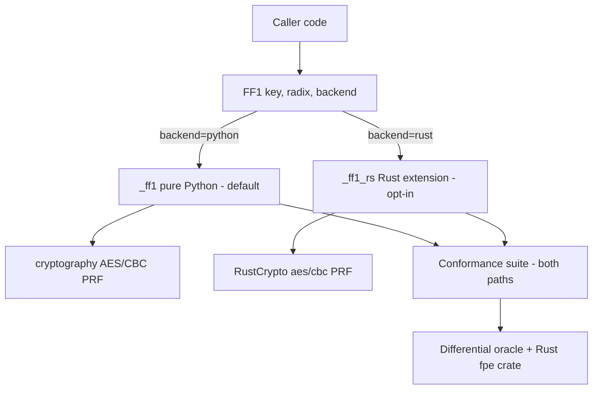

# Idea 00001 r01: v2.0.0 Optional Rust Accelerated Backend

> [!abstract] Recommendation: `proceed-to-experiment`
> The roadmap already commits 2.0 to an *optional accelerated backend*, and the
> compute bottleneck is precisely identified (the quadratic big-integer
> `NUM`/`STR` base conversion plus per-round Python overhead). The concept is
> coherent enough for a bounded spike. The principal uncertainty is **how much
> faster Rust actually is here** — Python's big-int arithmetic is already C-level,
> so the win is a constant factor plus overhead elimination, not an asymptotic
> change — and whether that win justifies the wheel-matrix and supply-chain cost.
> Next move: a throwaway Rust spike benchmarked against `just bench` and run
> against the existing conformance suite.

## 1. Seed Idea

### Original proposition

Open an idea to plan `v2.0.0` as specified on the project roadmap. The stated
objectives are:

1. **Performance** as the primary goal.
2. **Convert the compute bottleneck into Rust.**
3. **Maintain similar compatibility as `v1.0.0`.**
4. **Identify and recommend any feature** that can be added to `v2`.

The roadmap's 2.0 line (README §Roadmap) reads: *"Optional accelerated backend.
An opt-in faster path for high-throughput callers, with the pure-Python
implementation retained as the reference and the default."* This is also the
single open decision recorded in `AGENTS.md`: *"Optional accelerated backend
(backlogged for post-1.0): whether to build it at all; if built, opt-in only —
the pure-Python implementation stays the reference and the default."*

### Motivation and timing

`v1.0.0` shipped (2026-09-05) with a settled reference implementation and a
conformance suite strong enough to prove two implementations agree bit for bit
— the roadmap's explicit precondition for an accelerated path. The published
performance baseline shows the per-numeral cost climbing sharply past ~1,000
numerals (1.2 µs at n=100 → 26.8 µs at n=20,000), which the README attributes
to the quadratic `NUM`/`STR` big-integer conversion. High-throughput callers
sizing batch jobs over millions of rows are the audience the 2.0 backend exists
to serve. The timing is right: the reference is frozen, the conformance suite
exists, and the bottleneck is measured and documented.

## 2. Context and Intent

| Field | Detail |
|---|---|
| Intended outcome | An opt-in, faster FF1 path for high-throughput callers, with the pure-Python implementation retained as the reference and the default; bit-exact ciphertext compatibility with 1.0.0. |
| Target users or beneficiaries | Callers encrypting/decrypting large volumes (batch jobs, ETL, tokenisation at scale); downstream consumers of the private project that motivated the library. |
| Current stage | `v1.0.0` published and stable; 2.0 is a roadmap item with no implementation started. |
| Known constraints | FF1 only (FF3/FF3-1 permanently out of scope); no key management; no application-specific defaults; single runtime dependency (`cryptography`) unless explicitly approved; 100% line/branch coverage floor; conformance is the product. |
| Non-negotiables | Pure-Python stays the reference and the default; opt-in only; bit-exact ciphertext for every input valid in 1.0.0; typed exceptions rooted at `FF1Error`; thread-safety and pickling preserved. |
| Related project context | `src/fpr_ff1/_ff1.py` (Algorithm 7 core), `benchmarks/timing.py` (reproducible baseline), `pyproject.toml` (hatchling, explicit sdist include, wheel-test + sdist-assertion CI), `docs/backlog.md` (2.0 item + dropped Rust-oracle note). |

## 3. Problem or Opportunity

The FF1 core (`_ff1`, SP 800-38G Algorithm 7) runs ten Feistel rounds. Each
round performs, per half:

- `_num_radix` — decode a numeral sequence to a big integer (`value = value *
  radix + x`), **O(n²)** in the number of numerals;
- `_str_radix` — encode a big integer back to numerals (`value % radix`,
  `value //= radix`), **O(n²)**;
- `_prf` — CBC-MAC over `P || Q` (C-level via `cryptography`, O(n) blocks);
- `int.from_bytes`, a big modulo, and list slicing/copying (`a = x[:u]`,
  `b_side = x[u:]`).

The quadratic `NUM`/`STR` conversion dominates for large inputs; for small
inputs the cost is Python interpreter overhead (per-round function calls,
object allocation, list copies, and the Python↔C boundary crossings into
`cryptography`). The published baseline quantifies this: ~32,000 ops/s for 6
numerals (30.9 µs/op, almost all overhead), rising to 26.8 µs *per numeral* at
n=20,000.

The opportunity is a constant-factor speedup (not an asymptotic one — the
algorithm's `NUM`/`STR` steps are inherently quadratic) plus elimination of the
per-round interpreter and boundary overhead. For power-of-2 radices (2, 4, 8,
16, 32, 64, 256) the conversion is bit manipulation and could be made O(n) —
a genuine algorithmic win available to either a Rust backend or a pure-Python
fast path.

## 4. Proposed Feature or Concept

### User-visible outcome

A caller opts into the accelerated path (e.g. `FF1(..., backend="rust")`) and
gets the same ciphertext, same exceptions, and same validation semantics, faster.
Callers who do nothing are unaffected: the pure-Python path remains the default.

### Principal use cases

- Batch encryption/decryption of millions of short values (e.g. 6–16 numerals,
  radix 10/36/62) where per-call overhead dominates.
- Long-input encryption (n in the thousands) where the quadratic conversion
  dominates.
- Power-of-2 radices (256, 65535) where a bit-manipulation fast path applies.

### Important edge cases

- Odd vs even `n` (the `u != v` path) — `b` is derived from `v`, not `u`.
- `d > 16` S-expansion (radix 10 from 57 numerals, radix 65535 from 13) — the
  ECB expansion branch.
- Radix 2 (min_length 20) and radix 65535 (the supported maximum).
- Empty tweak vs absent tweak (must be equivalent).
- Pickling an accelerated instance and using it across threads.
- Free-threaded Python (3.14t) if the backend is built for it.

## 5. Desired Outcomes and Success Measures

| Outcome | Measure | Baseline | Target | Evidence needed |
|---|---|---:|---:|---|
| Faster small-input throughput | ops/s on 6 numerals, radix 10 | ~32,000 ops/s | ≥5× (≥160k ops/s) | `just bench` on the Rust path |
| Faster long-input throughput | per-numeral µs at n=20,000 | 26.8 µs | ≥3× (≤9 µs) | `just bench` on the Rust path |
| Bit-exact compatibility | ciphertext equality vs 1.0.0 | — | 100% across all vectors | NIST vectors, differential oracle, frozen KAT, bijectivity |
| Conformance parity | per-round intermediates match | — | 100% | trace hook reproduced for the Rust path |
| No API regression | existing callers unaffected | — | pure-Python default unchanged | full existing test suite green |

## 6. Scope and Non-goals

### In scope

- An opt-in accelerated backend (Rust) behind the existing `FF1` API.
- Bit-exact ciphertext and validation parity with 1.0.0.
- Conformance evidence for the accelerated path (vectors, intermediates, differential, bijectivity).
- Candidate 2.0 features evaluated alongside: batch API, radix 65536, a Rust `fpe` crate as a second differential oracle.

### Out of scope

- FF3/FF3-1 (permanently).
- Key generation, storage, derivation, or management.
- Application-specific defaults, alphabets, or convenience wrappers.
- Any change to accepted inputs or produced outputs for the pure-Python path (that would be a separate major-version concern, not this idea).
- A claim of FIPS validation or full constant-time operation.

## 7. Users and Stakeholders

| Stakeholder | Need or incentive | Impact | Involvement needed |
|---|---|---|---|
| High-throughput callers | Faster batch FPE | Primary beneficiary | Feedback on API shape (batch vs per-call) |
| Downstream private consumer | Throughput at scale | Direct | Confirm the workload profile the backend must serve |
| Maintainer (user) | Keep the "one code path, one dependency" simplicity | Decides the build/supply-chain trade-off | Approve the Rust dependency and wheel matrix |
| Packagers / CI | Reproducible builds across 9 matrix legs | New Rust toolchain + platform wheels | Confirm the supported wheel set |

## 8. Assumption Ledger

| ID | Statement | Classification | Impact if wrong | Evidence status | Confidence | Cheapest test |
|---|---|---|---|---|---|---|
| A1 | The quadratic `NUM`/`STR` conversion is the dominant cost for large inputs | verified-fact | Mis-targeted optimisation | README perf table + code inspection | High | Profile `_ff1` per round |
| A2 | Rust big-int arithmetic is meaningfully faster than Python's for this workload | hypothesis | The whole premise weakens | Unproven; Python ints are already C | Medium | Spike: port `_num_radix`/`_str_radix`, benchmark |
| A3 | A Rust core can reproduce bit-exact ciphertext and intermediates | hypothesis | Conformance failure blocks the idea | Deterministic, well-specified algorithm | High | Run conformance suite against the spike |
| A4 | PyO3/maturin/abi3 can produce wheels for the 9-leg matrix | supported | Build feasibility risk | External docs (PyO3, maturin) | High | Build one abi3 wheel per OS in CI |
| A5 | Adding a Rust backend is acceptable under the "single runtime dependency" principle | preference-or-design-choice | Scope conflict | AGENTS.md open decision #1 | — | User decision |
| A6 | The speedup justifies the build/supply-chain cost | unknown | Go/no-go | Unmeasured | Low | The spike's benchmark |
| A7 | The Rust backend can preserve thread-safety and pickling | inference | Compatibility regression | PyO3 Send/Sync + pickling support | Medium | Test concurrent use + pickle round-trip |

## 9. Research and Fact Check

| Claim | Finding | Status | Evidence | Checked on |
|---|---|---|---|---|
| Rust Python extensions are mature and support stable ABI wheels | PyO3 0.28/0.29 + maturin produce `abi3`/`abi3t` wheels; maturin-action builds manylinux/macOS/Windows | verified | PyO3 building-and-distribution guide; maturin bindings guide | 2026-09-05 |
| A maintained Rust FF1 implementation exists to reference or reuse | `fpe` (str4d, MIT/Apache-2.0, num-bigint) and `cosmian_fpe` (crypto_bigint, CT-default ops) both implement FF1 | verified | crates.io `fpe`; docs.rs `cosmian_fpe` | 2026-09-05 |
| Free-threaded Python (3.14t) affects extension builds | abi3 wheels don't load on free-threaded builds; abi3t (3.15+) or version-specific cp314t wheels are needed | verified | PyO3 guide; maturin-action issue #368 | 2026-09-05 |
| The FF1 core's quadratic conversion is the documented bottleneck | README states per-numeral cost climbs past ~1,000 numerals due to quadratic `NUM`/`STR` | verified | README §Performance; `_ff1.py` source | 2026-09-05 |

### Evidence limitations

- The speedup magnitude (A2, A6) is unmeasured — no Rust prototype exists yet.
- The Rust crates were inspected via their public docs/metadata, not audited for
  conformance to SP 800-38G; they are candidates for a *second oracle*, not a
  drop-in core.
- Free-threaded support is a fast-moving area (PyO3 0.28 changed the GIL default);
  the exact wheel set for 3.14t/3.15 is a build-time decision, not settled here.

## 10. Challenge Review

### Strongest version of the idea

A single `FF1` class gains a keyword-only `backend` parameter (default
`"python"`). When `"rust"` is selected, the entire Algorithm 7 loop — including
the PRF via a Rust AES crate — runs in a compiled extension, eliminating the
per-round interpreter overhead, the list copies, and the Python↔C boundary
crossings, while the big-int `NUM`/`STR` conversion runs in Rust's tighter
loop. The pure-Python path is untouched and remains the default, so every
existing caller is unaffected. The existing conformance suite — NIST vectors,
per-round intermediates, the differential oracle, the frozen KAT vectors, and
exhaustive bijectivity — is run against *both* paths, proving bit-exact
agreement. The Rust `fpe` crate is added as a second independent oracle,
strengthening the weakest conformance evidence (radices without NIST vectors)
at near-zero marginal cost now that a Rust toolchain is in the build anyway.

### Formal findings

#### IDEA-00001-R01-MAJ-01: Speedup magnitude is unproven — the win is constant-factor, not asymptotic

> [!warning] Major
> - **Confidence:** Medium
> - **Category:** Feasibility
> - **Evidence:** Python's `int` is arbitrary-precision and its multiply/divmod are C-level; `_num_radix`/`_str_radix` already call into C per iteration. The quadratic term is inherent to the algorithm, so Rust cannot remove it — only shrink the constant and the per-round overhead.
> - **Failure scenario:** The spike measures a modest speedup (e.g. <2×) on the dominant cases, because the big-int arithmetic is already C and the remaining Python overhead is smaller than assumed. The build/wheel/supply-chain cost then exceeds the benefit.
> - **Impact:** The entire premise of the 2.0 backend is weakened; the roadmap item may not be worth building.
> - **Mitigation or test:** A throwaway spike that ports `_num_radix`/`_str_radix` first (isolating the big-int win), then the full core, benchmarked against `just bench` across input sizes.
> - **References:** `src/fpr_ff1/_ff1.py` (`_num_radix`, `_str_radix`); `benchmarks/timing.py`; README §Performance.

#### IDEA-00001-R01-MAJ-02: Bit-exact conformance across a second implementation doubles the "plausible but wrong" surface

> [!warning] Major
> - **Confidence:** High
> - **Category:** Correctness / Conformance
> - **Evidence:** The project's stated goal is that a reviewer can compare the source against SP 800-38G line by line and find no gaps; the per-round intermediate trace hook exists precisely because "two compensating bugs can pass an output test." A Rust core is a second implementation of the same subtle algorithm (`b` from `v` not `u`, the padding, the parity rule, `S` truncated to `d` bytes).
> - **Failure scenario:** A subtle divergence in the Rust core (e.g. a wrong `b` derivation or padding) produces plausible-but-wrong ciphertext that the NIST vectors (radix 10/36 only) do not catch, and the differential oracle is the only guard for other radices.
> - **Impact:** A conformance regression in the accelerated path would be a correctness defect in a security library — the worst possible outcome.
> - **Mitigation or test:** Run the full conformance suite (NIST vectors, per-round intermediates via a reproduced trace hook, differential oracle, frozen KAT, exhaustive bijectivity) against the Rust path; add the Rust `fpe` crate as a second oracle.
> - **References:** `AGENTS.md` (conformance ethos); `tests/test_intermediates.py`; `tests/test_differential.py`; `tests/test_frozen_kat.py`.

#### IDEA-00001-R01-MAJ-03: The "single runtime dependency" and "one code path" principles are materially changed

> [!warning] Major
> - **Confidence:** High
> - **Category:** Architecture / Scope
> - **Evidence:** `AGENTS.md` states "Never add a runtime dependency beyond `cryptography` without explicit approval" and the README 1.0 row advertises "one code path, and it is the one the vectors test." A Rust backend adds a build-time toolchain, a compiled extension, and platform-specific wheels.
> - **Failure scenario:** The maintainer (or downstream packagers) reject the added build complexity, or the "one code path" simplicity that reviewers value is lost, and the change is reverted.
> - **Impact:** This is the AGENTS.md open decision #1 ("whether to build it at all"); proceeding without explicit approval violates the project contract.
> - **Mitigation or test:** Explicit user decision recorded in this idea's decision log; document the trade-off (opt-in, pure-Python default preserved, Rust as a *second* path not a replacement).
> - **References:** `AGENTS.md` (open decisions, "Never do"); README §Roadmap.

#### IDEA-00001-R01-MED-01: Wheel-matrix and build complexity grows materially

> [!warning] Medium
> - **Confidence:** High
> - **Category:** Operations / Delivery
> - **Evidence:** Rust wheels are platform-specific; abi3 collapses Python versions but not OS/arch. The current 9-leg matrix (3 Python × 3 OS) becomes a wheel-build matrix (Linux/macOS/Windows × arch), plus free-threaded (3.14t) and abi3t (3.15+) dimensions.
> - **Failure scenario:** The publish workflow and CI grow substantially; a wheel is missing for a platform a caller needs, or a build breaks on a new Python release.
> - **Impact:** Higher maintenance burden and a larger supply-chain surface for a small library.
> - **Mitigation or test:** maturin-action + abi3; decide the supported wheel set explicitly; keep the pure-Python sdist as the universal fallback.
> - **References:** PyO3 building-and-distribution guide; maturin bindings guide.

#### IDEA-00001-R01-MED-02: A second AES implementation (full Rust core) must be independently validated

> [!warning] Medium
> - **Confidence:** Medium
> - **Category:** Security / Correctness
> - **Evidence:** A full Rust core needs its own AES (e.g. RustCrypto `aes`/`cbc`), independent of `cryptography`. A Rust AES bug would produce wrong output that NIST vectors (radix 10/36) might not catch for other radices.
> - **Failure scenario:** The Rust AES or CBC-MAC diverges subtly, and the differential oracle is the only net for most radices.
> - **Impact:** A cryptographic correctness defect in the accelerated path.
> - **Mitigation or test:** Validate the Rust AES against NIST AES vectors and against the Python path's PRF output; use the Rust `fpe` crate as a second oracle; consider a NUM/STR-only Rust (no crypto in Rust) as a lower-risk alternative.
> - **References:** `src/fpr_ff1/_ff1.py` (`_prf`); crates.io `fpe`.

#### IDEA-00001-R01-MED-03: Native state must preserve pickling and thread-safety

> [!warning] Medium
> - **Confidence:** Medium
> - **Category:** Compatibility
> - **Evidence:** 1.0.0 instances are thread-safe by construction (no cached encryptor) and picklable (`__getstate__`/`__setstate__` drop `_aes` and rebuild). A Rust backend holds native state (AES schedule, big-int context) that must be serializable and must not introduce shared mutable state.
> - **Failure scenario:** An accelerated instance fails to pickle, or caches a live cipher context that breaks thread-safety — a regression against the 1.0.0 contract.
> - **Impact:** Compatibility regression for callers relying on pickling or concurrent use.
> - **Mitigation or test:** Design the Rust state as immutable/reconstructable; test pickle round-trip and concurrent use of accelerated instances.
> - **References:** `src/fpr_ff1/_ff1.py` (`__getstate__`, `__setstate__`, `_Aes`).

#### IDEA-00001-R01-LOW-01: The per-round trace hook must be reproduced for the Rust path

> [!warning] Low
> - **Confidence:** High
> - **Category:** Conformance
> - **Evidence:** `_encrypt_traced` is a test-only hook that exposes per-round `P/Q/R/S/y/m/c/C`; it is Python-specific and deliberately off the public API.
> - **Failure scenario:** The Rust path cannot produce intermediates, weakening the strongest conformance evidence for the accelerated path.
> - **Impact:** Reduced conformance assurance, not a user-facing defect.
> - **Mitigation or test:** A private Rust-side trace or a test-only bridge that exposes the same intermediates without expanding the public API.
> - **References:** `src/fpr_ff1/_ff1.py` (`_encrypt_traced`).

#### IDEA-00001-R01-LOW-02: Radix 65536 is a natural 2.0 addition but is a minor change, not a driver

> [!warning] Low
> - **Confidence:** High
> - **Category:** Scope
> - **Evidence:** Radix 65536 (2**16) is currently excluded as a deliberate subset; review 00004 MED-05 established that expanding the accepted domain without changing existing behaviour is a SemVer *minor* change. It completes the power-of-2 set and pairs with a bit-manipulation fast path.
> - **Failure scenario:** Bundling it into 2.0 conflates a minor change with the major-version backend work, or it is deferred and later forces an awkward release.
> - **Impact:** Minor scope/versioning confusion.
> - **Mitigation or test:** Decide explicitly whether radix 65536 rides in 2.0 or ships as a 1.x minor.
> - **References:** `docs/backlog.md` (version policy); `AGENTS.md` (radix subset).

### Failure modes and unintended consequences

- **Two implementations drift apart** over time as the pure-Python reference and the Rust core are maintained separately; a future change to one is not mirrored in the other.
- **The "one code path" simplicity is lost**, and reviewers can no longer verify the whole library against SP 800-38G in one file.
- **Supply-chain expansion** (Rust toolchain, new crates, platform wheels) increases the attack surface and maintenance burden for a small library.
- **Overclaiming constant-time**: a Rust backend may reduce but cannot eliminate value-dependent timing (the algorithm's data-dependent big-int sizes and alphabet lookup are inherent); claiming otherwise would be a security misrepresentation.

### Conditions to revise, park, or reject

- **Revise** if the spike shows the speedup is real but the API shape (batch vs per-call, `backend=` kwarg vs separate class) needs rethinking.
- **Park** if the measured speedup is small (<2×) and the build cost is high — the pure-Python path plus a power-of-2 fast path may be the better investment.
- **Reject** if the Rust core cannot reproduce bit-exact ciphertext and intermediates, or if the maintainer decides the "one code path" principle outweighs the performance gain.

## 11. Options and Trade-offs

| Option | Benefits | Costs and risks | Reversibility | Evidence needed |
|---|---|---|---|---|
| **A. Full Rust core** (Algorithm 7 + PRF in Rust) | Max speedup; eliminates interpreter + boundary overhead; second independent AES | Second AES to validate; largest Rust surface; trace hook reimplementation; wheel matrix | High (opt-in, pure-Python default) | Spike benchmark + conformance |
| **B. Rust NUM/STR only** (big-int conversion in Rust, PRF in Python) | Smaller Rust surface; no crypto in Rust; targets the documented bottleneck | 10× boundary crossings per op limit small-input speedup; still needs wheels | High | Spike: isolate the big-int win |
| **C. Pure-Python optimisation** (power-of-2 fast path, fewer copies, hoisting) | No build complexity; keeps one code path; O(n) for power-of-2 radices | No win for general radices or interpreter overhead; bounded speedup | High | Profile + micro-benchmarks |
| **D. No-build / defer** (keep 1.0.0 as-is) | Zero cost; simplicity preserved | Leaves the documented quadratic cost unaddressed for high-throughput callers | High | User priority call |

## 12. Recommended Concept

The current best synthesis is **Option A (full Rust core) as the target, staged
through Option B (NUM/STR first) to measure where the time actually goes**, with
Option C (pure-Python power-of-2 fast path) measured as a control. The opt-in
mechanism is a keyword-only `backend` parameter on the existing `FF1` class,
defaulting to `"python"`, so the public API and the pure-Python default are
unchanged for existing callers.

The candidate features to evaluate alongside the backend, in priority order:

1. **Batch API** (`encrypt_many`/`decrypt_many`) — amortises the AES schedule
   and P-block construction across many inputs; directly serves the
   high-throughput audience. New public API, so it needs its own conformance
   story and a careful design (does it accept a list of sequences? a single
   tweak?).
2. **Radix 65536** — completes the power-of-2 set and pairs with a
   bit-manipulation fast path; a documented *minor* change that could ship in
   2.0 or as a 1.x minor.
3. **Rust `fpe` crate as a second differential oracle** — strengthens the
   weakest conformance evidence (radices without NIST vectors) at near-zero
   marginal cost once Rust is in the build.

## 13. Dependencies, Risks, and Safeguards

| Item | Type | Likelihood | Impact | Mitigation, test, or owner |
|---|---|---|---|---|
| Rust toolchain + maturin in CI | Dependency | High | Medium | maturin-action, abi3 wheels; keep pure-Python sdist as fallback |
| Second AES implementation | Risk | Medium | High | Validate against NIST AES vectors + Python PRF; Rust `fpe` oracle |
| Bit-exact divergence | Risk | Medium | Critical | Full conformance suite on both paths; reproduced trace hook |
| Wheel matrix growth | Cost | High | Medium | Decide supported wheel set; abi3 collapses Python versions |
| Pickling/thread-safety regression | Risk | Low | Medium | Immutable native state; pickle + concurrency tests |
| Two implementations drifting | Risk | Medium | Medium | Shared conformance suite as the contract; CI runs both paths |

## 14. Highest-value Next Experiment

- **Hypothesis:** A Rust implementation of the FF1 core (Algorithm 7, including
  the PRF via a Rust AES crate) is ≥5× faster than the pure-Python reference on
  the small-input case and ≥3× faster at n=20,000, while reproducing bit-exact
  ciphertext and per-round intermediates for every conformance vector.
- **Method:** A throwaway spike (not committed to the package): (1) port
  `_num_radix`/`_str_radix` to Rust and benchmark in isolation; (2) port the
  full Algorithm 7 core to Rust behind a minimal PyO3 module; (3) benchmark
  against the `just bench` cases; (4) run the conformance suite (NIST vectors,
  intermediates, differential oracle, frozen KAT, bijectivity) against the Rust
  path.
- **Inputs or participants:** One developer; Rust toolchain; the existing test
  suite and vector fixtures; a pinned Rust AES crate.
- **Success threshold:** ≥5× on 6-numeral radix-10 throughput AND ≥3× at
  n=20,000, with 100% conformance (all vectors + intermediates + differential +
  bijectivity bit-exact).
- **Failure threshold:** <2× speedup on the dominant cases, or any conformance
  divergence that cannot be explained and fixed quickly.
- **Expected effort:** ~1–2 developer-days (NUM/STR first, then the full core).
- **Risks and safeguards:** Spike is throwaway; no wheel matrix yet; do not
  modify the pure-Python reference; pin the Rust AES crate.
- **Evidence to capture:** Per-case speedup numbers; conformance pass/fail;
  a profile of where the remaining time goes.
- **Decision enabled:** Go/no-go on the full Rust backend; whether NUM/STR-only
  or full core; whether the batch API and radix 65536 ride along.

## 15. Open Questions and Loose Ends

### Blocking

None — the concept is coherent enough to draft and the spike is the next step.

### Important but non-blocking

- [ ] What is the actual speedup, and does it justify the build cost? (resolved by the spike)
- [ ] Is the opt-in mechanism a `backend=` kwarg on `FF1`, or a separate class? (design choice)
- [ ] Does the batch API (`encrypt_many`/`decrypt_many`) belong in 2.0, and what is its exact signature?
- [ ] Does radix 65536 ship in 2.0 or as a 1.x minor?

### Later considerations

- [ ] Free-threaded (3.14t) and abi3t (3.15+) wheel support.
- [ ] Whether the Rust `fpe` crate is audited for conformance before use as an oracle.
- [ ] Constant-time posture: document what the Rust backend does and does not guarantee.

## 16. Feedback Incorporated

Not applicable: initial draft.

## 17. Decision Log

| Date | Decision or change | Rationale | Owner |
|---|---|---|---|
| 2026-09-05 | Idea opened as IDEA-00001 (draft) | Roadmap 2.0 item + user objectives (performance, Rust, compatibility) | idea-architect |

## 18. Recommended Next Actions

1. Approve the spike (Option A staged through Option B) as the next experiment.
2. Decide the opt-in mechanism (`backend=` kwarg vs separate class) and whether the batch API and radix 65536 are in scope for 2.0.
3. Run the spike and record per-case speedup + conformance results.
4. On a successful spike, hand off to the planning agent for a 2.0 delivery plan (wheel matrix, supply-chain hardening, conformance wiring).

## 19. Revision History

| Revision | Status | Kind | Supersedes | Summary |
|---|---|---|---|---|
| r01 | draft | initial | — | Initial discovery: Rust accelerated backend for 2.0, staged spike, candidate features |

## References

1. PyO3 project. "Building and distribution." Accessed 2026-09-05. https://pyo3.rs/main/building-and-distribution.html
2. Maturin project. "Bindings — Maturin User Guide." Accessed 2026-09-05. https://www.maturin.rs/bindings
3. str4d. "fpe — Format-preserving encryption in Rust." Accessed 2026-09-05. https://crates.io/crates/fpe
4. Cosmian. "cosmian_fpe::ff1." Accessed 2026-09-05. https://docs.rs/cosmian_fpe/latest/cosmian_fpe/ff1/index.html

## Confidence

**Medium.** The concept is coherent, the roadmap commits to it, and the
bottleneck is precisely identified and measured. But the two load-bearing
assumptions — that Rust is meaningfully faster here (given Python's big-int
arithmetic is already C-level) and that the speedup justifies the wheel-matrix
and supply-chain cost — are unproven and are exactly what the spike must
resolve before planning begins.
