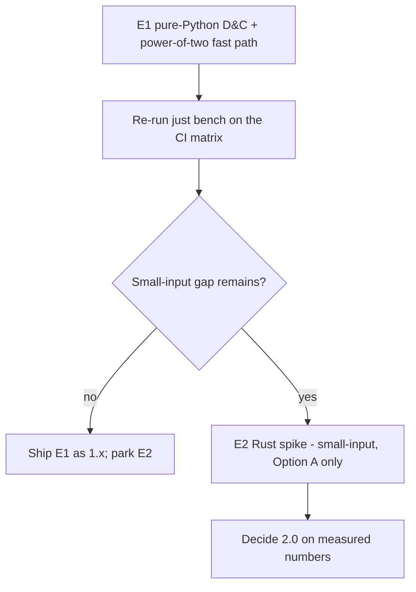

# Idea 00001 r02: v2.0.0 Optional Rust Accelerated Backend

> [!abstract] Recommendation: `proceed-to-experiment`
> Review 00005 refuted r01's central premise: the quadratic `NUM`/`STR` cost is
> an implementation choice, not an algorithmic invariant, and a ~25-line
> pure-Python divide-and-conquer conversion delivers **17.9× at n=20,000 radix 10**
> (112× at radix 256) bit-exact, at zero build cost. This revision re-baselines
> the idea: the long-input regime is a **1.x** pure-Python win, and the residual
> Rust case is the *small-input* regime only, with an unmeasured ~8× ceiling.
> Next move: run **E1** — land the pure-Python D&C conversion plus a power-of-two
> fast path behind the existing conformance suite — before any Rust spike.

## 1. Seed Idea

### Original proposition

Open an idea to plan `v2.0.0` as specified on the project roadmap. The stated
objectives are:

1. **Performance** as the primary goal.
2. **Convert the compute bottleneck into Rust.**
3. **Maintain similar compatibility as `v1.0.0`.**
4. **Identify and recommend any feature** that can be added to `v2`.

The roadmap's 2.0 line (README §Roadmap) reads: *"Optional accelerated backend.
An opt-in faster path for high-throughput callers, with the pure-Python
implementation retained as the reference and the default."*

### Motivation and timing

`v1.0.0` shipped (2026-09-05) with a settled reference implementation and a
conformance suite strong enough to prove two implementations agree bit for bit.
The published performance baseline showed the per-numeral cost climbing sharply
past ~1,000 numerals, which the README attributed to a quadratic `NUM`/`STR`
conversion it called "inherent to the algorithm."

**That attribution was wrong, and review 00005 proved it.** The quadratic cost is
inherent to the *naive digit-at-a-time loop*, not to `NUM`/`STR` as specified.
Divide-and-conquer base conversion is subquadratic, and power-of-two radices
admit an O(n) `to_bytes`/`from_bytes` path. This changes the whole shape of the
idea: the long-input regime is addressable in pure Python, now, as a 1.x release.

## 2. Context and Intent

| Field | Detail |
|---|---|
| Intended outcome | An opt-in, faster FF1 path for high-throughput callers, with the pure-Python implementation retained as the reference and the default; bit-exact ciphertext compatibility with 1.0.0. |
| Target users or beneficiaries | Callers encrypting/decrypting large volumes (batch jobs, ETL, tokenisation at scale); downstream consumers of the private project that motivated the library. |
| Current stage | `v1.0.0` published; Idea 00001 r01 reviewed by review 00005, which refuted its premise. This r02 re-baselines the idea. |
| Known constraints | FF1 only; no key management; no application-specific defaults; single runtime dependency (`cryptography`) unless explicitly approved; 100% line/branch coverage floor; conformance is the product. |
| Non-negotiables | Pure-Python stays the reference and the default; opt-in only; bit-exact ciphertext for every input valid in 1.0.0; typed exceptions rooted at `FF1Error`; thread-safety and pickling preserved. |
| Related project context | `src/fpr_ff1/_ff1.py` (Algorithm 7 core, `_num_radix`/`_str_radix` at 463–477), `benchmarks/timing.py`, `docs/reviews/00005-idea-00001-Opus_review.md` (the refuting review), `docs/backlog.md` (2.0 item + dropped Rust-oracle note). |

## 3. Problem or Opportunity

The FF1 core runs ten Feistel rounds. Each round performs, per half, a
`NUM`/`STR` base conversion (`_num_radix`/`_str_radix`), a CBC-MAC PRF, a big
modulo, and list slicing. The shipped conversion is a digit-at-a-time loop:

```python
# src/fpr_ff1/_ff1.py:471-477
def _str_radix(value: int, radix: int, length: int) -> list[int]:
    out = [0] * length
    for i in range(length - 1, -1, -1):
        out[i] = value % radix
        value //= radix
    return out
```

That loop is O(n²). **Base conversion itself is not.** Review 00005 measured a
~25-line pure-Python divide-and-conquer pair (recursive split, `divmod` by a
memoised `radix**k`, naive loop below a 64-numeral threshold) and a power-of-two
`to_bytes`/`from_bytes` fast path, monkeypatched over the module globals:

| Case | Shipped v1.0.0 | Pure-Python D&C | Speedup | Bit-exact |
|---|---:|---:|---:|:--|
| radix 10, n=6 | 30.4 µs | 30.9 µs | 1.0× | yes |
| radix 10, n=1,000 | 1.50 ms | 0.93 ms | 1.6× | yes |
| radix 10, n=5,000 | 33.0 ms | 5.4 ms | 6.1× | yes |
| radix 10, n=20,000 | 506 ms | 28.3 ms | **17.9×** | yes |
| radix 2, n=20,000 | 148 ms | 14.5 ms | 10.2× | yes |
| radix 62, n=20,000 | 916 ms | 49.5 ms | 18.5× | yes |
| radix 65535, n=20,000 | 2,464 ms | 159 ms | 15.5× | yes |
| radix 256, n=20,000 (`to_bytes`) | 1,114 ms | 9.9 ms | **112×** | yes |

All 84 conformance tests (NIST vectors, per-round intermediates, frozen KAT,
exact-arithmetic, properties, interoperability) passed unmodified against the
prototype — bit-exact including per-round `P/Q/R/S/y/m/c/C`.

The opportunity therefore splits into two regimes:

- **Large inputs (n ≳ 1,000):** a pure-Python win, available now, ciphertext-
  identical, shippable as a SemVer *minor* (arguably patch) release. No Rust.
- **Small inputs (n ≈ 6–100):** the residual Rust case. Profiling shows 55% of an
  n=6 call is `cryptography`'s per-call `Cipher(...).encryptor()` construction —
  a full Rust core with in-process AES could eliminate that, with an *estimated*
  (unmeasured) ceiling of ~8×.

## 4. Proposed Feature or Concept

### User-visible outcome

Two separable outcomes:

1. **E1 (pure-Python, 1.x):** subquadratic `NUM`/`STR` conversion plus a
   power-of-two fast path, behind the existing conformance suite. No API change,
   no new dependency, ciphertext unchanged for every input valid in 1.0.0.
2. **E2 (Rust, 2.0, only if E1 leaves a gap):** an opt-in `backend="rust"` path
   scoped to the small-input regime, with the pure-Python path retained as the
   reference and the default.

### Principal use cases

- Batch encryption/decryption of millions of short values (n ≈ 6–16) — the E2
  regime, if E1's small-input numbers leave a gap worth closing.
- Long-input encryption (n in the thousands) — the E1 regime, now a pure-Python
  win.
- Power-of-two radices (256, 65535) — the E1 fast path, the largest measured win.

### Important edge cases

- Odd vs even `n` (the `u != v` path) — `b` is derived from `v`, not `u`.
- `d > 16` S-expansion (radix 10 from 57 numerals, radix 65535 from 13).
- The D&C recursion threshold (lengths 63/64/65/128/129) — needs a boundary test.
- Radix 2 (min_length 20) and radix 65535 (the supported maximum).
- Empty tweak vs absent tweak (must be equivalent).
- Pickling and thread-safety of any accelerated instance (E2 only).

## 5. Desired Outcomes and Success Measures

Targets are now stated as multiples of the **E1** pure-Python baseline, not the
v1.0.0 numbers (which E1 supersedes).

| Outcome | Measure | Baseline (E1) | Target | Evidence needed |
|---|---|---:|---:|---|
| Long-input speedup | per-numeral µs at n=20,000, radix 10 | ~1.41 µs (28.3 ms) | ≥1× (E1 is the win) | `just bench` after E1 lands |
| Power-of-two speedup | n=20,000, radix 256 | ~9.9 ms | ≥1× (E1 is the win) | `just bench` after E1 lands |
| Small-input speedup (E2, conditional) | ops/s on 6 numerals, radix 10 | E1 number (≈ v1.0.0) | ≥N× over E1, N justified vs ~8× ceiling | E2 spike, only if E1 leaves a gap |
| Bit-exact compatibility | ciphertext equality vs 1.0.0 | — | 100% across all vectors | NIST vectors, differential oracle, frozen KAT, bijectivity |
| No API regression | existing callers unaffected | — | pure-Python default unchanged | full existing test suite green |

## 6. Scope and Non-goals

### In scope

- **E1:** subquadratic `NUM`/`STR` conversion + power-of-two fast path, pure
  Python, behind the conformance suite. This is the immediate work.
- **E2 (conditional):** an opt-in Rust backend scoped to the small-input regime,
  behind the existing `FF1` API, only if E1 leaves a gap worth closing.
- Candidate 2.0 features re-evaluated: batch API (re-justified), radix 65536
  (split into fast path vs domain widening), Rust `fpe` oracle (marked as a
  reversal of a recorded drop).

### Out of scope

- FF3/FF3-1 (permanently).
- Key generation, storage, derivation, or management.
- Application-specific defaults, alphabets, or convenience wrappers.
- Any change to accepted inputs or produced outputs for the pure-Python path
  (E1 is ciphertext-identical; radix 65536 widening is a separate minor decision).
- A claim of FIPS validation or full constant-time operation.

## 7. Users and Stakeholders

| Stakeholder | Need or incentive | Impact | Involvement needed |
|---|---|---|---|
| High-throughput callers | Faster batch FPE | Primary beneficiary of both E1 and E2 | Feedback on API shape (batch vs per-call) |
| Downstream private consumer | Throughput at scale | Direct | Confirm the workload profile (long vs short inputs) |
| Maintainer (user) | Keep the "one code path, one dependency" simplicity | Decides the E2 trade-off | Approve E1; decide E2 after E1 |
| Packagers / CI | Reproducible builds | E1: none; E2: new toolchain + wheels | Confirm the supported wheel set (E2 only) |

## 8. Assumption Ledger

| ID | Statement | Classification | Impact if wrong | Evidence status | Confidence | Cheapest test |
|---|---|---|---|---|---|---|
| A1 | `NUM`/`STR` dominates runtime at large n | verified-fact | Mis-targeted optimisation | Confirmed by review 00005 (85% at n=20,000) | High | Profile `_ff1` per round |
| A1b | The quadratic cost is inherent to the algorithm, so only Rust can help | **refuted** | Was the entire large-input case for Rust | Refuted by review 00005 (17.9× pure Python) | High | D&C prototype + `just bench` |
| A2 | Rust big-int arithmetic is meaningfully faster than Python's for the *small-input* regime | hypothesis | E2 has no case | Unmeasured; ~8× ceiling is an estimate | Low | E2 spike, gated on a measured hypothesis |
| A3 | A Rust core can reproduce bit-exact ciphertext and intermediates | hypothesis | Conformance failure blocks E2 | Deterministic, well-specified algorithm | High | Run conformance suite against the spike |
| A4 | PyO3/maturin/abi3 can produce wheels for the matrix | supported | Build feasibility risk (E2) | External docs (PyO3, maturin) | High | Build one abi3 wheel per OS in CI |
| A5 | Adding a Rust backend is acceptable under the "single runtime dependency" principle | preference-or-design-choice | Scope conflict (E2) | AGENTS.md open decision #1 | — | User decision, after E1 |
| A6 | The E2 speedup justifies the build/supply-chain cost | unknown | Go/no-go on E2 | Unmeasured | Low | E2 spike's benchmark |
| A7 | The Rust backend can preserve thread-safety and pickling | inference | Compatibility regression (E2) | PyO3 Send/Sync + pickling support | Medium | Test concurrent use + pickle round-trip |

## 9. Research and Fact Check

| Claim | Finding | Status | Evidence | Checked on |
|---|---|---|---|---|
| The quadratic `NUM`/`STR` cost is inherent to the algorithm | **Refuted** — it is inherent to the naive loop, not to `NUM`/`STR` | refuted | Review 00005: D&C conversion is O(n^1.2–1.3), 17.9× at n=20,000 | 2026-09-05 |
| A pure-Python D&C conversion is bit-exact | Confirmed across 84 conformance tests incl. per-round intermediates | supported | Review 00005 checks performed | 2026-09-05 |
| Power-of-two radices admit an O(n) fast path | Confirmed — `to_bytes`/`from_bytes`, 112× at radix 256 | supported | Review 00005 MED-03 | 2026-09-05 |
| The AES schedule is built per call (batch API amortises it) | **Refuted** — built once per instance | refuted | `_ff1.py:223-227`; review 00005 MED-01 | 2026-09-05 |
| Rust `fpe` crate is a new second-oracle idea | **Refuted** — already dropped in `docs/backlog.md` | refuted | `docs/backlog.md` Dropped Items; review 00005 MED-02 | 2026-09-05 |

### Evidence limitations

- All review 00005 measurements are single-machine (macOS Apple Silicon, CPython
  3.12.13). CPython's big-integer paths differ by version; the 3.13/3.14
  direction is untested and could move the multiples either way. This affects the
  *size* of the win, not its direction.
- No Rust prototype was built, so the ~8× small-input ceiling is an estimate, not
  a measurement.
- The D&C prototype is a correctness-and-timing probe, not a production
  candidate: no type annotations, no threshold tuning, no test coverage of its
  own.

## 10. Challenge Review

### Strongest version of the idea

The long-input regime is solved in pure Python (E1): subquadratic `NUM`/`STR`
conversion plus a power-of-two fast path, ciphertext-identical, shippable as a
1.x release with no new dependency and no loss of the "one code path" property.
The 2.0 question then narrows to the small-input regime alone, where a full Rust
core (Option A) with in-process AES could eliminate the 55% of an n=6 call spent
constructing `cryptography` cipher contexts — a real but unmeasured case, decided
on its merits with real numbers on both sides.

### Formal findings

#### IDEA-00001-R02-MAJ-01: The Rust speedup remains unmeasured; the ~8× small-input ceiling is an estimate, not a measurement

> [!warning] Major
> - **Confidence:** Medium
> - **Category:** Feasibility
> - **Evidence:** Review 00005 measured the pure-Python control but built no Rust prototype. The ~8× ceiling (31.09 µs → ~1.13 µs validation + ~2.3 µs real AES + PyO3 boundary) is arithmetic, not measurement.
> - **Failure scenario:** E2 is approved on the estimated ceiling, the spike measures materially less (e.g. 2–3×), and the build/wheel/supply-chain cost exceeds the benefit.
> - **Impact:** Mis-directed major-version investment; permanent expansion of build and supply-chain surface for a security library whose selling point is "one code path."
> - **Mitigation or test:** Gate E2 on a measured hypothesis of the form "≥N× over the E1 path at n ∈ {6, 100}" with N justified against the ~8× ceiling; settle the crate-fit question (LOW-01) with a 30-minute microbenchmark first.
> - **References:** Review 00005 MAJ-02, LOW-01; `src/fpr_ff1/_ff1.py:480-489` (`_prf`).

#### IDEA-00001-R02-MAJ-02: Bit-exact conformance across a second implementation remains the dominant hazard

> [!warning] Major
> - **Confidence:** High
> - **Category:** Correctness / Conformance
> - **Evidence:** The project's goal is line-by-line comparability against SP 800-38G; the per-round trace hook exists because "two compensating bugs can pass an output test." A Rust core is a second implementation of the same subtle algorithm.
> - **Failure scenario:** A subtle divergence in the Rust core produces plausible-but-wrong ciphertext that NIST vectors (radix 10/36 only) do not catch, and the differential oracle is the only guard for other radices.
> - **Impact:** A conformance regression in the accelerated path would be a correctness defect in a security library.
> - **Mitigation or test:** Run the full conformance suite (NIST vectors, per-round intermediates, differential oracle, frozen KAT, exhaustive bijectivity) against the Rust path. Note: the Rust `fpe` second oracle is a *consequence* of the E2 go decision, never an input to it (see §16, MED-02).
> - **References:** `AGENTS.md` (conformance ethos); `tests/test_intermediates.py`; `tests/test_differential.py`.

#### IDEA-00001-R02-MAJ-03: The "single runtime dependency / one code path" principle is materially changed by E2, but E1 preserves it

> [!warning] Major
> - **Confidence:** High
> - **Category:** Architecture / Scope
> - **Evidence:** `AGENTS.md` states "Never add a runtime dependency beyond `cryptography` without explicit approval"; README 1.0 advertises "one code path, and it is the one the vectors test." E1 is pure Python and preserves both; E2 adds a build toolchain, a compiled extension, and platform wheels.
> - **Failure scenario:** The maintainer rejects the added build complexity, or the "one code path" simplicity is lost, and E2 is reverted.
> - **Impact:** This is AGENTS.md open decision #1 ("whether to build it at all"). E1 does not require resolving it; E2 does.
> - **Mitigation or test:** Decide after E1, when the trade-off is concrete (what is being given up vs the measured small-input win). Record the decision in this idea's decision log.
> - **References:** `AGENTS.md` (open decisions, "Never do"); README §Roadmap.

#### IDEA-00001-R02-MED-01: The D&C conversion trades "clarity over cleverness" — the naive loop is the line-by-line reference

> [!warning] Medium
> - **Confidence:** Medium
> - **Category:** Maintainability
> - **Evidence:** Recursive conversion with a memoised power cache is materially less line-by-line comparable to SP 800-38G than the current five-line loop. `AGENTS.md` says "prefer clarity over cleverness."
> - **Failure scenario:** The reference implementation becomes the optimised one, and a future reviewer can no longer compare the source against the spec line by line.
> - **Impact:** Erosion of the project's core reviewability property.
> - **Mitigation or test:** Keep the naive loop in the module as the documented reference implementation, and assert equivalence with a differential test across every supported radix.
> - **References:** `AGENTS.md` (conventions); review 00005 Open question 2.

#### IDEA-00001-R02-MED-02: The power cache must not become shared mutable state

> [!warning] Medium
> - **Confidence:** Medium
> - **Category:** Concurrency / Correctness
> - **Evidence:** In the prototype the `radix**k` cache is call-local and passed down the recursion. Hoisting it to the instance would be an obvious optimisation and would introduce shared mutable state, breaking the thread-safety contract `_ff1.py:106-118` was written to guarantee.
> - **Failure scenario:** A future "optimisation" hoists the cache to the instance, and concurrent calls corrupt it — the "plausible but wrong" class `AGENTS.md` warns about.
> - **Impact:** A silent concurrency regression in a security library.
> - **Mitigation or test:** State the constraint explicitly in any E1 plan; keep the cache call-local or immutable; add a concurrency test.
> - **References:** `src/fpr_ff1/_ff1.py:106-118`; review 00005 Open question 3.

#### IDEA-00001-R02-MED-03: The Python-side validation floor is an Amdahl floor for any backend

> [!warning] Medium
> - **Confidence:** High
> - **Category:** Performance / Compatibility
> - **Evidence:** `_prepare` runs entirely in Python for both backends — `_coerce_numerals` calls `_require_int` once per numeral. Measured: 643 µs at n=5,000 and 2,586 µs at n=20,000 — a 9.2% floor against the D&C total.
> - **Failure scenario:** A §5 target is stated without accounting for the floor, and the backend is judged against an unreachable number.
> - **Impact:** Mis-set expectations; or, if validation is moved into Rust to escape the floor, changed exception messages and `FF1Error` type mapping — a compatibility question the "same exceptions" non-negotiable does not currently cover.
> - **Mitigation or test:** State every §5 target against the floor; if E2 moves validation into Rust, treat the exception-message/type-mapping change as an explicit compatibility decision.
> - **References:** `src/fpr_ff1/_ff1.py:286-305`; review 00005 LOW-01.

#### IDEA-00001-R02-LOW-01: The Rust crates' big-int fit is unverified

> [!warning] Low
> - **Confidence:** Medium
> - **Category:** Feasibility
> - **Evidence:** `cosmian_fpe` uses `crypto_bigint` (fixed-width) — whether it can represent an n=20,000 half at all is unverified; `fpe`'s `num-bigint` is not established as faster than CPython's `int` for these sizes.
> - **Failure scenario:** E2 is committed before discovering the chosen crate cannot represent the operands or is not faster.
> - **Impact:** Wasted spike budget; a wrong E2 go/no-go.
> - **Mitigation or test:** A 30-minute crate-level microbenchmark of `num-bigint` divmod at 33k-bit operands vs CPython, before committing to E2.
> - **References:** Review 00005 Open question 4.

#### IDEA-00001-R02-LOW-02: Single-machine measurement; 3.13/3.14 direction untested

> [!warning] Low
> - **Confidence:** High
> - **Category:** Evidence quality
> - **Evidence:** All review 00005 numbers come from one macOS Apple Silicon machine on CPython 3.12.13. CPython's big-integer paths changed in 3.12 and are not identical on 3.13/3.14.
> - **Failure scenario:** The E1 multiple is materially smaller on another interpreter/platform, and the published README table overstates it.
> - **Impact:** A documentation accuracy issue, not a correctness one.
> - **Mitigation or test:** Re-run `just bench` on the CI matrix after E1 lands and publish the matrix numbers.
> - **References:** Review 00005 Confidence.

### Failure modes and unintended consequences

- **Two implementations drift apart** (E2 only) as the pure-Python reference and the Rust core are maintained separately.
- **The "one code path" simplicity is lost** (E2 only); reviewers can no longer verify the whole library against SP 800-38G in one file.
- **The D&C conversion obscures the reference** (E1) if the naive loop is not retained as the documented reference.
- **Overclaiming constant-time**: neither E1 nor E2 eliminates value-dependent timing; claiming otherwise would be a security misrepresentation.

### Conditions to revise, park, or reject

- **Revise** if E1's landing reveals the D&C conversion is not bit-exact on some radix, or if the power cache cannot be kept thread-safe.
- **Park E2** if E1's small-input numbers leave no gap worth closing, or if the measured Rust speedup is small (<2×) against the E1 baseline.
- **Reject E2** if the Rust core cannot reproduce bit-exact ciphertext and intermediates, or if the maintainer decides the "one code path" principle outweighs the small-input gain.

## 11. Options and Trade-offs

| Option | Benefits | Costs and risks | Reversibility | Evidence needed |
|---|---|---|---|---|
| **A. Full Rust core** (Algorithm 7 + PRF in Rust) | Eliminates the 55% `cryptography` ctor overhead on small inputs; second independent AES | Second AES to validate; largest Rust surface; trace hook reimplementation; wheel matrix; unmeasured ~8× ceiling | High (opt-in, pure-Python default) | E2 spike + conformance |
| **B. Rust NUM/STR only** | Smaller Rust surface; no crypto in Rust | **Now known inert**: NUM/STR is ~5% of small-input cost and pure Python already wins at large n | High | — (dropped as a stage) |
| **C. Pure-Python optimisation** (D&C conversion + power-of-two fast path) | **Measured 17.9× at n=20,000, 112× at radix 256**; no build complexity; keeps one code path; ciphertext-identical | Clarity-vs-cleverness trade-off (MED-01); power-cache thread-safety (MED-02) | High | E1: land behind the conformance suite |
| **D. No-build / defer** | Zero cost; simplicity preserved | Leaves the measured 17.9× on the table for long-input callers | High | User priority call |

## 12. Recommended Concept

The re-baselined synthesis is: **E1 first (Option C), then decide E2 (Option A)
on its merits.** E1 is the immediate, independently valuable work — pure-Python
D&C conversion plus a power-of-two fast path, behind the existing conformance
suite, shippable as a 1.x release. E2 is a conditional Rust backend scoped to the
small-input regime, gated on a measured hypothesis against the E1 baseline.



The candidate features, re-evaluated:

1. **Batch API** — re-justified. The original rationale (amortise AES schedule and
   P-block) is false: the AES schedule is already per-instance, and the P-block is
   per-call but n/tweak-dependent. The real rationale is boundary-crossing
   amortisation *under a Rust backend* plus caller ergonomics, with a measured
   ceiling (~1.05× in pure Python). It is a new public API and therefore in
   tension with the "small surface" rule that killed the migration shim.
2. **Radix 65536** — split into two halves: the **fast path** (pure optimisation,
   no behaviour change, ships in a minor/patch) and the **domain widening**
   (accepts new inputs, a SemVer minor per the version policy). Only the second
   half is a versioning question.
3. **Rust `fpe` second oracle** — a *reversal* of a recorded drop, valid only as a
   consequence of the E2 go decision (Rust already in the build), never as an
   input to it. Removed from the mitigation column of the conformance finding.

## 13. Dependencies, Risks, and Safeguards

| Item | Type | Likelihood | Impact | Mitigation, test, or owner |
|---|---|---|---|---|
| D&C conversion bit-exactness | Risk | Low | High | Full conformance suite + threshold-boundary test + differential vs naive loop |
| Power-cache thread-safety | Risk | Low | High | Keep cache call-local/immutable; concurrency test |
| Clarity-vs-cleverness | Risk | Medium | Medium | Retain naive loop as reference; differential equivalence test |
| Rust toolchain + maturin (E2) | Dependency | High | Medium | maturin-action, abi3 wheels; pure-Python sdist as fallback |
| Second AES implementation (E2) | Risk | Medium | High | Validate against NIST AES vectors + Python PRF |
| Bit-exact divergence (E2) | Risk | Medium | Critical | Full conformance suite on both paths; reproduced trace hook |
| Wheel matrix growth (E2) | Cost | High | Medium | Decide supported wheel set; abi3 collapses Python versions |

## 14. Highest-value Next Experiment

**E1 (do first, ~half a day, no Rust):**

- **Hypothesis:** A pure-Python divide-and-conquer `NUM`/`STR` conversion plus a
  power-of-two `to_bytes`/`from_bytes` fast path is bit-exact across every
  supported radix and delivers the measured 17.9× (n=20,000 radix 10) and 112×
  (radix 256) on the CI matrix, with no API change and no new dependency.
- **Method:** Land the D&C conversion and the power-of-two fast path behind the
  existing conformance suite; retain the naive loop as the documented reference;
  add a threshold-boundary test (63/64/65/128/129) and a differential test
  asserting D&C output equals the naive loop across every supported radix.
- **Inputs or participants:** One developer; the existing test suite and vector
  fixtures; no new dependency.
- **Success threshold:** All conformance tests (NIST vectors, per-round
  intermediates, differential oracle, frozen KAT, bijectivity) green; `just bench`
  reproduces the review's multiples within an order of magnitude on the CI matrix.
- **Failure threshold:** Any bit-exactness divergence, or the power cache cannot
  be kept thread-safe without shared mutable state.
- **Expected effort:** ~half a day.
- **Risks and safeguards:** Keep the cache call-local/immutable; do not modify the
  public API; update `README.md` §Performance in the same change.
- **Evidence to capture:** Per-case speedup on the CI matrix; conformance
  pass/fail; the retained naive-loop differential test.
- **Decision enabled:** Whether the long-input regime is solved in 1.x (it is, per
  review 00005); the real E1 baseline for any E2 target.

**E2 (only if E1 leaves a small-input gap worth closing):**

- **Hypothesis:** A full Rust core (Option A) with in-process AES is ≥N× faster
  than the E1 path at n ∈ {6, 100}, with N justified against the ~8× ceiling.
- **Method:** A throwaway Rust spike scoped to the small-input regime and Option A
  only; benchmark against the E1 numbers; run the conformance suite against the
  Rust path.
- **Inputs or participants:** One developer; Rust toolchain; a pinned Rust AES
  crate; the crate-fit microbenchmark (LOW-01) first.
- **Success threshold:** ≥N× over E1 at n ∈ {6, 100}, with 100% conformance.
- **Failure threshold:** <2× over E1, or any conformance divergence.
- **Expected effort:** ~1–2 developer-days, after the crate-fit microbenchmark.
- **Risks and safeguards:** Spike is throwaway; do not modify the pure-Python
  reference; pin the Rust AES crate.
- **Evidence to capture:** Per-case speedup vs E1; conformance pass/fail.
- **Decision enabled:** Go/no-go on the 2.0 Rust backend, on measured numbers.

## 15. Open Questions and Loose Ends

### Blocking

None — E1 is coherent and independently valuable; E2 is gated on E1's result.

### Important but non-blocking

- [ ] Is the "one code path" property worth more than the small-input win? (maintainer decision, after E1 — resolved by the user, not by measurement)
- [ ] Does the D&C conversion violate "prefer clarity over cleverness"? (resolvable by retaining the naive loop as reference + differential test — decide explicitly rather than discovering in review)

### Later considerations

- [ ] Free-threaded (3.14t) and abi3t (3.15+) wheel support (E2 only).
- [ ] Whether the Rust `fpe` crate is audited for conformance before use as an oracle (E2 only).
- [ ] Constant-time posture: document what E1 and E2 do and do not guarantee.

## 16. Feedback Incorporated

| Feedback or prior finding | Disposition | Change in this revision | Rationale |
|---|---|---|---|
| REV-00005-MAJ-01 (premise false: quadratic is an implementation choice) | accepted | Reclassified A1 corollary from `verified-fact` to `refuted`; rewrote §3; promoted Option C to the measured baseline | The D&C conversion is subquadratic; the naive loop, not `NUM`/`STR`, is quadratic |
| REV-00005-MAJ-02 (experiment tests wrong hypothesis/baseline) | accepted | Restructured §14 into E1 (pure-Python) + E2 (Rust, conditional); re-derived §5 targets against the E1 baseline | Stage 1 (NUM/STR port) addresses ~5% of small-input cost and would be compared against a stale baseline |
| REV-00005-MED-01 (batch API rationale false) | accepted | Re-justified the batch API on boundary-crossing amortisation + ergonomics; noted the "small surface" tension | AES schedule is already per-instance; P-block is per-call but n/tweak-dependent |
| REV-00005-MED-02 (Rust `fpe` oracle already dropped) | accepted | Marked the oracle as a reversal of a recorded drop, valid only as a consequence of the E2 go decision; removed it from the conformance finding's mitigation | The "revisit only if" condition has not been met; using it to justify Rust is circular |
| REV-00005-MED-03 (power-of-two fast path mis-ranked) | accepted | Promoted the power-of-two fast path to a first-class workstream; split radix 65536 into fast path vs domain widening | It is the largest measured win (112×), not a "not a driver" Low |
| REV-00005-MED-04 (README claim now false) | accepted | Flagged `README.md:229-234` for correction in the same change that lands E1 | The idea inherited the error from the README; fixing the idea alone leaves the source in place |
| REV-00005-LOW-01 (validation floor unaccounted) | accepted | Added MED-03 recording the `_prepare` Amdahl floor and the exception-mapping compatibility question | `_prepare` is a real floor for any backend |
| REV-00005-LOW-02 (`docs/ideas/AGENTS.md` missing) | accepted (now resolved) | `docs/ideas/AGENTS.md` was created after the review | The directory contract now exists |
| IDEA-00001-R01-MAJ-01 (speedup magnitude unproven) | superseded | Re-expressed as R02-MAJ-01 (Rust speedup unmeasured, scoped to small-input) | The pure-Python win is now measured; the Rust case is the residual |
| IDEA-00001-R01-MAJ-02 (bit-exact conformance hazard) | still-open | Re-expressed as R02-MAJ-02, scoped to E2 | Unchanged in substance; now applies only to the Rust path |
| IDEA-00001-R01-MAJ-03 (single dependency / one code path) | still-open | Re-expressed as R02-MAJ-03, deferred to the E2 decision | E1 preserves both principles; E2 does not |

## 17. Decision Log

| Date | Decision or change | Rationale | Owner |
|---|---|---|---|
| 2026-09-05 | Idea opened as IDEA-00001 r01 (draft) | Roadmap 2.0 item + user objectives (performance, Rust, compatibility) | idea-architect |
| 2026-09-05 | r01 premise refuted by review 00005; re-baselined to r02 | The quadratic `NUM`/`STR` cost is an implementation choice, not an algorithmic invariant; pure Python delivers 17.9× at n=20,000 | idea-architect (on review 00005 evidence) |

## 18. Recommended Next Actions

1. **Run E1** — land the pure-Python D&C conversion plus the power-of-two fast path behind the conformance suite, with the naive loop retained as reference and a differential equivalence test. Ship as a **1.x** release (ciphertext-identical, so not a major version). Update `README.md` §Performance and `docs/backlog.md` in the same change.
2. **Re-run `just bench` on the CI matrix** to replace the single-machine numbers with matrix numbers.
3. **Then re-ask the 2.0 question** with the E1 baseline: decide whether the small-input gap is worth closing, and if so, run E2 (Rust, Option A only) after the crate-fit microbenchmark.
4. **Hand off to the planning agent** for an E1 delivery plan (or a combined E1-then-E2 plan) once this idea is accepted.

## 19. Revision History

| Revision | Status | Kind | Supersedes | Summary |
|---|---|---|---|---|
| r01 | draft | initial | — | Initial discovery: Rust accelerated backend for 2.0, staged spike, candidate features |
| r02 | revised | feedback | r01 | Re-baselined after review 00005: pure-Python D&C is the long-input win; Rust scoped to small-input, gated on E1 |

## References

None. This revision rests on repository evidence and on the measurements recorded
in `docs/reviews/00005-idea-00001-Opus_review.md`; no new external research was
performed.

## Confidence

**Medium.** The re-baselining direction is high-confidence — review 00005's
measurements are cross-checked six ways and the effect size (17.9×, 112×) is far
too large to be noise — but they are single-machine and not independently
reproduced here, and the residual Rust case (the ~8× small-input ceiling) is an
unmeasured estimate. The principal uncertainty is the *size* of the E1 win on
other interpreters/platforms and whether E2's small-input case survives
measurement.
