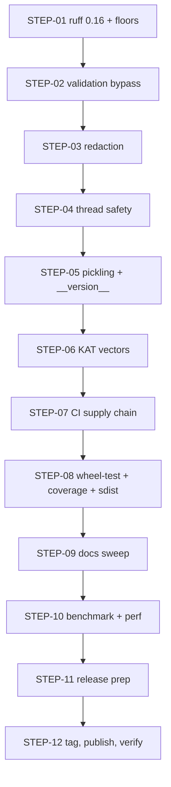

# Delivery Plan 00002: Reviews 00003 and 00004 to v1.0.0

> [!abstract] Plan status: `approved`
> Close every pre-1.0 blocker from reviews 00003 and 00004 — the minimum-domain
> validation bypass, plaintext disclosure in exception messages, the
> thread-safety hazard, the vulnerable `cryptography` floor, and the packaging,
> supply-chain and documentation gaps — then cut and publish `v1.0.0`. All
> user decisions are resolved; the plan is approved and ready for Builder.

## 1. Objective and outcome

`fpr-ff1` v0.1.1 is functionally conformant (both reviews verified the FF1 core
against SP 800-38G and found no algorithmic defects) but both reviews verdict
**no-go for an immediate `v1.0.0`**: review 00003 lists 7 blockers, review 00004
lists 3 major findings plus medium decision items. This plan closes every
blocker, major, and agreed high/medium/low finding, applies the three user
decisions (radix subset documented; `requires-python` upper bound dropped;
pickling and frozen oracle KAT vectors in scope), and ships `v1.0.0` to PyPI via
the existing Trusted Publishing pipeline.

The observable outcome: a `v1.0.0` release on PyPI whose classifier reads
Production/Stable, whose validation cannot be bypassed by a lying `Sequence`,
whose exceptions never echo plaintext values, whose instances are thread-safe
and picklable, whose dependency floor admits no known-vulnerable `cryptography`
release, and whose published artifact is byte-identical to the artifact CI
tested.

## 2. Source traceability

| Requirement | Source | Source location | Interpretation |
|---|---|---|---|
| PLAN-00002-REQ-01 | Review 00004 | `docs/reviews/00004-...md`, MAJ-01 | Enforce `Sequence` and revalidate materialised length in `_prepare` |
| PLAN-00002-REQ-02 | Review 00003 + 00004 | 00003 B3; 00004 MAJ-03 | Redact plaintext values from `ValueRangeError` messages |
| PLAN-00002-REQ-03 | Review 00003 + 00004 | 00003 H2; 00004 MED-01 | Call-local ECB encryptor; thread safety becomes a guarantee |
| PLAN-00002-REQ-04 | Review 00003 | 00003 H1, H3 | Pickling support; `self._key` retained deliberately for the rebuild |
| PLAN-00002-REQ-05 | Review 00003 + 00004 | 00003 B2; 00004 LOW-04 | `__version__` via `importlib.metadata`, exported and documented |
| PLAN-00002-REQ-06 | Review 00003 + 00004 | 00003 B4; 00004 LOW-01 | Drop the `requires-python` upper bound; `--locked` sync in CI |
| PLAN-00002-REQ-07 | Review 00004 | 00004 MAJ-02 | Raise `cryptography` floor to `>=50.0.0`; refresh lock; audit in CI |
| PLAN-00002-REQ-08 | Review 00003 + 00004 | 00003 H4; 00004 MED-03 | Pin all Actions to full SHAs; verify gitleaks checksum; dependabot |
| PLAN-00002-REQ-09 | Review 00003 + 00004 | 00003 H5; 00004 MED-02 | Publish the gate-built artifact; guard `workflow_dispatch` |
| PLAN-00002-REQ-10 | Review 00003 | 00003 H6 | Frozen oracle-generated KAT vectors with provenance header |
| PLAN-00002-REQ-11 | Review 00003 + 00004 | 00003 M3; 00004 LOW-03 | CI job installs the built wheel and runs the suite against it |
| PLAN-00002-REQ-12 | Review 00003 + 00004 | 00003 M1; 00004 LOW-02 | Reformat under ruff 0.16; floor `ruff>=0.16`; explicit sdist contents |
| PLAN-00002-REQ-13 | Review 00003 | 00003 M2 | Add `.pre-commit-config.yaml` wiring ruff, ruff-format, gitleaks |
| PLAN-00002-REQ-14 | Review 00003 + 00004 | 00003 M4; 00004 LOW-01 | Move coverage flags out of `addopts` for downstream packagers |
| PLAN-00002-REQ-15 | Review 00004 | 00004 MED-04 | Operational security guidance; no bare zero key in quick start |
| PLAN-00002-REQ-16 | Review 00004 | 00004 MED-05 (user decision: subset) | Document radix `2..65535` as a deliberate subset; fix comparison table |
| PLAN-00002-REQ-17 | Review 00004 | 00004 MED-06 | Replace "proven" language with calibrated evidence language |
| PLAN-00002-REQ-18 | Review 00003 + 00004 | 00003 B1, B5, B6, B7; 00004 LOW-04 | Version 1.0.0, classifier, SECURITY.md lifecycle, AGENTS.md, changelog |
| PLAN-00002-REQ-19 | Review 00003 + 00004 | 00003 M7, M8, L4; 00004 LOW-04 | Badges, CONTRIBUTING.md, CODE_OF_CONDUCT.md, templates, Documentation URL |
| PLAN-00002-REQ-20 | Review 00003 | 00003 M9, M10 | Benchmark harness (`just bench`); README performance section; hoist `radix**u`/`radix**v` |
| PLAN-00002-REQ-21 | Review 00003 | 00003 L1, L2, L3, L5, L6 | Polish: untrack `.codegraph/`, sdist excludes, config docs, tweak-first validation, migration wording |
| PLAN-00002-REQ-22 | Review 00003 + 00004 | 00003 §6; 00004 P1 | Full local gate + 9-leg matrix green before tagging |
| PLAN-00002-REQ-23 | Review 00003 + 00004 | 00003 §6; 00004 P1, LOW-05 | Tag signed `v1.0.0`; publish; verify PyPI state and attestations |
| PLAN-00002-REQ-24 | Review 00004 | 00004 MED-05 (user decision) | Version policy: domain expansion without behaviour change is minor |

## 3. Repository baseline

| Field | Value |
|---|---|
| Repository | `joelee/fpr-ff1` (`git@github.com:joelee/fpr-ff1.git`) |
| Branch | `main` |
| HEAD | `31419828e6d00141b59d22387de665a3bc48a9ff` ("Release v0.1.1") |
| Working tree at publication | Clean |
| Applicable instructions | `AGENTS.md` (agent contract); `docs/AGENTS.md` (documentation rules) |

## 4. Scope

### In scope

- `src/fpr_ff1/_ff1.py` validation, thread-safety, pickling, and performance
  changes; `src/fpr_ff1/__init__.py` `__version__` export.
- `pyproject.toml` version, classifier, `requires-python`, dependency floors,
  coverage configuration, sdist excludes, project URLs.
- `.github/workflows/ci.yml` and `publish.yml` supply-chain hardening; new
  `.github/dependabot.yml`, `.pre-commit-config.yaml`, issue/PR templates.
- `README.md`, `SECURITY.md`, `CHANGELOG.md`, `AGENTS.md`, `docs/*` updates
  required by the findings and the documentation rules.
- New test modules for the validation bypass, redaction, pickling,
  thread-safety, and frozen KAT vectors; `benchmarks/timing.py`.
- Release execution: tag `v1.0.0`, GitHub Release, Trusted Publishing,
  post-publish PyPI verification.

### Out of scope

- FF3/FF3-1, key management, application-specific defaults (permanently, per
  `AGENTS.md`).
- Radix `65536` support (user decision: document the `2..65535` subset).
- Optional accelerated backend (backlogged for post-1.0 / 2.0, per
  `docs/backlog.md`).
- Review 00004 P2 items: mutation testing, a second independent FF1 oracle,
  acting on SP 800-38G Rev. 1 finalisation (ongoing backlog item).
- `verbose_errors` opt-in flag (planner resolution: redaction is unconditional).
- Read-only `radix`/`alphabet`/`tweak` properties and `__repr__` (00003 M5;
  user decision: not in this release — additive, can land in 1.1).
- Rewriting published git history or changing commit author metadata (00004
  LOW-05 notes the corporate email; history rewrite is out of scope).
- `docs/reviews/` remains local-only per the standing owner decision recorded in
  plan 00001.

## 5. Constraints and preserved decisions

- **100% line and branch coverage floor** on the FF1 module is preserved; every
  new raise path gets a test, and dead branches are deleted rather than kept
  (`AGENTS.md`).
- **No floating-point arithmetic** in the FF1 core; the AST scan test must keep
  passing. Docstring/comment text must avoid the scanned tokens (`math.log`,
  `math.ceil`, float literals) — plan 00001 W3 documented this trap.
- **Never regenerate NIST fixtures from this implementation**; frozen KAT vectors
  are generated by the *oracle*, with provenance, which the reviews and
  `AGENTS.md` distinguish from self-authored vectors.
- **No runtime dependency beyond `cryptography`**; oracle and audit tools are
  dev-dependencies only, pinned.
- **SemVer with the project contract**: any change to accepted inputs or
  produced outputs is a major version. This release *is* the major version, so
  the input-domain changes it carries (rejecting lying `Sequence`s, `dict`,
  `set`; redacted messages) land legally. REQ-24 records the forward policy
  revision.
- **Thread-safety fix must not change ciphertext** for any currently valid
  input (both reviews' explicit constraint; verified by the unchanged NIST,
  differential, and bijectivity suites).
- Documentation is updated in the same change that makes it true
  (`docs/AGENTS.md`).
- The private test-only trace hook (`FF1._encrypt_traced`) stays off the public
  API.

## 6. Assumptions

None. Unresolved matters are recorded as decisions and block approval when
material.

## 7. Decisions and blockers

| ID | Decision or blocker | Resolution | Owner | Status |
|---|---|---|---|---|
| DEC-01 | Radix 65536: support vs document subset (00004 MED-05) | Document `2..65535` as a deliberate supported subset; correct the README comparison table; revise the version policy so future domain expansion is a SemVer minor change | User | Resolved 2026-09-04 |
| DEC-02 | `requires-python` cap (00003 B4) | Drop the upper bound entirely (`>=3.12`); classifiers state the tested versions; update the documented cap policy in README, backlog, pyproject comment | User | Resolved 2026-09-04 |
| DEC-03 | Optional additions (00003 H1/H6/M5; 00004 release path) | Pickling support (H1) and frozen oracle KAT vectors (H6) are in scope; M5 properties/`__repr__` and the 1.0.0rc1 TestPyPI stage are not — ship v1.0.0 directly once the matrix is green | User | Resolved 2026-09-04 |
| DEC-04 | `cryptography` floor conflict: 00003 M6 (lower) vs 00004 MAJ-02 (raise) | Raise to `>=50.0.0` — advisory PYSEC-2026-3552 affects 44.0.0–49.0.0, so the versions M6 would permit are known-vulnerable; the locked env already resolves 50.0.0 | Planner (evidence) | Resolved 2026-09-04 |
| DEC-05 | Redaction opt-in (00003 B3 suggests optional `verbose_errors`) | Redaction is unconditional; no new constructor flag at freeze time | Planner (evidence) | Resolved 2026-09-04 |
| DEC-06 | Thread safety: fix vs document (00003 H2 judgement call; 00004 MED-01) | Fix: call-local ECB encryptor; upgrade documentation from caveat to guarantee | Both reviews + user (DEC-03 covers the aligned highs) | Resolved 2026-09-04 |

## 8. Affected architecture and components

- `src/fpr_ff1/_ff1.py` — `FF1.__init__` (cipher construction, `_key`
  retention comment), `_Aes` (loses `ecb_encryptor` field), `_ff1` core
  (call-local ECB encryptor in the `d > 16` branch; hoisted `radix**u` /
  `radix**v`), `_prepare` (Sequence enforcement + length revalidation +
  tweak-before-coercion reorder), `_coerce_numerals` and `_decode_str`
  (redacted messages), new `__getstate__`/`__setstate__`, class docstring
  (thread-safety guarantee).
- `src/fpr_ff1/__init__.py` — `__version__` export.
- `src/fpr_ff1/_exceptions.py` — unchanged hierarchy; messages only.
- `tests/` — new: `test_sequence_validation.py` (or extend
  `test_validation.py`), redaction assertions, `test_pickle.py`,
  `test_thread_safety.py`, `tests/vectors/oracle_kat_frozen.json` +
  generation script; existing suites must pass unchanged (NIST, intermediates,
  differential, interoperability, bijectivity, properties, exact-arithmetic,
  contract, validation, smoke).
- `pyproject.toml` — version, classifiers, `requires-python`, `cryptography`
  floor, `ruff` floor, coverage config relocation, sdist excludes, URLs.
- `.github/workflows/ci.yml`, `.github/workflows/publish.yml`,
  `.github/dependabot.yml` (new), `.github/ISSUE_TEMPLATE/` (new),
  `.pre-commit-config.yaml` (new).
- `README.md`, `SECURITY.md`, `CHANGELOG.md`, `AGENTS.md`, `docs/backlog.md`,
  `docs/configuration.md`, `docs/developer-guide.md`,
  `docs/directory-structure.md`, `docs/architecture.md` (only if the
  thread-safety guarantee changes the documented design),
  `CONTRIBUTING.md` (new), `CODE_OF_CONDUCT.md` (new).
- `benchmarks/timing.py` (new), `justfile` (`bench` recipe; coverage recipe).
- `.codegraph/.gitignore` — untracked (L1).

## 9. Requirement catalogue

### PLAN-00002-REQ-01 — Close the minimum-domain validation bypass

- **Requirement:** `encrypt_numerals`/`decrypt_numerals` accept only real
  `collections.abc.Sequence` inputs; `dict`, `set`, and `Sequence`s whose
  `__len__` disagrees with their yielded values are rejected with typed
  exceptions; the materialised length is revalidated against the declared
  length and against `_validate_length` before the core runs.
- **Rationale:** A lying `Sequence` can encrypt a domain smaller than the
  enforced 1,000,000 minimum — a fail-open validation, explicitly in
  `SECURITY.md` scope, and a release blocker in review 00004.
- **Source:** `docs/reviews/00004-...md` MAJ-01; `src/fpr_ff1/_ff1.py`
  `_prepare` (lines 270–289).
- **Acceptance evidence:** New regression tests: inconsistent `Sequence` (0, 1,
  5 yielded values against declared 6), `dict`, `set`, both directions, and
  values below `min_length` — all rejected; full suite green; coverage floor
  holds.

### PLAN-00002-REQ-02 — Redact plaintext from exception messages

- **Requirement:** `ValueRangeError` messages from `_coerce_numerals` and
  `_decode_str` contain the index and failure kind but never the offending
  numeral value or character.
- **Rationale:** Current messages echo plaintext fragments into logs,
  contradicting `SECURITY.md`'s explicit scope; both reviews block on it.
- **Source:** 00003 B3; 00004 MAJ-03; `SECURITY.md` "Scope".
- **Acceptance evidence:** Tests assert the offending value/character is
  **absent** from `str(exc)` and the index is present; the existing test that
  requires the character in the message is inverted; no `match=` assertion in
  the suite references the removed text.

### PLAN-00002-REQ-03 — Thread safety by construction

- **Requirement:** No shared mutable cipher state on `FF1` instances: the ECB
  encryptor is created call-locally inside the `d > 16` expansion branch and
  discarded; `_Aes` retains only immutable configuration. Documentation
  (class docstring, README, `docs/configuration.md`, changelog) states
  instances are thread-safe.
- **Rationale:** The cached context is a silent-wrong-ciphertext hazard
  invisible at short lengths; both reviews recommend fixing over documenting.
- **Source:** 00003 H2 (with per-radix threshold table); 00004 MED-01;
  `src/fpr_ff1/_ff1.py` `_Aes`, `__init__`, `_ff1` step 6.iii.
- **Acceptance evidence:** A concurrency test (threads sharing one instance,
  `d > 16` inputs, results compared to single-threaded expectations) passes;
  NIST/differential/bijectivity suites unchanged (ciphertext identical);
  `_Aes` has no `CipherContext` field.

### PLAN-00002-REQ-04 — Pickling and copy support

- **Requirement:** `FF1` instances support `pickle` round-trip and
  `copy.deepcopy`/`copy.copy` via `__getstate__`/`__setstate__` that drop the
  cipher objects and rebuild them from `self._key`; `self._key` is retained
  with a comment naming pickling as the reason; `SECURITY.md` documents that
  the key crosses the pickle boundary.
- **Rationale:** FPE is a batch-processing workload; spawn-method
  multiprocessing and PySpark broadcast need picklable instances. Blocking
  usability wall at freeze time.
- **Source:** 00003 H1, H3; user decision DEC-03.
- **Acceptance evidence:** Round-trip test (pickle + deepcopy, encrypt/decrypt
  equality with the original, including a `d > 16` input); `multiprocessing`
  spawn round-trip test; SECURITY.md contains the pickle-boundary warning.

### PLAN-00002-REQ-05 — `__version__`

- **Requirement:** `fpr_ff1.__version__` exists via
  `importlib.metadata.version("fpr-ff1")`, is listed in `__all__`, and is
  documented in the README API section.
- **Rationale:** Callers recording which build produced data need it; must
  land while the surface can still be documented as stable.
- **Source:** 00003 B2; 00004 LOW-04.
- **Acceptance evidence:** Wheel-install smoke test asserts
  `fpr_ff1.__version__ == "1.0.0"`; README documents it.

### PLAN-00002-REQ-06 — `requires-python` upper bound dropped

- **Requirement:** `requires-python = ">=3.12"` with no upper bound; the
  pyproject comment, README "Supported Python versions", and
  `docs/backlog.md` "Ongoing" item are updated to the new policy (classifiers
  state tested versions; the cap policy is retired).
- **Rationale:** 3.15.0 final is scheduled 1 Oct 2026; a capped library
  becomes uninstallable there. User decision DEC-02.
- **Source:** 00003 B4; user decision DEC-02.
- **Acceptance evidence:** `pyproject.toml` shows `>=3.12`; README/backlog
  carry no cap defence; built metadata (`twine check` output / wheel METADATA)
  shows `Requires-Python: >=3.12`.

### PLAN-00002-REQ-07 — `cryptography` floor raised to a clean minimum

- **Requirement:** `dependencies = ["cryptography>=50.0.0"]`; `uv.lock`
  refreshed; a CI dependency-audit step runs `pip-audit` (or OSV scanner)
  against the lock and the declared-minimum resolution; the floor change is
  recorded in the 1.0.0 changelog.
- **Rationale:** The 44.0.0 floor permits releases affected by
  PYSEC-2026-3552 (fixed 50.0.0); scanners flag valid installations. Planner
  resolution DEC-04 of the M6/MAJ-02 conflict.
- **Source:** 00004 MAJ-02 (with advisory references); 00003 M6 overruled.
- **Acceptance evidence:** `pyproject.toml` floor is `>=50.0.0`; audit job
  green in CI; changelog records it.

### PLAN-00002-REQ-08 — Supply-chain hardening of workflows

- **Requirement:** Every action in `ci.yml` and `publish.yml` is pinned to a
  40-char commit SHA with the version in a trailing comment; the gitleaks
  tarball install verifies a published checksum; `.github/dependabot.yml`
  covers `github-actions` and `uv` ecosystems.
- **Rationale:** Mutable tags in a workflow holding `id-token: write` are a
  compromised-upstream path to the PyPI publishing token.
- **Source:** 00003 H4; 00004 MED-03.
- **Acceptance evidence:** No `@vN` or `@release/vN` refs remain in either
  workflow; dependabot config present; CI green (the pinned actions must
  actually run).

### PLAN-00002-REQ-09 — Publish the artifact that was tested

- **Requirement:** `publish.yml` downloads the `distributions` artifact built
  by the gated CI run and publishes that, instead of rebuilding; the manual
  `workflow_dispatch` trigger is removed (release events only); a guard
  verifies the tag matches the project version before publishing.
- **Rationale:** Two builds means only one was verified; manual dispatch can
  publish from an arbitrary ref.
- **Source:** 00003 H5; 00004 MED-02.
- **Acceptance evidence:** `publish.yml` contains `download-artifact` and no
  second `uv build`; no `workflow_dispatch` trigger; a tag/version guard step
  exists; the v1.0.0 publish run is green and publishes the gated artifact.

### PLAN-00002-REQ-10 — Frozen oracle KAT vectors

- **Requirement:** A generation script (dev-only) produces
  `tests/vectors/oracle_kat_frozen.json` from `ubiq-security-fpe==2.0.1.1`
  with a provenance header (oracle package version, generation date, inputs);
  a test asserts this implementation agrees with the frozen vectors; the live
  differential run remains the primary check.
- **Rationale:** The deprecated oracle is a single point of failure for all
  non-NIST-radix correctness evidence; frozen oracle-derived vectors are
  durable and do not violate the no-self-authored-vectors rule.
- **Source:** 00003 H6; user decision DEC-03.
- **Acceptance evidence:** Vector file present with provenance header; test
  passes with and without the oracle installed; `AGENTS.md` test rules
  respected (values from the independent implementation).

### PLAN-00002-REQ-11 — CI tests the built wheel

- **Requirement:** A CI job builds the wheel, installs it into a clean venv,
  and runs the full test suite against the installed package (importing every
  public symbol, encrypting/decrypting a NIST vector, checking `py.typed` and
  `__version__`).
- **Rationale:** Source-tree tests cannot catch packaging defects; the wheel is
  currently correct by inspection, not by enforcement.
- **Source:** 00003 M3; 00004 LOW-03.
- **Acceptance evidence:** The wheel-test job is green in the v1.0.0 gate run.

### PLAN-00002-REQ-12 — Formatter drift resolved and sdist contents explicit

- **Requirement:** Run `ruff format` under 0.16.x and commit; raise the dev
  floor to `ruff>=0.16`; add `[tool.hatch.build.targets.sdist]` explicit
  include/exclude (exclude agent/planning docs, `.codegraph`, local build
  dirs; keep licence, README, changelog, security policy, source, tests,
  vectors); add a sdist contents assertion to CI.
- **Rationale:** The next `just lock` would turn CI red for formatting reasons;
  the sdist currently ships agent state and swallows build-output `.gitignore`
  files.
- **Source:** 00003 M1, L2; 00004 LOW-02.
- **Acceptance evidence:** `ruff format --check .` green under the locked 0.16.x;
  `uv.lock` holds a 0.16.x ruff; built sdist listing contains no `AGENTS.md`,
  `docs/plans/`, `.codegraph/`; contents assertion job green.

### PLAN-00002-REQ-13 — Pre-commit configuration

- **Requirement:** Add `.pre-commit-config.yaml` wiring `ruff`, `ruff-format`,
  and `gitleaks` (local hooks or pinned hook repos), so M1-class drift is
  caught locally; document it in `docs/developer-guide.md`.
- **Rationale:** `pre-commit` is a dev dependency with no config — either wire
  it or drop it; wiring catches formatter drift before CI.
- **Source:** 00003 M2.
- **Acceptance evidence:** Config file present; `pre-commit run --all-files`
  passes locally (evidence in work log); developer guide documents it.

### PLAN-00002-REQ-14 — Coverage gate moved out of `addopts`

- **Requirement:** Coverage flags move from `[tool.pytest.ini_options] addopts`
  into a `just coverage` recipe (and/or separate config); `docs/developer-guide.md`
  notes the invocation; the 100% floor remains enforced in CI and `just
  quality`.
- **Rationale:** A bare `pytest` from the unpacked sdist currently fails for
  downstream packagers without `pytest-cov`.
- **Source:** 00003 M4.
- **Acceptance evidence:** `pyproject.toml` `addopts` carries no coverage flags;
  `just quality` still enforces 100%; a bare `pytest` invocation in a
  packager-like environment runs (documented evidence in work log).

### PLAN-00002-REQ-15 — Operational security guidance

- **Requirement:** README gains a security-notes section immediately after the
  quick start: FF1 is deterministic for fixed key+tweak; NIST recommends
  varying tweaks; FF1 gives confidentiality, not integrity/authentication;
  wrong key/tweak yields plausible plaintext, not an error; the
  1,000,000-value domain is a standards floor, not an anti-enumeration
  guarantee. The quick-start zero key is labelled test-only with a pointer to
  load real keys from the caller's secret store. `SECURITY.md` gains the
  matching expanded guidance.
- **Rationale:** The docs cover timing and zeroisation well but omit the
  operational properties most likely to surprise a pipeline integrator.
- **Source:** 00004 MED-04.
- **Acceptance evidence:** README section present with all five points; zero
  key labelled; SECURITY.md expanded; docs updated in the same change.

### PLAN-00002-REQ-16 — Radix subset documented honestly

- **Requirement:** The README comparison table's radix row states NIST's
  inclusive `[2..2**16]` vs this package's deliberate `2 <= radix < 2**16`
  subset; the features list and `docs/configuration.md` say "supported subset"
  rather than implying spec equality; `AGENTS.md` §Standards baseline gains a
  note that the exclusive bound is a deliberate implementation limit (NIST
  permits subsets).
- **Rationale:** The current table claims "same", which is false; user
  decision DEC-01 chose documentation over supporting 65536.
- **Source:** 00004 MED-05; user decision DEC-01.
- **Acceptance evidence:** No "same" claim remains on the radix row; subset
  language present in README, configuration docs, and AGENTS.md.

### PLAN-00002-REQ-17 — Calibrated evidence language

- **Requirement:** README "trust" section replaces "proven"/"proof" claims with
  "strong conformance evidence", "verified against", "tested exhaustively for
  these two domains", and states the implementation has not received an
  independent cryptographic audit or NIST validation (FIPS disclaimer already
  present, stays).
- **Rationale:** Finite vectors, one legacy oracle, properties, and two
  exhaustive domains do not prove general correctness; the README currently
  overstates.
- **Source:** 00004 MED-06.
- **Acceptance evidence:** `rg -i "proven|proof"` over README returns no
  conformance-claim matches; calibrated wording present.

### PLAN-00002-REQ-18 — Version, lifecycle, and record correctness

- **Requirement:** `version = "1.0.0"`; classifier
  `Development Status :: 5 - Production/Stable`; `SECURITY.md`
  supported-versions section rewritten for a 1.x lifecycle; `AGENTS.md` §Project
  stale "pre-1.0 backlog item" line fixed; `CHANGELOG.md` gains the `[1.0.0]`
  section **and** the missing Keep a Changelog link reference definitions
  (`[Unreleased]`, `[0.1.0]`, `[0.1.1]`, `[1.0.0]`); author/maintainer
  metadata added.
- **Rationale:** A 1.0.0 tagged as Beta undercuts the trust argument; the
  changelog's bracket syntax currently renders literally; AGENTS.md ships in
  the sdist and is stale on a load-bearing fact.
- **Source:** 00003 B1, B5, B6, B7; 00004 LOW-04.
- **Acceptance evidence:** PyPI page shows 1.0.0 / Production/Stable;
  changelog renders diff links; `rg "pre-1.0 backlog"` over AGENTS.md is empty.

### PLAN-00002-REQ-19 — Community files and badges

- **Requirement:** README badges (CI status, PyPI version, supported Python,
  licence); `CONTRIBUTING.md` (vector provenance rules, the full quality gate,
  security reporting, ciphertext-compatibility rules); `CODE_OF_CONDUCT.md`;
  issue and PR templates; `Documentation` project URL.
- **Rationale:** For a package asking to be trusted with cryptographic
  correctness, the absence of governance files is conspicuous; badges are the
  cheapest trust signal.
- **Source:** 00003 M7, M8, L4; 00004 LOW-04.
- **Acceptance evidence:** All files present and linked from README;
  `[project.urls]` includes Documentation.

### PLAN-00002-REQ-20 — Performance evidence and micro-optimisation

- **Requirement:** `benchmarks/timing.py` committed with a `just bench` recipe;
  the SECURITY.md timing table references it as its harness; README gains a
  performance section with the measured characteristics (per-numeral cost
  climbing past ~1,000 numerals due to quadratic big-integer conversion);
  `radix**u` and `radix**v` hoisted out of the round loop in `_ff1`.
- **Rationale:** SECURITY.md publishes falsifiable measurements with no
  harness; the 2.0 accelerated-backend roadmap needs a published baseline; the
  hoist is free.
- **Source:** 00003 M9, M10.
- **Acceptance evidence:** `just bench` runs and prints the table (work-log
  evidence); README performance section present; hoist verified by unchanged
  NIST/differential suites.

### PLAN-00002-REQ-21 — Polish items

- **Requirement:** Untrack `.codegraph/.gitignore` (L1); sdist excludes (L2,
  with REQ-12); `docs/configuration.md` documents `min_length`/`max_length`
  (L3); `_prepare` validates the tweak before coercing numerals (L5); README
  migration minimum-domain paragraph rewritten for the anxious migrating
  reader (L6).
- **Rationale:** Small correctness-of-record and cost items; L5 avoids an O(n)
  walk on inputs with a bad tweak.
- **Source:** 00003 L1–L6.
- **Acceptance evidence:** `git ls-files .codegraph` empty; configuration docs
  cover both properties; a bad-tweak + long-input test rejects at the tweak
  (message evidence); migration paragraph rewritten.

### PLAN-00002-REQ-22 — Full gate green before tagging

- **Requirement:** `just quality`, `just build`, and `just secrets` pass
  locally; the full 9-leg CI matrix plus the new wheel-test, audit, and sdist
  jobs are green on the release commit.
- **Rationale:** Both reviews require the complete matrix after the fixes; the
  coverage floor and oracle requirement make partial green meaningless.
- **Source:** 00003 §6; 00004 P1.
- **Acceptance evidence:** Work log records local gate output and the green
  matrix run URL.

### PLAN-00002-REQ-23 — Tag, publish, verify

- **Requirement:** Tag an **annotated, signed** `v1.0.0`; create the GitHub
  Release (notes = the 1.0.0 changelog section); Trusted Publishing fires on
  the release event; post-publish verification confirms PyPI serves 1.0.0 with
  Production/Stable classifier, `Requires-Python: >=3.12`, and provenance
  attestations on both artifacts.
- **Rationale:** The release is the deliverable; unsigned tags and unverified
  publishes are hygiene findings (00004 LOW-05, P1).
- **Source:** 00003 §6; 00004 P1, LOW-05.
- **Acceptance evidence:** `git tag -v v1.0.0` verifies; PyPI JSON API returns
  1.0.0 with attestations; work log records both.

### PLAN-00002-REQ-24 — Version policy revision

- **Requirement:** The version-policy statement (CHANGELOG header and README
  where stated) is revised: expanding the accepted domain without changing
  existing behaviour (e.g. a future radix-65536 addition) is a SemVer **minor**
  change; newly rejecting inputs or changing ciphertext remains major.
- **Rationale:** Review 00004 MED-05's argument for deciding now: the current
  "any change to accepted inputs is major" policy would force 2.0.0 for an
  otherwise backward-compatible addition.
- **Source:** 00004 MED-05; user decision DEC-01.
- **Acceptance evidence:** Policy text updated in CHANGELOG header and README;
  changelog 1.0.0 section records the revision.

## 10. Delivery strategy

Sequencing follows review 00003's suggested release sequence, adapted to the
user decisions:

1. **Runtime behaviour first** (steps 2–5): validation bypass, redaction,
   thread safety, pickling — the changes that touch ciphertext-adjacent code
   and must land before the freeze. Each is TDD'd: failing test first, minimal
   change, full conformance suites re-run to prove ciphertext is unchanged.
2. **Evidence protection** (step 6): frozen KAT vectors.
3. **CI/supply chain** (steps 7–8): action pinning, publish-the-built-artifact,
   wheel testing, coverage relocation, sdist contents — one coherent
   supply-chain commit per review 00003's grouping, confirmed by a green
   matrix.
4. **Documentation sweep** (steps 9–10): all README/SECURITY/changelog/AGENTS
   corrections, community files, benchmarks.
5. **Release** (steps 11–12): version bump, changelog, full gates, tag,
   publish, verify.

Steps 2–5 each end with `just test-fast` for feedback; the full `just quality`
runs at the end of each of the three phases (after step 5, step 8, step 10)
and before the release commit. The formatter step (1) lands first so
subsequent diffs are format-clean under the new ruff floor.

Verification method note: the thread-safety and hoist changes are verified by
the *existing* conformance suites (NIST vectors, per-round intermediates,
differential, bijectivity) proving byte-identical ciphertext, plus a new
concurrency test — TDD applies to the new behaviours (validation, redaction,
pickling), while ciphertext invariance is regression-verified.

## 11. Detailed implementation steps

### PLAN-00002-STEP-01 — Resolve formatter drift and raise tooling floors

- **Status placeholder:** `not-started`
- **Objective:** CI cannot go red from formatter drift; lock and constraint
  agree on which ruff governs.
- **Requirements:** `PLAN-00002-REQ-12` (format half)
- **Depends on:** None
- **Affected components:** `pyproject.toml` (`[dependency-groups]` dev ruff
  floor), `uv.lock`, reformatted files (expected: `README.md`, `AGENTS.md` per
  review 00003 M1 — ruff 0.16 formats Markdown code blocks).
- **Preconditions:** Clean worktree; `uv` available.
- **Test or evidence first:** `uv run ruff format --check .` under current
  0.15.20 (green) — then `uv lock` with the raised floor and re-check to
  capture the two failing files as the baseline evidence.
- **Implementation tasks:**
  1. Raise dev floor to `ruff>=0.16`; `uv lock`.
  2. `uv run ruff format .`; commit the result.
  3. Confirm `uv run ruff check .` still clean.
- **Documentation/configuration/operations:** None beyond the floor change.
- **Verification:** `uv run ruff format --check .` green; `uv run ruff check .`
  green; `uv.lock` ruff version is 0.16.x.
- **Completion criteria:** Format check green under 0.16.x; no other behaviour
  change.
- **Rollback or recovery:** Revert the format commit; the 0.15.20 lock remains
  valid until the floor change is committed.
- **Builder stop conditions:** If ruff 0.16 reformatting touches
  `src/fpr_ff1/_ff1.py` in a way that changes code semantics (it should not —
  formatting only), stop and report.

### PLAN-00002-STEP-02 — Close the minimum-domain validation bypass

- **Status placeholder:** `not-started`
- **Objective:** No input can reach the FF1 core below the enforced minimum
  domain or from a non-`Sequence` container.
- **Requirements:** `PLAN-00002-REQ-01`, `PLAN-00002-REQ-21` (L5 reorder)
- **Depends on:** STEP-01
- **Affected components:** `src/fpr_ff1/_ff1.py` `_prepare`, `_coerce_numerals`;
  `tests/test_validation.py` (or new `tests/test_sequence_validation.py`).
- **Preconditions:** STEP-01 landed.
- **Test or evidence first:** Write failing regression tests per review 00004
  MAJ-01: a `collections.abc.Sequence` subclass whose `__len__` reports 6 but
  yields 0/1/5 values (encrypt and decrypt, each raising); `dict` and `set`
  inputs of length 6 rejected with `TypeError`; yielded values below
  `min_length` rejected; tweak validated before coercion (bad tweak + long
  input rejects at the tweak without the O(n) walk — assert message).
- **Implementation tasks:**
  1. In `_prepare`: require `isinstance(x, collections.abc.Sequence)` before
     reading `__len__` (replacing the `hasattr` check; keep the actionable
     generator message).
  2. Capture `declared_length = len(x)`; validate it; materialise via
     `_coerce_numerals`; assert `len(numerals) == declared_length` and raise a
     typed `LengthError`/`ValueRangeError` on mismatch; re-run
     `_validate_length(len(numerals), inout)` defensively.
  3. Move `_validate_tweak(t)` before `_coerce_numerals`.
  4. Make the failing tests pass minimally; keep every existing rejection
     message and type stable for honest inputs.
- **Documentation/configuration/operations:** README numeral-interface section
  gains one sentence: input must be a true `Sequence` whose reported length is
  honest (link to exception).
- **Verification:** `just test-fast`; then full `uv run pytest` (coverage floor
  — new raise paths are exercised by the new tests).
- **Completion criteria:** All new regression tests pass; full suite green;
  coverage 100%.
- **Rollback or recovery:** Single-file revert of `_ff1.py` + test file.
- **Builder stop conditions:** If enforcing `Sequence` breaks a legitimate
  documented input type (it should not — `list`, `tuple`, `str`-of-numerals
  via alphabet path, NumPy arrays are `Sequence`-registered… verify NumPy
  integer arrays still pass; if a documented-accepted type regresses, stop and
  report rather than weakening the test).

### PLAN-00002-STEP-03 — Redact plaintext from exception messages

- **Status placeholder:** `not-started`
- **Objective:** No exception message contains a plaintext numeral value or
  character.
- **Requirements:** `PLAN-00002-REQ-02`
- **Depends on:** STEP-02
- **Affected components:** `src/fpr_ff1/_ff1.py` `_coerce_numerals`,
  `_decode_str`; the existing test asserting the character appears in the
  message (locate via the suite — review 00004 MAJ-03 evidence names it);
  `CHANGELOG.md` (noted in the 1.0.0 section at STEP-11).
- **Preconditions:** STEP-02 landed (messages touched there).
- **Test or evidence first:** Add/invert tests: `ff1.encrypt("12345X")` raises
  `ValueRangeError` whose `str()` contains `index 5` but not `X`; numeral case
  asserts `plaintext[5]` but not `42`.
- **Implementation tasks:**
  1. `_coerce_numerals`: `f"{inout}[{idx}]={numeral!r} out of range for radix {radix}"`
     → `f"{inout}[{idx}] is out of range for radix {radix}"`.
  2. `_decode_str`: `f"character {ch!r} at index {idx} is not in the alphabet"`
     → `f"character at index {idx} is not in the alphabet"`.
  3. Update the institutionalising test to assert absence.
- **Documentation/configuration/operations:** None (message contract is not
  documented verbatim; changelog at STEP-11 records the change).
- **Verification:** `just test-fast`; `rg "=\\d+ out of range|character '"`
  over `src/` returns no matches.
- **Completion criteria:** Redaction tests pass; full suite green.
- **Rollback or recovery:** Revert; note that redaction is a blocker, so
  rollback requires a user decision.
- **Builder stop conditions:** If any other message in the module is found to
  echo input values (e.g. `_require_int` names — those echo *type names*, not
  values, and are safe), extend redaction there too and record it.

### PLAN-00002-STEP-04 — Thread safety by construction

- **Status placeholder:** `not-started`
- **Objective:** Zero shared mutable cipher state; instances are thread-safe.
- **Requirements:** `PLAN-00002-REQ-03`
- **Depends on:** STEP-03
- **Affected components:** `src/fpr_ff1/_ff1.py` `_Aes`, `FF1.__init__`,
  `_ff1` step 6.iii, class docstring; `tests/test_thread_safety.py` (new);
  `README.md` §Thread safety; `docs/configuration.md` §Thread safety;
  `CHANGELOG.md` (STEP-11).
- **Preconditions:** STEP-03 landed.
- **Test or evidence first:** New concurrency test: N threads share one `FF1`
  instance, each encrypting a `d > 16` input (e.g. radix 10, length ≥ 57)
  repeatedly, asserting results equal the single-threaded expectation. This
  test cannot fail deterministically (it is a race detector), so also assert
  structurally: `_Aes` has no `CipherContext` field.
- **Implementation tasks:**
  1. Remove `ecb_encryptor` from `_Aes`; `__init__` stops creating it; update
     the `_Aes` docstring.
  2. In `_ff1` step 6.iii: create `Cipher(aes.algorithm, modes.ECB()).encryptor()`
     lazily inside the `while len(s_block) < d` entry (once per call, only when
     `d > 16`), use it for the expansion blocks, discard on return. Keep the
     "never finalize the cached encryptor" comment updated to reflect the new
     invariant (the local encryptor may be finalized or simply dropped).
  3. Update class docstring, README, `docs/configuration.md`: instances **are**
     thread-safe; separate calls on one instance are safe concurrently; no
     global state.
  4. Hoist `radix**u` / `radix**v` (REQ-20's code half) here or at STEP-10 —
     plan: do it here while touching `_ff1`, verified by the same suites.
- **Documentation/configuration/operations:** Thread-safety guarantee replaces
  the caveat in all four documents (docstring, README, configuration,
  changelog-at-11).
- **Verification:** `just test-fast`; full `uv run pytest` — NIST vectors,
  per-round intermediates, differential, bijectivity must pass **unchanged**
  (byte-identical ciphertext proof); new thread-safety test green.
- **Completion criteria:** All suites green; no `CipherContext` on `_Aes`;
  docs state the guarantee.
- **Rollback or recovery:** Revert restores the cached context and the caveat
  docs; requires user sign-off since both reviews recommend the fix.
- **Builder stop conditions:** If ciphertext changes for any valid input
  (any conformance suite failure), stop immediately — the fix must be
  behaviour-preserving.

### PLAN-00002-STEP-05 — Pickling, deepcopy, and `__version__`

- **Status placeholder:** `not-started`
- **Objective:** Instances survive pickle/deepcopy; the package reports its
  version.
- **Requirements:** `PLAN-00002-REQ-04`, `PLAN-00002-REQ-05`
- **Depends on:** STEP-04 (cipher construction shape is final first)
- **Affected components:** `src/fpr_ff1/_ff1.py` (`__getstate__`,
  `__setstate__`, `self._key` comment), `src/fpr_ff1/__init__.py`
  (`__version__`, `__all__), `tests/test_pickle.py` (new), `SECURITY.md`
  (pickle-boundary warning), README API section.
- **Preconditions:** STEP-04 landed.
- **Test or evidence first:** Failing tests: `pickle.loads(pickle.dumps(ff1))`
  round-trips and encrypts identically (including a `d > 16` input);
  `copy.deepcopy` likewise; `multiprocessing` spawn-context round-trip;
  `fpr_ff1.__version__` equals the installed distribution version.
- **Implementation tasks:**
  1. `__getstate__`: copy `__dict__`, drop `_aes`; `__setstate__`: rebuild
     `_Aes` from `self._key` (post-STEP-04 shape: algorithm + cbc_zero_iv).
  2. Add a comment at `self._key = key`: retained deliberately as the pickle
     rebuild source (resolves H3).
  3. `__init__.py`: `from importlib.metadata import version;
     __version__ = version("fpr-ff1")`; add to `__all__`.
  4. SECURITY.md "Known limitations": pickling serialises the key — it crosses
     process/temp-file/socket boundaries at the caller's direction.
  5. README API section documents `__version__`.
- **Documentation/configuration/operations:** As above; `docs/configuration.md`
  unchanged (no new constructor knobs).
- **Verification:** `just test-fast`; full suite (coverage: the new methods'
  paths exercised by the new tests).
- **Completion criteria:** Round-trip tests pass; `__version__` asserted;
  SECURITY.md updated.
- **Rollback or recovery:** Revert; pickling is user-approved scope (DEC-03),
  rollback needs sign-off.
- **Builder stop conditions:** If `__setstate__` cannot rebuild without
  retaining `_key` in a way that satisfies the coverage floor or type checks,
  stop and report the design tension.

### PLAN-00002-STEP-06 — Frozen oracle KAT vectors

- **Status placeholder:** `not-started`
- **Objective:** Differential evidence survives the oracle becoming
  uninstallable.
- **Requirements:** `PLAN-00002-REQ-10`
- **Depends on:** STEP-05 (ciphertext-adjacent changes complete, so the frozen
  vectors are frozen against the final 1.0.0 behaviour)
- **Affected components:** `tests/vectors/oracle_kat_frozen.json` (new),
  `tests/_oracle/` generation script (new, dev-only), `tests/test_differential.py`
  (frozen-vector test), `docs/developer-guide.md` (provenance note),
  `docs/directory-structure.md` (new files).
- **Preconditions:** Steps 2–5 landed and full suite green.
- **Test or evidence first:** The frozen-vector test itself: load the JSON,
  verify the provenance header fields, assert this implementation reproduces
  every vector. It fails until the file exists.
- **Implementation tasks:**
  1. Write the generation script: for each covered radix (2, 10, 16, 32, 36,
     62, 256, 65535) and representative lengths (including `d > 16`
     transitions), call `ubiq_security_fpe` and record inputs/outputs.
  2. Run it once; commit the JSON with the provenance header (oracle package
     `2.0.1.1`, generation date, generator script path).
  3. Add the frozen-vector test, running with or without the oracle installed.
  4. Keep the live differential suite as primary; document the fallback
     relationship in the developer guide.
- **Documentation/configuration/operations:** Developer guide and
  directory-structure updated in this change.
- **Verification:** `uv run pytest tests/test_differential.py` green with the
  oracle installed; also green with the oracle uninstalled
  (`FPR_FF1_REQUIRE_ORACLE` unset) via the frozen vectors.
- **Completion criteria:** Vector file with provenance committed; test green
  both ways.
- **Rollback or recovery:** Delete the new files; no runtime impact.
- **Builder stop conditions:** If the oracle cannot produce vectors for any
  covered radix (it should — the live suite covers them), stop and report
  rather than substituting self-generated values.

### PLAN-00002-STEP-07 — CI and publish supply-chain hardening

- **Status placeholder:** `not-started`
- **Objective:** The publish path is pinned, checksum-verified, and publishes
  the tested artifact.
- **Requirements:** `PLAN-00002-REQ-06` (locked sync), `PLAN-00002-REQ-07`
  (floor + audit), `PLAN-00002-REQ-08`, `PLAN-00002-REQ-09`
- **Depends on:** STEP-06
- **Affected components:** `pyproject.toml` (dependencies, requires-python),
  `uv.lock`, `.github/workflows/ci.yml`, `.github/workflows/publish.yml`,
  `.github/dependabot.yml` (new), `README.md` (Supported Python versions),
  `docs/backlog.md` (cap-policy item), `CHANGELOG.md` (STEP-11).
- **Preconditions:** STEP-06 landed.
- **Test or evidence first:** None executable locally beyond the gate; the
  evidence is the green matrix run at STEP-11. Capture the current workflow
  refs as the "before" evidence.
- **Implementation tasks:**
  1. `pyproject.toml`: `requires-python = ">=3.12"` (drop cap; update the
     adjacent comment); `cryptography>=50.0.0`; `uv lock`.
  2. `ci.yml`: `uv sync --locked`; add a dependency-audit job (`uvx pip-audit`
     against the lock and a minimum-resolution check); pin every action to a
     full SHA + version comment; verify the gitleaks tarball against the
     published checksum file before `tar`.
  3. `publish.yml`: remove `workflow_dispatch`; download the `distributions`
     artifact (needs the gate's build job to run — keep `needs: quality` and
     reference the artifact); add a tag/version guard step
     (`GITHUB_REF_NAME == v<project.version>`); publish the downloaded
     artifact; pin all actions to SHAs.
  4. `.github/dependabot.yml`: `github-actions` and `uv` ecosystems.
  5. README "Supported Python versions" and backlog cap-policy item updated to
     the no-cap policy.
- **Documentation/configuration/operations:** `docs/developer-guide.md` CI/CD
  section updated for the audit job and locked sync.
- **Verification:** Workflow YAML valid (actionlint if available, else the
  green run at STEP-11); `rg "@v[0-9]|@release/" .github/workflows` returns no
  matches.
- **Completion criteria:** All workflow changes in; floors raised; dependabot
  present; local `just quality` + `just build` green.
- **Rollback or recovery:** Revert the workflow commit; publishing continues
  on the old workflow if the release must ship urgently (not recommended).
- **Builder stop conditions:** If pinning an action to a SHA breaks a workflow
  (wrong SHA), stop and report — do not fall back to a mutable tag.

### PLAN-00002-STEP-08 — Wheel testing, coverage relocation, sdist contents

- **Status placeholder:** `not-started`
- **Objective:** CI proves the shipped artifacts; downstream packagers are not
  hostage to the coverage gate.
- **Requirements:** `PLAN-00002-REQ-11`, `PLAN-00002-REQ-12` (sdist half),
  `PLAN-00002-REQ-14`
- **Depends on:** STEP-07
- **Affected components:** `.github/workflows/ci.yml` (wheel-test job, sdist
  contents assertion), `pyproject.toml` (`addopts`, `[tool.hatch.build.targets.sdist]`),
  `justfile` (`coverage` recipe gains the flags), `docs/developer-guide.md`.
- **Preconditions:** STEP-07 landed.
- **Test or evidence first:** The sdist contents assertion is itself the test:
  build the sdist, list contents, fail if `AGENTS.md`, `docs/plans/`,
  `.codegraph/`, or a build-output `.gitignore` appears.
- **Implementation tasks:**
  1. `ci.yml` new job: `uv build`, create clean venv, `pip install
     dist/*.whl`, run the suite against the installed package (public-symbol
     import sweep, NIST vector round-trip, `py.typed` presence,
     `__version__ == "1.0.0"`).
  2. Move `--cov=fpr_ff1 --cov-report=term-missing --cov-fail-under=100` from
     `addopts` into the `just coverage` recipe (and the CI test step's explicit
     flags); keep `[tool.coverage.*]` config; `just quality` unchanged in
     effect.
  3. `[tool.hatch.build.targets.sdist]` explicit include/exclude per REQ-12;
     add the contents assertion to the build job.
  4. Developer guide: bare `pytest` is ungated; `just coverage` / CI enforces
     the floor.
- **Documentation/configuration/operations:** Developer guide and
  directory-structure updated.
- **Verification:** Local: `uv build` then inspect `tar -tzf` output for
  excludes; `just quality` still enforces 100% (deliberately introduce an
  uncovered line in a scratch branch is *not* required — rely on the CI run).
- **Completion criteria:** Jobs defined; local build clean; `just quality`
  green with the floor still enforced.
- **Rollback or recovery:** Revert; coverage flags return to `addopts`.
- **Builder stop conditions:** If moving coverage flags out of `addopts` lets
  any CI path run tests *without* the floor, stop — the floor must remain
  enforced in every CI test execution.

### PLAN-00002-STEP-09 — Documentation and community sweep

- **Status placeholder:** `not-started`
- **Objective:** Every documentation claim is true, calibrated, and
  1.0-appropriate; governance files exist.
- **Requirements:** `PLAN-00002-REQ-15`, `PLAN-00002-REQ-16`,
  `PLAN-00002-REQ-17`, `PLAN-00002-REQ-18` (docs half), `PLAN-00002-REQ-19`,
  `PLAN-00002-REQ-21` (L3, L6)
- **Depends on:** STEP-08 (all behaviour is final; docs describe reality)
- **Affected components:** `README.md`, `SECURITY.md`, `AGENTS.md`,
  `docs/configuration.md`, `docs/backlog.md`, `CONTRIBUTING.md` (new),
  `CODE_OF_CONDUCT.md` (new), `.github/ISSUE_TEMPLATE/` (new),
  `pyproject.toml` (Documentation URL, author/maintainer metadata).
- **Preconditions:** STEP-08 landed.
- **Test or evidence first:** None (documentation); verification is by
  inspection commands listed below.
- **Implementation tasks:**
  1. REQ-15: README security-notes section after quick start (five points);
     zero key labelled test-only; SECURITY.md expanded.
  2. REQ-16: radix subset language in the comparison table, features list,
     configuration docs, AGENTS.md standards note.
  3. REQ-17: calibrated evidence language throughout the trust section.
  4. REQ-19: badges; CONTRIBUTING.md (vector provenance, quality gate,
     security reporting, ciphertext-compatibility rules); CODE_OF_CONDUCT.md;
     issue/PR templates; Documentation URL.
  5. REQ-21 L3: configuration docs cover `min_length`/`max_length`; L6:
     migration minimum-domain paragraph rewritten.
  6. REQ-18 docs half: AGENTS.md stale line fixed; SECURITY.md 1.x lifecycle
     table.
  7. `docs/backlog.md`: mark the review-driven items complete; note the
     version-policy revision (REQ-24) and the dropped cap policy.
- **Documentation/configuration/operations:** This step *is* documentation;
  `docs/AGENTS.md` rules apply per file.
- **Verification:** `rg -i "proven" README.md` clean of conformance claims;
  `rg "pre-1.0 backlog" AGENTS.md` empty; radix table shows the subset;
  badges render (link targets exist); all new files present.
- **Completion criteria:** All REQ-15/16/17/18-docs/19/21 items verifiably
  in place.
- **Rollback or recovery:** Docs-only revert; no runtime impact.
- **Builder stop conditions:** If a documentation fix reveals a *code*
  discrepancy (docs said X, code does Y and Y is wrong), stop and report —
  that is a new finding, not a docs edit.

### PLAN-00002-STEP-10 — Benchmark harness and performance documentation

- **Status placeholder:** `not-started`
- **Objective:** Published measurements are reproducible; the performance
  baseline exists for the 2.0 roadmap.
- **Requirements:** `PLAN-00002-REQ-20`
- **Depends on:** STEP-09
- **Affected components:** `benchmarks/timing.py` (new), `justfile` (`bench`
  recipe), `SECURITY.md` (timing table references the harness), `README.md`
  (performance section), `docs/directory-structure.md`,
  `docs/developer-guide.md`.
- **Preconditions:** STEP-09 landed (README structure final).
- **Test or evidence first:** None (the harness is the evidence generator);
  the `radix**u`/`radix**v` hoist landed at STEP-04 and is already
  regression-verified.
- **Implementation tasks:**
  1. `benchmarks/timing.py`: reproduce the SECURITY.md measurement
     methodology (median of batches, all-zero vs all-max) and the throughput
     table (6-numeral radix-10 ops/s, construction, n = 100/1,000/5,000/
     20,000 per-numeral cost).
  2. `just bench` recipe; run it; record output in the work log.
  3. SECURITY.md timing section references `benchmarks/timing.py` and `just
     bench`.
  4. README performance section with the measured table and the
     quadratic-past-~1,000 note.
- **Documentation/configuration/operations:** Directory-structure and
  developer-guide updated.
- **Verification:** `just bench` runs end-to-end and prints both tables
  (work-log evidence).
- **Completion criteria:** Harness committed; docs reference it; benchmark
  output recorded.
- **Rollback or recovery:** Delete `benchmarks/`; docs revert.
- **Builder stop conditions:** If the benchmark cannot reproduce the
  SECURITY.md numbers within a plausible band on the local machine, record the
  fresh numbers and note the divergence — do not silently keep stale claims.

### PLAN-00002-STEP-11 — Release preparation: version, changelog, full gates

- **Status placeholder:** `not-started`
- **Objective:** The repository is in its exact 1.0.0 release state and every
  gate is green.
- **Requirements:** `PLAN-00002-REQ-18` (version half), `PLAN-00002-REQ-22`,
  `PLAN-00002-REQ-24`
- **Depends on:** STEP-10
- **Affected components:** `pyproject.toml` (version, classifier),
  `uv.lock` (self-reference), `CHANGELOG.md`, `docs/backlog.md`.
- **Preconditions:** All prior steps landed.
- **Test or evidence first:** None; this step's evidence is the gate output.
- **Implementation tasks:**
  1. `version = "1.0.0"`; classifier `Development Status :: 5 -
     Production/Stable`; `uv lock`.
  2. `CHANGELOG.md`: `[1.0.0]` section covering every user-visible change in
     this plan (validation tightening, redaction, thread-safety guarantee,
     pickling, `__version__`, dependency floor, requires-python, supply chain,
     docs) + the link reference definitions for all versions + the REQ-24
     version-policy revision.
  3. Full local gates: `just quality`, `just build`, `just secrets`.
  4. Push; confirm the full matrix (9 legs + wheel-test + audit + sdist jobs)
    green on the release commit.
- **Documentation/configuration/operations:** Backlog marks 1.0 shipped.
- **Verification:** Local gates pass; CI matrix run URL recorded in the work
  log; `twine check` on built artifacts (part of `just build` flow / CI).
- **Completion criteria:** Green matrix on the exact release commit; version
  and changelog final.
- **Rollback or recovery:** Pre-tag, everything is revertible; after tagging,
  a bad release requires PyPI yank — escalate to the user instead.
- **Builder stop conditions:** Any red leg, any coverage shortfall, any oracle
  failure — stop and report; do not tag over a red matrix.

### PLAN-00002-STEP-12 — Tag, publish, and verify

- **Status placeholder:** `not-started`
- **Objective:** `v1.0.0` is live on PyPI, signed, attested, and verified.
- **Requirements:** `PLAN-00002-REQ-23`
- **Depends on:** STEP-11
- **Affected components:** git tag `v1.0.0`, GitHub Release, PyPI project
  page.
- **Preconditions:** STEP-11's green matrix on the release commit.
- **Test or evidence first:** None; post-publish verification is the evidence.
- **Implementation tasks:**
  1. Create an **annotated, signed** tag `v1.0.0` on the release commit;
     `git tag -v v1.0.0` must verify.
  2. Push the tag; create the GitHub Release with the 1.0.0 changelog section
     as notes.
  3. The release event triggers `publish.yml`: gate → artifact download →
     twine check → Trusted Publishing.
  4. Post-publish verification: PyPI JSON API serves 1.0.0; classifier reads
     Production/Stable; `Requires-Python: >=3.12`; provenance attestations
     present on both artifacts; project page renders the new README (badges,
     no "proven" claims, radix subset table).
- **Documentation/configuration/operations:** Backlog "Completed" gains the
  1.0.0 line (can land as a follow-up commit post-publish).
- **Verification:** `git tag -v v1.0.0`; PyPI JSON API response; attestation
  bundles on both artifacts — all recorded in the work log.
- **Completion criteria:** All four post-publish checks pass and are recorded.
- **Rollback or recovery:** A failed publish is a user decision point (yank vs
  fix-forward); Builder stops and reports rather than retrying.
- **Builder stop conditions:** Publish workflow failure, missing attestations,
  wrong version/classifier on PyPI — stop and report with the run URL.

## 12. Cross-cutting concerns

| Area | Applicability | Planned action or reason not applicable | Step or requirement |
|---|---|---|---|
| Compatibility and APIs | Applicable | 1.0.0 is the major version that legalises the input-domain tightenings; ciphertext unchanged (verified by conformance suites); `__version__` and pickling are additive | REQ-01, 03, 04, 05; STEP-02–05 |
| Data and migration | Not applicable | No persistence, no schema, no stored-data impact; ciphertext byte-identical | — |
| Security and privacy | Applicable | Redaction (REQ-02), validation fail-open fix (REQ-01), dependency floor (REQ-07), supply chain (REQ-08/09), pickle-boundary documentation (REQ-04), operational guidance (REQ-15) | REQ-01, 02, 04, 07, 08, 09, 15 |
| Performance and scale | Applicable | Hoisted loop invariants; published baseline; benchmark harness | REQ-20; STEP-04, 10 |
| Reliability and failure handling | Applicable | Thread-safety guarantee removes a silent-corruption mode; typed rejections preserved | REQ-03 |
| Observability and operations | Applicable | Redacted messages keep index/kind for log triage; benchmark harness for timing claims | REQ-02, 20 |
| Dependencies and supply chain | Applicable | `cryptography>=50.0.0`; pinned actions; checksum-verified gitleaks; dependabot; frozen oracle vectors de-risk a dev dependency | REQ-07, 08, 10 |
| Accessibility and UX | Not applicable | Library package; no UI | — |
| Documentation and release | Applicable | Full docs sweep, calibrated language, community files, changelog with link definitions | REQ-15–19, 21; STEP-09, 11 |
| Deployment and rollback | Applicable | Publish-the-tested-artifact; pre-tag revertibility; post-tag escalation path defined | REQ-09, 22, 23; STEP-12 |

## 13. Verification strategy

| Level | Evidence or command | When | Required result |
|---|---|---|---|
| Focused unit tests | `uv run pytest tests/test_validation.py tests/test_sequence_validation.py tests/test_pickle.py tests/test_thread_safety.py` (new modules) | After each of STEP-02–05 | All pass |
| Fast suite | `just test-fast` | After every step touching `src/` or `tests/` | All pass |
| Conformance regression | Full `uv run pytest` (NIST vectors, per-round intermediates, differential, interoperability, bijectivity, properties, exact-arithmetic) | After STEP-04 (ciphertext invariance), STEP-06, and at STEP-11 | All pass, unchanged expectations |
| Coverage gate | `just quality` (100% line + branch via the relocated flags) | End of phases 1–3 and at STEP-11 | 100%, build fails below |
| Static analysis | `uv run ruff format --check .` and `uv run ruff check .` under 0.16.x; `uv run pyright` (strict) | Every quality run | Clean |
| AST float scan | Included in the suite (`test_exact_arithmetic.py`) | Every full run | Pass (no float ops in core) |
| Build and metadata | `just build`; `uvx twine check dist/*` | STEP-11 | Pass on both artifacts |
| Sdist contents | Contents assertion job / `tar -tzf` inspection | STEP-08, STEP-11 | No agent/planning/codegraph files |
| Wheel install test | New CI job | STEP-11 matrix | Suite green against installed wheel |
| Dependency audit | `uvx pip-audit` (lock + minimum resolution) | STEP-07 config; STEP-11 run | No known advisories |
| Secret scan | `just secrets` locally; CI gitleaks job | STEP-11 | Clean |
| Full matrix | 9-leg CI + new jobs on the release commit | STEP-11 | All green |
| Release verification | `git tag -v v1.0.0`; PyPI JSON API; attestation check | STEP-12 | Signed tag; 1.0.0 live, Production/Stable, `>=3.12`, attestations present |

## 14. Acceptance criteria

- [ ] `PLAN-00002-AC-01` A `Sequence` whose `__len__` disagrees with its
  yielded values, and `dict`/`set` inputs, are rejected with typed exceptions
  in both directions; regression tests cover 0/1/5-yield and below-minimum
  cases (REQ-01).
- [ ] `PLAN-00002-AC-02` No exception message contains an offending numeral
  value or character; tests assert absence and index presence (REQ-02).
- [ ] `PLAN-00002-AC-03` `_Aes` carries no `CipherContext`; a multi-threaded
  `d > 16` test matches single-threaded output; all conformance suites pass
  with unchanged expectations (REQ-03).
- [ ] `PLAN-00002-AC-04` Pickle, deepcopy, and multiprocessing-spawn round-trip
  tests pass; SECURITY.md documents the key-across-pickle-boundary consequence
  (REQ-04).
- [ ] `PLAN-00002-AC-05` `fpr_ff1.__version__` is exported, equals the
  distribution version, and is documented (REQ-05).
- [ ] `PLAN-00002-AC-06` Wheel METADATA shows `Requires-Python: >=3.12` with
  no upper bound; README/backlog carry the retired-cap policy (REQ-06).
- [ ] `PLAN-00002-AC-07` `cryptography>=50.0.0` in `pyproject.toml`; audit
  job green; changelog records the floor change (REQ-07).
- [ ] `PLAN-00002-AC-08` No mutable action refs in either workflow; gitleaks
  checksum verified; `.github/dependabot.yml` present (REQ-08).
- [ ] `PLAN-00002-AC-09` `publish.yml` downloads and publishes the gate-built
  artifact, has no `workflow_dispatch`, and guards tag/version agreement
  (REQ-09).
- [ ] `PLAN-00002-AC-10` `tests/vectors/oracle_kat_frozen.json` exists with
  provenance header; the frozen-vector test passes with and without the
  oracle installed (REQ-10).
- [ ] `PLAN-00002-AC-11` CI wheel-install job and sdist contents assertion
  exist and are green; coverage flags are out of `addopts` with the floor
  still enforced in CI and `just quality` (REQ-11, 12, 14).
- [ ] `PLAN-00002-AC-12` README/SECURITY/AGENTS/configuration documentation
  satisfies REQ-15/16/17/18-docs/19/21 (security notes, radix subset,
  calibrated language, badges, community files, `min_length`/`max_length`
  docs, migration rewrite); `.codegraph/` untracked (REQ-21 L1).
- [ ] `PLAN-00002-AC-13` `just bench` reproduces the timing and throughput
  tables; SECURITY.md references the harness; README has a performance
  section (REQ-20).
- [ ] `PLAN-00002-AC-14` `v1.0.0` is a signed annotated tag; PyPI serves
  1.0.0 with Production/Stable, `>=3.12`, and attestations on both artifacts;
  the changelog `[1.0.0]` section and link definitions exist and the version
  policy revision is recorded (REQ-18, 22, 23, 24).

## 15. Risks and mitigations

| Risk | Likelihood | Impact | Mitigation or test | Owner/step |
|---|---|---|---|---|
| Thread-safety fix changes ciphertext | Low | Critical | Full conformance suites must pass unchanged; Builder stop condition on any failure | STEP-04 |
| Sequence enforcement rejects a documented-accepted type (e.g. NumPy arrays) | Medium | Medium | Test the documented accepted types explicitly; stop condition on regression | STEP-02 |
| Oracle cannot generate frozen vectors for some radix | Low | Medium | Live suite already covers these radices; stop condition forbids self-substitution | STEP-06 |
| Ruff 0.16 Markdown formatting churns docs unexpectedly | Medium | Low | Format commit is isolated (STEP-01); review the diff before proceeding | STEP-01 |
| Pinned action SHA is wrong/broken | Medium | Medium | Matrix run at STEP-11 is the gate; stop condition forbids mutable-tag fallback | STEP-07, 11 |
| Dropping the requires-python cap admits untested future Pythons | Certain (by design) | Low | Classifiers state tested versions; user decision DEC-02 accepts this trade | STEP-07 |
| Benchmark cannot reproduce published numbers | Medium | Low | Record fresh numbers; note divergence; never keep stale claims | STEP-10 |
| Publish workflow fails post-tag | Low | High | Stop-and-report; yank vs fix-forward is a user decision | STEP-12 |
| Coverage floor broken by relocated flags | Low | High | STEP-08 stop condition: every CI test execution must still enforce the floor | STEP-08 |
| New tests weaken existing conformance assertions | Low | Critical | Reviews' rule: a change that weakens tests is a defect; Builder verifies existing assertions are untouched | All |

## 16. Builder hand-off

- **Start condition:** User approval and a clean repository.
- **First step:** `PLAN-00002-STEP-01` — Resolve formatter drift and raise
  tooling floors.
- **Required sequence:** STEP-01 → 02 → 03 → 04 → 05 → 06 → 07 → 08 → 09 →
  10 → 11 → 12. Steps 2–5 are strictly ordered (each builds on the prior
  `_ff1.py` state); steps 7–10 are order-flexible in principle but sequenced
  to keep docs describing final behaviour.
- **Parallel-safe work:** STEP-09's community-file creation and STEP-10's
  benchmark harness are independent of each other; everything touching
  `src/fpr_ff1/_ff1.py` is strictly serial.
- **Do not change:** approved scope, requirements, steps, acceptance criteria,
  or content outside Builder's permitted work-log area. Never weaken an
  existing test to make a change pass. Never regenerate NIST fixtures. Never
  add FF3, key management, or a runtime dependency beyond `cryptography`.
- **Escalate when:** any conformance suite expectation changes (ciphertext
  invariance is inviolable); a documented-accepted input type regresses; the
  oracle cannot produce frozen vectors; a pinned action SHA breaks; the
  publish run fails; any stop condition in a step fires.
- **Completion hand-off:** Record STEP-12's four post-publish verifications
  (signed tag, PyPI version/classifier/python-requires, attestations, README
  render) in the work log, mark `implementation_status: completed`, and hand
  to a Validate/review pass against this plan's acceptance criteria.

<!-- BUILDER_WORK_LOG_START -->
## 17. Builder Work Log

> [!warning] Builder-maintained section
> Delivery Planner creates this section. After approval, Builder may update only
> this delimited section and the Builder-maintained front-matter fields. Builder
> must preserve prior entries and use UTC timestamps.

### Step status

| Step | Status | Started (UTC) | Completed (UTC) | Evidence | Builder notes |
|---|---|---|---|---|---|
| PLAN-00002-STEP-01 | completed | 2026-09-04T18:40:46Z | 2026-09-04T18:40:46Z | Red: `ruff format --check .` under 0.16.6 failed on `README.md` + `AGENTS.md` (predicted drift); green: format applied, check + lint clean, 707 fast-suite tests pass | Markdown code-block formatting only; no source files touched |
| PLAN-00002-STEP-02 | completed | 2026-09-04T18:55:00Z | 2026-09-04T19:12:00Z | Red: 15 new tests failed `DID NOT RAISE` (bypass reproduced); green: 19/19 pass, full suite 728 passed, 100% coverage, pyright strict clean | `_prepare` now enforces `isinstance(x, Sequence)`, revalidates materialised length, and checks the tweak before coercion (L5); README numeral-interface section documents the enforced contract |
| PLAN-00002-STEP-03 | completed | 2026-09-04T19:13:00Z | 2026-09-04T19:14:34Z | Red: 3 redaction tests failed (values echoed); green: 124/124 validation tests, full fast suite 728 passed, 100% coverage, pyright strict clean | `_coerce_numerals` and `_decode_str` messages now carry index + failure kind only; institutionalising test inverted to assert absence; no other message in `src/` echoes input values |
| PLAN-00002-STEP-04 | completed | 2026-09-04T19:20:00Z | 2026-09-04T20:21:13Z | Red: 2 structural tests failed (cached `CipherContext` on `_Aes`); green: 5/5 pass, full suite 735 passed incl. slow bijectivity (ciphertext byte-identical), 100% coverage, pyright strict clean | `_Aes` lost `ecb_encryptor`; ECB encryptor created call-locally in the `d > 16` branch; `radix**u`/`radix**v` hoisted (REQ-20 code half); thread-safety guarantee replaces the caveat in docstring, README, `docs/configuration.md` |
| PLAN-00002-STEP-05 | completed | 2026-09-04T20:22:00Z | 2026-09-04T20:27:45Z | Red: 3 tests failed (no `__getstate__`, no `__version__`, `__all__` incomplete); green: 12/12 pass, full fast suite 745 passed, 100% coverage, pyright strict clean | `__getstate__` drops `_aes`; `__setstate__` rebuilds and type-gates the key with `KeyLengthError` (not assert — vanishes under `-O`); `self._key` retention comment added (H3); `__version__` exported; SECURITY.md pickle-boundary warning; README documents both |
| PLAN-00002-STEP-06 | completed | 2026-09-04T20:30:00Z | 2026-09-04T20:41:04Z | Red: 3 KAT tests failed (file absent); green: 46 oracle-generated vectors frozen with provenance; 4 frozen tests pass with the oracle import **blocked** (441 live tests skip, frozen evidence survives); full fast suite 749 passed, 100% coverage | Frozen tests live in `tests/test_frozen_kat.py` (separate module — the differential module's oracle skip would have silenced them); generator is `tests/_oracle/generate_kat.py`, dev-only, manual; developer guide and directory-structure updated |
| PLAN-00002-STEP-07 | completed | 2026-09-04T20:42:00Z | 2026-09-04T20:46:26Z | All workflow YAML valid; `rg "@v[0-9]|@release/"` over workflows returns no matches; built wheel METADATA shows `Requires-Python: >=3.12` and `cryptography>=50.0.0`; full fast suite 749 passed, 100% coverage; `uv build` + `twine check` pass | Action SHAs resolved via GitHub API (checkout v4.3.0 `11bd5960`, setup-uv v5.4.2 `d4b2f3b6`, upload/download-artifact v4.6.2/v4.3.0, pypi-publish v1.12.3 `67339c73` — annotated tags resolved to commit SHAs); gitleaks verified against published checksums.txt; audit job added; publish downloads the gated artifact with a tag/version guard; dependabot added |
| PLAN-00002-STEP-08 | not-started | — | — | — | — |
| PLAN-00002-STEP-09 | not-started | — | — | — | — |
| PLAN-00002-STEP-10 | not-started | — | — | — | — |
| PLAN-00002-STEP-11 | not-started | — | — | — | — |
| PLAN-00002-STEP-12 | not-started | — | — | — | — |

Allowed status values: `not-started`, `in-progress`, `blocked`, `completed`,
`skipped`. A skipped step requires explicit user approval recorded in Evidence.

### Execution log

| Timestamp (UTC) | Step | Event | Evidence or reference | Next action |
|---|---|---|---|---|
| 2026-09-04T18:40:46Z | PLAN-00002-STEP-01 | Execution started on `feature/plan-00002-for-v1.0.0-release` from approved-plan start commit `e9956d7` | Hand-off validated: plan approved, `build_ready: true`, `blocking_decisions: 0`, approval commit reachable, baseline fresh (only planning artefacts after `3141982`) | Raise ruff floor, re-lock, reformat |
| 2026-09-04T18:40:46Z | PLAN-00002-STEP-01 | Step completed: dev floor `ruff>=0.12.0` → `ruff>=0.16`; `uv lock` resolved ruff 0.15.20 → 0.16.6; `ruff format .` reformatted `AGENTS.md` and `README.md` (Markdown code blocks, as review 00003 M1 predicted); no source files changed | Verification results table below | Proceed to PLAN-00002-STEP-02 |
| 2026-09-04T19:12:00Z | PLAN-00002-STEP-02 | Step completed: `_prepare` enforces `collections.abc.Sequence` (rejecting `dict`, `set`, and `__len__`-only objects), revalidates the materialised length against the declared length and against `_validate_length`, and validates the tweak before the numeral coercion (REQ-21 L5); new `tests/test_sequence_validation.py` (19 tests); README documents the enforced Sequence contract | Verification results table below | Proceed to PLAN-00002-STEP-03 |
| 2026-09-04T19:14:34Z | PLAN-00002-STEP-03 | Step completed: `ValueRangeError` messages redacted — `plaintext[5] is out of range for radix 10` and `character at index 5 is not in the alphabet` (index + failure kind, never the value); the test institutionalising the old character-echoing message inverted; two new redaction tests for the numeral branch (positive and negative values) | Verification results table below | Proceed to PLAN-00002-STEP-04 |
| 2026-09-04T20:21:13Z | PLAN-00002-STEP-04 | Step completed: `_Aes` holds only immutable configuration (no `CipherContext` field); the step 6.iii ECB encryptor is created locally inside the `d > 16` branch and discarded; `radix**u`/`radix**v` hoisted out of the round loop (REQ-20 code half); thread-safety documentation upgraded from caveat to guarantee in the class docstring, README, and `docs/configuration.md`; new `tests/test_thread_safety.py` (5 tests: 2 structural, 2 concurrency, 1 expansion-path guard) | Verification results table below | Proceed to PLAN-00002-STEP-05 |
| 2026-09-04T20:27:45Z | PLAN-00002-STEP-05 | Step completed: `__getstate__`/`__setstate__` implemented (state drops `_aes`; rebuild type-gates the key with `KeyLengthError`); `self._key` retention comment added naming `__setstate__` as its reader (H3 resolved); `fpr_ff1.__version__` exported via `importlib.metadata` and added to `__all__`; SECURITY.md documents the key-across-pickle-boundary consequence; README API section documents `__version__` and pickling; new `tests/test_pickle.py` (12 tests: round-trips, all pickle protocols, spawn-context multiprocessing, state-shape, corrupted-payload rejection, version) | Verification results table below | Proceed to PLAN-00002-STEP-06 |
| 2026-09-04T20:41:04Z | PLAN-00002-STEP-06 | Step completed: `tests/_oracle/generate_kat.py` (dev-only, manual) generated 46 oracle-derived KAT vectors across all 8 covered radices with `d > 16` transitions; `tests/vectors/oracle_kat_frozen.json` committed with provenance header (oracle 2.0.1.1, generation date, generator path); new `tests/test_frozen_kat.py` (4 tests: provenance, radix coverage, S-expansion reach, reproduction) runs with zero oracle dependency; developer guide documents the fallback relationship; directory-structure refreshed | Verification results table below | Proceed to PLAN-00002-STEP-07 |
| 2026-09-04T20:46:26Z | PLAN-00002-STEP-07 | Step completed: `requires-python` cap dropped (`>=3.12`); `cryptography>=50.0.0` floor (PYSEC-2026-3552); lock refreshed; all actions pinned to full commit SHAs with version comments; gitleaks tarball verified against published checksums before extraction; new dependency-audit job (lock + declared minimum); `uv sync --locked` in CI; `publish.yml` drops `workflow_dispatch`, downloads the gated `distributions` artifact, guards tag==version, publishes the tested artifact; `.github/dependabot.yml` added (github-actions + uv); README/backlog/developer-guide updated to the no-cap policy | Verification results table below | Proceed to PLAN-00002-STEP-08 |

### Deviations and blockers

| Timestamp (UTC) | Step | Deviation or blocker | Impact | Decision required from |
|---|---|---|---|---|

Write `None` until an entry is required.

### Verification results

| Timestamp (UTC) | Step | Command or check | Result | Evidence |
|---|---|---|---|---|
| 2026-09-04T18:40:46Z | PLAN-00002-STEP-01 | `uv run ruff format --check .` (ruff 0.15.20, pre-change baseline) | Pass — 16 files formatted | Captured before the floor raise |
| 2026-09-04T18:40:46Z | PLAN-00002-STEP-01 | `uv lock` after raising floor to `ruff>=0.16` | Resolved; ruff 0.15.20 → 0.16.6 | Lock diff shows only ruff-related churn |
| 2026-09-04T18:40:46Z | PLAN-00002-STEP-01 | `uv run ruff format --check .` (ruff 0.16.6, red phase) | Fail — 2 files would be reformatted: `AGENTS.md`, `README.md` | Matches plan prediction (review 00003 M1) |
| 2026-09-04T18:40:46Z | PLAN-00002-STEP-01 | `uv run ruff format .` then `--check .` | 2 files reformatted; 28 files all formatted | Green phase |
| 2026-09-04T18:40:46Z | PLAN-00002-STEP-01 | `uv run ruff check .` | All checks passed | Lint clean under 0.16.6 |
| 2026-09-04T18:40:46Z | PLAN-00002-STEP-01 | `uv run pytest -m 'not slow' --no-cov -q` | 707 passed, 2 deselected in 0.82s | No behavioural impact |
| 2026-09-04T19:12:00Z | PLAN-00002-STEP-02 | `uv run pytest tests/test_sequence_validation.py -q --no-cov` (red phase, pre-fix) | 15 failed (`DID NOT RAISE` — the MAJ-01 bypass reproduced), 4 passed (honest-input guards) | Bypass confirmed before fix |
| 2026-09-04T19:12:00Z | PLAN-00002-STEP-02 | `uv run pytest tests/test_sequence_validation.py -q --no-cov` (green phase) | 19 passed | All new regression tests green |
| 2026-09-04T19:12:00Z | PLAN-00002-STEP-02 | `uv run pytest -q` (full suite incl. slow bijectivity) | 728 passed in 217.37s; 100% line and branch coverage | No regression; new raise paths covered |
| 2026-09-04T19:12:00Z | PLAN-00002-STEP-02 | `uv run pyright` (strict) | 0 errors, 0 warnings | New test module type-clean |
| 2026-09-04T19:12:00Z | PLAN-00002-STEP-02 | `uv run ruff format --check .` + `uv run ruff check .` | 29 files formatted; all checks passed | Clean |
| 2026-09-04T19:14:34Z | PLAN-00002-STEP-03 | `uv run pytest tests/test_validation.py -q --no-cov` (red phase, pre-fix) | 3 failed (values echoed in messages), 121 passed | Redaction gap confirmed |
| 2026-09-04T19:14:34Z | PLAN-00002-STEP-03 | `uv run pytest tests/test_validation.py -q --no-cov` (green phase) | 124 passed | All redaction tests green |
| 2026-09-04T19:14:34Z | PLAN-00002-STEP-03 | `uv run pytest -m 'not slow' -q` (full fast suite) | 728 passed; 100% line and branch coverage | No other test asserted on the removed text |
| 2026-09-04T19:14:34Z | PLAN-00002-STEP-03 | `rg` scan of `src/` for `={numeral!r}` / `character {ch!r}` patterns | No matches | No value-echoing message remains |
| 2026-09-04T19:14:34Z | PLAN-00002-STEP-03 | `uv run pyright` (strict) + `uv run ruff format --check .` + `uv run ruff check .` | 0 errors; 29 files formatted; all checks passed | Clean |
| 2026-09-04T20:21:13Z | PLAN-00002-STEP-04 | `uv run pytest tests/test_thread_safety.py -q --no-cov` (red phase, pre-fix) | 2 structural tests failed (cached `CipherContext` present); 3 passed | Shared-state hazard confirmed structurally |
| 2026-09-04T20:21:13Z | PLAN-00002-STEP-04 | `uv run pytest tests/test_thread_safety.py -q --no-cov` (green phase) | 5 passed | Structure + concurrency green |
| 2026-09-04T20:21:13Z | PLAN-00002-STEP-04 | `uv run pytest -q` (full suite incl. slow bijectivity) | 735 passed in 217.41s; 100% line and branch coverage | Ciphertext byte-identical: NIST vectors, per-round intermediates, differential, interoperability, bijectivity all unchanged |
| 2026-09-04T20:21:13Z | PLAN-00002-STEP-04 | `uv run pyright` (strict) + `uv run ruff format --check .` + `uv run ruff check .` | 0 errors, 0 warnings; 30 files formatted; all checks passed | Clean |
| 2026-09-04T20:27:45Z | PLAN-00002-STEP-05 | `uv run pytest tests/test_pickle.py -q --no-cov` (red phase, pre-fix) | 3 failed (no `__getstate__`, no `__version__`, `__all__` incomplete), 8 passed | Gap confirmed |
| 2026-09-04T20:27:45Z | PLAN-00002-STEP-05 | `uv run pytest tests/test_pickle.py -q --no-cov` (green phase) | 12 passed | All round-trip and version tests green |
| 2026-09-04T20:27:45Z | PLAN-00002-STEP-05 | `uv run pytest -m 'not slow' -q` (full fast suite) | 745 passed; 100% line and branch coverage (new `__setstate__` raise path covered by the corrupted-payload test) | No regression |
| 2026-09-04T20:27:45Z | PLAN-00002-STEP-05 | `uv run pyright` (strict) + `uv run ruff format --check .` + `uv run ruff check .` | 0 errors, 0 warnings; 31 files formatted; all checks passed | Clean |
| 2026-09-04T20:41:04Z | PLAN-00002-STEP-06 | `uv run pytest tests/test_differential.py -q --no-cov` (red phase, pre-generation) | 3 KAT tests failed (FileNotFoundError), 441 live tests passed | Gap confirmed |
| 2026-09-04T20:41:04Z | PLAN-00002-STEP-06 | `uv run python -m tests._oracle.generate_kat` | 46 vectors written across radices 2, 10, 16, 32, 36, 62, 256, 65535 | Oracle-generated, provenance recorded |
| 2026-09-04T20:41:04Z | PLAN-00002-STEP-06 | `uv run pytest tests/test_frozen_kat.py tests/test_differential.py -q --no-cov` (oracle installed) | 445 passed | Live + frozen both green |
| 2026-09-04T20:41:04Z | PLAN-00002-STEP-06 | Same command with the oracle import blocked (simulated uninstallable oracle) | 4 frozen tests passed, 441 live tests skipped | The durability claim verified: evidence survives the oracle |
| 2026-09-04T20:41:04Z | PLAN-00002-STEP-06 | `uv run pytest -m 'not slow' -q` (full fast suite) | 749 passed; 100% line and branch coverage | No regression |
| 2026-09-04T20:41:04Z | PLAN-00002-STEP-06 | `uv run pyright` (strict) + `uv run ruff format --check .` + `uv run ruff check .` | 0 errors, 0 warnings; 33 files formatted; all checks passed | Clean |
| 2026-09-04T20:46:26Z | PLAN-00002-STEP-07 | YAML parse check on `ci.yml`, `publish.yml`, `dependabot.yml` | All valid | Workflows syntactically sound |
| 2026-09-04T20:46:26Z | PLAN-00002-STEP-07 | `rg "@v[0-9]\|@release/" .github/workflows` | No matches | No mutable action refs remain |
| 2026-09-04T20:46:26Z | PLAN-00002-STEP-07 | `uv build` + `uvx twine check dist/*` + wheel METADATA inspection | Both artifacts PASSED; METADATA shows `Requires-Python: >=3.12`, `Requires-Dist: cryptography>=50.0.0` | REQ-06/REQ-07 confirmed in built metadata |
| 2026-09-04T20:46:26Z | PLAN-00002-STEP-07 | `uv run pytest -m 'not slow' -q` + `uv run pyright` + ruff checks | 749 passed; 100% coverage; 0 errors; all clean | No regression |
| 2026-09-04T20:46:26Z | PLAN-00002-STEP-07 | GitHub API resolution of pinned action SHAs (external research) | checkout v4.3.0 → `11bd5960a326750d5838078e36cf38b85af677262`; setup-uv v5.4.2 → `d4b2f3b6ecc6e67c4457f6d3e41ec42d3d0fcb86` (annotated tag, resolved via tag object); upload-artifact v4.6.2 → `ea165f8d65b6e75b540449e92b4886f43607fa02`; download-artifact v4.3.0 → `d3f86a106a0bac45b974a628896c90dbdf5c8093`; pypi-publish v1.12.3 → `67339c736fd9354cd4f8cb0b744f2b82a74b5c70` (annotated tag, resolved via tag object) | Sources: api.github.com refs/tags endpoints, accessed 2026-09-04; gitleaks v8.30.1 checksums.txt confirmed at github.com/gitleaks/gitleaks/releases/tag/v8.30.1 |

### Completion summary

- **Implementation status:** `in-progress`
- **Completed requirements:** `PLAN-00002-REQ-12` (format half), `REQ-01` through `REQ-05`, `REQ-06`, `REQ-07`, `REQ-08`, `REQ-09`, `REQ-10`, `REQ-20` (code half), `REQ-21` (L5; L1/L2/L3/L6 remain)
- **Incomplete requirements:** REQ-11, REQ-12 (sdist half), REQ-13 through REQ-19, REQ-20 (benchmark/docs half), REQ-22 through REQ-24, REQ-21 (L1/L2/L3/L6)
- **Outstanding blockers:** None
- **Review request:** Not ready — STEP-07 of 12 complete
<!-- BUILDER_WORK_LOG_END -->

## 18. Planning change log

| Timestamp (UTC) | Plan status | Change | Reason | Requested/approved by |
|---|---|---|---|---|
| 2026-09-04T14:54:18Z | draft | Initial plan created from reviews 00003 and 00004 with user decisions DEC-01 (radix subset), DEC-02 (drop requires-python cap), DEC-03 (pickling + frozen KAT in; M5 and rc1 out) | User request to plan the path to v1.0.0 | User |
| 2026-09-04T17:44:50Z | approved | Set `plan_status: approved`, `build_ready: true`, `approved_at`; no content changes to scope, requirements, steps, or acceptance criteria | Explicit user approval of the draft | User |

## 19. External references

None. All requirements trace to the two review reports, repository files, and
user decisions recorded above. The reviews' own external references (NIST
SP 800-38G, PYSEC-2026-3552, PyPA guidance) are cited inside the review
documents and were not independently re-fetched during planning;
`web_research_used: false` reflects that.

## 20. Confidence

**High.** Both reviews independently verified the same repository state
(`3141982`, v0.1.1) with executable evidence (707/709 passing tests, 100%
coverage, built-and-checked artifacts), and their findings were cross-checked
against the current source during planning (`_prepare`, `_coerce_numerals`,
`_decode_str`, `_Aes`, `_ff1`, `pyproject.toml`, both workflows, README,
SECURITY.md, CHANGELOG.md, justfile, uv.lock). The three scope forks were
resolved by explicit user decision, and the one inter-review conflict
(`cryptography` floor) was resolved on advisory evidence cited in review 00004.
The principal residual uncertainty is executional, not planning: the exact
set of files ruff 0.16 reformats, the pinned action SHAs' correctness, and
benchmark reproducibility — each carries a stop condition rather than an
assumption.