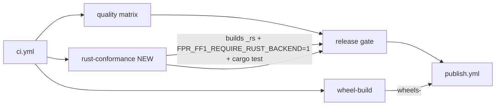

# Delivery Plan 00004: Review 00006 v2.0.0rc1 Hardening

> [!abstract] Plan status: `superseded`
> Superseded by `docs/plans/00005-Review_00006_v2.0.0rc1_Hardening.md` (PLAN-00005), which corrects this draft's infeasible Cargo version, the `just`-on-runner assumption, the `-D warnings` ordering, the un-flagged `cargo fmt` baseline, the fragile collected-count assertion, and five missing documentation targets. This draft is retained for history and is not Builder-ready.

## 1. Objective and outcome

Review 00006 (`docs/reviews/00006-v2.0.0rc1-Claude_Fable.md`, verdict `request-changes`) found that the Rust backend is a faithful, bit-exact port — but the release gate never executes its conformance suite or `cargo test`, so every platform wheel is published with its cryptographic core unverified by CI. The review also raised one Medium (the PyO3 bindings hold the GIL) and seven Lows (stale names/comments, a ~10×-off crossover claim, per-call AES key-schedule rebuilds, a missing `cargo` Dependabot ecosystem, a pickle-boundary key-length gap, a hard-coded extension version, and absent Rust hygiene gates).

This plan closes all nine findings so that `v2.0.0rc1` can be tagged with the compiled path evidenced in the release pipeline, not only on the maintainer's machine. The pure-Python path and its ciphertext are unchanged; the Rust core's *output* is unchanged (the GIL and key-schedule changes are performance/behaviour-neutral to ciphertext).

## 2. Source traceability

| Requirement | Source | Source location | Interpretation |
|---|---|---|---|
| PLAN-00004-REQ-01 | Review 00006 | `REV-00006-MAJ-01` | Add a Rust conformance leg to CI that builds the extension, runs the full suite with `FPR_FF1_REQUIRE_RUST_BACKEND=1`, and runs `cargo test`; make the release gate depend on it |
| PLAN-00004-REQ-02 | Review 00006 | `REV-00006-MED-01` | Release the GIL in the two production PyO3 bindings via `py.detach` |
| PLAN-00004-REQ-03 | Review 00006 | `REV-00006-LOW-01` | Sweep stale names and future-tense comments; update `AGENTS.md` (decide D3, add `backend` to the signature, add a "never let the two cores drift" rule); update `SECURITY.md` supported-versions |
| PLAN-00004-REQ-04 | Review 00006 | `REV-00006-LOW-02` | Correct the README crossover claim and table; extend the benchmark harness with n=1,000/5,000 and a non-radix-10 row |
| PLAN-00004-REQ-05 | Review 00006 | `REV-00006-LOW-03` | Build the AES key schedule once per call and pass `&Aes` to `prf`/`cipher_block` |
| PLAN-00004-REQ-06 | Review 00006 | `REV-00006-LOW-04` | Add a `cargo` Dependabot ecosystem for `/rust` |
| PLAN-00004-REQ-07 | Review 00006 | `REV-00006-LOW-05` | Re-validate the key's length in `__setstate__` so a corrupt pickle raises `KeyLengthError`, not `cryptography`'s `ValueError` |
| PLAN-00004-REQ-08 | Review 00006 | `REV-00006-LOW-06` | Replace the hard-coded `_rs.__version__` with `env!("CARGO_PKG_VERSION")` and align the crate version with the distribution |
| PLAN-00004-REQ-09 | Review 00006 | `REV-00006-LOW-07` | Add Rust hygiene gates (clippy/fmt) to CI and `just`; remove the needless `allow`; fix the Windows dev-loop gap |

## 3. Repository baseline

| Field | Value |
|---|---|
| Repository | joelee/fpr-ff1 |
| Branch | release/v2.0.0rc1 |
| HEAD | c2e65757b82e1546e27234c0b069d1b6c3e9e065 |
| Working tree at publication | Clean |
| Applicable instructions | `AGENTS.md`, `docs/AGENTS.md`, `docs/plans/AGENTS.md`, `docs/reviews/AGENTS.md` |

## 4. Scope

### In scope

- A new Rust conformance leg in `.github/workflows/ci.yml` (build extension, run full suite with `FPR_FF1_REQUIRE_RUST_BACKEND=1`, run `cargo test`), and the `publish.yml` gate's dependence on it.
- GIL release in `rust/fpr-ff1-rust/src/lib.rs` production bindings.
- Documentation/contract corrections: `AGENTS.md`, `SECURITY.md`, `README.md`, `CHANGELOG.md`, `docs/architecture.md`, `docs/configuration.md`, `docs/developer-guide.md`, `docs/backlog.md`, `pyproject.toml` comment, three test-module docstrings.
- Rust key-schedule hoisting, `__version__` fix, `Cargo.toml` version alignment.
- `__setstate__` key-length re-validation plus a test.
- `cargo` Dependabot ecosystem, Rust hygiene gates (`cargo fmt --check`, `cargo clippy --all-targets -- -D warnings`), `just rust-lint` recipe, Windows `backend-dev` arm.
- Benchmark harness extension (n=1,000/5,000, radix-256 row) and README crossover correction.

### Out of scope

- Porting the divide-and-conquer conversion to the Rust core (review 00006 Open question 1). **Deferred to `RC2`** per user decision; recorded in `docs/backlog.md`.
- Changing the pure-Python path, its ciphertext, or its public API.
- Changing the Rust core's produced ciphertext (the GIL and key-schedule changes are output-neutral).
- FF3/FF3-1, key management, or any other permanently out-of-scope feature.
- Re-tagging or publishing `v2.0.0rc1` (release actions remain the user's).

## 5. Constraints and preserved decisions

- Plan 00003 decision D3 (build the Rust backend, opt-in only, pure-Python reference/default) is now **decided** and must be recorded as such in `AGENTS.md`, not re-litigated.
- Plan 00003 decision D4 (validation stays in Python for both backends) is preserved; the GIL change does not move validation.
- The 100% line-and-branch coverage floor on `fpr_ff1` is preserved; the new Rust leg enforces it with the extension built.
- The pure-Python path must never depend on Rust being installed; the new Rust leg is additive and does not alter the existing `quality` matrix.
- Ciphertext is bit-identical to 1.1.0 on both backends; no output change is permitted.
- `cargo test`/`cargo clippy`/`cargo fmt` are Rust-side gates; they do not enter `just quality` (which must stay Rust-free), but a new `just rust-lint` recipe and a CI leg carry them.

## 6. Assumptions

None. Unresolved matters are recorded as decisions and block approval when material.

## 7. Decisions and blockers

| ID | Decision or blocker | Resolution | Owner | Status |
|---|---|---|---|---|
| D1 | Scope: address all nine findings vs blocking-only | User selected "All 9 findings" on 2026-09-08 | User | Resolved |
| D2 | MED-01 resolution: release the GIL vs document the stall | User selected "Release the GIL via py.detach" on 2026-09-08 | User | Resolved |
| D3 | Open question 1 (D&C conversion): port now vs defer | User selected "Defer; add D&C conversion to backlog for RC2" on 2026-09-08 | User | Resolved |
| D4 | LOW-06: drop `_rs.__version__` vs align it | Align it to the crate version via `env!("CARGO_PKG_VERSION")` and bump `Cargo.toml` in lock-step with `pyproject.toml`; add a test asserting `_rs.__version__ == fpr_ff1.__version__` | Planner (bounded, follows review recommendation) | Resolved |
| D5 | LOW-07 clippy `manual_div_ceil`: adopt `div_ceil` vs keep explicit `(b+3)/4` | Keep the explicit `(b + 3) / 4` form with an `#[allow(clippy::manual_div_ceil)]` and a spec-step comment, so the code stays line-by-line comparable to SP 800-38G; record the decision | Planner (bounded, follows review's stated preference) | Resolved |

## 8. Affected architecture and components

- `.github/workflows/ci.yml` — new `rust-conformance` job; `publish.yml` gate dependency.
- `.github/workflows/publish.yml` — `quality` reuse already pulls `ci.yml`; confirm the new job is part of the gate.
- `rust/fpr-ff1-rust/src/lib.rs` — GIL release, key-schedule hoisting, `__version__`, `#[allow]` adjustments.
- `rust/fpr-ff1-rust/Cargo.toml` — version alignment.
- `src/fpr_ff1/_ff1.py` — `__setstate__` key-length re-validation.
- `tests/test_pickle.py`, `tests/test_backend_dispatch.py` — new assertions.
- `tests/conftest.py`, `tests/test_backend_dispatch.py`, `tests/test_rust_aes_validation.py` — docstring corrections (LOW-01).
- `AGENTS.md`, `SECURITY.md`, `README.md`, `CHANGELOG.md`, `docs/architecture.md`, `docs/configuration.md`, `docs/developer-guide.md`, `docs/backlog.md`, `pyproject.toml` — documentation/contract corrections.
- `benchmarks/timing.py` — harness extension.
- `.github/dependabot.yml` — `cargo` ecosystem.
- `justfile` — `rust-lint` recipe, Windows `backend-dev` arm.

## 9. Requirement catalogue

### PLAN-00004-REQ-01 — Rust conformance leg in CI

- **Requirement:** Add a CI job that installs the Rust toolchain, builds the extension into the test environment, runs the full suite with `FPR_FF1_REQUIRE_RUST_BACKEND=1 FPR_FF1_REQUIRE_ORACLE=1 pytest --cov=fpr_ff1 --cov-report=term-missing --cov-fail-under=100`, and runs `cargo test --manifest-path rust/Cargo.toml`; the release gate must depend on it.
- **Rationale:** The compiled core is currently verified by exactly one NIST vector in `wheel-test-platform`; the ~546 rust-parameterised tests and `cargo test` never run in CI, so a broken `lib.rs` ships green.
- **Source:** Review 00006 `REV-00006-MAJ-01`.
- **Acceptance evidence:** The new job is green in CI; `pytest --collect-only -q | tail -1` reports ≈1,403 collected (not 857); a deliberate `lib.rs` break turns the job red while other jobs stay green.

### PLAN-00004-REQ-02 — Release the GIL in the production bindings

- **Requirement:** Add a `py: Python<'_>` parameter to `encrypt_numerals`/`decrypt_numerals` and wrap the core call in `py.detach(|| ff1(...))`.
- **Rationale:** The bindings currently hold the GIL for the whole ten-round computation, giving no thread-level parallelism and stalling other threads up to ~125 ms at long inputs.
- **Source:** Review 00006 `REV-00006-MED-01`.
- **Acceptance evidence:** Thread-safety suite still green; a GIL probe shows ~3.5–4× at 4 threads (or a documented measurement); no ciphertext change.

### PLAN-00004-REQ-03 — Stale names and future-tense comments sweep

- **Requirement:** Fix `pyproject.toml` comment (`_fpr_ff1_rs` → `fpr_ff1._rs`), `test_backend_dispatch.py:50` error string, the three "lands in STEP-14" docstrings, `AGENTS.md` (decide D3, add `backend` to the signature, add a "never let the two cores drift" rule), and `SECURITY.md` supported-versions.
- **Rationale:** The agent contract and policy docs contradict the shipped state and invite re-litigating the backend.
- **Source:** Review 00006 `REV-00006-LOW-01`.
- **Acceptance evidence:** No stale `_fpr_ff1_rs` references remain; `AGENTS.md` lists the backend as decided and shows `backend` in the signature; `SECURITY.md` reflects the 2.x line.

### PLAN-00004-REQ-04 — Correct the crossover claim and extend the harness

- **Requirement:** Replace "a few hundred numerals" with the measured band (~1,000–5,000), add a radix-256 row, and extend `benchmarks/timing.py::backend_comparison_table` with n=1,000/5,000 and a non-radix-10 radix.
- **Rationale:** The published crossover is ~10× too low (conservative direction) and radix-10-only.
- **Source:** Review 00006 `REV-00006-LOW-02`.
- **Acceptance evidence:** README states the measured band and cites `just bench`; the harness reproduces the table.

### PLAN-00004-REQ-05 — Hoist the AES key schedule

- **Requirement:** Build `Aes` once in `ff1_impl` and pass `&Aes` to `prf`/`cipher_block`; keep thin key-taking wrappers for the test-only bindings.
- **Rationale:** The core rebuilds the key schedule 10× per call plus once per S-expansion block.
- **Source:** Review 00006 `REV-00006-LOW-03`.
- **Acceptance evidence:** `cargo test` green; `cargo clippy` clean; ciphertext unchanged (full suite green on both backends).

### PLAN-00004-REQ-06 — cargo Dependabot ecosystem

- **Requirement:** Add a `cargo` ecosystem entry for `/rust` to `.github/dependabot.yml`.
- **Rationale:** `cargo audit` turns the gate red on advisories but nothing raises the remediation PR.
- **Source:** Review 00006 `REV-00006-LOW-04`.
- **Acceptance evidence:** `.github/dependabot.yml` lists `cargo` with `directory: /rust`.

### PLAN-00004-REQ-07 — Re-validate key length in `__setstate__`

- **Requirement:** Add `if len(key) not in {16, 24, 32}: raise KeyLengthError(...)` next to the existing type check, plus a test in `test_pickle.py`.
- **Rationale:** A corrupt pickle with a 15-byte key currently raises `cryptography`'s `ValueError`, not `KeyLengthError`.
- **Source:** Review 00006 `REV-00006-LOW-05`.
- **Acceptance evidence:** New test passes; a 15-byte-key pickle raises `KeyLengthError`.

### PLAN-00004-REQ-08 — Fix `_rs.__version__` and align crate version

- **Requirement:** Replace `m.add("__version__", "0.1.0")` with `env!("CARGO_PKG_VERSION")`; bump `Cargo.toml` version to match `pyproject.toml`; add a test asserting `_rs.__version__ == fpr_ff1.__version__`.
- **Rationale:** The hard-coded literal is unrelated to the distribution version and untested.
- **Source:** Review 00006 `REV-00006-LOW-06`.
- **Acceptance evidence:** `_rs.__version__` equals the distribution version; the new test passes.

### PLAN-00004-REQ-09 — Rust hygiene gates and dev-loop fix

- **Requirement:** Add `cargo fmt --check` and `cargo clippy --all-targets -- -D warnings` to the Rust CI leg and a `just rust-lint` recipe; remove the needless `#[allow(clippy::too_many_arguments)]`; add the Windows arm to `just backend-dev` (or document the limitation).
- **Rationale:** The Rust side has no equivalent of ruff/pyright; warnings accumulate silently; the dev loop is broken on Windows.
- **Source:** Review 00006 `REV-00006-LOW-07`.
- **Acceptance evidence:** `cargo clippy --all-targets -- -D warnings` and `cargo fmt --check` are clean; the needless `allow` is gone; `backend-dev` handles Windows or documents the limitation.

## 10. Delivery strategy

The nine findings are independent except that REQ-01 (the CI leg) is the natural home for REQ-09's Rust hygiene gates, and REQ-05/REQ-08/REQ-09 all touch `lib.rs`/`Cargo.toml` and are best verified together with `cargo test`/`cargo clippy`. The sequence is:

1. **Rust core changes first** (REQ-02, REQ-05, REQ-08, REQ-09's `lib.rs`/`Cargo.toml` parts) — they are the riskiest and must be proven ciphertext-neutral before anything else.
2. **Python-side correctness** (REQ-07) — small, independent, TDD.
3. **CI + supply chain** (REQ-01, REQ-06, REQ-09's CI/justfile parts) — the release-gate fix that makes the whole thing evidenced.
4. **Documentation/contract** (REQ-03, REQ-04) — last, so docs describe the final state.

Each step is independently verifiable and commits cleanly. The 100% coverage floor and the full dual-backend suite are re-run at the checkpoints that touch Python or the extension.

## 11. Detailed implementation steps

### PLAN-00004-STEP-01 — Release the GIL in the production bindings

- **Status placeholder:** `not-started`
- **Objective:** Make the compiled backend yield the GIL during the FF1 computation.
- **Requirements:** `PLAN-00004-REQ-02`
- **Depends on:** None
- **Affected components:** `rust/fpr-ff1-rust/src/lib.rs` (`encrypt_numerals`, `decrypt_numerals`)
- **Preconditions:** Clean worktree; Rust toolchain available locally.
- **Test or evidence first:** The existing thread-safety suite (`tests/test_thread_safety.py`) is the regression net; a GIL probe (4 threads vs serial) is the new evidence.
- **Implementation tasks:**
  1. Add `py: Python<'_>` to both `#[pyfunction]` signatures.
  2. Wrap the core call: `py.detach(|| ff1(&key, radix, &x, &tweak, true)).map_err(PyValueError::new_err)` (and `false` for decrypt).
  3. Confirm nothing inside `ff1` touches Python objects (it does not — owned `Vec`/`u32` only).
- **Documentation/configuration/operations:** None (behaviour-neutral; docs updated in STEP-08).
- **Verification:** `cargo test --manifest-path rust/Cargo.toml`; `uv run pytest tests/test_thread_safety.py -q`; a GIL probe showing ~3.5–4× at 4 threads.
- **Completion criteria:** Thread-safety suite green; GIL probe shows parallelism; ciphertext unchanged.
- **Rollback or recovery:** Revert the two bindings; the core is untouched.
- **Builder stop conditions:** Any ciphertext divergence, or `py.detach` unavailable in the pinned pyo3 (0.29) — escalate.

### PLAN-00004-STEP-02 — Hoist the AES key schedule

- **Status placeholder:** `not-started`
- **Objective:** Build the AES key schedule once per call instead of per PRF/expansion block.
- **Requirements:** `PLAN-00004-REQ-05`
- **Depends on:** PLAN-00004-STEP-01
- **Affected components:** `rust/fpr-ff1-rust/src/lib.rs` (`prf`, `cipher_block`, `ff1_impl`)
- **Preconditions:** STEP-01 committed.
- **Test or evidence first:** `cargo test` (8 tests) is the regression net; the full dual-backend suite proves ciphertext-neutrality.
- **Implementation tasks:**
  1. Change `prf`/`cipher_block` to take `&Aes` instead of `&[u8]`; keep thin key-taking wrappers for the test-only `_test_prf`/`_test_cipher_block` bindings.
  2. Build `Aes::new(key)?` once in `ff1_impl` and pass `&cipher` to the PRF and expansion call sites (`:290`, `:307`).
  3. Keep the result stateless and call-local (the schedule is immutable).
- **Documentation/configuration/operations:** None.
- **Verification:** `cargo test --manifest-path rust/Cargo.toml`; `cargo clippy --all-targets -- -D warnings`; full dual-backend suite green.
- **Completion criteria:** `cargo test` green; ciphertext unchanged (full suite green on both backends).
- **Rollback or recovery:** Revert; the change is internal to `lib.rs`.
- **Builder stop conditions:** Any ciphertext divergence.

### PLAN-00004-STEP-03 — Fix `_rs.__version__` and align the crate version

- **Status placeholder:** `not-started`
- **Objective:** Make the extension version reflect the distribution version.
- **Requirements:** `PLAN-00004-REQ-08`
- **Depends on:** PLAN-00004-STEP-02
- **Affected components:** `rust/fpr-ff1-rust/src/lib.rs` (`_rs` module), `rust/fpr-ff1-rust/Cargo.toml`, `tests/test_backend_dispatch.py`
- **Preconditions:** STEP-02 committed.
- **Test or evidence first:** Add a test asserting `_rs.__version__ == fpr_ff1.__version__` (red first).
- **Implementation tasks:**
  1. Replace `m.add("__version__", "0.1.0")` with `m.add("__version__", env!("CARGO_PKG_VERSION"))`.
  2. Bump `Cargo.toml` `version` to `2.0.0rc1` (lock-step with `pyproject.toml`).
  3. Add the version-equality test to `tests/test_backend_dispatch.py` (rust-parameterised, so it skips without the extension and runs in the new CI leg).
- **Documentation/configuration/operations:** None.
- **Verification:** `cargo test`; `uv run pytest tests/test_backend_dispatch.py -q`; full suite green.
- **Completion criteria:** `_rs.__version__` equals the distribution version; new test passes.
- **Rollback or recovery:** Revert; the attribute is cosmetic.
- **Builder stop conditions:** Version mismatch between `Cargo.toml` and `pyproject.toml`.

### PLAN-00004-STEP-04 — Re-validate key length in `__setstate__`

- **Status placeholder:** `not-started`
- **Objective:** Make a corrupt pickle raise `KeyLengthError`, not `cryptography`'s `ValueError`.
- **Requirements:** `PLAN-00004-REQ-07`
- **Depends on:** None (independent of the Rust steps)
- **Affected components:** `src/fpr_ff1/_ff1.py` (`__setstate__`), `tests/test_pickle.py`
- **Preconditions:** Clean worktree.
- **Test or evidence first:** Add `test_setstate_rejects_wrong_length_key` to `tests/test_pickle.py` (red first: a 15-byte key currently raises `ValueError`).
- **Implementation tasks:**
  1. In `__setstate__`, after the `isinstance(key, bytes)` check, add `if len(key) not in {16, 24, 32}: raise KeyLengthError(...)`.
  2. Add the test mirroring `test_setstate_rejects_non_bytes_key`.
- **Documentation/configuration/operations:** None.
- **Verification:** `uv run pytest tests/test_pickle.py -q`; full coverage gate green.
- **Completion criteria:** A 15-byte-key pickle raises `KeyLengthError`; coverage floor held.
- **Rollback or recovery:** Revert the two-line change.
- **Builder stop conditions:** Any existing pickle test regression.

### PLAN-00004-STEP-05 — Add the Rust conformance leg and hygiene gates to CI

- **Status placeholder:** `not-started`
- **Objective:** Make the release gate execute the compiled backend's full conformance suite and Rust hygiene gates.
- **Requirements:** `PLAN-00004-REQ-01`, `PLAN-00004-REQ-09` (CI/justfile parts)
- **Depends on:** PLAN-00004-STEP-01 through STEP-04
- **Affected components:** `.github/workflows/ci.yml`, `.github/workflows/publish.yml`, `justfile`
- **Preconditions:** Rust core changes committed and locally green.
- **Test or evidence first:** The deliberate-break verification (below) is the proof the leg is real.
- **Implementation tasks:**
  1. Add a `rust-conformance` job (ubuntu-latest) that: installs the Rust toolchain (pinned `dtolnay/rust-toolchain` with `toolchain: stable`), builds the extension into the test env (`uvx maturin@1.15.0 develop --release` into `.venv`, or `just backend-dev`), then runs `FPR_FF1_REQUIRE_RUST_BACKEND=1 FPR_FF1_REQUIRE_ORACLE=1 uv run pytest --cov=fpr_ff1 --cov-report=term-missing --cov-fail-under=100`, then `cargo test --manifest-path rust/Cargo.toml`, `cargo fmt --check --manifest-path rust/Cargo.toml`, and `cargo clippy --all-targets --manifest-path rust/Cargo.toml -- -D warnings`.
  2. Add a `just rust-lint` recipe (`cargo fmt --check` + `cargo clippy --all-targets -- -D warnings`).
  3. Confirm `publish.yml`'s `quality` reuse pulls the new job (it reuses `ci.yml`; ensure the new job is not gated out of the `workflow_call` path).
  4. Add a collected-count assertion (`pytest --collect-only -q | tail -1` ≈ 1,403) so a regression back to 857 is visible.
- **Documentation/configuration/operations:** `docs/developer-guide.md` CI description updated in STEP-08.
- **Verification:** On a branch, deliberately break `lib.rs` (e.g. start `j` at 0) and confirm the new leg goes red while existing jobs stay green; then revert. Confirm the collected count.
- **Completion criteria:** New job green in CI; deliberate break turns it red; `cargo test`/`fmt`/`clippy` run in the leg.
- **Rollback or recovery:** Revert the workflow change; the package remains installable pure-Python.
- **Builder stop conditions:** The leg cannot be made green with the extension built; escalate.

### PLAN-00004-STEP-06 — Add the cargo Dependabot ecosystem

- **Status placeholder:** `not-started`
- **Objective:** Let Dependabot raise Rust dependency PRs.
- **Requirements:** `PLAN-00004-REQ-06`
- **Depends on:** None
- **Affected components:** `.github/dependabot.yml`
- **Preconditions:** Clean worktree.
- **Test or evidence first:** N/A (config-only); validate YAML.
- **Implementation tasks:**
  1. Add a `cargo` ecosystem entry: `package-ecosystem: cargo`, `directory: /rust`, weekly, grouped like the others.
- **Documentation/configuration/operations:** `docs/developer-guide.md` Dependabot sentence updated in STEP-08.
- **Verification:** YAML valid; `directory: /rust` present.
- **Completion criteria:** `.github/dependabot.yml` lists the `cargo` ecosystem.
- **Rollback or recovery:** Revert the one entry.
- **Builder stop conditions:** None.

### PLAN-00004-STEP-07 — Rust hygiene: clippy/fmt clean, remove needless allow, fix dev loop

- **Status placeholder:** `not-started`
- **Objective:** Make the Rust side pass `-D warnings` and fix the Windows dev loop.
- **Requirements:** `PLAN-00004-REQ-09` (lib.rs/justfile parts)
- **Depends on:** PLAN-00004-STEP-02 (key-schedule change is in the same file)
- **Affected components:** `rust/fpr-ff1-rust/src/lib.rs`, `rust/fpr-ff1-rust/src/tests.rs`, `justfile`
- **Preconditions:** STEP-02 committed.
- **Test or evidence first:** `cargo clippy --all-targets` currently emits `manual_div_ceil` (lib.rs:234,239; tests.rs ×2) — the red baseline.
- **Implementation tasks:**
  1. Add `#[allow(clippy::manual_div_ceil)]` with a spec-step comment at the two `(b + 3) / 4` sites (decision D5), and fix the two `tests.rs` sites the same way.
  2. Remove the needless `#[allow(clippy::too_many_arguments)]` at `lib.rs:186` (5 args < 7 threshold).
  3. Add the Windows arm to `just backend-dev` (copy `_fpr_ff1_rs.dll` → `_rs.pyd`), or document the limitation in `docs/developer-guide.md`.
- **Documentation/configuration/operations:** `docs/developer-guide.md` dev-loop note if the limitation is documented instead of fixed.
- **Verification:** `cargo clippy --all-targets -- -D warnings` clean; `cargo fmt --check` clean; `cargo test` green.
- **Completion criteria:** Clippy/fmt clean; needless `allow` removed; dev loop documented or fixed for Windows.
- **Rollback or recovery:** Revert.
- **Builder stop conditions:** None.

### PLAN-00004-STEP-08 — Documentation and contract sweep

- **Status placeholder:** `not-started`
- **Objective:** Correct stale names, future-tense comments, the crossover claim, and the supported-versions policy.
- **Requirements:** `PLAN-00004-REQ-03`, `PLAN-00004-REQ-04`
- **Depends on:** PLAN-00004-STEP-05 (so docs describe the final CI state)
- **Affected components:** `AGENTS.md`, `SECURITY.md`, `README.md`, `CHANGELOG.md`, `docs/architecture.md`, `docs/configuration.md`, `docs/developer-guide.md`, `docs/backlog.md`, `pyproject.toml`, `tests/conftest.py`, `tests/test_backend_dispatch.py`, `tests/test_rust_aes_validation.py`, `benchmarks/timing.py`
- **Preconditions:** STEP-05 committed.
- **Test or evidence first:** `just bench` (with the extension built) to produce the corrected crossover numbers.
- **Implementation tasks:**
  1. `pyproject.toml:98-99` — fix the `_fpr_ff1_rs` → `fpr_ff1._rs` comment.
  2. `test_backend_dispatch.py:50` — fix the stale `_fpr_ff1_rs` error string.
  3. `conftest.py:19-20`, `test_backend_dispatch.py:11-12`, `test_rust_aes_validation.py:22-24` — rewrite the "lands in STEP-14" comments as present-tense contract statements.
  4. `AGENTS.md` — move the accelerated backend out of "Open decisions" (record D3 as decided), add `backend: str = "python"` to the `FF1.__init__` signature, add a "Rust core mirrors `_ff1.py`; never let the two drift" rule.
  5. `SECURITY.md:22,30` — update the supported-versions sentence for the 2.x line; drop the 0.1.x row.
  6. `README.md:253-268` — replace "a few hundred numerals" with the measured band (~1,000–5,000), add a radix-256 row, cite `just bench`.
  7. `benchmarks/timing.py::backend_comparison_table` — add n=1,000/5,000 and a radix-256 case.
  8. `CHANGELOG.md` — add an `[Unreleased]` note for the rc1 hardening (or fold into the rc1 entry if still unreleased).
  9. `docs/architecture.md`, `docs/configuration.md`, `docs/developer-guide.md` — reflect the GIL release, the Rust CI leg, and the Dependabot `cargo` ecosystem.
  10. `docs/backlog.md` — record the D&C conversion as an `RC2` item (decision D3).
- **Documentation/configuration/operations:** This step is the documentation work.
- **Verification:** `uv run ruff format --check .`; `uv run ruff check .`; `uv run pyright`; grep for stale `_fpr_ff1_rs` returns nothing; `just bench` reproduces the README table.
- **Completion criteria:** No stale references; `AGENTS.md`/`SECURITY.md`/`README.md` match the shipped state; backlog records the RC2 item.
- **Rollback or recovery:** Revert doc edits.
- **Builder stop conditions:** None.

### PLAN-00004-STEP-09 — Full gate and release-readiness checkpoint

- **Status placeholder:** `not-started`
- **Objective:** Prove the whole change set is green end-to-end and record the release hand-off.
- **Requirements:** All (REQ-01 through REQ-09)
- **Depends on:** PLAN-00004-STEP-01 through STEP-08
- **Affected components:** None (verification only)
- **Preconditions:** All prior steps committed.
- **Test or evidence first:** This step is the evidence.
- **Implementation tasks:**
  1. Run the full local gate: `uv run ruff format --check .`, `uv run ruff check .`, `uv run pyright`, `FPR_FF1_REQUIRE_RUST_BACKEND=1 FPR_FF1_REQUIRE_ORACLE=1 uv run pytest --cov=fpr_ff1 --cov-report=term-missing --cov-fail-under=100`, `cargo test`, `cargo fmt --check`, `cargo clippy --all-targets -- -D warnings`.
  2. Confirm the collected count is ≈1,403 with the extension built.
  3. Record the release hand-off (tag `v2.0.0rc1`, push, GitHub release remain the user's).
- **Documentation/configuration/operations:** None.
- **Verification:** All commands above green; collected count ≈1,403.
- **Completion criteria:** Full gate green; release hand-off recorded.
- **Rollback or recovery:** N/A.
- **Builder stop conditions:** Any red gate.

## 12. Cross-cutting concerns

| Area | Applicability | Planned action or reason not applicable | Step or requirement |
|---|---|---|---|
| Compatibility and APIs | Applicable | No public API change; `backend` keyword already shipped; `_rs.__version__` becomes meaningful | REQ-08; STEP-03 |
| Data and migration | Not applicable | No data model or persistence | — |
| Security and privacy | Applicable | Pickle key-length re-validation closes a typed-exception gap; GIL release does not change the timing posture (no overclaim) | REQ-07, REQ-02; STEP-04, STEP-01 |
| Performance and scale | Applicable | GIL release enables thread-level parallelism; key-schedule hoisting removes a constant factor | REQ-02, REQ-05; STEP-01, STEP-02 |
| Reliability and failure handling | Applicable | Corrupt pickle now raises the documented exception type | REQ-07; STEP-04 |
| Observability and operations | Not applicable | Library, no telemetry | — |
| Dependencies and supply chain | Applicable | `cargo` Dependabot ecosystem; Rust hygiene gates; `cargo audit` already present | REQ-06, REQ-09; STEP-06, STEP-05 |
| Accessibility and UX | Not applicable | No UI | — |
| Documentation and release | Applicable | Contract/policy/crossover corrections; backlog RC2 item; changelog | REQ-03, REQ-04; STEP-08 |
| Deployment and rollback | Applicable | Release gate now includes the Rust leg; tag/publish remain the user's | REQ-01; STEP-05 |

## 13. Verification strategy

| Level | Evidence or command | When | Required result |
|---|---|---|---|
| Rust unit | `cargo test --manifest-path rust/Cargo.toml` | Steps 01–03, 05, 07, 09 | 8+ passed |
| Rust hygiene | `cargo fmt --check` + `cargo clippy --all-targets -- -D warnings` | Steps 05, 07, 09 | Clean |
| Focused Python | `uv run pytest tests/test_thread_safety.py tests/test_pickle.py tests/test_backend_dispatch.py -q` | Steps 01, 03, 04 | Green |
| Full dual-backend | `FPR_FF1_REQUIRE_RUST_BACKEND=1 FPR_FF1_REQUIRE_ORACLE=1 uv run pytest --cov=fpr_ff1 --cov-report=term-missing --cov-fail-under=100` | Steps 02, 05, 09 | 100% line/branch; ≈1,403 collected |
| Static | `uv run ruff format --check .` / `ruff check .` / `uv run pyright` | Steps 04, 08, 09 | Clean |
| CI leg | New `rust-conformance` job green; deliberate `lib.rs` break turns it red | Step 05 | Leg is real, not a silent skip |
| Benchmark | `just bench` (extension built) | Step 08 | Reproduces the corrected README table |

## 14. Acceptance criteria

- [ ] `PLAN-00004-AC-01` A `rust-conformance` CI job builds the extension, runs the full suite with `FPR_FF1_REQUIRE_RUST_BACKEND=1`, and runs `cargo test`; the release gate depends on it; a deliberate `lib.rs` break turns it red.
- [ ] `PLAN-00004-AC-02` The production PyO3 bindings release the GIL via `py.detach`; the thread-safety suite is green and a GIL probe shows parallelism; ciphertext is unchanged.
- [ ] `PLAN-00004-AC-03` No stale `_fpr_ff1_rs` references remain; `AGENTS.md` records the backend as decided and shows `backend` in the signature; `SECURITY.md` reflects the 2.x line.
- [ ] `PLAN-00004-AC-04` The README crossover claim states the measured band (~1,000–5,000) with a radix-256 row, and `just bench` reproduces it.
- [ ] `PLAN-00004-AC-05` The AES key schedule is built once per call; `cargo test` and the full dual-backend suite are green with unchanged ciphertext.
- [ ] `PLAN-00004-AC-06` `.github/dependabot.yml` lists a `cargo` ecosystem for `/rust`.
- [ ] `PLAN-00004-AC-07` A corrupt pickle with a wrong-length key raises `KeyLengthError`; the new test passes and the coverage floor holds.
- [ ] `PLAN-00004-AC-08` `_rs.__version__` equals the distribution version; the crate version is aligned with `pyproject.toml`.
- [ ] `PLAN-00004-AC-09` `cargo clippy --all-targets -- -D warnings` and `cargo fmt --check` are clean; the needless `allow` is removed; the Windows dev loop is fixed or documented.

## 15. Risks and mitigations

| Risk | Likelihood | Impact | Mitigation or test | Owner/step |
|---|---|---|---|---|
| GIL release introduces a data race or ciphertext change | Low | High | `py.detach` is safe by construction (owned values only); thread-safety suite + full dual-backend suite | Builder/STEP-01 |
| Key-schedule hoisting changes output | Low | High | Full dual-backend suite bit-exact on both backends | Builder/STEP-02 |
| New CI leg is a silent skip (same class as MAJ-01) | Medium | High | Collected-count assertion (≈1,403) + deliberate-break verification | Builder/STEP-05 |
| `maturin develop` into `.venv` clobbers the editable install | Medium | Medium | Use `just backend-dev` (cargo build + copy) or a dedicated venv; verify the extension imports | Builder/STEP-05 |
| Clippy `-D warnings` breaks on a future toolchain | Low | Low | Pinned `rust-toolchain.toml` channel; `#[allow]` with spec-step comment for the deliberate `div_ceil` divergence | Builder/STEP-07 |
| Crossover numbers drift on other hardware | Medium | Low | State the band as measured on reference hardware; cite `just bench` | Builder/STEP-08 |

## 16. Builder hand-off

- **Start condition:** User approval and a clean repository.
- **First step:** PLAN-00004-STEP-01 — Release the GIL in the production bindings.
- **Required sequence:** STEP-01 → STEP-02 → STEP-03 → STEP-04 → STEP-05 → STEP-06 → STEP-07 → STEP-08 → STEP-09. STEP-04 and STEP-06 are independent of the Rust steps and may be done in any order relative to them, but STEP-05 depends on STEP-01..04 and STEP-08 depends on STEP-05.
- **Parallel-safe work:** STEP-04 (pickle) and STEP-06 (Dependabot) are independent of the Rust core steps and of each other.
- **Do not change:** approved scope, requirements, steps, acceptance criteria, or content outside Builder's permitted work-log area. Do not change the pure-Python path's ciphertext or public API. Do not port the D&C conversion (deferred to RC2).
- **Escalate when:** any ciphertext divergence; `py.detach` unavailable in pyo3 0.29; the new CI leg cannot be made green with the extension built; a deliberate `lib.rs` break does not turn the leg red.
- **Completion hand-off:** Full gate green; release hand-off recorded (tag `v2.0.0rc1`, push, GitHub release remain the user's); review 00006 marked `addressed` once MAJ-01 is closed.

<!-- BUILDER_WORK_LOG_START -->
## 17. Builder Work Log

> [!warning] Builder-maintained section
> Delivery Planner creates this section. After approval, Builder may update only
> this delimited section and the Builder-maintained front-matter fields. Builder
> must preserve prior entries and use UTC timestamps.

### Step status

| Step | Status | Started (UTC) | Completed (UTC) | Evidence | Builder notes |
|---|---|---|---|---|---|
| PLAN-00004-STEP-01 | not-started | — | — | — | — |
| PLAN-00004-STEP-02 | not-started | — | — | — | — |
| PLAN-00004-STEP-03 | not-started | — | — | — | — |
| PLAN-00004-STEP-04 | not-started | — | — | — | — |
| PLAN-00004-STEP-05 | not-started | — | — | — | — |
| PLAN-00004-STEP-06 | not-started | — | — | — | — |
| PLAN-00004-STEP-07 | not-started | — | — | — | — |
| PLAN-00004-STEP-08 | not-started | — | — | — | — |
| PLAN-00004-STEP-09 | not-started | — | — | — | — |

Allowed status values: `not-started`, `in-progress`, `blocked`, `completed`,
`skipped`. A skipped step requires explicit user approval recorded in Evidence.

### Execution log

| Timestamp (UTC) | Step | Event | Evidence or reference | Next action |
|---|---|---|---|---|

### Deviations and blockers

| Timestamp (UTC) | Step | Deviation or blocker | Impact | Decision required from |
|---|---|---|---|---|

Write `None` until an entry is required.

### Verification results

| Timestamp (UTC) | Step | Command or check | Result | Evidence |
|---|---|---|---|---|

### Completion summary

- **Implementation status:** `not-started`
- **Completed requirements:** None
- **Incomplete requirements:** All
- **Outstanding blockers:** None
- **Review request:** Not ready
<!-- BUILDER_WORK_LOG_END -->

## 18. Planning change log

| Timestamp (UTC) | Plan status | Change | Reason | Requested/approved by |
|---|---|---|---|---|
| 2026-09-08T22:07:26Z | superseded | Marked `plan_status: superseded`; this draft is replaced by `docs/plans/00005-Review_00006_v2.0.0rc1_Hardening.md` (PLAN-00005, `plan_kind: superseding`, `previous_plan` links here) | PLAN-00005 corrects this draft's infeasible Cargo version, the `just`-on-runner assumption, the `-D warnings` ordering, the un-flagged `cargo fmt` baseline, the fragile collected-count assertion, and five missing documentation targets | User |

## 19. External references

None. All requirements derive from review 00006 and repository evidence; no external research was used.

## 20. Confidence

**High.** Every requirement is traceable to a specific review finding that I independently verified against the repository at `c2e6575` (the `ci.yml`/`conftest.py` skip behaviour, the `lib.rs` GIL/key-schedule/`__version__` sites, the `__setstate__` gap, the Dependabot config, and the README crossover text). The principal residual uncertainty is quantitative, not directional: the exact crossover band and GIL speedup will differ on other hardware, which is why the plan requires the numbers to be re-measured with `just bench` and stated as measured.
