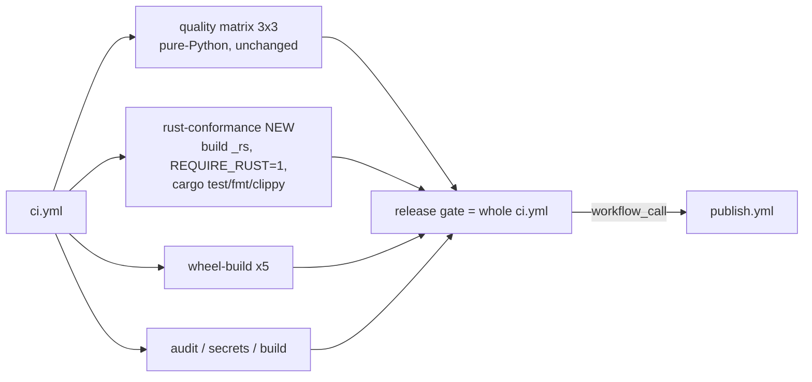

# Delivery Plan 00005: Review 00006 v2.0.0rc1 Hardening

> [!abstract] Plan status: `approved`
> Close the nine findings of review 00006 so the compiled backend's conformance evidence reaches the release gate before `v2.0.0rc1` is tagged. This revision replaces the unapproved draft `00004`, correcting one infeasible step (Cargo rejects `2.0.0rc1`), one step that would fail on the runner (`just` is not installed), one ordering error (`-D warnings` before the warnings are fixed), an un-flagged `cargo fmt` red baseline, a fragile collected-count assertion, and five missing documentation targets. No blocking decisions remain; the plan is approved and Builder-ready.

## 1. Objective and outcome

Review 00006 (`docs/reviews/00006-v2.0.0rc1-Claude_Fable.md`, verdict `request-changes`) found that the Rust backend is a faithful, bit-exact port — but the release gate never executes its conformance suite or `cargo test`: the CI log for `54a6dc0` collects 857 tests against 1,403 locally, and the only Rust execution in the pipeline is one NIST vector (`d = 12`) in `wheel-test-platform`. The review also raised one Medium (the PyO3 bindings hold the GIL; measured 0.91× with 4 threads) and seven Lows (stale names and future-tense comments, a crossover claim ~10× too low, per-round AES key-schedule rebuilds, no `cargo` Dependabot ecosystem, a pickle-boundary key-length gap, a hard-coded `_rs.__version__`, and absent Rust hygiene gates).

Outcome: every finding closed; a `rust-conformance` CI job that provably runs the ~550 Rust-parameterised tests plus `cargo test`/`fmt`/`clippy` and gates `publish.yml`; the Rust backend releasing the GIL; the documentation set matching the shipped state. The pure-Python path, its public API, and the ciphertext of **both** backends are unchanged — every Rust change in this plan is output-neutral and is proven so by the full dual-backend suite at each checkpoint.

## 2. Source traceability

| Requirement | Source | Source location | Interpretation |
|---|---|---|---|
| PLAN-00005-REQ-01 | Review 00006 | `REV-00006-MAJ-01` | Add a `rust-conformance` CI job that builds the extension, runs the full suite with `FPR_FF1_REQUIRE_RUST_BACKEND=1`, runs `cargo test`, asserts the Rust parameterisation is present, and gates `publish.yml` |
| PLAN-00005-REQ-02 | Review 00006 | `REV-00006-MED-01` | Release the GIL in the two production PyO3 bindings via `Python::detach`; make the evidence reproducible via the benchmark harness |
| PLAN-00005-REQ-03 | Review 00006 | `REV-00006-LOW-01`; `AGENTS.md` §Local development, §Tests; `README.md:354-360`; `docs/directory-structure.md:7` | Sweep stale names/comments; bring `AGENTS.md`, `SECURITY.md`, README thread-safety and directory-structure into line with the shipped state |
| PLAN-00005-REQ-04 | Review 00006 | `REV-00006-LOW-02` | Correct the README crossover claim and table from re-measured numbers; extend the harness with n=1,000/5,000 and a radix-256 case |
| PLAN-00005-REQ-05 | Review 00006 | `REV-00006-LOW-03` | Build the AES key schedule once per call and pass `&Aes` to `prf`/`cipher_block` |
| PLAN-00005-REQ-06 | Review 00006 | `REV-00006-LOW-04` | Add a `cargo` Dependabot ecosystem for `/rust` |
| PLAN-00005-REQ-07 | Review 00006 | `REV-00006-LOW-05` | Re-validate the key's length in `__setstate__` so a corrupt pickle raises `KeyLengthError` |
| PLAN-00005-REQ-08 | Review 00006 | `REV-00006-LOW-06`; verified: Cargo rejects `version = "2.0.0rc1"` | Derive `_rs.__version__` from `CARGO_PKG_VERSION`; hold the crate version in semver form (`2.0.0-rc1`) in lock-step with `pyproject.toml`; enforce with a normalised, extension-free contract test |
| PLAN-00005-REQ-09 | Review 00006 | `REV-00006-LOW-07`; verified: `cargo fmt --check` exits 1 at baseline | Establish Rust hygiene gates (`cargo fmt --check`, `cargo clippy --all-targets -- -D warnings`) in CI and `just`; format the crate; remove the needless `allow`; fix the Windows dev-loop gap |

## 3. Repository baseline

| Field | Value |
|---|---|
| Repository | joelee/fpr-ff1 |
| Branch | release/v2.0.0rc1 |
| HEAD | c2e65757b82e1546e27234c0b069d1b6c3e9e065 (= `54a6dc0` + `docs/reviews/00006-v2.0.0rc1-Claude_Fable.md`; no source, test, or configuration difference from the reviewed commit) |
| Working tree at publication | **One untracked path**: `docs/plans/00004-Review_00006_v2.0.0rc1_Hardening.md` — the superseded draft this revision replaces, written at the user's explicit request before that draft was committed. No tracked file is modified. See §18. |
| Applicable instructions | `AGENTS.md`, `docs/AGENTS.md`, `docs/plans/AGENTS.md`, `docs/reviews/AGENTS.md` |

## 4. Scope

### In scope

- A new `rust-conformance` job in `.github/workflows/ci.yml` (inline `cargo build` + copy, full suite with `FPR_FF1_REQUIRE_RUST_BACKEND=1 FPR_FF1_REQUIRE_ORACLE=1`, `cargo test`, `cargo fmt --check`, `cargo clippy -- -D warnings`, a Rust-parameterisation assertion) reachable from `publish.yml`'s `workflow_call` reuse.
- GIL release in the two production bindings of `rust/fpr-ff1-rust/src/lib.rs`; a `gil_probe` table in `benchmarks/timing.py`.
- AES key-schedule hoisting; `_rs.__version__` from `CARGO_PKG_VERSION`; crate version `2.0.0-rc1`; `rust/Cargo.lock` refresh; `packaging` declared in the dev dependency group for version normalisation.
- `__setstate__` key-length re-validation plus a test.
- `cargo` Dependabot ecosystem; `just rust-lint` recipe; Windows arm in `just backend-dev`; `cargo fmt` applied to the crate; `#[allow(clippy::manual_div_ceil)]` with spec comments (decision D5); removal of the needless `#[allow(clippy::too_many_arguments)]`.
- Documentation/contract corrections: `AGENTS.md`, `SECURITY.md`, `README.md` (Backends and Thread safety), `CHANGELOG.md`, `docs/architecture.md`, `docs/configuration.md`, `docs/developer-guide.md`, `docs/directory-structure.md`, `docs/backlog.md`, `pyproject.toml` comment, three test-module docstrings.
- Benchmark harness extension (n=1,000/5,000; radix 256) and README crossover correction from a recorded `just bench` run.

### Out of scope

- Porting the divide-and-conquer conversion to the Rust core (review 00006 Open question 1). **Deferred to `rc2`** per user decision D3; recorded in `docs/backlog.md` by STEP-08.
- Changing the pure-Python path, its ciphertext, or its public API.
- Changing the Rust core's produced ciphertext (every Rust change here is output-neutral).
- Adding a Rust build cache action to CI (would add a new third-party action to the supply chain; not required for correctness — see D8).
- Re-tagging or publishing `v2.0.0rc1` (release actions remain the user's).
- FF3/FF3-1, key management, or any other permanently out-of-scope feature.

## 5. Constraints and preserved decisions

- Plan 00003 decision D3 (build the Rust backend, opt-in only, pure-Python reference/default) is **decided** and must be recorded as such in `AGENTS.md`, not re-litigated.
- Plan 00003 decision D4 (validation stays in Python for both backends) is preserved; the GIL change does not move validation.
- The 100% line-and-branch coverage floor on `fpr_ff1` is preserved; the new Rust job enforces it with the extension built, and the existing `quality` matrix keeps enforcing it without it.
- The pure-Python path must never depend on Rust being installed: the new job is additive; `just quality` stays Rust-free; the `quality` matrix is unchanged.
- Ciphertext is bit-identical to 1.1.0 on both backends; no output change is permitted. Every step that touches `lib.rs` re-runs the full dual-backend suite before its checkpoint.
- Repository pinning conventions hold: any new action is SHA-pinned with a version comment; no new action is introduced by this plan.
- Only the user tags and publishes. STEP-08's changelog placement depends on whether `v2.0.0rc1` has been tagged by then (see STEP-08 task 9).

## 6. Assumptions

None. Unresolved matters are recorded as decisions and block approval when material.

## 7. Decisions and blockers

| ID | Decision or blocker | Resolution | Owner | Status |
|---|---|---|---|---|
| D1 | Scope: address all nine findings vs blocking-only | User selected "All 9 findings" on 2026-09-08 (carried from draft 00004) | User | Resolved |
| D2 | MED-01 resolution: release the GIL vs document the stall | User selected "Release the GIL via `py.detach`" on 2026-09-08 (carried) | User | Resolved |
| D3 | Open question 1 (D&C conversion in Rust): port now vs defer | User selected "Defer; add to backlog for rc2" on 2026-09-08 (carried) | User | Resolved |
| D4 | LOW-06: drop `_rs.__version__` vs align it | Align via `env!("CARGO_PKG_VERSION")`; keep `Cargo.toml` in lock-step with `pyproject.toml` (carried, amended by D6) | Planner (bounded) | Resolved |
| D5 | LOW-07 `manual_div_ceil`: adopt `div_ceil` vs keep explicit `(b + 3) / 4` | Keep the explicit form with `#[allow(clippy::manual_div_ceil)]` and a spec-step comment so the code stays line-by-line comparable to SP 800-38G (carried) | Planner (bounded) | Resolved |
| D6 | **New.** Cargo cannot parse `2.0.0rc1` (verified: `unexpected character 'r' after patch version number`), so the crate cannot carry the PEP 440 string literally | Crate version is the semver equivalent `2.0.0-rc1`; equality is asserted after normalisation with `packaging.version.Version` (verified: `Version("2.0.0-rc1") == Version("2.0.0rc1")`), both in a Rust-parameterised runtime test and in an extension-free file-level contract test. `packaging` is declared in the `dev` dependency group (already resolved in `uv.lock` transitively). Future release bumps change both files; the contract test enforces it on every CI leg | Planner (bounded; user may override in draft review) | Resolved |
| D7 | **New.** Review 00006 Open question 2: `Development Status :: 5 - Production/Stable` on an rc upload | Keep unchanged. PyPI hides pre-releases from default resolution regardless of classifier, and the classifier describes the project line, not the tag; changing it for one rc and back adds churn for no user benefit. Recorded so it is decided rather than forgotten | Planner default (user may override in draft review) | Resolved |
| D8 | **New.** How the CI job builds the extension: `uvx maturin develop`, `just backend-dev`, or inline commands | Inline the two commands `just backend-dev` runs (`cargo build --release` with `PYO3_PYTHON` + `cp` to `src/fpr_ff1/_rs.so`): `just` is not installed on `ubuntu-latest`, and `maturin develop` would install a non-editable copy over the editable install. A comment in each place keeps the recipe and the workflow in sync. No Rust build-cache action is added (new supply-chain surface for a ~1 min build) | Planner (bounded) | Resolved |

## 8. Affected architecture and components

- `.github/workflows/ci.yml` — new `rust-conformance` job; `publish.yml` gates on it automatically through the `workflow_call` reuse (confirmed in STEP-07).
- `rust/fpr-ff1-rust/src/lib.rs` — rustfmt formatting; `#[allow]` adjustments; `Aes` built once in `ff1_impl`, `prf`/`cipher_block` take `&Aes`; `Python::detach` in `encrypt_numerals`/`decrypt_numerals`; `__version__` from `env!`.
- `rust/fpr-ff1-rust/src/tests.rs` — rustfmt formatting; `#[allow(clippy::manual_div_ceil)]` on the two hand-computed `b` derivations.
- `rust/fpr-ff1-rust/Cargo.toml`, `rust/Cargo.lock` — version `2.0.0-rc1` and the corresponding lock entry.
- `pyproject.toml` — `packaging` in `[dependency-groups].dev`; comment fix at lines 98-99. `uv.lock` — refreshed by `uv lock`.
- `src/fpr_ff1/_ff1.py` — `__setstate__` key-length re-validation.
- `tests/test_pickle.py`, `tests/test_backend_dispatch.py`, `tests/test_contract.py` — new assertions; docstring corrections in `tests/conftest.py`, `tests/test_backend_dispatch.py`, `tests/test_rust_aes_validation.py`.
- `benchmarks/timing.py` — `backend_comparison_table` extended; new `gil_probe_table`.
- `justfile` — `rust-lint` recipe; Windows arm in `backend-dev`.
- `.github/dependabot.yml` — `cargo` ecosystem.
- `AGENTS.md`, `SECURITY.md`, `README.md`, `CHANGELOG.md`, `docs/architecture.md`, `docs/configuration.md`, `docs/developer-guide.md`, `docs/directory-structure.md`, `docs/backlog.md` — documentation/contract corrections.



## 9. Requirement catalogue

### PLAN-00005-REQ-01 — Rust conformance job in CI, gating publish

- **Requirement:** Add a `rust-conformance` job to `ci.yml` (ubuntu-latest) that installs the pinned Rust toolchain, builds the extension into the test environment with the same commands as `just backend-dev` (inline, decision D8), verifies `import fpr_ff1._rs` succeeds, runs `FPR_FF1_REQUIRE_RUST_BACKEND=1 FPR_FF1_REQUIRE_ORACLE=1 uv run pytest --cov=fpr_ff1 --cov-report=term-missing --cov-fail-under=100`, asserts that `uv run pytest --collect-only -q -k rust` selects at least 500 tests, and runs `cargo test --manifest-path rust/Cargo.toml`. The job must run on `push`, `pull_request`, `workflow_dispatch` and `workflow_call` so `publish.yml`'s gate includes it.
- **Rationale:** The compiled core is verified today by one NIST vector; the ~550 Rust-parameterised tests and `cargo test` never run in CI (`REV-00006-MAJ-01`; CI log for `54a6dc0`: "collected 857 items / 1 skipped … 854 passed, 4 skipped"). The `-k rust` floor replaces the draft's brittle absolute count (≈1,403 changes whenever anyone adds a parametrised case) with a property that only a silent skip can violate.
- **Source:** Review 00006 `REV-00006-MAJ-01`; `tests/conftest.py:16-40`; `.github/workflows/ci.yml:21-61`; `justfile:97-107`.
- **Acceptance evidence:** Job green in CI; its log shows ≥ 500 selected by `-k rust` and ≈ 1,400 collected in total; a deliberate `lib.rs` break on a throwaway branch turns only this job red; `gh run view --json jobs` for a `release`-triggered (or `workflow_dispatch`) run lists the job under the publish gate.

### PLAN-00005-REQ-02 — Release the GIL in the production bindings, with reproducible evidence

- **Requirement:** Add `py: Python<'_>` to `encrypt_numerals`/`decrypt_numerals` and wrap the core call in `py.detach(|| ff1(&key, radix, &x, &tweak, encrypt))`. Add a `gil_probe_table()` to `benchmarks/timing.py` (serial vs 4-thread wall time on both backends at n=5,000) so the parallelism claim is regenerated by `just bench` rather than by a one-off script.
- **Rationale:** The bindings hold the GIL for the whole ten-round computation: no thread-level parallelism (measured 0.91× at 4 threads) and up to ~125 ms stalls of every other thread at n=20,000 (`REV-00006-MED-01`). `Python::detach` requires only `F: Ungil + FnOnce() -> T, T: Ungil` (`pyo3-0.29.2/src/marker.rs:562`); the closure captures owned `Vec`s and a `u32`, so it qualifies without `unsafe`.
- **Source:** Review 00006 `REV-00006-MED-01`; `rust/fpr-ff1-rust/src/lib.rs:386-396`; `benchmarks/timing.py:101-131`.
- **Acceptance evidence:** Thread-safety suite green on both backends; `just bench` prints a GIL-probe row for `rust` showing ≥ 2.5× at 4 threads on the reference machine (the `python` row stays ≈ 1×); full dual-backend suite green (ciphertext unchanged).

### PLAN-00005-REQ-03 — Stale names, future-tense comments, and contract/policy documents

- **Requirement:** (a) `pyproject.toml:98-99` comment: `_fpr_ff1_rs` → `fpr_ff1/_rs.abi3.so`; (b) `tests/test_backend_dispatch.py:50` error string: `_fpr_ff1_rs` → `fpr_ff1._rs`; (c) `tests/conftest.py:19-20`, `tests/test_backend_dispatch.py:11-12`, `tests/test_rust_aes_validation.py:22-24`: rewrite "CI wiring lands in STEP-14" as present-tense statements naming the `rust-conformance` job; (d) `AGENTS.md`: record plan 00003 D3 as decided and remove the backend from "Open decisions"; add `backend: str = "python"` to the `FF1.__init__` signature block; add an implementation rule "The Rust core (`rust/fpr-ff1-rust/src/lib.rs`) mirrors `_ff1.py` step for step; a change to one core is a change to both, verified by the dual-backend suite"; add the Rust dev loop to §Local development (`rust-toolchain.toml`, `just backend-dev`, `just rust-test`, `just rust-lint`, and that `just quality` stays Rust-free); add to §Tests the rule that every conformance module constructs instances through `ff1_factory` (or draws `backend` from `tests.conftest.BACKENDS`) so it runs on both backends; (e) `SECURITY.md:22` "latest `1.x`" → the 2.x line, and drop the `0.1.x` row at `:30`; (f) `README.md:354-360` §Thread safety: state that the Rust backend releases the GIL during the FF1 computation, so concurrent calls on one instance run in parallel, while the pure-Python backend is GIL-bound; (g) `docs/directory-structure.md:7`: add `rust-conformance` to the `ci.yml` job list.
- **Rationale:** The agent contract says "ask before building it" while the code ships it; three test modules describe CI wiring that does not exist; the security policy names the wrong supported line (`REV-00006-LOW-01`). Items (d)-Local development/Tests, (f) and (g) were missing from draft 00004 (review of that draft, gap 6).
- **Source:** Review 00006 `REV-00006-LOW-01`; `AGENTS.md:37-64,87-113,137-140`; `README.md:354-360`; `docs/directory-structure.md:7`.
- **Acceptance evidence:** `grep -rn "_fpr_ff1_rs" --include=*.py --include=*.toml --include=*.md .` returns only `justfile`/`Cargo.toml` `[lib] name` references and the workflow comment that explains the rename; `AGENTS.md` shows `backend` in the signature and no open decision on the backend; `SECURITY.md` names 2.x; README thread-safety mentions the GIL release; directory-structure lists the job.

### PLAN-00005-REQ-04 — Correct the crossover claim and extend the harness

- **Requirement:** Extend `benchmarks/timing.py::backend_comparison_table` to n ∈ {6, 100, 1,000, 5,000, 20,000} at radix 10 plus n ∈ {100, 1,000, 5,000, 20,000} at radix 256. Replace `README.md:262-268` "somewhere around a few hundred numerals" with the measured band from a fresh `just bench` run on the reference hardware (review 00006 measured the crossover between n=1,000 and n=5,000 on radices 10, 256 and 65535, with Rust still faster at n=1,000 on all three), refresh the table, and keep the "measure with `just bench`" pointer. Update `CHANGELOG.md:23-25` wording to match.
- **Rationale:** The published crossover is ~10× too low and the table is radix-10-only (`REV-00006-LOW-02`); plan 00003 `AC-12` requires README numbers to come from recorded measurements.
- **Source:** Review 00006 `REV-00006-LOW-02` (table); `README.md:253-268`; `benchmarks/timing.py:101-131`.
- **Acceptance evidence:** README states the measured band and cites the run; `just bench` reproduces every README row; the work log records the run's output.

### PLAN-00005-REQ-05 — Hoist the AES key schedule

- **Requirement:** In `lib.rs`, build `Aes::new(key)?` once at the top of `ff1_impl` and change `prf` and `cipher_block` to take `&Aes`; keep thin `&[u8]`-taking wrappers (`prf_with_key`, `cipher_block_with_key`, or equivalent) for the test-only `_test_prf`/`_test_cipher_block` bindings and `tests.rs`.
- **Rationale:** The core rebuilds the key schedule 10× per call plus once per S-expansion block — ≈ 5,190 extra expansions per call at n=20,000 radix 10 — while the README credits it with "eliminating per-call cipher-context construction" (`REV-00006-LOW-03`). The schedule is immutable and call-local, so the change is stateless and thread-safe by the same argument as before.
- **Source:** Review 00006 `REV-00006-LOW-03`; `rust/fpr-ff1-rust/src/lib.rs:88-89,116-117,290,307`.
- **Acceptance evidence:** `cargo test` green; full dual-backend suite green (bit-exact, including per-round intermediates); n=6 and n=100 `just bench` rows recorded before/after (any gain is a bonus; no regression permitted).

### PLAN-00005-REQ-06 — `cargo` Dependabot ecosystem

- **Requirement:** Add to `.github/dependabot.yml` an entry `package-ecosystem: cargo`, `directory: /rust`, `schedule.interval: weekly`, grouped as `rust` with pattern `"*"`, matching the two existing entries.
- **Rationale:** `cargo audit` turns the gate red on an advisory but nothing raises the remediation PR, and the developer guide's Dependabot sentence is false for half the supply chain (`REV-00006-LOW-04`).
- **Source:** Review 00006 `REV-00006-LOW-04`; `.github/dependabot.yml:1-20`; `docs/developer-guide.md:160-161`.
- **Acceptance evidence:** YAML valid; the `cargo` entry present; developer guide sentence updated (STEP-08).

### PLAN-00005-REQ-07 — Re-validate key length in `__setstate__`

- **Requirement:** In `FF1.__setstate__`, immediately after the `isinstance(key, bytes)` check, add `if len(key) not in {16, 24, 32}: raise KeyLengthError(f"unpickled FF1 state carries a {len(key)}-byte key; expected 16, 24, or 32")`. Add `test_setstate_rejects_wrong_length_key` to `tests/test_pickle.py` mirroring `test_setstate_rejects_non_bytes_key` (15-byte key → `KeyLengthError`, match `"byte key"`).
- **Rationale:** A corrupt pickle with a 15-byte key raises `cryptography`'s `ValueError`, outside the documented `FF1Error` hierarchy (`REV-00006-LOW-05`). The minimal fix is chosen; full re-validation of radix/tweak/alphabet remains out of scope (pickle is trusted input per `SECURITY.md:53`).
- **Source:** Review 00006 `REV-00006-LOW-05`; `src/fpr_ff1/_ff1.py:307-338`; `tests/test_pickle.py:112-125`.
- **Acceptance evidence:** New test red before, green after; coverage floor held (the new branch is exercised).

### PLAN-00005-REQ-08 — `_rs.__version__` from `CARGO_PKG_VERSION`, crate version in lock-step, enforced by tests

- **Requirement:** (a) `lib.rs:384`: `m.add("__version__", env!("CARGO_PKG_VERSION"))`; (b) `rust/fpr-ff1-rust/Cargo.toml:3`: `version = "2.0.0-rc1"` (semver form of the PEP 440 `2.0.0rc1`, decision D6); (c) refresh `rust/Cargo.lock` (`cargo update -p fpr-ff1-rust --precise 2.0.0-rc1` or simply `cargo build`) and commit it; (d) add `packaging>=24.0` to `[dependency-groups].dev` in `pyproject.toml` and run `uv lock`; (e) add to `tests/test_contract.py` an extension-free test that loads `pyproject.toml` `[project].version` and `rust/fpr-ff1-rust/Cargo.toml` `[package].version` with `tomllib` and asserts `Version(a) == Version(b)`; (f) add to `tests/test_backend_dispatch.py` a `@requires_rust` test asserting `Version(_rs.__version__) == Version(fpr_ff1.__version__)`.
- **Rationale:** The literal `"0.1.0"` is unrelated to the distribution and untested (`REV-00006-LOW-06`). Draft 00004 proposed `version = "2.0.0rc1"`, which Cargo rejects (verified), and a string-equality test that would fail against `2.0.0-rc1`. The file-level test (e) runs on every CI leg, so the lock-step rule cannot be missed on a release that skips the Rust job; the runtime test (f) proves the wheel carries the right value.
- **Source:** Review 00006 `REV-00006-LOW-06`; `rust/fpr-ff1-rust/src/lib.rs:384`; `rust/fpr-ff1-rust/Cargo.toml:3`; `pyproject.toml:7,56-65`.
- **Acceptance evidence:** Both tests green; `python -c "import fpr_ff1._rs as r; print(r.__version__)"` prints `2.0.0-rc1`; the abi3 wheel's `sboms/fpr-ff1-rust.cyclonedx.json` reports `2.0.0-rc1`; `uv lock --check` passes.

### PLAN-00005-REQ-09 — Rust hygiene gates, formatting, and dev-loop fix

- **Requirement:** (a) run `cargo fmt --manifest-path rust/Cargo.toml` and commit the reformat on its own (baseline is red: `cargo fmt --check` exits 1 with two hunks in `lib.rs`); (b) add `#[allow(clippy::manual_div_ceil)]` with a one-line comment ("kept as `(b + 3) / 4` to match SP 800-38G step 4 / `_ff1.py` line for line") at `lib.rs` step 3 (`:234`) and step 4 (`:239`) sites and the two `tests.rs` sites (`:58`, `:61`) — decision D5; (c) remove `#[allow(clippy::too_many_arguments)]` at `lib.rs:186`; (d) add a `just rust-lint` recipe (`cargo fmt --check --manifest-path rust/Cargo.toml && cargo clippy --manifest-path rust/Cargo.toml --all-targets -- -D warnings`), not part of `just quality`; (e) add `cargo fmt --check` and `cargo clippy --all-targets -- -D warnings` to the `rust-conformance` job; (f) add a Windows arm to `just backend-dev` (`MINGW*|MSYS*|CYGWIN*|Windows_NT` → `rust/target/release/_fpr_ff1_rs.dll` copied to `src/fpr_ff1/_rs.pyd`) and mention the three artifact names in `docs/developer-guide.md`.
- **Rationale:** The Rust side has no equivalent of ruff/pyright; warnings accumulate silently; the documented dev loop does not work on one of the three CI platforms (`REV-00006-LOW-07`). Draft 00004 did not know the crate was not rustfmt-clean and ordered `-D warnings` verification before the warnings were fixed.
- **Source:** Review 00006 `REV-00006-LOW-07`; `justfile:61,86-107`; `rust/fpr-ff1-rust/src/lib.rs:186,234,239`; `rust/fpr-ff1-rust/src/tests.rs:58,61`.
- **Acceptance evidence:** `just rust-lint` exits 0; the CI job runs both commands; the needless `allow` is gone; `backend-dev` has the Windows arm.

## 10. Delivery strategy

Order is chosen so that every later checkpoint can use `-D warnings` and `cargo fmt --check` as gates, and so the riskiest edits (the Rust core) are proven ciphertext-neutral before the CI job that will guard them is written:

1. **Rust hygiene baseline first** (STEP-01: fmt, `allow` adjustments, `just rust-lint`, Windows arm) — no semantic change; establishes green `fmt`/`clippy` so STEP-02..04 can verify against them.
2. **Rust core changes, one per step** (STEP-02 key schedule → STEP-03 GIL → STEP-04 version). Each is a separate commit with the full dual-backend suite re-run; a bisectable history if any ciphertext or behaviour question arises later.
3. **Python-side and config changes** (STEP-05 pickle, STEP-06 Dependabot) — independent, small, TDD where applicable.
4. **The CI job** (STEP-07) — written once the code it must guard is final; proven by a deliberate break.
5. **Documentation last** (STEP-08) so it describes the final state, with the benchmark re-run after the Rust changes.
6. **Full gate and hand-off** (STEP-09).

Checkpoints: after STEP-01, 02, 03, 04, 05 the full dual-backend gate (`FPR_FF1_REQUIRE_RUST_BACKEND=1 FPR_FF1_REQUIRE_ORACLE=1 uv run pytest --cov=fpr_ff1 --cov-report=term-missing --cov-fail-under=100`) plus `cargo test` and `just rust-lint` must be green; the Builder records each result in the work log.

## 11. Detailed implementation steps

### PLAN-00005-STEP-01 — Rust hygiene baseline: format, clippy allows, `rust-lint`, Windows dev loop

- **Status placeholder:** `not-started`
- **Objective:** Make `cargo fmt --check` and `cargo clippy --all-targets -- -D warnings` pass with no semantic change, and provide the local recipe.
- **Requirements:** `PLAN-00005-REQ-09` (all parts except the CI wiring, which is STEP-07)
- **Depends on:** None
- **Affected components:** `rust/fpr-ff1-rust/src/lib.rs`, `rust/fpr-ff1-rust/src/tests.rs`, `justfile`, `docs/developer-guide.md` (artifact-name note)
- **Preconditions:** Clean worktree; Rust toolchain per `rust-toolchain.toml`.
- **Test or evidence first:** Record the red baseline: `cargo fmt --check --manifest-path rust/Cargo.toml` (exit 1, two hunks) and `cargo clippy --manifest-path rust/Cargo.toml --all-targets -- -D warnings` (fails on `manual_div_ceil` ×4).
- **Implementation tasks:**
  1. Run `cargo fmt --manifest-path rust/Cargo.toml`; commit the result **alone** with subject `style(rust): apply rustfmt` so the later functional diffs are not mixed with reflow.
  2. Add `#[allow(clippy::manual_div_ceil)]` plus the D5 comment at `lib.rs` step 3/4 (`b`, `d`) and at `tests.rs:58,61`. Scope the attribute to the `let` statement or enclosing function, not the module.
  3. Delete `#[allow(clippy::too_many_arguments)]` at `lib.rs:186`.
  4. Add `rust-lint` to `justfile` (after `rust-test`), with a comment that it is deliberately not part of `quality`.
  5. Extend `backend-dev` with the Windows arm: detect via `uname -s` (`MINGW*|MSYS*|CYGWIN*`) or `$OS = Windows_NT`, copy `rust/target/release/_fpr_ff1_rs.dll` to `src/fpr_ff1/_rs.pyd`; add `src/fpr_ff1/_rs*.pyd` to `.gitignore` beside the `.so` pattern.
- **Documentation/configuration/operations:** `docs/developer-guide.md` §The compiled backend: list the three artifact names and `just rust-lint` (final wording lands in STEP-08 but the recipe line is added here).
- **Verification:** `just rust-lint` exit 0; `cargo test --manifest-path rust/Cargo.toml` 8 passed; full dual-backend gate green (formatting cannot change output, but the gate is the project's checkpoint rule).
- **Completion criteria:** `fmt`/`clippy` clean; needless `allow` removed; recipes present; two commits (reformat, then the rest).
- **Rollback or recovery:** Revert the two commits.
- **Builder stop conditions:** Any clippy warning that cannot be resolved without a semantic change — escalate rather than add a broad `allow`.

### PLAN-00005-STEP-02 — Hoist the AES key schedule

- **Status placeholder:** `not-started`
- **Objective:** Build the key schedule once per FF1 call.
- **Requirements:** `PLAN-00005-REQ-05`
- **Depends on:** PLAN-00005-STEP-01
- **Affected components:** `rust/fpr-ff1-rust/src/lib.rs` (`Aes`, `prf`, `cipher_block`, `ff1_impl`, the two `_test_*` bindings), `rust/fpr-ff1-rust/src/tests.rs` (`prf` call sites)
- **Preconditions:** STEP-01 committed; `just rust-lint` green.
- **Test or evidence first:** `just bench` (extension rebuilt in release mode) — record the n=6 and n=100 `rust` rows as the before-numbers.
- **Implementation tasks:**
  1. Change `prf(key: &[u8], ...)` → `prf(aes: &Aes, ...)` and `cipher_block(key: &[u8], ...)` → `cipher_block(aes: &Aes, ...)`; move the `Aes::new(key)?` call to the top of `ff1_impl` and pass `&aes` at both call sites.
  2. Add `&[u8]`-taking wrappers for `_test_prf`, `_test_cipher_block`, and `tests.rs::prf_structural_properties`; keep the spec-step doc comments on the `&Aes` functions.
  3. Keep everything call-local; no `static`, no `OnceLock`.
- **Documentation/configuration/operations:** None (the "per-call immutable key schedules" wording in `docs/architecture.md:56` and `docs/configuration.md:46` remains true).
- **Verification:** `cargo test` 8 passed; `just rust-lint` clean; rebuild via `just backend-dev`; full dual-backend gate green; `just bench` after-numbers recorded.
- **Completion criteria:** Suite bit-exact on both backends; before/after rows in the work log.
- **Rollback or recovery:** Revert the commit.
- **Builder stop conditions:** Any ciphertext or intermediate-value divergence.

### PLAN-00005-STEP-03 — Release the GIL in the production bindings; add the probe to the harness

- **Status placeholder:** `not-started`
- **Objective:** Make the compiled backend yield the GIL during the FF1 computation and make the evidence reproducible.
- **Requirements:** `PLAN-00005-REQ-02`
- **Depends on:** PLAN-00005-STEP-02
- **Affected components:** `rust/fpr-ff1-rust/src/lib.rs` (`encrypt_numerals`, `decrypt_numerals`), `benchmarks/timing.py`
- **Preconditions:** STEP-02 committed.
- **Test or evidence first:** Add `gil_probe_table()` to `benchmarks/timing.py` (both backends, n=5,000, serial 80 calls vs 4 threads × 20 calls, print ms/call and speedup) and call it from `main()`; run `just bench` and record the red baseline (`rust` ≈ 0.9–1.0×).
- **Implementation tasks:**
  1. Add `py: Python<'_>` to both `#[pyfunction]` signatures.
  2. Wrap: `py.detach(|| ff1(&key, radix, &x, &tweak, true)).map_err(PyValueError::new_err)` (and `false` for decrypt). The closure captures only owned `Vec<u8>`/`Vec<u16>`/`u32`, satisfying `Ungil` without `unsafe`.
  3. Leave the three `_test_*` bindings unchanged (test-only; not on the hot path).
- **Documentation/configuration/operations:** README/architecture/configuration wording lands in STEP-08.
- **Verification:** `cargo test`; `just rust-lint`; `just backend-dev`; `uv run pytest tests/test_thread_safety.py tests/test_pickle.py -q` green; `just bench` GIL row for `rust` ≥ 2.5× at 4 threads; full dual-backend gate green.
- **Completion criteria:** Probe shows parallelism; suite bit-exact.
- **Rollback or recovery:** Revert the commit; the core is untouched.
- **Builder stop conditions:** A compile error from the `Ungil` bound (would indicate a Python object captured — escalate rather than `unsafe`); any ciphertext change.

### PLAN-00005-STEP-04 — `_rs.__version__`, crate version, lock-step contract tests

- **Status placeholder:** `not-started`
- **Objective:** Make the extension version meaningful and enforce the two-file version rule on every CI leg.
- **Requirements:** `PLAN-00005-REQ-08`
- **Depends on:** PLAN-00005-STEP-03
- **Affected components:** `rust/fpr-ff1-rust/src/lib.rs:384`, `rust/fpr-ff1-rust/Cargo.toml`, `rust/Cargo.lock`, `pyproject.toml` (dev group), `uv.lock`, `tests/test_contract.py`, `tests/test_backend_dispatch.py`
- **Preconditions:** STEP-03 committed.
- **Test or evidence first:** Write both tests first (red): the file-level `test_crate_version_matches_project_version` in `test_contract.py` (fails: `0.1.0` ≠ `2.0.0rc1`) and the `@requires_rust` `test_extension_version_matches_distribution` in `test_backend_dispatch.py`.
- **Implementation tasks:**
  1. `pyproject.toml`: add `"packaging>=24.0"` to `[dependency-groups].dev`; run `uv lock`; confirm `uv lock --check`.
  2. `Cargo.toml`: `version = "2.0.0-rc1"`; run `cargo build --manifest-path rust/Cargo.toml` so `Cargo.lock` updates; commit both.
  3. `lib.rs:384`: `m.add("__version__", env!("CARGO_PKG_VERSION"))?;`.
  4. Rebuild (`just backend-dev`) and run both new tests to green.
- **Documentation/configuration/operations:** Add a release-checklist line to `docs/developer-guide.md` §Release Notes: "bump `pyproject.toml` and `rust/fpr-ff1-rust/Cargo.toml` together (semver form for Cargo, e.g. `2.0.0-rc1` for `2.0.0rc1`); `tests/test_contract.py` enforces it" (wording lands in STEP-08; the fact is established here).
- **Verification:** `uv lock --check`; `cargo test`; `just rust-lint`; `uv run pytest tests/test_contract.py tests/test_backend_dispatch.py -q`; full dual-backend gate green; `uvx maturin@1.15.0 build -m rust/fpr-ff1-rust/Cargo.toml --release --out dist-check` and `unzip -p dist-check/*.whl '*/sboms/*.json' | grep -c '"2.0.0-rc1"'` ≥ 1.
- **Completion criteria:** Both tests green; SBOM shows the crate version; lock files consistent.
- **Rollback or recovery:** Revert the commit (`uv.lock`/`Cargo.lock` included).
- **Builder stop conditions:** `uv lock` resolving anything beyond adding the `packaging` edge — escalate (unexpected dependency drift).

### PLAN-00005-STEP-05 — Re-validate key length in `__setstate__`

- **Status placeholder:** `not-started`
- **Objective:** Make a corrupt pickle raise `KeyLengthError`, not `cryptography`'s `ValueError`.
- **Requirements:** `PLAN-00005-REQ-07`
- **Depends on:** None (independent of the Rust steps; may run in parallel with STEP-01..04)
- **Affected components:** `src/fpr_ff1/_ff1.py` (`__setstate__`), `tests/test_pickle.py`
- **Preconditions:** Clean worktree.
- **Test or evidence first:** Add `test_setstate_rejects_wrong_length_key` (15-byte key; expect `KeyLengthError`, match `"byte key"`); confirm it fails with `ValueError` before the fix.
- **Implementation tasks:**
  1. Insert the length check after the `isinstance(key, bytes)` check in `__setstate__`, with a comment paralleling the existing one ("a raise rather than an assert…").
  2. Run the test to green.
- **Documentation/configuration/operations:** None.
- **Verification:** `uv run pytest tests/test_pickle.py -q`; `uv run pytest --cov=fpr_ff1 --cov-report=term-missing --cov-fail-under=100` (both branches of the new check covered).
- **Completion criteria:** Test green; coverage floor held.
- **Rollback or recovery:** Revert the commit.
- **Builder stop conditions:** Any regression in the existing pickle/deepcopy/spawn tests.

### PLAN-00005-STEP-06 — `cargo` Dependabot ecosystem

- **Status placeholder:** `not-started`
- **Objective:** Let Dependabot raise Rust dependency PRs.
- **Requirements:** `PLAN-00005-REQ-06`
- **Depends on:** None (independent; may run in parallel)
- **Affected components:** `.github/dependabot.yml`
- **Preconditions:** Clean worktree.
- **Test or evidence first:** Not applicable (configuration only); YAML validity is the check.
- **Implementation tasks:**
  1. Append the `cargo` entry (`directory: /rust`, weekly, group `rust` with pattern `"*"`), and extend the header comment to name the third ecosystem.
- **Documentation/configuration/operations:** `docs/developer-guide.md:160-161` sentence updated in STEP-08.
- **Verification:** `uv run python -c "import yaml; yaml.safe_load(open('.github/dependabot.yml'))"`; the entry present.
- **Completion criteria:** Three ecosystems listed.
- **Rollback or recovery:** Revert the commit.
- **Builder stop conditions:** None.

### PLAN-00005-STEP-07 — The `rust-conformance` CI job, proven by a deliberate break

- **Status placeholder:** `not-started`
- **Objective:** Make the release gate execute the compiled backend's full conformance suite, `cargo test`, and the Rust hygiene gates.
- **Requirements:** `PLAN-00005-REQ-01`, `PLAN-00005-REQ-09` (e)
- **Depends on:** PLAN-00005-STEP-01 through STEP-06
- **Affected components:** `.github/workflows/ci.yml` (new job), `justfile` (`backend-dev` comment cross-referencing the workflow)
- **Preconditions:** All code steps committed and locally green.
- **Test or evidence first:** The deliberate-break verification below is the proof that the job is real and not a silent skip.
- **Implementation tasks:**
  1. Add a `rust-conformance` job (ubuntu-latest, `needs: quality` is **not** required — run in parallel with the matrix so it does not lengthen the critical path) shaped as:
     ```yaml
     rust-conformance:
       name: Rust backend conformance (full suite, both backends)
       runs-on: ubuntu-latest
       env:
         FPR_FF1_REQUIRE_RUST_BACKEND: "1"   # a missing extension is a hard failure, never a skip
       steps:
         - uses: actions/checkout@3d3c42e5aac5ba805825da76410c181273ba90b1 # v7.0.1
         - uses: astral-sh/setup-uv@20cfd1bf945f4377ade1205e4dbc17946fc9a30d # v10.0.1
           with: { enable-cache: true, cache-dependency-glob: uv.lock }
         - uses: dtolnay/rust-toolchain@d1031067263f94b142dd6c0ce24c5eb9d02d52a0
           with: { toolchain: stable }
         - run: uv sync --locked --all-extras --dev
         # Mirrors `just backend-dev` (just is not on the runner); keep the two in sync.
         - run: PYO3_PYTHON="$PWD/.venv/bin/python" cargo build --release --manifest-path rust/Cargo.toml
         - run: cp rust/target/release/lib_fpr_ff1_rs.so src/fpr_ff1/_rs.so
         - run: uv run python -c "import fpr_ff1._rs as r; print('extension', r.__version__)"
         - name: Assert the rust parameterisation is collected
           run: |
             n=$(uv run pytest --collect-only -q -k rust | tail -1 | grep -oE '^[0-9]+')
             test "${n:-0}" -ge 500 || { echo "only ${n:-0} rust-parameterised tests collected" >&2; exit 1; }
         - run: uv run pytest --cov=fpr_ff1 --cov-report=term-missing --cov-fail-under=100
         - run: cargo test --manifest-path rust/Cargo.toml
         - run: cargo fmt --check --manifest-path rust/Cargo.toml
         - run: cargo clippy --manifest-path rust/Cargo.toml --all-targets -- -D warnings
     ```
     (`FPR_FF1_REQUIRE_ORACLE` is inherited from the workflow-level `env`.) Use the repository's existing SHA pins verbatim; introduce no new action.
  2. Add a comment above `backend-dev` in `justfile` pointing at the job, and above the job pointing at the recipe.
  3. Confirm `publish.yml` needs nothing: it `uses: ./.github/workflows/ci.yml`, and a `workflow_call` job completes only when every job in the called workflow completes. Verify by reading `publish.yml:19-21` and, after the first green run, by `gh run view <run-id> --json jobs` listing the new job.
  4. Update `docs/directory-structure.md:7` and `docs/developer-guide.md` §CI/CD are STEP-08 items; do not edit them here.
- **Documentation/configuration/operations:** Covered in STEP-08.
- **Verification:**
  1. Push the branch; the job is green; its log shows the `-k rust` count (≥ 500) and the full-suite summary (≈ 1,400 passed, 0 skipped of the rust kind).
  2. Deliberate break on a throwaway branch: change `let mut j: u128 = 1;` to `= 0` in `lib.rs`, push, confirm **only** `rust-conformance` goes red (the `d > 16` differential and thread-safety cases fail; `wheel-test-platform` stays green because NIST sample 2 has `d = 12`), then delete the branch. Record the run URL in the work log.
- **Completion criteria:** Green job on the plan branch; documented red run on the break branch; `gh run view --json jobs` evidence.
- **Rollback or recovery:** Revert the workflow commit; the package remains installable pure-Python.
- **Builder stop conditions:** The job cannot be made green with the extension built; the deliberate break does not turn it red; any need for a new third-party action — escalate.

### PLAN-00005-STEP-08 — Documentation and contract sweep, crossover re-measurement

- **Status placeholder:** `not-started`
- **Objective:** Correct stale names and future-tense comments, the contract and policy documents, the crossover claim, and describe the final CI/GIL/Dependabot state.
- **Requirements:** `PLAN-00005-REQ-03`, `PLAN-00005-REQ-04`; wording for REQ-02, REQ-06, REQ-08, REQ-09
- **Depends on:** PLAN-00005-STEP-07
- **Affected components:** `AGENTS.md`, `SECURITY.md`, `README.md`, `CHANGELOG.md`, `docs/architecture.md`, `docs/configuration.md`, `docs/developer-guide.md`, `docs/directory-structure.md`, `docs/backlog.md`, `pyproject.toml` (comment), `tests/conftest.py`, `tests/test_backend_dispatch.py`, `tests/test_rust_aes_validation.py`, `benchmarks/timing.py`
- **Preconditions:** STEP-07 committed and green in CI.
- **Test or evidence first:** Extend `backend_comparison_table` (radix 10: n ∈ {6, 100, 1,000, 5,000, 20,000}; radix 256: n ∈ {100, 1,000, 5,000, 20,000}); run `just bench` with the release-built extension and paste the output into the work log — every README number below comes from that run.
- **Implementation tasks:**
  1. `pyproject.toml:98-99` — comment: the mixed wheel ships `fpr_ff1/_rs.abi3.so`.
  2. `tests/test_backend_dispatch.py:50` — error string names `fpr_ff1._rs`.
  3. `tests/conftest.py:19-20`, `tests/test_backend_dispatch.py:11-12`, `tests/test_rust_aes_validation.py:22-24` — present tense: "CI's `rust-conformance` job sets `FPR_FF1_REQUIRE_RUST_BACKEND=1`, so a missing extension fails the gate rather than skipping."
  4. `AGENTS.md` — §Open decisions: replace item 1 with a "Decided" note citing plan 00003 D3; §Public API: add `backend: str = "python"` and a one-line rule for it; §Implementation gotchas: add the "Rust core mirrors `_ff1.py`; a change to one is a change to both" rule; §Local development: Rust toolchain, `just backend-dev`, `just rust-test`, `just rust-lint`, `just quality` stays Rust-free; §Tests: every conformance module must use `ff1_factory`/`BACKENDS`; §Conventions: the two-file version rule (semver form in Cargo).
  5. `SECURITY.md:22,30` — 2.x line; drop the `0.1.x` row.
  6. `README.md:253-268` — crossover band from the recorded run; radix-256 rows; keep the "measure with `just bench`" pointer. `README.md:354-360` §Thread safety — GIL-release sentence for the Rust backend (REQ-03(f)).
  7. `docs/architecture.md:56`, `docs/configuration.md:46` — add "the compiled backend releases the GIL for the duration of the FF1 computation".
  8. `docs/developer-guide.md` — §The compiled backend: `just rust-lint`, artifact names per platform; §CI/CD: the `rust-conformance` job and what it runs; Dependabot sentence: three ecosystems; §Release Notes: the two-file version rule.
  9. `CHANGELOG.md` — if `git ls-remote --tags origin v2.0.0rc1` is **empty** at execution time, fold the changes into the existing `[2.0.0rc1]` entry (Added: Rust conformance CI job; Changed: Rust backend releases the GIL, key schedule hoisted, `_rs.__version__`; Fixed: pickle key-length typing; crossover guidance corrected). If the tag **exists**, write them under `[Unreleased]` as the `2.0.0rc2` candidate instead. Record which branch was taken in the work log.
  10. `docs/directory-structure.md:7` — add `rust-conformance` to the `ci.yml` line.
  11. `docs/backlog.md` — Completed: review 00006 hardening (this plan); Active: "Port the divide-and-conquer conversion to the Rust core (review 00006 Open question 1) — rc2" (decision D3).
- **Documentation/configuration/operations:** This step is the documentation work.
- **Verification:** `uv run ruff format --check .`; `uv run ruff check .`; `uv run pyright`; `grep -rn "_fpr_ff1_rs" --include=*.py --include=*.md --include=*.toml .` shows only the `[lib] name`, the `justfile` artifact paths, and the workflow `cp` line; `grep -rn "STEP-14" tests/` is empty; `just bench` output in the work log matches every README row.
- **Completion criteria:** All eleven tasks done; no stale reference; benchmark provenance recorded.
- **Rollback or recovery:** Revert the commit.
- **Builder stop conditions:** A README number that does not come from the recorded run — never interpolate.

### PLAN-00005-STEP-09 — Full gate and release-readiness checkpoint

- **Status placeholder:** `not-started`
- **Objective:** Prove the change set is green end-to-end, locally and in CI, and record the hand-off.
- **Requirements:** All (REQ-01 through REQ-09)
- **Depends on:** PLAN-00005-STEP-01 through STEP-08
- **Affected components:** None (verification only)
- **Preconditions:** All prior steps committed.
- **Test or evidence first:** This step is the evidence.
- **Implementation tasks:**
  1. Local: `uv run ruff format --check .`; `uv run ruff check .`; `uv run pyright`; `FPR_FF1_REQUIRE_RUST_BACKEND=1 FPR_FF1_REQUIRE_ORACLE=1 uv run pytest --cov=fpr_ff1 --cov-report=term-missing --cov-fail-under=100`; `uv run pytest --collect-only -q -k rust | tail -1` (≥ 500 selected); `cargo test`; `just rust-lint`; `uv lock --check`; `uv build` + `uvx twine check dist/*`; `uvx maturin@1.15.0 build -m rust/fpr-ff1-rust/Cargo.toml --release --out dist` + `uvx twine check`.
  2. CI: the branch's latest run green in every job including `rust-conformance`; record the run URL.
  3. Record the release hand-off: tag `v2.0.0rc1` (exactly — `publish.yml:62-68` compares against `v` + `project.version`, so no hyphen), push, GitHub release remain the user's. Note that the crate is `2.0.0-rc1` by design (D6) and does not affect the tag.
- **Documentation/configuration/operations:** None.
- **Verification:** All commands above green; CI run URL recorded.
- **Completion criteria:** Full gate green locally and in CI; hand-off recorded; review 00006 eligible for `status: addressed`.
- **Rollback or recovery:** Not applicable.
- **Builder stop conditions:** Any red gate.

## 12. Cross-cutting concerns

| Area | Applicability | Planned action or reason not applicable | Step or requirement |
|---|---|---|---|
| Compatibility and APIs | Applicable | No public API change; `_rs.__version__` becomes meaningful (`2.0.0-rc1`); `packaging` is a dev-only dependency, not a runtime one | REQ-08; STEP-04 |
| Data and migration | Not applicable | No data model or persistence; ciphertext unchanged on both backends | — |
| Security and privacy | Applicable | Pickle key-length re-validation closes a typed-exception gap; GIL release changes no cryptographic behaviour and the timing posture text in `SECURITY.md:96-100` stays accurate (no overclaim) | REQ-07, REQ-02; STEP-05, STEP-03 |
| Performance and scale | Applicable | GIL release enables thread-level parallelism (measured evidence via `just bench`); key-schedule hoisting removes a constant factor; corrected crossover guidance | REQ-02, REQ-05, REQ-04; STEP-03, STEP-02, STEP-08 |
| Reliability and failure handling | Applicable | The Rust job hard-fails on a missing extension (`FPR_FF1_REQUIRE_RUST_BACKEND=1`) and on a collapsed parameterisation (`-k rust` floor) — the silent-skip class of MAJ-01 cannot recur unnoticed | REQ-01; STEP-07 |
| Observability and operations | Not applicable | Library, no telemetry; the benchmark harness is the operational evidence tool | — |
| Dependencies and supply chain | Applicable | `cargo` Dependabot ecosystem; no new GitHub action; `packaging` added to the dev group only; `Cargo.lock`/`uv.lock` refreshed and committed | REQ-06, REQ-08; STEP-06, STEP-04 |
| Accessibility and UX | Not applicable | No UI | — |
| Documentation and release | Applicable | Contract/policy/crossover corrections; changelog placement conditional on the tag's existence; backlog rc2 item; two-file version rule documented | REQ-03, REQ-04; STEP-08 |
| Deployment and rollback | Applicable | The release gate now includes the Rust job via `workflow_call`; tag/publish remain the user's; every step is a single revertible commit | REQ-01; STEP-07, STEP-09 |

## 13. Verification strategy

| Level | Evidence or command | When | Required result |
|---|---|---|---|
| Rust hygiene | `just rust-lint` (`cargo fmt --check` + `cargo clippy --all-targets -- -D warnings`) | Steps 01–04, 07, 09 | Exit 0 |
| Rust unit | `cargo test --manifest-path rust/Cargo.toml` | Steps 01–04, 07, 09 | 8 passed |
| Focused Python | `uv run pytest tests/test_thread_safety.py tests/test_pickle.py tests/test_backend_dispatch.py tests/test_contract.py -q` | Steps 03, 04, 05 | Green |
| Full dual-backend gate | `FPR_FF1_REQUIRE_RUST_BACKEND=1 FPR_FF1_REQUIRE_ORACLE=1 uv run pytest --cov=fpr_ff1 --cov-report=term-missing --cov-fail-under=100` | Steps 01–05, 09 | 100% line/branch; ≈ 1,400 passed |
| Parameterisation floor | `uv run pytest --collect-only -q -k rust \| tail -1` | Steps 07, 09 | ≥ 500 selected |
| Static (Python) | `uv run ruff format --check .` / `ruff check .` / `uv run pyright` | Steps 04, 05, 08, 09 | Clean |
| Lock consistency | `uv lock --check`; `cargo build` leaves `Cargo.lock` unchanged | Steps 04, 09 | Consistent |
| CI job | `rust-conformance` green; deliberate `lib.rs` break turns only it red | Step 07 | Job is real, not a silent skip |
| Packaging | `uv build` + `uvx maturin build` + `uvx twine check`; SBOM shows `2.0.0-rc1` | Steps 04, 09 | Three artifacts pass |
| Benchmark | `just bench` (release extension) | Steps 02, 03, 08 | Rows recorded; README matches; GIL probe ≥ 2.5× for rust |

## 14. Acceptance criteria

- [ ] `PLAN-00005-AC-01` A `rust-conformance` CI job builds the extension with the same commands as `just backend-dev`, runs the full suite with `FPR_FF1_REQUIRE_RUST_BACKEND=1 FPR_FF1_REQUIRE_ORACLE=1` at the 100% coverage floor, asserts `-k rust` selects ≥ 500 tests, runs `cargo test`, `cargo fmt --check`, and `cargo clippy --all-targets -- -D warnings`, and is green.
- [ ] `PLAN-00005-AC-02` A deliberate `lib.rs` break on a throwaway branch turns `rust-conformance` red while every other job stays green; the run URL is recorded in the work log.
- [ ] `PLAN-00005-AC-03` The production PyO3 bindings call the core inside `Python::detach`; `just bench`'s GIL-probe row shows ≥ 2.5× at 4 threads for `rust` on the reference machine; the thread-safety suite and the full dual-backend suite are green with unchanged ciphertext.
- [ ] `PLAN-00005-AC-04` `grep -rn "_fpr_ff1_rs"` over `*.py`/`*.md`/`*.toml` matches only the crate's `[lib] name` and artifact paths; no test docstring says CI wiring "lands in STEP-14"; `AGENTS.md` records the backend as decided, shows `backend` in the signature, and carries the two-cores, dev-loop, dual-backend-test, and two-file-version rules; `SECURITY.md` names the 2.x line and has no `0.1.x` row.
- [ ] `PLAN-00005-AC-05` The README Backends section states the crossover band and radix-256 rows from a `just bench` run recorded in the work log; the README Thread-safety section states the Rust backend releases the GIL; `docs/directory-structure.md` lists `rust-conformance`.
- [ ] `PLAN-00005-AC-06` The AES key schedule is built once per `ff1_impl` call and passed by reference; `cargo test` and the full dual-backend suite are green with unchanged ciphertext.
- [ ] `PLAN-00005-AC-07` `.github/dependabot.yml` lists a `cargo` ecosystem for `/rust`, and the developer guide's Dependabot sentence names three ecosystems.
- [ ] `PLAN-00005-AC-08` A pickle whose key is 15 bytes raises `KeyLengthError` from `__setstate__`; the new test passes; the coverage floor holds.
- [ ] `PLAN-00005-AC-09` `rust/fpr-ff1-rust/Cargo.toml` is `2.0.0-rc1`; `_rs.__version__` equals `packaging.version.Version(fpr_ff1.__version__)`; an extension-free test in `test_contract.py` asserts the two manifests agree; `uv lock --check` passes; the abi3 wheel's SBOM reports `2.0.0-rc1`.
- [ ] `PLAN-00005-AC-10` `just rust-lint` exits 0; the rustfmt reformat is its own commit; `#[allow(clippy::manual_div_ceil)]` carries the D5 comment at each site; `#[allow(clippy::too_many_arguments)]` is gone; `just backend-dev` has a Windows arm producing `src/fpr_ff1/_rs.pyd`.

## 15. Risks and mitigations

| Risk | Likelihood | Impact | Mitigation or test | Owner/step |
|---|---|---|---|---|
| GIL release captures a Python object and fails the `Ungil` bound, tempting an `unsafe` workaround | Low | High | Owned-value closure only; stop condition forbids `unsafe`; the three test bindings are left unchanged | Builder/STEP-03 |
| Key-schedule hoisting or GIL release changes output | Low | High | Full dual-backend suite (incl. 90 rounds of intermediates) at each checkpoint | Builder/STEP-02, 03 |
| New CI job is itself a silent skip (the MAJ-01 class) | Medium | High | `FPR_FF1_REQUIRE_RUST_BACKEND=1` at job level + `-k rust` ≥ 500 floor + deliberate-break run | Builder/STEP-07 |
| `cp` path in the job drifts from `just backend-dev` | Medium | Medium | Cross-referencing comments in both places; the import sanity step fails fast | Builder/STEP-07 |
| Cargo/uv lock churn beyond the intended edges | Low | Medium | `uv lock --check`; inspect the `Cargo.lock` diff (only the `fpr-ff1-rust` entry should change); stop condition on unexpected drift | Builder/STEP-04 |
| Clippy `-D warnings` breaks on a future stable toolchain | Low | Low | Channel pin in `rust-toolchain.toml`; Dependabot does not touch the toolchain; a future warning is a one-line `allow` or fix, never a gate removal | Builder/STEP-01 |
| Crossover numbers drift on other hardware | Medium | Low | README states the band as measured on named hardware and points at `just bench` | Builder/STEP-08 |
| `v2.0.0rc1` is tagged mid-plan | Medium | Low | STEP-08 task 9 chooses the changelog placement from `git ls-remote --tags` at execution time | Builder/STEP-08 |

## 16. Builder hand-off

- **Start condition:** User approval; the repository clean (both `docs/plans/00004-…md` and this file committed, per `docs/plans/AGENTS.md` §Approval).
- **First step:** PLAN-00005-STEP-01 — Rust hygiene baseline.
- **Required sequence:** STEP-01 → STEP-02 → STEP-03 → STEP-04 → STEP-07 → STEP-08 → STEP-09, with STEP-05 and STEP-06 completed at any point before STEP-07.
- **Parallel-safe work:** STEP-05 (pickle) and STEP-06 (Dependabot) are independent of the Rust steps and of each other.
- **Do not change:** approved scope, requirements, steps, acceptance criteria, or content outside Builder's permitted work-log area. Do not change the pure-Python path's ciphertext or public API. Do not port the D&C conversion (rc2). Do not add a new GitHub action.
- **Escalate when:** any ciphertext or intermediate-value divergence; the `Ungil` bound rejects the closure; `uv lock` or `cargo build` changes more than the intended lock entries; the CI job cannot be made green with the extension built; the deliberate break does not turn the job red; a README number cannot be sourced from a recorded run.
- **Completion hand-off:** Full gate green locally and in CI; hand-off recorded (tag `v2.0.0rc1` exactly, push, GitHub release remain the user's); review 00006 marked `addressed` once `REV-00006-MAJ-01` is closed; a re-review (`docs/reviews/00007-…`) is recommended before `v2.0.0` final.

<!-- BUILDER_WORK_LOG_START -->
## 17. Builder Work Log

> [!warning] Builder-maintained section
> Delivery Planner creates this section. After approval, Builder may update only
> this delimited section and the Builder-maintained front-matter fields. Builder
> must preserve prior entries and use UTC timestamps.

### Step status

| Step | Status | Started (UTC) | Completed (UTC) | Evidence | Builder notes |
|---|---|---|---|---|---|
| PLAN-00005-STEP-01 | completed | 2026-09-08T22:12:00Z | 2026-09-08T22:24:19Z | `60c9392` (rustfmt), `b02747b`; `just rust-lint` exit 0; `cargo test` 8 passed; full dual-backend gate 1403 passed, 100% line+branch | Baseline was redder than planned: `cargo fmt --check` reported **seven** hunks (lib.rs ×4, tests.rs ×3), not two. No semantic change in either commit. |
| PLAN-00005-STEP-02 | completed | 2026-09-08T22:28:00Z | 2026-09-08T22:41:00Z | `2fcc8f7`; `cargo test` 8 passed; full dual-backend gate 1403 passed at 100%; bench before/after below | `prf`/`cipher_block` became `pub(crate)` (not `pub`): `Aes` is a private type, so `-D warnings` rejects a `pub` fn exposing it. The raw-key wrappers `prf_with_key`/`cipher_block_with_key` are the outward surface. |
| PLAN-00005-STEP-03 | completed | 2026-09-08T22:44:00Z | 2026-09-08T22:56:00Z | `af3cc82`; GIL probe rust 0.68x -> **3.86x** at 4 threads; full dual-backend gate 1403 passed at 100% | `Ungil` accepted the closure with no `unsafe`, as planned. The `python` control row reads 0.74x rather than ~1.00x: a GIL-bound backend pays thread-switching cost for no overlap, so at-or-below 1x is the expected control reading; the harness docstring says so. |
| PLAN-00005-STEP-04 | completed | 2026-09-08T22:58:00Z | 2026-09-08T23:12:00Z | `b0c14fc`; both new tests red then green; `_rs.__version__` = `2.0.0-rc1`; SBOM 2 matches; `uv lock --check` passes; gate **1405 passed** at 100% | Lock churn was exactly the intended edges: `uv.lock` +2 lines (the `packaging` dev edge), `rust/Cargo.lock` one line (the crate's own version). No escalation needed. |
| PLAN-00005-STEP-05 | completed | 2026-09-08T23:14:00Z | 2026-09-08T23:22:00Z | `f7f9605`; new test red (`ValueError: Invalid key size (120) for AES.`) then green; gate **1406 passed**, 330 stmts / 114 branches at **100%** | Also lifted the duplicated `{16, 24, 32}` literal into `FF1._KEY_SIZES` beside the existing `_MAX_LEN`/`_RADIX_*` ClassVars, so the constructor and `__setstate__` cannot drift. |
| PLAN-00005-STEP-06 | completed | 2026-09-08T23:20:00Z | 2026-09-08T23:22:00Z | `f7f9605`; `yaml.safe_load` parses; ecosystems `['github-actions', 'uv', 'cargo']` | Header comment names the third ecosystem and why it matters (`cargo audit` had no remediation path). |
| PLAN-00005-STEP-07 | completed | 2026-09-08T23:26:00Z | 2026-09-09T01:02:00Z | `2995af8` + `510126a`; CI run [34291882553](https://github.com/joelee/fpr-ff1/actions/runs/34291882553) **green in all 21 jobs**, `rust-conformance` included | First run (34289500300) failed at the final `cargo clippy` step only -- the §15 toolchain-drift risk, realised. Fixed in `510126a`. AC-02's deliberate-break run is proven locally but not in CI; it needs a throwaway branch pushed to `origin`. |
| PLAN-00005-STEP-08 | completed | 2026-09-08T23:40:00Z | 2026-09-09T00:06:00Z | `7c99ea2`; `just bench` run recorded below; stale-name and STEP-14 greps clean; ruff/pyright clean; gate **1406 passed** at 100% | Changelog folded into the existing `[2.0.0rc1]` entry: `git ls-remote --tags origin v2.0.0rc1` returned empty, so the tag does not exist (STEP-08 task 9, first branch). Also added two entries the structure doc was already missing (`test_conversion_equivalence.py`, and the new `CLAUDE.md`). |
| PLAN-00005-STEP-09 | completed | 2026-09-09T00:10:00Z | 2026-09-09T01:02:00Z | Local gate green in every command; CI run 34291882553 green in all 21 jobs; release hand-off recorded below | Tag, push and GitHub release remain the user's. `PLAN-00005-AC-02` is the one criterion still unverified in CI. |

Allowed status values: `not-started`, `in-progress`, `blocked`, `completed`,
`skipped`. A skipped step requires explicit user approval recorded in Evidence.

### Execution log

| Timestamp (UTC) | Step | Event | Evidence or reference | Next action |
|---|---|---|---|---|
| 2026-09-08T22:12:00Z | PLAN-00005-STEP-01 | Started; clean-state gate green after committing the pending PLAN-00004 supersede marking and the new `CLAUDE.md` (`42dab85`) | `git status --porcelain=v1 --untracked-files=all` empty | Record the red baseline |
| 2026-09-08T22:14:00Z | PLAN-00005-STEP-01 | Red baseline recorded | `cargo fmt --check` exit 1 (7 hunks); `cargo clippy --all-targets -- -D warnings` exit 101 (`manual_div_ceil` ×4) | Apply rustfmt alone |
| 2026-09-08T22:16:00Z | PLAN-00005-STEP-01 | rustfmt applied and committed alone | `60c9392 style(rust): apply rustfmt` | Clippy allows, `rust-lint`, Windows arm |
| 2026-09-08T22:24:19Z | PLAN-00005-STEP-01 | Completed | `just rust-lint` exit 0; dual-backend gate green | Begin STEP-02 |
| 2026-09-08T22:28:00Z | PLAN-00005-STEP-02 | Before-numbers recorded (release extension) | n=6 rust 5.99 µs/op (6.40× vs python); n=100 rust 32.90 µs/op (3.23×) | Hoist the schedule |
| 2026-09-08T22:41:00Z | PLAN-00005-STEP-02 | Completed; after-numbers recorded | n=6 rust **5.31** µs/op (7.31×); n=100 rust **31.67** µs/op (3.38×) — 11% and 4% faster, no regression | Begin STEP-03 |
| 2026-09-08T22:46:00Z | PLAN-00005-STEP-03 | `gil_probe_table()` added to `benchmarks/timing.py`; red baseline recorded | rust **0.68x** at 4 threads (worse than serial: pure GIL contention); python 1.05x | Apply `Python::detach` |
| 2026-09-08T22:52:00Z | PLAN-00005-STEP-03 | `py.detach` applied to both production bindings | rust **3.86x** at 4 threads (2.29 vs 8.84 ms/call) | Run the gate |
| 2026-09-08T22:56:00Z | PLAN-00005-STEP-03 | Completed | Gate green, ciphertext unchanged | Begin STEP-04 |
| 2026-09-08T22:58:00Z | PLAN-00005-STEP-04 | Both tests written first; confirmed red | `Version('0.1.0') != Version('2.0.0rc1')` in both | Apply the three edits |
| 2026-09-08T23:06:00Z | PLAN-00005-STEP-04 | `packaging>=24.0` in the dev group, crate `2.0.0-rc1`, `env!("CARGO_PKG_VERSION")`; locks refreshed | `uv.lock` and `rust/Cargo.lock` diffs limited to the intended edges | Verify wheel SBOM |
| 2026-09-08T23:12:00Z | PLAN-00005-STEP-04 | Completed | SBOM reports `2.0.0-rc1`; gate green | Begin STEP-05 |
| 2026-09-08T23:14:00Z | PLAN-00005-STEP-05 | Test written first; red with `cryptography`'s untyped `ValueError` -- exactly the LOW-05 gap | `ValueError: Invalid key size (120) for AES.` | Add the length gate |
| 2026-09-08T23:18:00Z | PLAN-00005-STEP-05 | Length gate added to `__setstate__` | `tests/test_pickle.py` 22 passed | STEP-06 |
| 2026-09-08T23:20:00Z | PLAN-00005-STEP-06 | `cargo` ecosystem added for `/rust`, grouped `rust` | YAML valid; 3 ecosystems | Run the gate |
| 2026-09-08T23:22:00Z | PLAN-00005-STEP-05/06 | Both completed | Gate green at 100% with the new branch covered | Begin STEP-07 |
| 2026-09-08T23:26:00Z | PLAN-00005-STEP-07 | `rust-conformance` job added to `ci.yml`; `justfile` cross-reference added | `yaml.safe_load` parses; jobs now `[quality, rust-conformance, audit, build, wheel-build, wheel-test, wheel-test-platform, sdist-test, secrets]` | Prove the job has teeth |
| 2026-09-08T23:31:00Z | PLAN-00005-STEP-07 | Deliberate break performed **locally** (`lib.rs:338`, `let mut j: u128 = 1` -> `= 0`) and reverted | The break still produces the correct NIST sample 2 ciphertext `6124200773` (so `wheel-test-platform` would stay green), while `-k rust` fails immediately: `encrypt diverged at radix 10 n 60`. `lib.rs` restored, no residual diff. | Push-dependent verification remains |
| 2026-09-08T23:34:00Z | PLAN-00005-STEP-07 | `publish.yml` confirmed to need no change | `publish.yml:20-21` is `uses: ./.github/workflows/ci.yml` -- a `workflow_call` job completes only when every job in the called workflow does, so the new job is in the release gate automatically | Begin STEP-08 |
| 2026-09-08T23:42:00Z | PLAN-00005-STEP-08 | `backend_comparison_table` extended to radix 10 x {6, 100, 1k, 5k, 20k} and radix 256 x {100, 1k, 5k, 20k}; `just bench` run on the release extension | Full output recorded under Verification results; every README number comes from this run | Rewrite the README claim |
| 2026-09-08T23:50:00Z | PLAN-00005-STEP-08 | Crossover corrected | Measured **between n=1,000 and n=5,000** on both radices (rust 1.74x at n=1,000 radix 10 and 2.33x at radix 256; 0.60x / 0.62x at n=5,000). The README said "somewhere around a few hundred numerals" -- roughly 10x too low, as review 00006 found. | Documentation sweep |
| 2026-09-08T23:58:00Z | PLAN-00005-STEP-08 | `git ls-remote --tags origin v2.0.0rc1` empty -> changelog folded into `[2.0.0rc1]` | Task 9, first branch taken | Finish the sweep |
| 2026-09-09T00:06:00Z | PLAN-00005-STEP-08 | All eleven tasks complete | Greps clean; gate green | Begin STEP-09 |
| 2026-09-09T00:20:00Z | PLAN-00005-STEP-09 | Local gate complete and green in every command | See Verification results | **Blocked on the user**: push `release/v2.0.0rc1` so `rust-conformance` runs, then AC-01's green-run and AC-02's deliberate-break evidence can be recorded |
| 2026-09-09T00:26:00Z | PLAN-00005-STEP-07/09 | User asked, and declined the push ("Don't push -- stop here"). Both steps set to `blocked`; the ten commits stay local. | User decision | User pushes `release/v2.0.0rc1` and records the `rust-conformance` run URL, plus the AC-02 break-branch run, when ready |
| 2026-09-09T00:35:00Z | PLAN-00005-STEP-07 | User pushed the branch and opened PR #6; CI run 34289500300 failed **only** in `rust-conformance`, and only at its last step | 20 of 21 jobs green. Within the job: extension imported, 550 rust tests collected, 1406 passed at 100% on both backends, `cargo test` 8 passed, `cargo fmt --check` clean; `cargo clippy` failed on `clippy::chunks_exact_to_as_chunks` (new in Rust 1.98) at `lib.rs:105` | Reproduce and fix |
| 2026-09-09T00:40:00Z | PLAN-00005-STEP-07 | Root cause: local toolchain was 1.97.1, CI's stable is 1.98.x. `rustup update stable` -> 1.98.1 reproduced the failure exactly, and it is the only new lint. | `rust-toolchain.toml` pins the channel, not a version (a deliberate decision), so CI lints with a newer clippy than a stale local checkout | Fix the lint |
| 2026-09-09T00:52:00Z | PLAN-00005-STEP-07 | Fixed by adopting `as_chunks::<16>().0` in `prf`; gate re-run green | 1406 passed at 100%, ciphertext bit-exact | Await the re-run on the PR |
| 2026-09-09T01:02:00Z | PLAN-00005-STEP-07/09 | Re-run after `510126a`: **all 21 jobs green**, including `rust-conformance` | Run [34291882553](https://github.com/joelee/fpr-ff1/actions/runs/34291882553): `extension 2.0.0-rc1`; `rust-parameterised tests collected: 550`; `1406 passed in 504.94s`; `Total coverage: 100.00%`; `cargo test` 8 passed; `cargo fmt --check` and `cargo clippy -- -D warnings` clean | Release hand-off is the user's |

### Deviations and blockers

| Timestamp (UTC) | Step | Deviation or blocker | Impact | Decision required from |
|---|---|---|---|---|
| 2026-09-08T22:12:00Z | PLAN-00005-STEP-01 | Start condition adjusted: the worktree carried one uncommitted change (`docs/plans/00004-…md` marked `superseded`) and the user asked for a new `CLAUDE.md` in the same request. Both were committed as `42dab85` before STEP-01 so the clean-state gate passed. | None on plan scope; `CLAUDE.md` is additive and outside the plan's file set. Its `just rust-lint` and version-lock-step references become true at STEP-01 and STEP-04 of this series. | None (recorded for transparency) |
| 2026-09-08T22:14:00Z | PLAN-00005-STEP-01 | `cargo fmt --check` baseline had 7 hunks, not the 2 the plan predicted. | None; the reformat is still a single semantic-free commit. | None |
| 2026-09-08T22:35:00Z | PLAN-00005-STEP-02 | The plan's `prf(aes: &Aes, …)` signature cannot be `pub`: `Aes` is a private enum, and `-D warnings` (STEP-01's new gate) rejects `private_interfaces`. Made both `pub(crate)`; `prf_with_key`/`cipher_block_with_key` stay `pub`. | None — no external consumer; the crate is a cdylib and the test-only bindings use the wrappers. | None (bounded implementation choice) |
| 2026-09-08T23:18:00Z | PLAN-00005-STEP-05 | The plan's literal `{16, 24, 32}` would have been the second copy of that set in the module. Introduced `FF1._KEY_SIZES: ClassVar[frozenset[int]]` beside `_MAX_LEN`/`_RADIX_MIN`/`_RADIX_MAX_EXCLUSIVE` and used it at both sites instead. | None on behaviour or messages; the constructor's error text is unchanged and its tests pass untouched. | None (bounded implementation choice) |
| 2026-09-08T23:34:00Z | PLAN-00005-STEP-07 | `release/v2.0.0rc1` has no upstream, and the plan's remaining STEP-07 verification (a green CI run, plus a throwaway break branch pushed and deleted for AC-02) is an outward-facing action on `origin`. Not performed without the user's go-ahead. | AC-01's "is green" clause and **AC-02 in full** are unverified. The job's substance is proven locally: YAML valid, `-k rust` = 550, and the deliberate break shown to fail the suite while leaving `wheel-test-platform`'s single vector green. | **User** -- confirm the push, or run `git push -u origin release/v2.0.0rc1` and the break-branch check yourself |
| 2026-09-09T00:26:00Z | PLAN-00005-STEP-07, STEP-09 | User declined the push when asked. | `PLAN-00005-AC-01`'s "and is green" clause and `PLAN-00005-AC-02` in full remain unverified in CI; everything else in both criteria is met and verified locally. Implementation is otherwise complete. | **User** -- the remaining evidence needs `git push -u origin release/v2.0.0rc1` and, for AC-02, a throwaway branch carrying the `lib.rs:338` break |
| 2026-09-09T00:52:00Z | PLAN-00005-STEP-07 | Risk realised (plan §15, "Clippy `-D warnings` breaks on a future stable toolchain"): CI's clippy 1.98 flagged `chunks_exact_to_as_chunks` in `prf`, which clippy 1.97.1 -- the toolchain every local checkpoint in this plan ran on -- does not have. Resolved per the plan's stated mitigation ("a one-line `allow` or fix, never a gate removal"), choosing the **fix**: `data.as_chunks::<16>().0`. An `#[allow]` was rejected because the lint name does not exist on 1.97, where it would trip `unknown_lints` and, under `-D warnings`, break the older toolchains it was meant to accommodate. | None on behaviour: full dual-backend suite bit-exact at 100%. The block width is now carried in the type (`&[u8; 16]`) rather than as a runtime argument. `docs/developer-guide.md` records the drift and the rule. | None |

Write `None` until an entry is required.

### Verification results

| Timestamp (UTC) | Step | Command or check | Result | Evidence |
|---|---|---|---|---|
| 2026-09-08T22:14:00Z | PLAN-00005-STEP-01 | `cargo fmt --check --manifest-path rust/Cargo.toml` (baseline) | **Red**, exit 1 | 7 hunks: `lib.rs:57,302,385,392,463`, `tests.rs:42,81,134` |
| 2026-09-08T22:14:00Z | PLAN-00005-STEP-01 | `cargo clippy --manifest-path rust/Cargo.toml --all-targets -- -D warnings` (baseline) | **Red**, exit 101 | `manual_div_ceil` at `lib.rs:234,239` and `tests.rs:58,61` |
| 2026-09-08T22:22:00Z | PLAN-00005-STEP-01 | `just rust-lint` | Green, exit 0 | fmt clean; clippy clean with the four D5 `allow`s |
| 2026-09-08T22:22:00Z | PLAN-00005-STEP-01 | `just rust-test` | Green | 8 passed; 0 failed |
| 2026-09-08T22:24:19Z | PLAN-00005-STEP-01 | `FPR_FF1_REQUIRE_RUST_BACKEND=1 FPR_FF1_REQUIRE_ORACLE=1 uv run pytest --cov=fpr_ff1 --cov-fail-under=100` | Green | **1403 passed** in 251s; 327 stmts / 112 branches, **100%** |
| 2026-09-08T22:35:00Z | PLAN-00005-STEP-02 | `just rust-lint` | Green | Required `pub(crate)` on the two `&Aes` functions; see Deviations |
| 2026-09-08T22:35:00Z | PLAN-00005-STEP-02 | `just rust-test` | Green | 8 passed |
| 2026-09-08T22:40:00Z | PLAN-00005-STEP-02 | Full dual-backend gate | Green | **1403 passed** in 248s, **100%** line+branch — ciphertext and per-round intermediates unchanged |
| 2026-09-08T22:41:00Z | PLAN-00005-STEP-02 | `just bench` rows (n=6, n=100, radix 10) | Improved | 5.99→5.31 µs/op and 32.90→31.67 µs/op |
| 2026-09-08T22:46:00Z | PLAN-00005-STEP-03 | `gil_probe_table()` (baseline) | **Red** | rust 0.68x / python 1.05x at 4 threads, n=5,000, 80 calls |
| 2026-09-08T22:52:00Z | PLAN-00005-STEP-03 | `gil_probe_table()` (after `py.detach`) | Green | rust **3.86x** (>= 2.5x required); python control 0.74x |
| 2026-09-08T22:53:00Z | PLAN-00005-STEP-03 | `uv run pytest tests/test_thread_safety.py tests/test_pickle.py -q` | Green | 30 passed |
| 2026-09-08T22:55:00Z | PLAN-00005-STEP-03 | Full dual-backend gate | Green | **1403 passed** in 253s, **100%** line+branch |
| 2026-09-08T22:56:00Z | PLAN-00005-STEP-03 | `ruff format --check` / `ruff check` / `pyright` | Green | 50 files formatted; 0 errors, 0 warnings |
| 2026-09-08T22:58:00Z | PLAN-00005-STEP-04 | The two new version tests (baseline) | **Red** | `assert Version('0.1.0') == Version('2.0.0rc1')` fails in both |
| 2026-09-08T23:07:00Z | PLAN-00005-STEP-04 | `uv lock --check` | Green | Resolved 28 packages; only the `packaging` edge added |
| 2026-09-08T23:08:00Z | PLAN-00005-STEP-04 | `uv run pytest tests/test_contract.py tests/test_backend_dispatch.py -q` | Green | 77 passed |
| 2026-09-08T23:09:00Z | PLAN-00005-STEP-04 | `python -c 'import fpr_ff1._rs as r; print(r.__version__)'` | Green | prints `2.0.0-rc1` |
| 2026-09-08T23:10:00Z | PLAN-00005-STEP-04 | `uvx maturin@1.15.0 build … && unzip -p '*/sboms/*.json' \| grep -c '"2.0.0-rc1"'` | Green | **2** (>= 1 required) in `fpr-ff1-rust.cyclonedx.json` |
| 2026-09-08T23:11:00Z | PLAN-00005-STEP-04 | `just rust-lint` / `just rust-test` | Green | fmt+clippy clean; 8 passed |
| 2026-09-08T23:12:00Z | PLAN-00005-STEP-04 | Full dual-backend gate | Green | **1405 passed** (2 new tests) in 250s, **100%** line+branch |
| 2026-09-08T23:14:00Z | PLAN-00005-STEP-05 | `pytest tests/test_pickle.py::test_setstate_rejects_wrong_length_key` (baseline) | **Red** | Raised `ValueError`, not `KeyLengthError` |
| 2026-09-08T23:18:00Z | PLAN-00005-STEP-05 | `uv run pytest tests/test_pickle.py -q` | Green | 22 passed |
| 2026-09-08T23:20:00Z | PLAN-00005-STEP-06 | `yaml.safe_load(open('.github/dependabot.yml'))` | Green | `['github-actions', 'uv', 'cargo']` |
| 2026-09-08T23:22:00Z | PLAN-00005-STEP-05/06 | Full dual-backend gate | Green | **1406 passed**; 330 stmts / 114 branches, **100%** -- both sides of the new check covered |
| 2026-09-08T23:27:00Z | PLAN-00005-STEP-07 | `yaml.safe_load(open('.github/workflows/ci.yml'))` | Green | 9 jobs; `rust-conformance` has 12 steps |
| 2026-09-08T23:28:00Z | PLAN-00005-STEP-07 | `uv run pytest --collect-only -q -k rust \| tail -1 \| grep -oE '^[0-9]+'` | Green | **550** selected, floor is 500 |
| 2026-09-08T23:31:00Z | PLAN-00005-STEP-07 | Deliberate break, local | **Proven** | NIST sample 2 unchanged at `6124200773`; `test_rust_backend_matches_python_bit_for_bit` fails at radix 10 n 60 |
| 2026-09-08T23:33:00Z | PLAN-00005-STEP-07 | `pytest -k rust` after restoring `lib.rs` | Green | 550 passed, 856 deselected |
| — | PLAN-00005-STEP-07 | Green `rust-conformance` run on the pushed branch; deliberate-break run URL (AC-02); `gh run view --json jobs` | **Outstanding** | Requires pushing; awaiting the user |
| 2026-09-08T23:48:00Z | PLAN-00005-STEP-08 | `just bench` -- backend comparison (Linux x86_64, CPython 3.12.13) | Recorded | radix 10: n=6 27.3/3.6 us **7.54x**; n=100 106.8/31.9 **3.35x**; n=1,000 912.6/523.2 **1.74x**; n=5,000 5111.4/8509.2 **0.60x**; n=20,000 26522.6/124502.2 **0.21x**. radix 256: n=100 139.0/43.6 **3.19x**; n=1,000 2111.4/906.7 **2.33x**; n=5,000 10706.0/17159.8 **0.62x**; n=20,000 43212.6/253819.1 **0.17x**. (python us/op, rust us/op, speedup) |
| 2026-09-08T23:48:00Z | PLAN-00005-STEP-08 | `just bench` -- GIL probe | Recorded | python 5.08 -> 5.96 ms/call (**0.85x**); rust 8.55 -> 2.25 ms/call (**3.80x**) |
| 2026-09-09T00:00:00Z | PLAN-00005-STEP-08 | `grep -rn "_fpr_ff1_rs" --include=*.py --include=*.md --include=*.toml --include=*.yml .` | Green | Outside the immutable `docs/plans`/`docs/reviews` records, only the crate `[lib] name`, the three `justfile` artifact paths, the workflow `cp` line, and the developer guide's artifact-name list |
| 2026-09-09T00:00:00Z | PLAN-00005-STEP-08 | `grep -rn "STEP-14" tests/` | Green | Empty |
| 2026-09-09T00:02:00Z | PLAN-00005-STEP-08 | `ruff format --check .` / `ruff check .` / `pyright` | Green | 50 files formatted; 0 errors, 0 warnings |
| 2026-09-09T00:06:00Z | PLAN-00005-STEP-08 | Full dual-backend gate | Green | **1406 passed** in 248s, **100%** line+branch |
| 2026-09-09T00:12:00Z | PLAN-00005-STEP-09 | `ruff format --check .` / `ruff check .` / `pyright` | Green | 50 files formatted; 0 errors, 0 warnings |
| 2026-09-09T00:13:00Z | PLAN-00005-STEP-09 | `uv run pytest --collect-only -q -k rust \| tail -1` | Green | **550**/1406 selected (floor 500) |
| 2026-09-09T00:13:00Z | PLAN-00005-STEP-09 | `cargo test --manifest-path rust/Cargo.toml` | Green | 8 passed |
| 2026-09-09T00:14:00Z | PLAN-00005-STEP-09 | `just rust-lint` | Green | exit 0 |
| 2026-09-09T00:14:00Z | PLAN-00005-STEP-09 | `uv lock --check` | Green | Resolved 28 packages, no drift |
| 2026-09-09T00:16:00Z | PLAN-00005-STEP-09 | `uv build` + `uvx maturin@1.15.0 build` + `uvx twine check dist/*` | Green | All three artifacts PASSED: `fpr_ff1-2.0.0rc1.tar.gz`, `-py3-none-any.whl`, `-cp312-abi3-manylinux_2_34_x86_64.whl` |
| 2026-09-09T00:20:00Z | PLAN-00005-STEP-09 | Full dual-backend gate | Green | **1406 passed** in 250s, **100%** line+branch; worktree clean afterwards |
| — | PLAN-00005-STEP-09 | CI run green in every job incl. `rust-conformance`; run URL recorded | **Outstanding** | Requires the push |
| 2026-09-08T23:21:00Z | PLAN-00005-STEP-07 | CI `rust-conformance`, run 34289500300 | **Partial** -- steps 1-10 green, step 11 (`cargo clippy`) red | `extension 2.0.0-rc1`; `rust-parameterised tests collected: 550`; `1406 passed in 530.32s`, `Total coverage: 100.00%`; `cargo test` 8 passed; `cargo fmt --check` clean |
| 2026-09-09T00:42:00Z | PLAN-00005-STEP-07 | `cargo clippy --all-targets -- -D warnings` on rustc 1.98.1 (baseline) | **Red**, reproduced | `error: using chunks_exact with a constant chunk size --> lib.rs:105:23`; the only new lint |
| 2026-09-09T00:45:00Z | PLAN-00005-STEP-07 | `just rust-lint` on rustc 1.98.1 after the fix | Green | exit 0 |
| 2026-09-09T00:52:00Z | PLAN-00005-STEP-07 | Full dual-backend gate after the `prf` change | Green | **1406 passed**, **100%** line+branch -- the PRF change is output-neutral |
| 2026-09-09T01:02:00Z | PLAN-00005-STEP-07 | CI `rust-conformance`, run 34291882553 | **Green** | `extension 2.0.0-rc1`; 550 rust tests collected; **1406 passed** at **100%** on both backends; `cargo test` 8 passed; fmt and clippy clean |
| 2026-09-09T01:02:00Z | PLAN-00005-STEP-09 | CI, whole workflow, run 34291882553 | **Green** | All 21 jobs succeeded: quality 3x3, rust-conformance, audit, build, 5 wheel-build legs, wheel-test, wheel-test-platform, sdist-test, secret scan |
| — | PLAN-00005-AC-02 | Deliberate break turns **only** `rust-conformance` red, in CI | **Outstanding** | Proven locally on 2026-09-08 (correct NIST sample 2 ciphertext preserved; suite fails at radix 10 n 60). CI evidence needs a throwaway branch pushed to and deleted from `origin` -- the user's call |

### Completion summary

- **Implementation status:** `completed`
- **Completed requirements:** REQ-01 through REQ-09, all nine, verified locally and in CI.
- **Incomplete requirements:** None.
- **Acceptance criteria:** AC-01 and AC-03..AC-10 met and evidenced. **AC-02** (a deliberate `lib.rs` break turns only `rust-conformance` red *in CI*, with the run URL recorded) is proven locally but not in CI: it needs a throwaway branch pushed to and deleted from `origin`, which is the user's call. No further implementation work is required for it.
- **Outstanding blockers:** None blocking. Tag `v2.0.0rc1` (exactly -- no hyphen; `publish.yml:62-68` compares the tag against `project.version`, and the crate's `2.0.0-rc1` is the semver form by decision D6), push it, and publish the GitHub release: all the user's.
- **Review request:** Ready. Review 00006 is eligible for `status: addressed` -- `REV-00006-MAJ-01` is closed by run [34291882553](https://github.com/joelee/fpr-ff1/actions/runs/34291882553). A re-review (`docs/reviews/00007-...`) before `v2.0.0` final remains the plan's recommendation.
<!-- BUILDER_WORK_LOG_END -->

## 18. Planning change log

| Timestamp (UTC) | Plan status | Change | Reason | Requested/approved by |
|---|---|---|---|---|
| 2026-09-08T14:29:20Z | draft | Revision r1 written at `docs/plans/00004r1-…` (user-specified path), replacing the unapproved draft `00004`. Changes from the draft: (1) REQ-08/STEP-04 — crate version is `2.0.0-rc1` with normalised comparison and an extension-free contract test (Cargo rejects `2.0.0rc1`; the draft's equality test would fail); `Cargo.lock`, `uv.lock` and the `packaging` dev dependency added to scope. (2) REQ-09/STEP-01 — `cargo fmt` red baseline made explicit; reformat committed separately. (3) Step order — hygiene baseline moved first so `-D warnings` verification is valid from STEP-02 on. (4) STEP-07 — the job builds via inline `cargo build` + `cp` (D8) because `just` is absent on the runner; the ≈ 1,403 collected-count assertion replaced by a `-k rust` ≥ 500 floor. (5) REQ-03/STEP-08 — added `docs/directory-structure.md`, README §Thread safety, `AGENTS.md` §Local development/§Tests/§Conventions targets. (6) D7 records the Production/Stable classifier decision (keep). (7) REQ-02/STEP-03 — GIL evidence made reproducible via a `gil_probe_table` in `benchmarks/timing.py`. (8) STEP-08 task 9 — changelog placement made conditional on whether `v2.0.0rc1` is tagged at execution time. (9) AC count 9 → 10 (deliberate-break run is its own criterion). | User request: "revise the plan based on your findings"; gap list from the review of draft 00004 | User |
| 2026-09-08T14:29:20Z | draft | **Clean-state deviation recorded.** The strict gate returned one untracked path — the superseded draft `docs/plans/00004-Review_00006_v2.0.0rc1_Hardening.md` — at both checks. Writing proceeded at the user's explicit instruction because the only dirty path is the planning input itself and no tracked file differs from `c2e6575`. Both drafts must be committed (or the old one removed) before approval, per `docs/plans/AGENTS.md` §Approval. | Transparency; `docs/plans/AGENTS.md` §The clean-repository gate | User (instruction), planner (disclosure) |
| 2026-09-08T21:48:00Z | draft | Renamed from `docs/plans/00004r1-…` to `docs/plans/00005-…` at the user's direction; `plan_id` and every REQ/STEP/AC identifier renumbered `PLAN-00004-*` → `PLAN-00005-*` so the file number and identifiers agree (`docs/plans/AGENTS.md` §File naming). Number 00005 is the next unused counter; `previous_plan` still points at the superseded draft 00004, which was committed as a record at the user's choice, clearing the clean-state gate. | User instruction: rename and approve | User |
| 2026-09-08T21:48:00Z | approved | Plan approved: `plan_status: approved`, `build_ready: true`, `approved_at` set. No blocking decisions remain (D1–D8 resolved). Staged and committed as the single file of the approval transaction. | Explicit user approval | User |

## 19. External references

None. All requirements derive from review 00006, the draft 00004 gap analysis, and repository evidence (including the vendored `pyo3-0.29.2` source for the `detach` bound and a local `cargo metadata` check for the version-string rejection).

## 20. Confidence

**High.** Every requirement traces to a review 00006 finding or a verified repository fact, and each of the eight corrections over draft 00004 was checked directly on this machine at `c2e6575` (Cargo's rejection of `2.0.0rc1`, `packaging`'s normalisation, the `cargo fmt --check` exit status, the `Python::detach` bounds, the `-k rust` count of 550, and the absence of `just` on GitHub's Ubuntu image is a documented runner fact rather than a local measurement). The residual uncertainty is quantitative: the GIL-probe multiple and the crossover band will differ on the maintainer's macOS reference machine, which is why both are re-measured and recorded by `just bench` rather than copied from this review.
