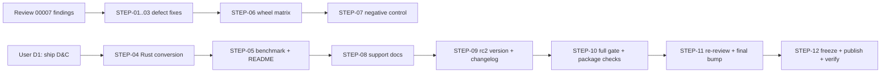

# Delivery Plan 00006: Review 00007 to v2.0.0

> [!abstract] Plan status: `draft`
> Close the four findings of review 00007, ship the previously-deferred Rust divide-and-conquer conversion, and carry the release through an `rc2` candidate to a stable `v2.0.0`. No blocking decisions remain; the plan is not yet Builder-ready pending explicit user approval.

## 1. Objective and outcome

Review 00007 (`docs/reviews/00007-V2_0_0_Stable_Release_Readiness.md`, verdict `request-changes`) found one blocking compatibility defect and three smaller actionable findings in the `v2.0.0rc1` release candidate, and produced a 20-task stable-release checklist. This plan turns that checklist into an ordered, testable build sequence.

Outcome: a stable `v2.0.0` on PyPI whose pure-Python path is byte-identical to 1.1.0, whose opt-in `backend="rust"` path is bit-exact with the reference and now fast at long inputs, whose legacy 1.x pickles restore correctly, whose tweak-length validation fails closed identically on both backends, and whose release gate actually executes every published native wheel. The release proceeds through an intermediate `v2.0.0rc2` candidate (user decision D2) so the code changes get a re-review and a soak point before final.

The four findings are:

- **MAJ-01** — `FF1.__setstate__` computes a default backend but never stores it, so a real 1.x pickle restores without `_backend` and every subsequent operation raises `AttributeError`.
- **MED-01** — an oversized tweak (length ≥ `2**32`) is silently narrowed by the Rust core's `t as u32` cast while the Python reference refuses to encode it, breaking backend parity and fail-closed behaviour.
- **MED-02** — the release gate installs and executes only the Linux x86_64 native wheel; the other four targets are built and published but never imported, and the full conformance suite runs against a source-tree build rather than the abi3 distribution build.
- **LOW-01** — several public-contract acceptance tests still construct `FF1` directly and therefore never exercise the Rust backend.

In addition, user decision D1 brings the previously-deferred Rust divide-and-conquer conversion (backlog "target 2.0.0rc2") into this release, which changes the Rust core and therefore requires refreshed performance evidence and the direct Python/Rust comparison tests the review's STABLE-06 demands.

## 2. Source traceability

| Requirement | Source | Source location | Interpretation |
|---|---|---|---|
| PLAN-00006-REQ-01 | Review 00007 | `REV-00007-MAJ-01` | Persist the validated/default backend in `__setstate__`; fix the test that hides the defect; add a real serialized legacy-state round trip |
| PLAN-00006-REQ-02 | Review 00007 | `REV-00007-MED-01` | Enforce an absolute four-byte-encodable tweak-length ceiling in shared Python validation; add a checked Rust conversion; boundary tests without allocating gigabytes; document the limit |
| PLAN-00006-REQ-03 | Review 00007 | `REV-00007-LOW-01` | Parameterize the remaining public-contract acceptance/interoperability tests over both backends |
| PLAN-00006-REQ-04 | Review 00007 + user D1 | `STABLE-06`; `docs/backlog.md:14-17` | Port the divide-and-conquer (and power-of-two) conversion to the Rust core, retaining the naive loops as reference; equivalence + direct Python/Rust encrypt/decrypt comparisons |
| PLAN-00006-REQ-05 | Review 00007 | `STABLE-08` | Refresh `just bench` evidence after the Rust core change and align README/changelog guidance |
| PLAN-00006-REQ-06 | Review 00007 | `REV-00007-MED-02`; plan 00003 `REQ-20` | Install and execute every published native wheel on a compatible runner; run full conformance against at least one abi3 distribution build |
| PLAN-00006-REQ-07 | Review 00007 | `STABLE-07`; plan 00005 `AC-02` | Produce the missing CI negative-control evidence (a controlled S-expansion error fails Rust conformance) |
| PLAN-00006-REQ-08 | Review 00007 + user D3 | `STABLE-12`; open question 3, 4 | Document the glibc 2.34 native-wheel floor and the pure fallback; resolve the post-final 1.x support window; recheck NIST draft status |
| PLAN-00006-REQ-09 | Review 00007 | `STABLE-09`, `STABLE-10`, `STABLE-11` | Re-run the full quality/conformance gates; verify dependency/build-input consistency; verify package contents and fallback paths |
| PLAN-00006-REQ-10 | Review 00007 + user D2 | `STABLE-13`, `STABLE-15`, `STABLE-16` | Cut `v2.0.0rc2`, then bump to `2.0.0` final with lock entries and release documentation |
| PLAN-00006-REQ-11 | Review 00007 | `STABLE-14` | Obtain an independent re-review of the final change set before final publication |
| PLAN-00006-REQ-12 | Review 00007 | `STABLE-17`–`STABLE-20` | Freeze and gate the exact final commit; owner publishes `v2.0.0`; verify the public release; record handoff and recovery |

## 3. Repository baseline

| Field | Value |
|---|---|
| Repository | joelee/fpr-ff1 |
| Branch | release/v2 |
| HEAD | 26b0164ef81283caee3429f971657948d3186d9c |
| Working tree at publication | Clean |
| Applicable instructions | `AGENTS.md`, `docs/AGENTS.md`, `docs/plans/AGENTS.md`, `docs/reviews/AGENTS.md` |

`release/v2` is the branch the user selected for this work. Its HEAD is the commit that added review 00007 on top of the `v2.0.0rc1` tag commit (`89c74b7`). The `v2.0.0rc1` tag peels to `89c74b7`, so the release candidate source and the current branch agree except for the review report itself.

## 4. Scope

### In scope

- Fix `FF1.__setstate__` so a restored 1.x instance carries `_backend` (MAJ-01), with a corrected regression test and a real serialized legacy-state round trip.
- Add an absolute tweak-length ceiling (`2**32 - 1`) shared by both backends, a checked Rust length conversion, boundary tests that do not allocate gigabytes, and matching documentation (MED-01).
- Parameterize the remaining public-contract acceptance and tweak-bound interoperability tests over both backends (LOW-01).
- Port the divide-and-conquer and power-of-two `NUM_radix`/`STR_radix` conversion to the Rust core, retaining the naive loops as the spec reference, with equivalence tests and direct Python/Rust encrypt+decrypt comparisons (D1 / STABLE-06).
- Refresh `just bench` evidence and the README/changelog performance guidance after the Rust core change (STABLE-08).
- Expand the release gate to install and execute every published native wheel on a compatible runner, and run full conformance against at least one abi3 distribution build (MED-02).
- Produce the CI negative-control evidence for plan 00005 AC-02 (STABLE-07).
- Document the glibc 2.34 native-wheel floor, the pure fallback, and the post-final 1.x support window (D3 / STABLE-12).
- Cut `v2.0.0rc2`, then bump to `2.0.0` final with lock entries and release documentation (D2).
- Full gate, dependency/build consistency, package-contents verification, re-review, and the final publish/verify/handoff sequence.

### Out of scope

- FF3/FF3-1, key management, application-specific defaults or alphabets, a `ubiq_security_fpe` compatibility shim, automatic backend switching, and any new runtime dependency — permanently out of scope per `AGENTS.md`.
- Lowering the Linux native-wheel floor below `manylinux_2_34` (user decision D3: keep and document).
- Free-threaded Python, extra native architectures, and lower-glibc native wheels (require separately agreed scope).
- An independent cryptographic audit (not an existing acceptance condition; must not be represented as completed).
- Re-tagging, overwriting, or yanking the already-published `v2.0.0rc1` (it stays as-is; the new candidate is `v2.0.0rc2`).

## 5. Constraints and preserved decisions

- The pure-Python path, its public API, and its ciphertext are unchanged; every Rust change in this plan is output-neutral and proven so by the full dual-backend suite at each checkpoint.
- Plan 00003 decision D3 (Rust backend, opt-in only, pure-Python reference/default) and D4 (validation stays in Python for both backends) are preserved and not re-litigated.
- The 100% line-and-branch coverage floor on `fpr_ff1` is preserved; the Rust job enforces it with the extension built, and the `quality` matrix keeps enforcing it without it.
- `just quality` stays Rust-free; the pure-Python path must never depend on a Rust toolchain.
- The two-file version rule holds: `pyproject.toml` and `rust/fpr-ff1-rust/Cargo.toml` are bumped together, with the Cargo semver form for pre-releases (`2.0.0-rc2` for `2.0.0rc2`), enforced by `tests/test_contract.py`.
- Git tags follow `pyproject.toml` exactly (`v2.0.0rc2`, then `v2.0.0`); `publish.yml` compares the tag against the project version.
- Only the user tags, pushes, and publishes. Builder never performs outward actions without explicit authorization.
- The `Development Status :: 5 - Production/Stable` classifier stays (plan 00005 decision D7).

## 6. Assumptions

None. Unresolved matters are recorded as decisions and block approval when material.

## 7. Decisions and blockers

| ID | Decision or blocker | Resolution | Owner | Status |
|---|---|---|---|---|
| D1 | Review 00007 open question 1: ship the Rust divide-and-conquer conversion in v2.0.0 vs defer | User selected "Ship in v2.0.0" on 2026-09-09 | User | Resolved |
| D2 | Review 00007 STABLE-13: cut an intermediate rc2 vs go straight to final | User selected "Cut v2.0.0rc2 first" on 2026-09-09 | User | Resolved |
| D3 | Review 00007 open question 3: keep manylinux_2_34 vs lower the floor | User selected "Keep manylinux_2_34, document it" on 2026-09-09 | User | Resolved |
| D4 | Review 00007 open question 4: post-final 1.x support window | Resolved in STEP-08 by documenting the actual policy; the concrete window is a documentation decision the plan makes explicit (see REQ-08) rather than leaving ambiguous | Planner (bounded; user may override in draft review) | Resolved |
| D5 | Review 00007 open question 2: AC-02 negative-control evidence | Produced in STEP-07 on a disposable branch; the push/run is an outward action the user authorizes | User (authorization) | Resolved |

## 8. Affected architecture and components

- `src/fpr_ff1/_ff1.py` — `__setstate__` backend persistence (REQ-01); absolute tweak-length ceiling in shared validation (REQ-02).
- `rust/fpr-ff1-rust/src/lib.rs` — checked tweak-length conversion (REQ-02); divide-and-conquer and power-of-two `num_radix`/`str_radix` with retained naive reference (REQ-04).
- `rust/fpr-ff1-rust/src/tests.rs` — equivalence and boundary tests for the new conversion (REQ-04).
- `tests/test_backend_dispatch.py`, `tests/test_pickle.py` — corrected legacy-pickle test and real serialized round trip (REQ-01).
- `tests/test_validation.py`, `tests/test_interoperability.py` — dual-backend parameterization of remaining public-contract cases (REQ-03).
- `tests/test_rust_aes_validation.py` or a new module — direct Python/Rust encrypt+decrypt comparisons across key sizes and tweaks (REQ-04).
- `benchmarks/timing.py` — refreshed measurement shapes (REQ-05).
- `.github/workflows/ci.yml` — expanded per-target wheel execution and abi3 full-conformance leg (REQ-06).
- `README.md`, `CHANGELOG.md`, `SECURITY.md`, `docs/configuration.md`, `docs/developer-guide.md`, `docs/backlog.md`, `docs/architecture.md` — documentation corrections (REQ-02, REQ-05, REQ-08, REQ-10).
- `pyproject.toml`, `rust/fpr-ff1-rust/Cargo.toml`, `uv.lock`, `rust/Cargo.lock` — version bumps (REQ-10).

## 9. Requirement catalogue

### PLAN-00006-REQ-01 — Persist the backend on legacy-pickle restoration

- **Requirement:** In `FF1.__setstate__`, after validating the backend value (defaulting a missing `_backend` to `"python"`), assign `self._backend = backend` so the restored instance carries the attribute every operation reads. Keep the existing fail-fast availability check for a saved `"rust"` backend. Fix `test_legacy_pickle_state_defaults_to_python` to restore onto `FF1.__new__(FF1)` rather than a normally-constructed destination, and add a test that serializes a 1.1-format state (no `_backend` key), restores it on an uninitialized object, and exercises encrypt/decrypt plus a second pickle round trip.
- **Rationale:** Real unpickling bypasses `__init__`, so the current code leaves `_backend` unset and every numeral/string method raises `AttributeError` (MAJ-01). The existing test hides the defect by constructing its destination normally.
- **Source:** Review 00007 `REV-00007-MAJ-01`; `src/fpr_ff1/_ff1.py:333-352`; `tests/test_backend_dispatch.py:251-261`.
- **Acceptance evidence:** A real 1.1-format payload restores on an uninitialized object, `_backend == "python"`, all applicable operations succeed, and a second serialization cycle round-trips. Current-format Python and Rust round trips and missing-extension rejection remain green.

### PLAN-00006-REQ-02 — Fail closed on oversized tweaks, identically on both backends

- **Requirement:** Add an absolute tweak-length ceiling of `2**32 - 1` to shared Python validation so a default or per-call tweak of length ≥ `2**32` raises `TweakLengthError` before any FF1 calculation, on both backends. Replace the Rust `t as u32` cast with a checked conversion that returns an error rather than wrapping. Document the limit and the changed rejection behaviour. Do not change ciphertext for any currently valid input.
- **Rationale:** The P block encodes the tweak length in four bytes; the reference raises `OverflowError` at `2**32` while the Rust core silently wraps, breaking backend parity and the no-silent-truncation contract (MED-01).
- **Source:** Review 00007 `REV-00007-MED-01`; `src/fpr_ff1/_ff1.py:367-371,803-814,908-914`; `rust/fpr-ff1-rust/src/lib.rs:284-301`.
- **Acceptance evidence:** Boundary tests at `2**32 - 1`, `2**32`, and above (via a factored length check or test-only length double, without allocating gigabytes) reject identically with `TweakLengthError` on both backends; a Rust checked-encoding test is green; ordinary empty/short/long-tweak conformance cases are unchanged.

### PLAN-00006-REQ-03 — Complete the dual-backend public-contract sweep

- **Requirement:** Parameterize the remaining public-contract acceptance and interoperability tests that perform real encryption through `ff1_factory` or `BACKENDS`, specifically the real long-tweak, `IntEnum`/`__index__`, bytes-like normalization, mutable-input snapshot, and configured-tweak-bound interoperability cases. Do not parameterize Python-only conversion-internals tests or backend-selection tests.
- **Rationale:** These cases currently construct `FF1` directly and never cross the FFI boundary, so the Rust backend is not exercised for them (LOW-01).
- **Source:** Review 00007 `REV-00007-LOW-01`; `tests/test_validation.py:244-259,324-358,393-441`; `tests/test_interoperability.py:109-124`; `AGENTS.md:124`.
- **Acceptance evidence:** Collection shows both backends for each selected public-contract case, and both pass without changing expected outcomes.

### PLAN-00006-REQ-04 — Port the divide-and-conquer conversion to the Rust core

- **Requirement:** Add subquadratic `NUM_radix`/`STR_radix` to the Rust core (divide-and-conquer above a threshold, plus the power-of-two byte-packing path), retaining the naive loops as the documented spec reference. Wire the fast path into `ff1_impl` at the same call sites the Python reference uses. Add Rust equivalence tests (fast vs naive across representative and full supported radices, leading zeros, truncation, odd splits, recursion thresholds, degenerate lengths) and direct same-input Python/Rust encryption **and decryption** comparisons across all key sizes and varied tweaks, including long inputs that reach the fast path.
- **Rationale:** User decision D1 brings the backlog "target 2.0.0rc2" optimization into this release; the review's STABLE-06 requires spec-comparable reference logic, call-local scratch state, and direct (not round-trip-only) cross-backend comparisons.
- **Source:** Review 00007 `STABLE-06`; `docs/backlog.md:14-17`; `src/fpr_ff1/_ff1.py:604-762`; `rust/fpr-ff1-rust/src/lib.rs:156-184`.
- **Acceptance evidence:** `cargo test` green including new equivalence tests; full dual-backend suite bit-exact (including per-round intermediates); direct Python/Rust encrypt+decrypt comparisons green across key sizes and tweaks; no shared mutable state introduced.

### PLAN-00006-REQ-05 — Refresh performance evidence and guidance

- **Requirement:** Re-run `just bench` with a release-built extension after the Rust core change, recording machine, interpreter, toolchain, package/extension versions, per-case timings, and the GIL probe. Update the README Backends section and changelog to match the recorded measurements, including the crossover band and any long-input improvement.
- **Rationale:** The Rust core change alters long-input performance, so the published crossover guidance must be re-measured rather than inherited (STABLE-08).
- **Source:** Review 00007 `STABLE-08`; `benchmarks/timing.py`; `README.md:253-277`.
- **Acceptance evidence:** Work log records the run; every README number traces to that run; no universal speedup or constant-time claim is made.

### PLAN-00006-REQ-06 — Execute every published native wheel in the release gate

- **Requirement:** Expand the release gate so each of the five native wheel targets (Linux x86_64/aarch64, macOS x86_64/arm64, Windows x64) is installed on a compatible runner and exercised, including a native Intel macOS runner or an explicitly configured compatible environment for the cross-built Intel wheel. Run an installed-package conformance subset (NIST vectors both directions, AES KAT, a `d > 16` case, typed errors, version/`py.typed` checks) on Python 3.12/3.13/3.14, and run the full conformance suite against at least one abi3 distribution build rather than only the source-tree extension. Make every target's test job required by the publishing gate.
- **Rationale:** Four of five published native wheels are never imported by the gate, and the full suite runs against a source-tree build with a different PyO3 feature configuration than the distribution wheels (MED-02; plan 00003 REQ-20).
- **Source:** Review 00007 `REV-00007-MED-02`; `.github/workflows/ci.yml:218-274,329-373`; `pyproject.toml:105-108`.
- **Acceptance evidence:** Each target's installed-artifact test job is green and required by the gate; imports resolve to the clean environment's installed artifact, not the source tree; the abi3 full-conformance leg is green.

### PLAN-00006-REQ-07 — Produce the CI negative-control evidence

- **Requirement:** On a disposable, non-release branch authorized by the user, demonstrate that a controlled S-expansion error (e.g. the `j` counter starting at 0) fails real Rust/installed-wheel conformance and prevents the gate from succeeding. Retain the run reference and restore correct source before any candidate. Never tag or publish the mutated revision.
- **Rationale:** Plan 00005 AC-02's deliberate-break evidence was performed locally but never in CI (STABLE-07; review 00007 open question 2).
- **Source:** Review 00007 `STABLE-07`; plan 00005 `AC-02` and its work log lines 639, 648.
- **Acceptance evidence:** A recorded CI run on the disposable branch shows the mutation failing Rust conformance while the correct source passes; the mutated revision is never tagged or published.

### PLAN-00006-REQ-08 — Make support and deployment statements precise

- **Requirement:** Document the native-wheel OS/architecture/libc coverage, including the `manylinux_2_34` (glibc 2.34+) floor and the pure-Python fallback for older glibc/musl. Resolve the post-final 1.x support/backport window in `SECURITY.md` (replace the rc row with the final policy and state the actual 1.x maintenance window). Recheck NIST Rev. 1 draft status at final freeze and retain the chosen subset and no-float/forward-AES rules.
- **Rationale:** The review's open questions 3 and 4 and STABLE-12 require these statements to be explicit rather than implied (D3, D4).
- **Source:** Review 00007 `STABLE-12`, open questions 3 and 4; `SECURITY.md:22-29`; `README.md`.
- **Acceptance evidence:** README/configuration/developer/security documents state the glibc floor, the fallback, and the 1.x support window without implying native support on untested platforms.

### PLAN-00006-REQ-09 — Re-run the full gate and verify build/package consistency

- **Requirement:** Re-run the complete quality and conformance gates on the selected source (Rust-free Python matrix plus the required-Rust path), the Python locked/minimum-dependency audits, Cargo audit, and the secret gate. Check both lock files after version/manifest edits. Add or use `--locked` for release Cargo/maturin builds. Verify package contents (sdist, pure wheel, native wheels) for source/metadata/license/`py.typed`, extension placement, and absence of caches/agent instructions/plans/reviews/dev binaries in the pure wheel; prove the sdist installs pure-Python and Rust selection fails clearly there.
- **Rationale:** STABLE-09/10/11 require the candidate to be gated and its artifacts verified, not merely source-tree-imported.
- **Source:** Review 00007 `STABLE-09`, `STABLE-10`, `STABLE-11`.
- **Acceptance evidence:** All matrix legs and required native jobs green; audits and secret scan green; lock files consistent; package-contents checks green; sdist fallback proven.

### PLAN-00006-REQ-10 — Cut rc2, then bump to final with lock entries and docs

- **Requirement:** Bump to `2.0.0rc2` (Python) / `2.0.0-rc2` (Cargo) with matching lock entries, add a dated `[2.0.0rc2]` changelog section, and update the backlog to record the shipped conversion. After re-review, bump to `2.0.0` / `2.0.0` with lock entries, add a dated `[2.0.0]` changelog section summarizing the delivered feature and post-rc fixes, add comparison links, point `[Unreleased]` at `v2.0.0...HEAD`, and update the README roadmap/supported-version text.
- **Rationale:** User decision D2 requires an intermediate rc2; STABLE-15/16 require the two-file version rule and final documentation.
- **Source:** Review 00007 `STABLE-13`, `STABLE-15`, `STABLE-16`; `pyproject.toml`; `rust/fpr-ff1-rust/Cargo.toml`; `uv.lock`; `rust/Cargo.lock`; `CHANGELOG.md`.
- **Acceptance evidence:** The manifest contract test, installed `fpr_ff1.__version__`, native `_rs.__version__`, wheel metadata, and native SBOM agree on the version at each stage; lock files are consistent; changelog links resolve.

### PLAN-00006-REQ-11 — Obtain an independent re-review

- **Requirement:** Request an independent read-only re-review of the final change set, with this plan's predecessor review (00007) and current CI/artifact evidence attached. The re-review must confirm MAJ-01 is resolved, remaining findings are fixed or explicitly dispositioned, and no Critical/Major issue remains.
- **Rationale:** STABLE-14 requires a re-review before final publication; the code changes (especially the Rust core) warrant independent verification.
- **Source:** Review 00007 `STABLE-14`.
- **Acceptance evidence:** A new review report exists with no Critical/Major findings against the final change set.

### PLAN-00006-REQ-12 — Freeze, publish, verify, and record the handoff

- **Requirement:** Freeze the exact final commit (only reviewed release changes, both version manifests and locks verified), run the full CI/packaging gates after the final metadata edits, confirm the `pypi` environment and Trusted Publisher binding, and have the owner publish `v2.0.0` (tag exactly `v2.0.0`) via `publish.yml`. Verify the public release end to end (intended file set, metadata, non-yanked status, attestations, clean-environment installs, NIST + long-expansion smoke on both backends and the pure fallback). Record the handoff and recovery procedure.
- **Rationale:** STABLE-17 through STABLE-20 define the final publication and verification sequence; tagging and publishing remain owner actions.
- **Source:** Review 00007 `STABLE-17`–`STABLE-20`; `.github/workflows/publish.yml`.
- **Acceptance evidence:** `v2.0.0` is discoverable on PyPI without prerelease opt-in; public artifact behaviour matches the gated candidate; handoff and recovery procedure recorded.

## 10. Delivery strategy

Order is chosen so that the two defect fixes and the test sweep land first (small, independent, TDD), then the Rust core change (the riskiest edit) is proven ciphertext-neutral before the CI and documentation work that depends on it:

1. **Defect fixes first** (STEP-01 pickle, STEP-02 tweak ceiling, STEP-03 test sweep) — each is a small, independently verifiable change with a red-then-green test.
2. **Rust core change** (STEP-04) — the divide-and-conquer port, proven bit-exact by the full dual-backend suite and the new direct comparisons before anything else builds on it.
3. **Performance evidence** (STEP-05) — re-measured only after the core is final, so the README numbers describe the shipped code.
4. **CI and documentation** (STEP-06 wheel matrix, STEP-07 negative control, STEP-08 support docs) — written once the code they guard/describe is final.
5. **Release mechanics** (STEP-09 rc2, STEP-10 full gate, STEP-11 re-review + final bump, STEP-12 publish) — the candidate is assembled, gated, re-reviewed, then promoted.

Checkpoints: after STEP-01 through STEP-05 the full dual-backend gate (`FPR_FF1_REQUIRE_RUST_BACKEND=1 FPR_FF1_REQUIRE_ORACLE=1 uv run pytest --cov=fpr_ff1 --cov-report=term-missing --cov-fail-under=100`) plus `cargo test` and `just rust-lint` must be green; the Builder records each result in the work log. STEP-06 and STEP-07 require CI execution and are gated on user authorization for the outward push.

## 11. Detailed implementation steps

### PLAN-00006-STEP-01 — Persist the backend on legacy-pickle restoration

- **Status placeholder:** `not-started`
- **Objective:** Make a real 1.x pickle restore into a fully functional instance.
- **Requirements:** `PLAN-00006-REQ-01`
- **Depends on:** None
- **Affected components:** `src/fpr_ff1/_ff1.py` (`__setstate__`), `tests/test_backend_dispatch.py`, `tests/test_pickle.py`
- **Preconditions:** Clean worktree on `release/v2`.
- **Test or evidence first:** Rewrite `test_legacy_pickle_state_defaults_to_python` to restore onto `FF1.__new__(FF1)` and assert `_backend == "python"` plus a successful encrypt/decrypt; add `test_legacy_serialized_state_round_trips` that builds a 1.1-format state dict (no `_backend`), restores it on an uninitialized object, exercises both numeral and string methods, then pickles and restores again. Confirm both fail with `AttributeError` before the fix.
- **Implementation tasks:**
  1. In `__setstate__`, after the backend validation block, assign `self._backend = backend` (the validated value, defaulted to `"python"`).
  2. Keep the `_load_rust_backend()` availability check for a saved `"rust"` backend unchanged.
  3. Run the corrected and new tests to green.
- **Documentation/configuration/operations:** Add a changelog entry under the rc2 section (final wording lands in STEP-09).
- **Verification:** `uv run pytest tests/test_backend_dispatch.py tests/test_pickle.py -q`; full dual-backend gate green; coverage floor held (the new assignment line is exercised).
- **Completion criteria:** A real 1.1-format payload restores on an uninitialized object and all applicable operations plus a second serialization cycle succeed.
- **Rollback or recovery:** Revert the commit.
- **Builder stop conditions:** Any regression in existing pickle/deepcopy/spawn tests; any ciphertext change.

### PLAN-00006-STEP-02 — Fail closed on oversized tweaks

- **Status placeholder:** `not-started`
- **Objective:** Reject tweaks whose length cannot be encoded in the four-byte P-block field, identically on both backends.
- **Requirements:** `PLAN-00006-REQ-02`
- **Depends on:** None
- **Affected components:** `src/fpr_ff1/_ff1.py` (`_validate_tweak` or a shared helper), `rust/fpr-ff1-rust/src/lib.rs` (`ff1_impl`), `tests/test_validation.py`, `rust/fpr-ff1-rust/src/tests.rs`, `docs/configuration.md`
- **Preconditions:** Clean worktree.
- **Test or evidence first:** Add a boundary test that checks the length ceiling at `2**32 - 1`, `2**32`, and above without allocating gigabytes (a factored length check or a test-only length double). Confirm the Python path currently raises `OverflowError` (not `TweakLengthError`) at `2**32` and the Rust path would wrap.
- **Implementation tasks:**
  1. Add an absolute ceiling check in shared Python validation: a tweak of length ≥ `2**32` raises `TweakLengthError` before any FF1 calculation, for both default and per-call tweaks, on both backends.
  2. Replace the Rust `t as u32` cast with a checked conversion (`u32::try_from(t)` mapping failure to an error) as defense in depth.
  3. Add a Rust checked-encoding test.
  4. Document the limit and the changed rejection behaviour in `docs/configuration.md`.
- **Documentation/configuration/operations:** `docs/configuration.md` runtime-constraints note; changelog entry in STEP-09.
- **Verification:** `uv run pytest tests/test_validation.py -q`; `cargo test`; `just rust-lint`; full dual-backend gate green; ordinary empty/short/long-tweak conformance cases unchanged.
- **Completion criteria:** Over-limit tweaks reject identically with `TweakLengthError` on both backends before FF1 calculation; ordinary-input outputs unchanged.
- **Rollback or recovery:** Revert the commit.
- **Builder stop conditions:** Any change to ciphertext for currently valid inputs; any divergence in exception type/message between backends.

### PLAN-00006-STEP-03 — Complete the dual-backend public-contract sweep

- **Status placeholder:** `not-started`
- **Objective:** Exercise the remaining public-contract acceptance cases on both backends.
- **Requirements:** `PLAN-00006-REQ-03`
- **Depends on:** None (independent; may run in parallel with STEP-01/02)
- **Affected components:** `tests/test_validation.py`, `tests/test_interoperability.py`
- **Preconditions:** Clean worktree.
- **Test or evidence first:** Identify the direct `FF1(...)` constructions in the named tests; confirm they currently collect only the Python backend even with `FPR_FF1_REQUIRE_RUST_BACKEND=1`.
- **Implementation tasks:**
  1. Parameterize the real long-tweak, `IntEnum`/`__index__`, bytes-like normalization, and mutable-input snapshot tests through `ff1_factory` or `BACKENDS`.
  2. Parameterize `test_tweak_bounds_map_across_apis` through `ff1_factory`.
  3. Leave Python-only conversion-internals and backend-selection tests unparameterized.
- **Documentation/configuration/operations:** None.
- **Verification:** `uv run pytest tests/test_validation.py tests/test_interoperability.py -q`; `uv run pytest --collect-only -q -k rust | tail -1` shows the added cases; full dual-backend gate green.
- **Completion criteria:** Both backends are exercised for each selected public-contract case without changing expected outcomes.
- **Rollback or recovery:** Revert the commit.
- **Builder stop conditions:** Any assertion weakened to make a case pass on both backends.

### PLAN-00006-STEP-04 — Port the divide-and-conquer conversion to the Rust core

- **Status placeholder:** `not-started`
- **Objective:** Make the Rust backend fast at long inputs while remaining bit-exact with the reference.
- **Requirements:** `PLAN-00006-REQ-04`
- **Depends on:** PLAN-00006-STEP-01, STEP-02, STEP-03
- **Affected components:** `rust/fpr-ff1-rust/src/lib.rs`, `rust/fpr-ff1-rust/src/tests.rs`, `tests/test_rust_aes_validation.py` (or a new comparison module)
- **Preconditions:** STEP-01..03 committed; `just rust-lint` green.
- **Test or evidence first:** Add Rust equivalence tests (fast vs naive across representative and full supported radices, leading zeros, truncation, odd splits, recursion thresholds, degenerate lengths) and direct Python/Rust encrypt+decrypt comparison tests across all key sizes and varied tweaks, including long inputs. Confirm the naive-only core currently fails the long-input performance expectation (recorded, not asserted as a test).
- **Implementation tasks:**
  1. Add `num_radix_fast`/`str_radix_fast` (divide-and-conquer above a threshold, plus the power-of-two byte-packing path) mirroring `_ff1.py`'s `_num_radix`/`_str_radix` dispatch, retaining the naive loops as the spec reference.
  2. Wire the fast path into `ff1_impl` at the same call sites the Python reference uses (step 6.i Q source, step 6.vi A/B, step 6.vii C).
  3. Keep all scratch/cache state call-local; no `static`, no `OnceLock`.
  4. Run the new equivalence and comparison tests to green.
- **Documentation/configuration/operations:** None (README/benchmark guidance lands in STEP-05).
- **Verification:** `cargo test`; `just rust-lint`; `just backend-dev`; full dual-backend gate green (bit-exact, including per-round intermediates); direct Python/Rust encrypt+decrypt comparisons green.
- **Completion criteria:** Suite bit-exact on both backends; new equivalence and direct-comparison tests green; no shared mutable state introduced.
- **Rollback or recovery:** Revert the commit; the naive loops remain intact as reference.
- **Builder stop conditions:** Any ciphertext or intermediate-value divergence; any `unsafe` or shared-state shortcut.

### PLAN-00006-STEP-05 — Refresh performance evidence and guidance

- **Status placeholder:** `not-started`
- **Objective:** Re-measure and re-document the backend crossover after the Rust core change.
- **Requirements:** `PLAN-00006-REQ-05`
- **Depends on:** PLAN-00006-STEP-04
- **Affected components:** `benchmarks/timing.py`, `README.md`, `CHANGELOG.md`
- **Preconditions:** STEP-04 committed; release-built extension present.
- **Test or evidence first:** Run `just bench` with the release-built extension and record machine, interpreter, toolchain, package/extension versions, per-case timings, and the GIL probe.
- **Implementation tasks:**
  1. Extend `benchmarks/timing.py` if needed to cover the shapes the README quotes (short inputs, 1k/5k/20k, radix 10 and a non-decimal radix).
  2. Update the README Backends section and changelog to match the recorded measurements, including the crossover band and any long-input improvement.
- **Documentation/configuration/operations:** This step is the documentation work for performance.
- **Verification:** `just bench` output recorded in the work log; every README number traces to that run; `uv run ruff format --check .` / `ruff check .` clean.
- **Completion criteria:** README/changelog guidance matches the final candidate's recorded measurements; no universal speedup or constant-time claim.
- **Rollback or recovery:** Revert the commit.
- **Builder stop conditions:** A README number that does not come from the recorded run — never interpolate.

### PLAN-00006-STEP-06 — Execute every published native wheel in the release gate

- **Status placeholder:** `not-started`
- **Objective:** Make the release gate actually run each published native wheel.
- **Requirements:** `PLAN-00006-REQ-06`
- **Depends on:** PLAN-00006-STEP-01 through STEP-05
- **Affected components:** `.github/workflows/ci.yml`
- **Preconditions:** All code steps committed and locally green.
- **Test or evidence first:** The per-target installed-artifact jobs are the evidence; a deliberate import-origin assertion proves they run the installed wheel, not the source tree.
- **Implementation tasks:**
  1. Add per-target install-and-exercise jobs for Linux x86_64/aarch64, macOS x86_64/arm64, and Windows x64, each on a compatible runner (native Intel macOS or an explicitly configured compatible environment for the cross-built Intel wheel).
  2. Each job installs its exact wheel artifact into a clean environment and runs an installed-package conformance subset (NIST vectors both directions, AES KAT, a `d > 16` case, typed errors, version/`py.typed` checks) on Python 3.12/3.13/3.14.
  3. Add a full-conformance leg against at least one abi3 distribution build (not the source-tree extension).
  4. Make every target's test job required by the publishing gate (automatic if inside `ci.yml`).
- **Documentation/configuration/operations:** `docs/developer-guide.md` CI description updated in STEP-08.
- **Verification:** Push the branch (user-authorized); all per-target jobs green; imports resolve to the installed artifact; the abi3 full-conformance leg green.
- **Completion criteria:** Each target's installed-artifact test job is green and required by the gate.
- **Rollback or recovery:** Revert the workflow commit; the package remains installable pure-Python.
- **Builder stop conditions:** A target that cannot be made green on a compatible runner — escalate rather than silently dropping the target.

### PLAN-00006-STEP-07 — Produce the CI negative-control evidence

- **Status placeholder:** `not-started`
- **Objective:** Prove the Rust conformance gate has teeth, in CI.
- **Requirements:** `PLAN-00006-REQ-07`
- **Depends on:** PLAN-00006-STEP-06
- **Affected components:** None (verification only; a disposable branch)
- **Preconditions:** STEP-06 committed and green in CI.
- **Test or evidence first:** This step is the evidence.
- **Implementation tasks:**
  1. On a disposable, non-release branch authorized by the user, apply a controlled S-expansion error (e.g. `let mut j: u128 = 1;` → `= 0` in `lib.rs`).
  2. Push the branch (user-authorized) and confirm the Rust/installed-wheel conformance jobs fail while the correct source passes.
  3. Record the run reference, restore correct source, and delete the branch.
- **Documentation/configuration/operations:** None.
- **Verification:** A recorded CI run shows the mutation failing Rust conformance; the mutated revision is never tagged or published.
- **Completion criteria:** Plan 00005 AC-02 has the intended CI evidence, or an explicit owner waiver is recorded.
- **Rollback or recovery:** Delete the disposable branch; restore correct source.
- **Builder stop conditions:** The mutation does not turn the Rust jobs red — escalate; never tag or publish the mutated revision.

### PLAN-00006-STEP-08 — Make support and deployment statements precise

- **Status placeholder:** `not-started`
- **Objective:** Document the native-wheel floor, the fallback, and the 1.x support window.
- **Requirements:** `PLAN-00006-REQ-08`
- **Depends on:** PLAN-00006-STEP-06
- **Affected components:** `README.md`, `SECURITY.md`, `docs/configuration.md`, `docs/developer-guide.md`
- **Preconditions:** STEP-06 committed.
- **Test or evidence first:** Not applicable (documentation); the statements must match the shipped artifacts and the resolved decisions.
- **Implementation tasks:**
  1. State the `manylinux_2_34` (glibc 2.34+) native-wheel floor and the pure-Python fallback for older glibc/musl in the README and configuration docs.
  2. Resolve the post-final 1.x support/backport window in `SECURITY.md` (replace the rc row with the final policy; state the actual 1.x maintenance window).
  3. Recheck NIST Rev. 1 draft status and retain the chosen subset and no-float/forward-AES rules.
  4. Update the developer-guide CI description for the expanded wheel matrix.
- **Documentation/configuration/operations:** This step is the documentation work.
- **Verification:** `uv run ruff format --check .` / `ruff check .` clean; the statements match the shipped artifacts and resolved decisions.
- **Completion criteria:** Support/deployment statements are explicit and accurate, without implying native support on untested platforms.
- **Rollback or recovery:** Revert the commit.
- **Builder stop conditions:** A statement that cannot be sourced from the shipped artifacts or a resolved decision.

### PLAN-00006-STEP-09 — Cut the rc2 candidate

- **Status placeholder:** `not-started`
- **Objective:** Produce the `v2.0.0rc2` candidate with version, changelog, and backlog updates.
- **Requirements:** `PLAN-00006-REQ-10` (rc2 portion)
- **Depends on:** PLAN-00006-STEP-01 through STEP-08
- **Affected components:** `pyproject.toml`, `rust/fpr-ff1-rust/Cargo.toml`, `uv.lock`, `rust/Cargo.lock`, `CHANGELOG.md`, `docs/backlog.md`
- **Preconditions:** All prior steps committed and green.
- **Test or evidence first:** The version contract test (`test_crate_version_matches_project_version`) is red before the bump and green after.
- **Implementation tasks:**
  1. Bump `pyproject.toml` to `2.0.0rc2` and `rust/fpr-ff1-rust/Cargo.toml` to `2.0.0-rc2`; refresh `uv.lock` and `rust/Cargo.lock`.
  2. Add a dated `[2.0.0rc2]` changelog section summarizing the fixes and the conversion; add its comparison link.
  3. Update `docs/backlog.md` to record the shipped conversion (move the rc2 item to Completed).
- **Documentation/configuration/operations:** Changelog and backlog are the documentation work.
- **Verification:** `uv lock --check`; `cargo build` leaves `Cargo.lock` unchanged; `uv run pytest tests/test_contract.py -q`; `uv run ruff format --check .` / `ruff check .` clean.
- **Completion criteria:** The rc2 candidate has consistent versions, lock entries, and changelog/backlog.
- **Rollback or recovery:** Revert the commit.
- **Builder stop conditions:** `uv lock` or `cargo build` changing more than the intended version edges — escalate.

### PLAN-00006-STEP-10 — Run the full gate and verify build/package consistency

- **Status placeholder:** `not-started`
- **Objective:** Prove the rc2 candidate is green end-to-end and its artifacts are correct.
- **Requirements:** `PLAN-00006-REQ-09`
- **Depends on:** PLAN-00006-STEP-09
- **Affected components:** None (verification only)
- **Preconditions:** STEP-09 committed.
- **Test or evidence first:** This step is the evidence.
- **Implementation tasks:**
  1. Local: `just quality`; `just rust-test`; `just rust-lint`; `FPR_FF1_REQUIRE_RUST_BACKEND=1 FPR_FF1_REQUIRE_ORACLE=1 uv run pytest --cov=fpr_ff1 --cov-report=term-missing --cov-fail-under=100`; `uv lock --check`; `uv build` + `uvx twine check dist/*`; `uvx maturin@1.15.0 build -m rust/fpr-ff1-rust/Cargo.toml --release --out dist` + `uvx twine check`.
  2. Verify package contents (sdist, pure wheel, native wheels) for source/metadata/license/`py.typed`, extension placement, and absence of caches/agent instructions/plans/reviews/dev binaries in the pure wheel; prove the sdist installs pure-Python and Rust selection fails clearly there.
  3. CI: the branch's latest run green in every job including the expanded wheel matrix; record the run URL.
- **Documentation/configuration/operations:** None.
- **Verification:** All commands above green; CI run URL recorded; package-contents checks green.
- **Completion criteria:** Full gate green locally and in CI; artifacts verified; sdist fallback proven.
- **Rollback or recovery:** Not applicable.
- **Builder stop conditions:** Any red gate; any package-contents violation.

### PLAN-00006-STEP-11 — Obtain a re-review and bump to final

- **Status placeholder:** `not-started`
- **Objective:** Get independent verification of the rc2 change set, then prepare the final version.
- **Requirements:** `PLAN-00006-REQ-11`, `PLAN-00006-REQ-10` (final portion)
- **Depends on:** PLAN-00006-STEP-10
- **Affected components:** `pyproject.toml`, `rust/fpr-ff1-rust/Cargo.toml`, `uv.lock`, `rust/Cargo.lock`, `CHANGELOG.md`, `README.md`
- **Preconditions:** STEP-10 green; rc2 candidate published or otherwise available for review.
- **Test or evidence first:** The re-review is the evidence gate; the final version bump is red-then-green on the contract test.
- **Implementation tasks:**
  1. Request an independent read-only re-review of the rc2 change set with review 00007 as predecessor and current CI/artifact evidence attached (owner action; Builder prepares the evidence bundle).
  2. On a clean re-review (no Critical/Major), bump `pyproject.toml` to `2.0.0` and `rust/fpr-ff1-rust/Cargo.toml` to `2.0.0`; refresh `uv.lock` and `rust/Cargo.lock`.
  3. Add a dated `[2.0.0]` changelog section summarizing the delivered feature and post-rc fixes; add its comparison link; point `[Unreleased]` at `v2.0.0...HEAD`; update the README roadmap/supported-version text.
- **Documentation/configuration/operations:** Changelog and README are the documentation work.
- **Verification:** `uv lock --check`; `uv run pytest tests/test_contract.py -q`; `uv run ruff format --check .` / `ruff check .` clean; the re-review report has no Critical/Major findings.
- **Completion criteria:** A clean re-review exists; the final version, locks, and docs are consistent.
- **Rollback or recovery:** Revert the final-bump commit if the re-review surfaces a blocker.
- **Builder stop conditions:** Any Critical/Major finding in the re-review — do not bump to final.

### PLAN-00006-STEP-12 — Freeze, publish, verify, and record the handoff

- **Status placeholder:** `not-started`
- **Objective:** Deliver stable `v2.0.0` and record the recovery procedure.
- **Requirements:** `PLAN-00006-REQ-12`
- **Depends on:** PLAN-00006-STEP-11
- **Affected components:** None (release actions; owner-performed)
- **Preconditions:** STEP-11 committed; re-review clean.
- **Test or evidence first:** This step is the release evidence.
- **Implementation tasks:**
  1. Freeze the exact final commit (only reviewed release changes; both version manifests and locks verified); run the full CI/packaging gates after the final metadata edits.
  2. Confirm the `pypi` environment and Trusted Publisher binding; retain the release-only trigger and restricted permissions.
  3. Owner creates the `v2.0.0` tag and publishes a non-prerelease GitHub release; `publish.yml` reruns the gate and uploads the downloaded artifacts.
  4. Verify the public release end to end (intended file set, metadata, non-yanked status, attestations, clean-environment installs, NIST + long-expansion smoke on both backends and the pure fallback).
  5. Record the handoff and recovery procedure (commit/tag, run references, artifact digests, support policy, verification outcome).
- **Documentation/configuration/operations:** Handoff and recovery record.
- **Verification:** `v2.0.0` discoverable on PyPI without prerelease opt-in; public artifact behaviour matches the gated candidate; handoff recorded.
- **Completion criteria:** Stable `v2.0.0` published and verified; recovery procedure recorded.
- **Rollback or recovery:** For a defective release, stop promotion, notify users, and consider yanking plus a new corrected version; never replace published files or retag history.
- **Builder stop conditions:** Any red gate at the final commit; any attestation/artifact mismatch.

## 12. Cross-cutting concerns

| Area | Applicability | Planned action or reason not applicable | Step or requirement |
|---|---|---|---|
| Compatibility and APIs | Applicable | Legacy-pickle restoration fixed; tweak ceiling is a new rejection (documented); no public API change; ciphertext unchanged | REQ-01, REQ-02; STEP-01, STEP-02 |
| Data and migration | Applicable | 1.x pickles must restore; no data model or persistence otherwise | REQ-01; STEP-01 |
| Security and privacy | Applicable | Tweak ceiling closes a fail-open/parity gap; no new key handling; no constant-time overclaim | REQ-02; STEP-02 |
| Performance and scale | Applicable | Rust D&C conversion removes the long-input slowdown; benchmark evidence refreshed | REQ-04, REQ-05; STEP-04, STEP-05 |
| Reliability and failure handling | Applicable | Oversized tweaks reject identically before FF1; per-target wheel jobs hard-fail on import/ABI defects | REQ-02, REQ-06; STEP-02, STEP-06 |
| Observability and operations | Not applicable | Library, no telemetry; benchmark harness is the operational evidence tool | — |
| Dependencies and supply chain | Applicable | `--locked` release builds; audits and secret gate re-run; no new dependency | REQ-09; STEP-10 |
| Accessibility and UX | Not applicable | No UI | — |
| Documentation and release | Applicable | glibc floor, 1.x support window, changelog/backlog, README guidance, rc2 then final | REQ-05, REQ-08, REQ-10; STEP-05, STEP-08, STEP-09, STEP-11 |
| Deployment and rollback | Applicable | rc2 soak point; final publish via the gated pipeline; yank/recovery procedure recorded | REQ-10, REQ-12; STEP-09, STEP-12 |

## 13. Verification strategy

| Level | Evidence or command | When | Required result |
|---|---|---|---|
| Focused Python | `uv run pytest tests/test_backend_dispatch.py tests/test_pickle.py tests/test_validation.py tests/test_interoperability.py -q` | Steps 01–03 | Green |
| Rust unit | `cargo test --manifest-path rust/Cargo.toml` | Steps 02, 04, 10 | Green, including new equivalence tests |
| Rust hygiene | `just rust-lint` | Steps 02, 04, 10 | Exit 0 |
| Full dual-backend gate | `FPR_FF1_REQUIRE_RUST_BACKEND=1 FPR_FF1_REQUIRE_ORACLE=1 uv run pytest --cov=fpr_ff1 --cov-report=term-missing --cov-fail-under=100` | Steps 01–05, 10 | 100% line/branch; bit-exact on both backends |
| Static (Python) | `uv run ruff format --check .` / `ruff check .` / `uv run pyright` | Steps 05, 08, 09, 11 | Clean |
| Lock consistency | `uv lock --check`; `cargo build` leaves `Cargo.lock` unchanged | Steps 09, 10, 11 | Consistent |
| CI wheel matrix | Per-target installed-artifact jobs + abi3 full-conformance leg | Steps 06, 10 | Green and required by the gate |
| Negative control | Disposable-branch mutation fails Rust conformance | Step 07 | Recorded run; mutation never tagged/published |
| Benchmark | `just bench` (release extension) | Step 05 | Rows recorded; README matches |
| Packaging | `uv build` + `uvx maturin build` + `uvx twine check`; package-contents checks | Step 10 | Artifacts pass; sdist fallback proven |
| Re-review | Independent read-only review of the final change set | Step 11 | No Critical/Major findings |
| Release verification | PyPI page + attestations + clean-environment installs | Step 12 | `v2.0.0` discoverable; behaviour matches the gated candidate |

## 14. Acceptance criteria

- [ ] `PLAN-00006-AC-01` A real 1.1-format pickle restores on an uninitialized object with `_backend == "python"`, all applicable operations succeed, and a second serialization cycle round-trips; the corrected and new tests pass.
- [ ] `PLAN-00006-AC-02` A tweak of length ≥ `2**32` raises `TweakLengthError` identically on both backends before FF1 calculation; boundary tests pass without allocating gigabytes; ordinary-input outputs are unchanged.
- [ ] `PLAN-00006-AC-03` The remaining public-contract acceptance and tweak-bound interoperability tests are parameterized over both backends and pass without changing expected outcomes.
- [ ] `PLAN-00006-AC-04` The Rust core uses the divide-and-conquer/power-of-two conversion with the naive loops retained as reference; `cargo test` and the full dual-backend suite are green and bit-exact; direct Python/Rust encrypt+decrypt comparisons pass across key sizes and tweaks.
- [ ] `PLAN-00006-AC-05` `just bench` output is recorded in the work log and every README/changelog performance number traces to that run.
- [ ] `PLAN-00006-AC-06` Every published native wheel target is installed and exercised on a compatible runner, and a full-conformance leg runs against at least one abi3 distribution build; all such jobs are green and required by the publishing gate.
- [ ] `PLAN-00006-AC-07` A recorded CI run on a disposable branch shows a controlled S-expansion error failing Rust conformance; the mutated revision is never tagged or published.
- [ ] `PLAN-00006-AC-08` The README/configuration/developer/security documents state the glibc 2.34 native-wheel floor, the pure fallback, and the post-final 1.x support window.
- [ ] `PLAN-00006-AC-09` The rc2 candidate has consistent versions (`2.0.0rc2` / `2.0.0-rc2`), lock entries, and changelog/backlog; the full gate and package-contents checks are green.
- [ ] `PLAN-00006-AC-10` An independent re-review of the final change set exists with no Critical/Major findings.
- [ ] `PLAN-00006-AC-11` The final version (`2.0.0` / `2.0.0`) and lock entries are consistent; the `[2.0.0]` changelog and README roadmap/supported-version text are updated; the manifest contract test passes.
- [ ] `PLAN-00006-AC-12` `v2.0.0` is published and discoverable on PyPI without prerelease opt-in; public artifact behaviour matches the gated candidate; the handoff and recovery procedure is recorded.

## 15. Risks and mitigations

| Risk | Likelihood | Impact | Mitigation or test | Owner/step |
|---|---|---|---|---|
| Rust D&C conversion diverges bit-wise on some radix | Medium | High | Equivalence tests across representative and full supported radices; full dual-backend suite incl. per-round intermediates; direct Python/Rust comparisons | Builder/STEP-04 |
| Conversion introduces shared mutable state (thread-safety regression) | Low | High | Call-local scratch/cache only; thread-safety suite; review attention | Builder/STEP-04 |
| Tweak ceiling changes an accepted input unexpectedly | Low | Medium | Boundary tests; ordinary-input conformance unchanged; documented as a new rejection | Builder/STEP-02 |
| A native wheel target cannot be made green on a compatible runner | Medium | Medium | Escalate rather than drop the target; pure fallback reduces impact | Builder/STEP-06 |
| Re-review surfaces a new blocker | Medium | High | rc2 soak point; do not bump to final until clean | Builder/STEP-11 |
| Version/lock drift beyond the intended edges | Low | Medium | `uv lock --check`; inspect lock diffs; stop condition on unexpected drift | Builder/STEP-09, STEP-11 |
| Crossover numbers drift on other hardware | Medium | Low | README states the band as measured on named hardware and points at `just bench` | Builder/STEP-05 |

## 16. Builder hand-off

- **Start condition:** User approval and a clean repository on `release/v2`.
- **First step:** PLAN-00006-STEP-01 — Persist the backend on legacy-pickle restoration.
- **Required sequence:** STEP-01 → STEP-02 → STEP-03 → STEP-04 → STEP-05 → STEP-06 → STEP-07 → STEP-08 → STEP-09 → STEP-10 → STEP-11 → STEP-12. STEP-01/02/03 are independent of each other and may be done in any order before STEP-04.
- **Parallel-safe work:** STEP-01, STEP-02, and STEP-03 are independent and may proceed in parallel.
- **Do not change:** approved scope, requirements, steps, acceptance criteria, or content outside Builder's permitted work-log area. Do not change the pure-Python path's ciphertext or public API. Do not add FF3/FF3-1, key management, a compatibility shim, or a new runtime dependency. Do not lower the native-wheel floor below `manylinux_2_34`.
- **Escalate when:** any ciphertext or intermediate-value divergence; the Rust conversion requires `unsafe` or shared state; a native wheel target cannot be made green; the negative-control mutation does not turn the Rust jobs red; a re-review surfaces a Critical/Major finding; a README number cannot be sourced from a recorded run.
- **Completion hand-off:** Full gate green locally and in CI; re-review clean; final version, locks, and docs consistent; tag `v2.0.0` (exactly), push, and GitHub release remain the user's; handoff and recovery procedure recorded.

<!-- BUILDER_WORK_LOG_START -->
## 17. Builder Work Log

> [!warning] Builder-maintained section
> Delivery Planner creates this section. After approval, Builder may update only
> this delimited section and the Builder-maintained front-matter fields. Builder
> must preserve prior entries and use UTC timestamps.

### Step status

| Step | Status | Started (UTC) | Completed (UTC) | Evidence | Builder notes |
|---|---|---|---|---|---|
| PLAN-00006-STEP-01 | not-started | — | — | — | — |
| PLAN-00006-STEP-02 | not-started | — | — | — | — |
| PLAN-00006-STEP-03 | not-started | — | — | — | — |
| PLAN-00006-STEP-04 | not-started | — | — | — | — |
| PLAN-00006-STEP-05 | not-started | — | — | — | — |
| PLAN-00006-STEP-06 | not-started | — | — | — | — |
| PLAN-00006-STEP-07 | not-started | — | — | — | — |
| PLAN-00006-STEP-08 | not-started | — | — | — | — |
| PLAN-00006-STEP-09 | not-started | — | — | — | — |
| PLAN-00006-STEP-10 | not-started | — | — | — | — |
| PLAN-00006-STEP-11 | not-started | — | — | — | — |
| PLAN-00006-STEP-12 | not-started | — | — | — | — |

Allowed status values: `not-started`, `in-progress`, `blocked`, `completed`,
`skipped`. A skipped step requires explicit user approval recorded in Evidence.

### Execution log

| Timestamp (UTC) | Step | Event | Evidence or reference | Next action |
|---|---|---|---|---|

### Deviations and blockers

| Timestamp (UTC) | Step | Deviation or blocker | Impact | Decision required from |
|---|---|---|---|---|

Write `None` until an entry is required.

### Verification results

| Timestamp (UTC) | Step | Command or check | Result | Evidence |
|---|---|---|---|---|

### Completion summary

- **Implementation status:** `not-started`
- **Completed requirements:** None
- **Incomplete requirements:** All
- **Outstanding blockers:** None
- **Review request:** Not ready
<!-- BUILDER_WORK_LOG_END -->

## 18. Planning change log

| Timestamp (UTC) | Plan status | Change | Reason | Requested/approved by |
|---|---|---|---|---|
| 2026-09-09T20:09:30Z | draft | Initial draft written at `docs/plans/00006-Review_00007_to_v2.0.0.md`, targeting the stable `v2.0.0` release from review 00007. Three user decisions recorded: D1 (ship the Rust D&C conversion in v2.0.0), D2 (cut `v2.0.0rc2` first), D3 (keep `manylinux_2_34` and document it). | User request to draft a plan from review 00007; decisions resolved via clarification | User |

## 19. External references

None. All requirements derive from review 00007, the user's three decisions, and repository evidence (source, tests, workflows, and the prior plans 00003 and 00005).

## 20. Confidence

**High.** Every requirement traces to a review 00007 finding or a user decision, and the affected source, test, workflow, and documentation paths were inspected directly at the clean `release/v2` baseline. The principal residual uncertainty is execution evidence: the Rust conversion's bit-exactness, the per-target wheel jobs, and the negative-control run must be produced by Builder and CI, which is why the plan sequences them behind the full dual-backend gate and a re-review rather than asserting them during planning.
