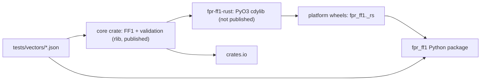

# Delivery Plan 00008: Publish Rust Crate To Crates Io

> [!abstract] Plan status: `draft`
> Split the existing PyO3 crate into a publishable pure-Rust library plus a thin binding, port the validation layer that today lives only in Python, hold both to the same conformance evidence, and publish to crates.io from this repository in version lock-step with the PyPI distribution. The crate is published as **`fpr-ff1`** under **MIT OR Apache-2.0** (user decisions D2 and D3, 2026-09-22); no decision remains open, and the plan awaits explicit user approval.

## 1. Objective and outcome

`rust/fpr-ff1-rust` already implements SP 800-38G Algorithm 7, the Algorithm 6 PRF, and the subquadratic numeral conversion in 724 lines, proven bit-exact against the pure-Python reference by the dual-backend suite. It is not usable by Rust callers: it is `crate-type = ["cdylib"]`, carries `publish = false`, depends unconditionally on PyO3, and performs **no validation at all** — every check (key size, radix, lengths, numerals, tweak bounds, alphabet) runs in Python for both backends by plan 00003 decision D4.

Outcome: a crate on crates.io that a Rust caller can depend on directly, with its own validation, typed errors, string and numeral interfaces, and documentation; published from this repository by the same release gate that publishes the wheels, at the same version. The Python package's behaviour, ciphertext, exceptions and wheels are unchanged by this work.

Market context, verified 2026-09-22 (§19): the only general-purpose FF1 crate, `fpe`, has had no commit since 2023-04-13, has an unmerged `aes` 0.9 support PR open since 2026-04-29, and computes `b = ceil(v * log2(radix) / 8)` in `f64` via `libm` for non-power-of-two radices — the float bug class this project bans and AST-scans for. No published crate carries per-round intermediate conformance evidence. `fpr-ff1`, `ff1`, `nist-ff1` and `sp800-38g` are all unregistered.

## 2. Source traceability

| Requirement | Source | Source location | Interpretation |
|---|---|---|---|
| PLAN-00008-REQ-01 | User | "write a plan for the crate" (2026-09-22) | Split the workspace into a publishable core `rlib` and a PyO3 binding that depends on it, with the extension's behaviour unchanged |
| PLAN-00008-REQ-02 | Repository | `src/fpr_ff1/_ff1.py:33-179`, `:396-511`; `src/fpr_ff1/_exceptions.py` | Port every validation rule and its rejection semantics into the crate as a typed error enum |
| PLAN-00008-REQ-03 | User; repository | `AGENTS.md` §Public API | A Rust API offering the numeral primitive and the string interface, documented with doctests |
| PLAN-00008-REQ-04 | Repository | `AGENTS.md` §Tests 1-8; `tests/vectors/*.json` | Hold the crate to the project's conformance bar from the same vector files |
| PLAN-00008-REQ-05 | Repository | `AGENTS.md` "A change to one core is a change to both" | Keep the two cores and the two validation layers provably in step |
| PLAN-00008-REQ-06 | User decision D1 | "Keep lock-step" (2026-09-22) | The published crate version equals the distribution version, enforced by the contract test |
| PLAN-00008-REQ-07 | Repository; external | `pyproject.toml` sdist include list; crates.io packaging rules | Package the crate so it ships its own sources and none of the Python tree |
| PLAN-00008-REQ-08 | Repository | `.github/workflows/ci.yml` | Gate the crate in CI: tests, lint, MSRV, docs, packaging dry run, API compatibility |
| PLAN-00008-REQ-09 | External | crates.io Trusted Publishing (§19) | Publish from `publish.yml` by OIDC, with no stored token |
| PLAN-00008-REQ-10 | Repository | `docs/AGENTS.md` | Update every maintained document the change makes untrue |
| PLAN-00008-REQ-11 | User; repository | `SECURITY.md`; `AGENTS.md` §Never do | State the crate's claims no more strongly than the Python package's, and verify the published crate |

## 3. Repository baseline

| Field | Value |
|---|---|
| Repository | joelee/fpr-ff1 |
| Branch | release/v2 |
| HEAD | 052dc226538484a4d04c945f226899ad16033fef |
| Working tree at publication | Clean |
| Applicable instructions | `AGENTS.md`, `CLAUDE.md`, `docs/AGENTS.md`, `docs/plans/AGENTS.md` |

At this baseline `rust/Cargo.toml` is a workspace with one member, `fpr-ff1-rust` version `2.0.0-rc2`, `publish = false`, `crate-type = ["cdylib"]`, library name `_fpr_ff1_rs`, depending on `pyo3` 0.29 (`extension-module`), `num-bigint` 0.4, `num-traits` 0.2, `num-integer` 0.1 and `aes` 0.8. Plan 00007 is in execution: `v2.0.0rc2` is published and soaking until 2026-09-25, with STEP-12 to STEP-14 (re-review, final bump, release) outstanding.

## 4. Scope

### In scope

- A two-member Rust workspace: a publishable core library crate, and the existing PyO3 extension as a thin binding depending on it by path.
- A validation layer in the core crate covering every rule the Python package enforces, with a typed error enum.
- A Rust public API: construction, the numeral primitive, the string interface, and length properties.
- Rust conformance tests reading the existing JSON vectors: NIST samples both directions, per-round intermediates, AES known-answer vectors, frozen oracle vectors, validation rejection sweeps, property and bijectivity tests.
- A shared cross-language case file so both validation layers are proven to accept and reject identically.
- Lock-step versioning extended to the published crate, enforced by `tests/test_contract.py`.
- Crate packaging metadata, `README`, licence files, docs.rs configuration and `cargo publish` dry run.
- CI: crate tests, `clippy`, `fmt`, an MSRV leg, a docs build, `cargo package`, and `cargo-semver-checks` once a baseline exists.
- Publication from `publish.yml` by crates.io Trusted Publishing, and verification of the published crate.
- Documentation updates: `README.md`, `docs/architecture.md`, `docs/directory-structure.md`, `docs/developer-guide.md`, `docs/backlog.md`, `AGENTS.md`, `SECURITY.md`.

### Out of scope

- Any change to the Python package's public API, ciphertext, exception types or messages, wheels, or to `_ff1.py` beyond documentation. The Python path remains the reference (plan 00003 D3, D4 preserved).
- FF3/FF3-1, key management, and every other permanent exclusion in `AGENTS.md`.
- `no_std` support (D6), key zeroization (D5), constant-time claims, and a `serde` feature. Each may be proposed later on its own evidence.
- Publishing the PyO3 binding crate to crates.io; it stays `publish = false`.
- Changing the Python package's version scheme, or decoupling crate and distribution versions (D1: lock-step).
- Any release action for plan 00007; this plan starts only after `v2.0.0` is published (D7).

## 5. Constraints and preserved decisions

- **The two cores stay in step.** `AGENTS.md` requires that a change to one core is a change to both, proven by the dual-backend suite. This plan adds a second such obligation for validation, and must not weaken the first.
- **Exact integer arithmetic only** in the crate, as in both existing cores: no `f32`, `f64`, `log2`, `powf` or `libm` anywhere in the FF1 path. This is the differentiator against `fpe` and a project non-negotiable.
- **No shared mutable state:** no `static`, no `OnceLock`, no cached cipher context; scratch state stays call-local, as today.
- **No `unsafe`** in either crate.
- **Vectors are never regenerated** from this implementation, and no self-generated output is committed as a vector. The crate reads the existing files in `tests/vectors/`.
- **Version lock-step (D1):** `pyproject.toml`, the core crate and the binding crate carry the same version, with the Cargo semver spelling for pre-releases.
- **Claims parity (REQ-11):** no FIPS validation claim, no constant-time claim, no zeroization claim.
- Only the user tags, pushes and publishes. Builder performs no outward action without per-action authorization.
- 100% line and branch coverage on `fpr_ff1` remains a hard floor; `just quality` stays Rust-free.

## 6. Assumptions

None. Unresolved matters are recorded as decisions and block approval when material.

## 7. Decisions and blockers

| ID | Decision or blocker | Resolution | Owner | Status |
|---|---|---|---|---|
| D1 | Crate version independent of the distribution version, or locked in step | **User decided 2026-09-22: keep lock-step.** The first published crate version is therefore the distribution version at publication (`2.0.x`), not `0.1.0`. The README states why a first release carries that number | User | Resolved |
| D2 | **Published crate name** | **User selected `fpr-ff1` on 2026-09-22**, matching the PyPI distribution for one identity across both registries. The crate directory becomes `rust/fpr-ff1/` and the library target is `fpr_ff1`; the binding crate keeps the package name `fpr-ff1-rust` and the library target `_fpr_ff1_rs` | User | Resolved |
| D3 | **Crate licence** | **User selected dual MIT OR Apache-2.0 on 2026-09-22.** Both crate manifests carry `license = "MIT OR Apache-2.0"`; `LICENSE-APACHE` is added beside the existing MIT text; the PyPI distribution's `license = "MIT"` and `license-files` are unchanged. `README.md` states which files are dual-licensed | User | Resolved |
| D4 | Where validation lives | Duplicate it: the crate validates for Rust callers, Python keeps its own for both backends (plan 00003 D4 unchanged). A shared JSON case file proves the two agree. Rejected alternative: Python calling into Rust validation, which would change exception messages, break the pure-Python path's independence, and contradict plan 00003 D4 | Planner | Resolved |
| D5 | Key zeroization in the crate | Out of scope for the first release. Rust could zeroize, unlike Python, but a partial claim is worse than none: the key still reaches the AES key schedule and any caller-held buffer. Revisit with `zeroize` behind a feature once there is a claim the crate can defend in `SECURITY.md` | Planner | Resolved |
| D6 | `no_std` support | Out of scope for the first release. `num-bigint` supports `no_std` with `alloc`, so this stays open as a later, separately evidenced change | Planner | Resolved |
| D7 | When this plan starts | After plan 00007 STEP-14 completes and `v2.0.0` is published. Rationale: plan 00007 is mid-release with a candidate soaking; touching the workspace, the version contract or `publish.yml` before the final tag risks the release. The user may override | Planner (user may override) | Resolved |
| D8 | MSRV | Declare `rust-version = "1.87"` and test it in CI. The current core already uses `u32::is_multiple_of` (stable 1.87), `std::iter::repeat_n` (1.82) and `usize::div_ceil` (1.73). Raising the MSRV later is a minor version for the crate | Planner | Resolved |
| D9 | Numeral type in the public API | `u16` slices, matching the internal core and the documented radix subset `2 <= radix < 2**16`. Rejected: `u32`, which would admit values the radix bound already excludes and force a second validation pass | Planner | Resolved |

### 7.1 D2 options (`fpr-ff1` selected; the rest record what was offered)

| Option | For | Against |
|---|---|---|
| `fpr-ff1` | Matches the PyPI name and this repository; one identity across both registries; unambiguous when searching for either | Slightly awkward to read; "fpr" means nothing to a Rust user arriving from a search |
| `ff1` | The best possible name for discovery: exact, short, unregistered | Claims the generic name for one implementation; invites "why is this *the* ff1 crate" scrutiny; no link to the Python package |
| `nist-ff1` | Descriptive and honest about the standard; good search terms | Implies a NIST endorsement the project explicitly disclaims (`AGENTS.md`: never claim FIPS validation) |
| `sp800-38g` | Precise, spec-anchored | Unreadable in a dependency list; the spec also covers FF3, which this crate will never implement |

Planner recommendation was **`fpr-ff1`**, for one identity across registries; the user selected it on 2026-09-22.

### 7.2 D3 options (dual MIT OR Apache-2.0 selected)

| Option | Effect |
|---|---|
| Dual MIT OR Apache-2.0 (Rust convention) | `license = "MIT OR Apache-2.0"`, add `LICENSE-APACHE`, keep `LICENSE` as `LICENSE-MIT`. Matches `fpe` and nearly all of the ecosystem; the Apache grant covers patents explicitly. Requires adding a licence the repository has not used before, and the crate's sources are shared with the Python package, so the repository's licensing statement must say which files are dual-licensed |
| MIT only | No change to the repository's licensing. Some corporate consumers require an explicit patent grant and will treat MIT-only as a blocker |

Planner recommendation was **dual MIT OR Apache-2.0 for the crate's sources**; the user selected it on 2026-09-22. STEP-07 adds `LICENSE-APACHE` and `LICENSE-MIT` to the crate and sets both manifests; STEP-09 states in `README.md` which files are dual-licensed.

## 8. Affected architecture and components

- `rust/Cargo.toml` — workspace members become the core crate and the binding crate.
- `rust/fpr-ff1/` (new) — the published crate `fpr-ff1` (library target `fpr_ff1`): `src/lib.rs` (core moved here, PyO3 removed), `src/validate.rs`, `src/error.rs`, `src/alphabet.rs`, `src/tests/`, `README.md`, `LICENSE-MIT`, `LICENSE-APACHE`.
- `rust/fpr-ff1-rust/` — keeps `crate-type = ["cdylib"]`, `publish = false`, PyO3 bindings and the test-only trace bridge; depends on the core crate by path.
- `tests/vectors/*.json` — unchanged, read by both suites.
- `tests/vectors/validation_cases.json` (new) — the shared accept/reject case file (REQ-05).
- `tests/test_contract.py` — version lock-step extended to both crates; consumes the shared case file.
- `.github/workflows/ci.yml` — crate test, lint, MSRV, docs, package and semver jobs.
- `.github/workflows/publish.yml` — crates.io publication by Trusted Publishing.
- `README.md`, `AGENTS.md`, `SECURITY.md`, `docs/architecture.md`, `docs/directory-structure.md`, `docs/developer-guide.md`, `docs/backlog.md`, `justfile`.

## 9. Requirement catalogue

### PLAN-00008-REQ-01 — Split the workspace into a publishable core and a binding

- **Requirement:** Create the core crate (name per D2) containing the FF1 core, PRF, AES seams and conversion, with **no PyO3 dependency**, `crate-type = ["rlib"]`, and publishable metadata. Reduce `fpr-ff1-rust` to the PyO3 layer: the `#[pymodule]`, the production bindings, and the test-only trace bridge, depending on the core by path with `publish = false` retained. The extension's module name, exported symbols, `__version__` and behaviour are unchanged, and the wheels keep the same contents.
- **Rationale:** The crate cannot be published while it is `cdylib`-only with a mandatory `extension-module` dependency; and `extension-module` must not leak into a library Rust callers link.
- **Source:** User instruction; `rust/fpr-ff1-rust/Cargo.toml:14,17-18`; `rust/fpr-ff1-rust/src/lib.rs` `#[pymodule] fn _rs`.
- **Acceptance evidence:** `cargo tree -p fpr-ff1` shows no `pyo3`; `just backend-dev`, `just rust-test`, `just rust-lint` and the full dual-backend gate are unchanged and green; the built wheel's contents equal the previous release's file list.

### PLAN-00008-REQ-02 — Port the validation layer with typed errors

- **Requirement:** The core crate validates, before any FF1 computation: key length (16, 24, 32); radix `2 <= radix < 2**16`; minimum domain `radix**minlen >= 1_000_000` with `min_length` derived by integer arithmetic; input length between `min_length` and `2**32 - 1`; every numeral `< radix`; tweak length `<= 2**32 - 1`; configured tweak bounds, including rejection of bounds above the ceiling and of `min > max`; alphabet length equal to radix and character uniqueness; and string inputs drawn from the alphabet. Errors are a non-exhaustive enum mirroring the Python hierarchy (`KeyLength`, `Radix`, `Length`, `ValueRange`, `TweakLength`, `Alphabet`), implementing `core::error::Error` and `Display`. **Messages must not contain plaintext or key material**, matching the Python redaction rule.
- **Rationale:** The crate performs no validation today; Python does it for both backends. A published crate that trusts its caller would fail open, contradicting the project's fail-closed posture.
- **Source:** `src/fpr_ff1/_ff1.py:33-179` (`_require_int`, `_validate_tweak_bounds`, `_require_bytes`), `:396-511` (`_validate_tweak_length`, `_validate_tweak`, `_validate_length`, `_coerce_numerals`, `_prepare`, `_decode_str`), `:598-613` (`_min_length`); `src/fpr_ff1/_exceptions.py`.
- **Acceptance evidence:** A rejection test for every rule and boundary, including `min_length` exactly; no message contains a numeral value or key byte; `cargo test` green.

### PLAN-00008-REQ-03 — A documented Rust public API

- **Requirement:** Provide a constructor taking key and radix with optional alphabet, default tweak and tweak bounds, returning `Result`; `encrypt_numerals`/`decrypt_numerals` over `&[u16]` returning `Result<Vec<u16>, _>`; `encrypt`/`decrypt` over `&str` when an alphabet is configured; and `min_length`/`max_length` accessors. Instances are `Send + Sync` with no interior mutability. Every public item carries a doc comment; the crate root documents the supported subset, the fail-closed limits, the absence of FF3, and the no-FIPS and no-constant-time disclaimers, with runnable doctests.
- **Rationale:** The crate is the product for Rust callers; the API is the part that cannot be changed later without a major version.
- **Source:** `AGENTS.md` §Public API; `src/fpr_ff1/_ff1.py:181-596`.
- **Acceptance evidence:** `cargo test --doc` green; `cargo doc` builds with no warnings; a compile-time assertion that the type is `Send + Sync`.

### PLAN-00008-REQ-04 — Hold the crate to the project's conformance bar

- **Requirement:** Rust tests read the existing JSON vectors and cover: all nine NIST samples, encrypt and decrypt; the per-round intermediates for every round of every sample through the existing trace hook; the FIPS 197 AES known-answer vectors; the frozen oracle vectors including `d > 16` cases; exact-arithmetic boundary radices; property tests (round trip, length and alphabet preservation, key and tweak sensitivity, determinism); and exhaustive bijectivity for radix 2 length 20 and radix 10 length 6. A test asserts no float type or `libm` call appears in the crate's FF1 path, mirroring the Python AST scan.
- **Rationale:** `AGENTS.md` makes conformance the product, and the crate must carry the same evidence as the wheels rather than inheriting it by association. The float scan is the crate's differentiator and must be enforced, not asserted.
- **Source:** `AGENTS.md` §Tests 1-8; `tests/vectors/*.json`; `tests/test_exact_arithmetic.py`.
- **Acceptance evidence:** `cargo test` green including the vector-driven tests; the float scan fails when a float is introduced deliberately; the bijectivity tests are feature- or `--ignored`-gated if they exceed a minute, and CI runs them.

### PLAN-00008-REQ-05 — Prove the two validation layers agree

- **Requirement:** Add `tests/vectors/validation_cases.json`: a list of cases, each with constructor or call arguments and the expected outcome (accepted, or rejected with a named error kind). The Python suite asserts each case against `FF1`; the Rust suite asserts the same case against the crate. Kind names map one to one between the Python exception hierarchy and the Rust enum. The file is the single source for both, and a case may not be added to one suite alone.
- **Rationale:** Two validation layers are two chances to diverge, in a project whose central rule is that the cores stay in step. Without this, a caller could find an input the wheel rejects and the crate accepts.
- **Source:** `AGENTS.md` "A change to one core is a change to both"; plan 00003 decision D4.
- **Acceptance evidence:** Both suites consume the file and pass; a deliberately divergent rule fails one of them; the case list covers every variant of the Rust error enum and every Python exception type except `BackendError` (which has no crate equivalent).

### PLAN-00008-REQ-06 — Extend version lock-step to the published crate

- **Requirement:** Both crates carry the distribution version in Cargo semver spelling. `tests/test_contract.py::test_crate_version_matches_project_version` is extended to check both manifests, and to fail if either is missing or if the core crate's `publish` is disabled while the binding's is enabled. The crate's README states that the first published version matches the Python distribution (decision D1) rather than starting at `0.1.0`.
- **Rationale:** D1. Two manifests already drift only because a test forbids it; a third manifest needs the same guard.
- **Source:** User decision D1; `tests/test_contract.py:209-240`; `AGENTS.md` §Conventions.
- **Acceptance evidence:** The contract test covers both manifests and fails when either drifts, on every CI leg, without a Rust toolchain.

### PLAN-00008-REQ-07 — Package the crate correctly

- **Requirement:** The published `.crate` contains the core crate's sources, README, licence files and vector fixtures needed by its tests, and nothing from the Python tree, no agent instructions, plans or reviews. Metadata sets description, repository, documentation, homepage, keywords (including `ff1`, `fpe`, `format-preserving-encryption`), categories (`cryptography`, plus `no-std` only if it ever applies), `rust-version` (D8), and docs.rs configuration. `cargo package --locked` and `cargo publish --dry-run` succeed.
- **Rationale:** crates.io publication is irreversible per version; contents and metadata are the parts most easily got wrong once.
- **Source:** crates.io packaging rules; `pyproject.toml` sdist include list as the precedent for an explicit allow-list.
- **Acceptance evidence:** A contents assertion over `cargo package --list` against required and forbidden patterns, mirroring the sdist check; dry run green.

### PLAN-00008-REQ-08 — Gate the crate in CI

- **Requirement:** `ci.yml` gains: `cargo test` for the workspace on Linux, macOS and Windows; `cargo clippy --all-targets -- -D warnings` and `cargo fmt --check` (extending the existing job); a leg pinned to the declared MSRV; `cargo doc` with warnings denied; `cargo package --locked` with the contents assertion; and `cargo-semver-checks` against the previously published version, skipped with a recorded reason before the first publication. All are required by the publishing gate because `publish.yml` reuses the workflow.
- **Rationale:** The existing `rust-conformance` job proves the extension, not the library crate's API, MSRV or packaging.
- **Source:** `.github/workflows/ci.yml`; `.github/workflows/publish.yml` `workflow_call` reuse.
- **Acceptance evidence:** All new jobs green on a pushed branch; each fails when its subject is deliberately broken (MSRV lowered, doc link broken, forbidden file added).

### PLAN-00008-REQ-09 — Publish by Trusted Publishing

- **Requirement:** `publish.yml` gains a `publish-crate` job that runs only after the gate, uses `rust-lang/crates-io-auth-action` (SHA-pinned) with `id-token: write` to obtain a short-lived token, and runs `cargo publish --locked -p fpr-ff1`. No crates.io token is stored in the repository. The job is skipped for pre-release versions unless the user asks otherwise, so a candidate is not published to crates.io.
- **Rationale:** Mirrors the PyPI Trusted Publishing posture: no long-lived credentials, publish only what the gate verified.
- **Source:** crates.io Trusted Publishing documentation (§19); `.github/workflows/publish.yml`.
- **Acceptance evidence:** A dry run on a pre-release proves the job is skipped; the real publication produces the crate on crates.io from the tagged commit.

### PLAN-00008-REQ-10 — Update the maintained documents

- **Requirement:** `AGENTS.md` gains the crate as a third artifact with its contract (validation duplicated, case file shared, lock-step, no floats). `docs/architecture.md` gains the split and the dependency direction. `docs/directory-structure.md` describes both crates. `docs/developer-guide.md` documents the new `just` recipes and CI jobs, and how to run the crate's tests. `README.md` gains a short Rust section pointing at the crate and stating that Python remains the reference. `docs/backlog.md` records the shipped crate and the deferred `no_std` and zeroize items.
- **Rationale:** `docs/AGENTS.md`: documentation is part of the product and is updated in the change that makes it true.
- **Source:** `docs/AGENTS.md`.
- **Acceptance evidence:** Each document states the new arrangement; no document implies the crate is the reference implementation or that it is FIPS validated.

### PLAN-00008-REQ-11 — Verify the published crate and record the claims

- **Requirement:** After publication: the crates.io page shows the intended version, licence (D3), description and links; docs.rs builds the documentation successfully; a scratch project depending on the published version compiles and reproduces a NIST sample vector and a `d > 16` case on a clean machine. `SECURITY.md` covers the crate explicitly: same scope, same no-FIPS, no-constant-time and no-zeroization statements, and the same private reporting channel.
- **Rationale:** Publication is not evidence of usability; and a second artifact with no stated security policy invites the assumption that it has stronger guarantees than the wheels.
- **Source:** `SECURITY.md`; `AGENTS.md` §Never do.
- **Acceptance evidence:** docs.rs build succeeds; the scratch project's output matches the published vector; `SECURITY.md` names the crate.

## 10. Delivery strategy

The order isolates the risky move (splitting the crate) from the new surface (validation and API), and puts every published artifact behind the same gate that protects the wheels.

1. **Split first, behaviour frozen** (STEP-01). Moving code between crates must not change the extension, so the dual-backend gate is the checkpoint before anything else is built on it.
2. **Validation, then API, then conformance** (STEP-02 to STEP-04). Validation is the part with the most rules and the least existing Rust code; the API depends on it; the conformance suite proves the result.
3. **Agreement between layers** (STEP-05) once both validation layers exist.
4. **Packaging and CI** (STEP-06 to STEP-08) once the crate's content is final.
5. **Documentation** (STEP-09), written when the thing it describes exists.
6. **Release** (STEP-10 to STEP-12): version alignment, an owner-performed publication, then verification.

Checkpoint after every code step: `just quality` (Rust-free), the full dual-backend gate, `cargo test` for the workspace, and `just rust-lint`. The wheels' behaviour is re-proven at each checkpoint, because the crate split touches the code they ship.

## 11. Detailed implementation steps

### PLAN-00008-STEP-01 — Split the workspace

- **Status placeholder:** `not-started`
- **Objective:** A publishable core crate and a PyO3 binding, with no behaviour change.
- **Requirements:** `PLAN-00008-REQ-01`
- **Depends on:** None
- **Affected components:** `rust/Cargo.toml`, `rust/fpr-ff1/` (new), `rust/fpr-ff1-rust/{Cargo.toml,src/lib.rs}`, `rust/Cargo.lock`, `justfile`
- **Preconditions:** Clean worktree; `v2.0.0` published (D7); plan approved
- **Test or evidence first:** Record the current wheel's file list and `_rs.__version__`, and the dual-backend gate result, as the before-state.
- **Implementation tasks:**
  1. Create `rust/fpr-ff1/` (package `fpr-ff1`, library target `fpr_ff1`); move the FF1 core, PRF, AES seams, conversion and `TraceRecord` into it; delete its PyO3 imports.
  2. Reduce `fpr-ff1-rust` to `#[pymodule]`, the production bindings and the trace bridge; add the core as a path dependency; keep `publish = false`, the `cdylib` type and the `_fpr_ff1_rs` library name.
  3. Update the workspace members and `just backend-dev` if the artifact path changes.
  4. Re-run the gate and compare the wheel's file list with the before-state.
- **Documentation/configuration/operations:** None (STEP-09).
- **Verification:** `cargo tree -p fpr-ff1` has no `pyo3`; `cargo test`; `just rust-lint`; `just backend-dev`; full dual-backend gate; wheel file list unchanged.
- **Completion criteria:** The extension behaves identically and the core crate builds without PyO3.
- **Rollback or recovery:** Revert the commit.
- **Builder stop conditions:** Any ciphertext or intermediate change; any wheel content change; `extension-module` reachable from the core crate.

### PLAN-00008-STEP-02 — Port validation and typed errors

- **Status placeholder:** `not-started`
- **Objective:** The crate rejects everything the Python package rejects, with typed errors.
- **Requirements:** `PLAN-00008-REQ-02`
- **Depends on:** STEP-01
- **Affected components:** `rust/fpr-ff1/src/{error.rs,validate.rs,lib.rs}`
- **Preconditions:** STEP-01 committed.
- **Test or evidence first:** Write the rejection tests from the Python rules first: every error variant, every boundary (`min_length` exactly, one below; radix 1 and `2**16`; key 15/17/23/25/31/33; tweak ceiling; inverted and oversized bounds; duplicate and wrong-length alphabet). They fail until the code exists.
- **Implementation tasks:**
  1. Define the non-exhaustive error enum with `Display` and `core::error::Error`, messages free of plaintext and key material.
  2. Implement `min_length` by integer arithmetic only, matching `_min_length`.
  3. Implement the validation functions and wire them into the entry points, before any computation.
  4. Run the rejection tests to green.
- **Documentation/configuration/operations:** Doc comments naming the spec clause or project rule behind each check.
- **Verification:** `cargo test`; `just rust-lint`; a grep showing no float type in the crate.
- **Completion criteria:** Every rule in REQ-02 is enforced and covered by a test.
- **Rollback or recovery:** Revert the commit.
- **Builder stop conditions:** A rule that cannot be expressed without floats; a message that would echo a numeral or key byte.

### PLAN-00008-STEP-03 — Public API and documentation

- **Status placeholder:** `not-started`
- **Objective:** The API Rust callers use, documented with runnable examples.
- **Requirements:** `PLAN-00008-REQ-03`
- **Depends on:** STEP-02
- **Affected components:** `rust/fpr-ff1/src/{lib.rs,alphabet.rs}`, `rust/fpr-ff1/README.md`
- **Preconditions:** STEP-02 committed.
- **Test or evidence first:** Doctests for construction, the numeral interface, the string interface and one rejection; a `Send + Sync` assertion.
- **Implementation tasks:**
  1. Implement the constructor, the four operations and the length accessors over `u16` numerals (D9).
  2. Implement the alphabet type: length and uniqueness by Unicode code point, decode and encode by character.
  3. Write the crate-root documentation: supported subset, fail-closed limits, no FF3, no FIPS, no constant-time.
  4. Write the crate README from the same material.
- **Documentation/configuration/operations:** This step is the crate's documentation.
- **Verification:** `cargo test --doc`; `cargo doc --no-deps` with warnings denied; `cargo test`.
- **Completion criteria:** Every public item documented; examples compile and run.
- **Rollback or recovery:** Revert the commit.
- **Builder stop conditions:** An API that admits values the radix bound excludes; any claim beyond the Python package's.

### PLAN-00008-STEP-04 — Conformance suite

- **Status placeholder:** `not-started`
- **Objective:** The crate carries the project's conformance evidence in its own right.
- **Requirements:** `PLAN-00008-REQ-04`
- **Depends on:** STEP-03
- **Affected components:** `rust/fpr-ff1/tests/`, `rust/fpr-ff1/Cargo.toml` (dev-dependencies: a JSON parser, a property-test crate)
- **Preconditions:** STEP-03 committed.
- **Test or evidence first:** This step is the evidence. Each suite is written against the JSON vectors before any convenience helper is added.
- **Implementation tasks:**
  1. Load the vector files by relative path from the workspace; assert the nine NIST samples both directions.
  2. Assert the per-round intermediates for every round of every sample through the trace hook.
  3. Assert the FIPS 197 AES vectors and the frozen oracle vectors, including `d > 16`.
  4. Add property tests and the exhaustive bijectivity sweeps, gated so the default `cargo test` stays fast and CI runs them in full.
  5. Add the float scan over the crate's own sources.
- **Documentation/configuration/operations:** None.
- **Verification:** `cargo test`; the gated sweeps run in CI; a deliberate float introduction fails the scan; a deliberate S-expansion break fails the intermediates.
- **Completion criteria:** Every item in REQ-04 covered and green.
- **Rollback or recovery:** Revert the commit.
- **Builder stop conditions:** Any vector regenerated or expected value hand-written; any divergence from the Python core.

### PLAN-00008-STEP-05 — Cross-language validation agreement

- **Status placeholder:** `not-started`
- **Objective:** Prove both validation layers accept and reject identically.
- **Requirements:** `PLAN-00008-REQ-05`
- **Depends on:** STEP-04
- **Affected components:** `tests/vectors/validation_cases.json` (new), `tests/test_validation.py` or a new Python module, `rust/fpr-ff1/tests/`
- **Preconditions:** STEP-04 committed.
- **Test or evidence first:** Write the case file first, from the Python rules, and confirm the Python suite passes against it before the Rust side exists.
- **Implementation tasks:**
  1. Define the case schema: arguments, the expected outcome, and the error kind name.
  2. Enumerate cases covering every Python exception type (except `BackendError`) and every Rust enum variant, plus the boundaries from STEP-02.
  3. Consume the file from both suites.
  4. Verify a deliberately divergent rule fails exactly one side.
- **Documentation/configuration/operations:** Document the file's role in `AGENTS.md` at STEP-09.
- **Verification:** Both suites green; the divergence probe recorded in the work log.
- **Completion criteria:** Both layers proven equivalent over the case file.
- **Rollback or recovery:** Revert the commit.
- **Builder stop conditions:** A case that cannot be expressed for one language; any weakening of an assertion to make both pass.

### PLAN-00008-STEP-06 — Version lock-step for three manifests

- **Status placeholder:** `not-started`
- **Objective:** The crate cannot drift from the distribution version.
- **Requirements:** `PLAN-00008-REQ-06`
- **Depends on:** STEP-01
- **Affected components:** `tests/test_contract.py`, both crate manifests
- **Preconditions:** STEP-01 committed.
- **Test or evidence first:** Change one manifest deliberately and record the contract test red; restore and record green.
- **Implementation tasks:**
  1. Extend the contract test to both manifests, including the `publish` flags.
  2. Set both crate versions to the current distribution version.
- **Documentation/configuration/operations:** `AGENTS.md` §Conventions at STEP-09.
- **Verification:** `uv run pytest tests/test_contract.py`; the test runs without a Rust toolchain.
- **Completion criteria:** Red-then-green recorded; both manifests aligned.
- **Rollback or recovery:** Revert the commit.
- **Builder stop conditions:** None.

### PLAN-00008-STEP-07 — Packaging and metadata

- **Status placeholder:** `not-started`
- **Objective:** A `.crate` that contains the right files and nothing else.
- **Requirements:** `PLAN-00008-REQ-07`
- **Depends on:** STEP-04, STEP-06
- **Affected components:** `rust/fpr-ff1/Cargo.toml`, `rust/fpr-ff1/{README.md,LICENSE-MIT,LICENSE-APACHE}`
- **Preconditions:** STEP-04 and STEP-06 committed.
- **Test or evidence first:** `cargo package --list` before the metadata work, recorded as the before-state.
- **Implementation tasks:**
  1. Set description, repository, documentation, homepage, keywords, categories, `rust-version` (D8), `license = "MIT OR Apache-2.0"` (D3) and docs.rs metadata; set `publish` appropriately on both crates.
  2. Add `LICENSE-MIT` and `LICENSE-APACHE` to the crate; if the vectors are needed by packaged tests, include them explicitly, otherwise exclude the test data and gate those tests out of the packaged build.
  3. Add a contents assertion over `cargo package --list` with required and forbidden patterns.
  4. Run `cargo package --locked` and `cargo publish --dry-run`.
- **Documentation/configuration/operations:** Crate README finalised.
- **Verification:** Both commands green; the contents assertion passes and fails when a forbidden path is added.
- **Completion criteria:** The packaged crate is correct and reproducible.
- **Rollback or recovery:** Revert the commit.
- **Builder stop conditions:** Any Python-tree, agent-instruction, plan or review file in the package.

### PLAN-00008-STEP-08 — CI jobs for the crate

- **Status placeholder:** `not-started`
- **Objective:** Every claim about the crate is gated in CI.
- **Requirements:** `PLAN-00008-REQ-08`
- **Depends on:** STEP-07
- **Affected components:** `.github/workflows/ci.yml`, `justfile`
- **Preconditions:** STEP-07 committed; user authorization to push for CI execution.
- **Test or evidence first:** Validate the workflow locally (actionlint) and run each new command locally first.
- **Implementation tasks:**
  1. Add the workspace `cargo test` matrix across the three operating systems.
  2. Add the MSRV leg pinned to `rust-version`, the `cargo doc` leg with warnings denied, and the `cargo package` leg with the contents assertion.
  3. Add `cargo-semver-checks` against the last published version, with a recorded skip reason before the first publication.
  4. Add matching `just` recipes so the same commands run locally.
  5. Push (user-authorized) and iterate to green; record the run URL.
- **Documentation/configuration/operations:** `docs/developer-guide.md` at STEP-09.
- **Verification:** All new jobs green; each proven to fail when its subject is broken.
- **Completion criteria:** The crate's gate is as strong as the wheels'.
- **Rollback or recovery:** Revert the workflow commit.
- **Builder stop conditions:** A job that cannot be made green on a supported runner.

### PLAN-00008-STEP-09 — Documentation

- **Status placeholder:** `not-started`
- **Objective:** Every maintained document describes the two artifacts truthfully.
- **Requirements:** `PLAN-00008-REQ-10`
- **Depends on:** STEP-08
- **Affected components:** `AGENTS.md`, `README.md`, `SECURITY.md`, `docs/architecture.md`, `docs/directory-structure.md`, `docs/developer-guide.md`, `docs/backlog.md`
- **Preconditions:** STEP-08 committed.
- **Test or evidence first:** Not applicable (documentation).
- **Implementation tasks:**
  1. `AGENTS.md`: the crate as a third artifact; validation duplicated; the shared case file; lock-step; no floats; the crate is not the reference.
  2. `docs/architecture.md` and `docs/directory-structure.md`: the split and the dependency direction.
  3. `docs/developer-guide.md`: the new recipes and CI jobs.
  4. `README.md`: a short Rust section; `SECURITY.md`: the crate named, with the same claims and channel (REQ-11).
  5. `docs/backlog.md`: the crate recorded, with `no_std` (D6) and zeroize (D5) as deferred items.
- **Documentation/configuration/operations:** This step is the documentation work.
- **Verification:** `uv run ruff format --check .` and `ruff check .`; a read-through against REQ-10.
- **Completion criteria:** No document implies the crate is the reference or carries stronger claims.
- **Rollback or recovery:** Revert the commit.
- **Builder stop conditions:** A statement that cannot be sourced from the shipped artifacts.

### PLAN-00008-STEP-10 — Align versions and gate the release commit

- **Status placeholder:** `not-started`
- **Objective:** A commit whose three manifests agree and whose gate is green.
- **Requirements:** `PLAN-00008-REQ-06`, `PLAN-00008-REQ-08`
- **Depends on:** STEP-09
- **Affected components:** `pyproject.toml`, both crate manifests, `uv.lock`, `rust/Cargo.lock`, `CHANGELOG.md`
- **Preconditions:** STEP-09 committed.
- **Test or evidence first:** Contract test red-then-green across the version bump.
- **Implementation tasks:**
  1. Choose the release version with the user (a minor bump if the Python package is unchanged in behaviour, since the crate is additive to the project, not to the Python API).
  2. Bump all three manifests and both lock files; add the changelog entry describing the crate.
  3. Run the full local gate and record the CI run at that commit.
- **Documentation/configuration/operations:** Changelog.
- **Verification:** `uv lock --check`; `cargo build --locked`; contract test; full gate; CI green.
- **Completion criteria:** The release commit is gated and self-consistent.
- **Rollback or recovery:** Revert the commit.
- **Builder stop conditions:** Lock drift beyond the version lines.

### PLAN-00008-STEP-11 — Publish

- **Status placeholder:** `not-started`
- **Objective:** The crate is on crates.io, published by the gate.
- **Requirements:** `PLAN-00008-REQ-09`
- **Depends on:** STEP-10
- **Affected components:** `.github/workflows/publish.yml`
- **Preconditions:** STEP-10 green; the user has configured the crates.io Trusted Publisher for this repository and workflow; per-action authorization for the tag, the merge to `main` and the release.
- **Test or evidence first:** `cargo publish --dry-run` in CI on the release commit.
- **Implementation tasks:**
  1. Add the `publish-crate` job with `rust-lang/crates-io-auth-action` (SHA-pinned), `id-token: write`, running `cargo publish --locked -p fpr-ff1`; skip it for pre-release versions.
  2. Builder records the frozen commit; the owner merges to `main` by PR with a merge commit (the convention plan 00007 established), tags, and publishes the GitHub release.
  3. The release triggers `publish.yml`, which publishes to PyPI and crates.io from the same gated commit.
- **Documentation/configuration/operations:** Work-log record of the run and the published versions.
- **Verification:** The publish run is green; both registries show the same version.
- **Completion criteria:** The crate is published from the tagged commit with no stored token.
- **Rollback or recovery:** A crates.io version cannot be replaced. For a defective release, yank it and publish a corrected patch version; never attempt to overwrite.
- **Builder stop conditions:** Any gate failure; any attempt to publish from an untagged or ungated commit.

### PLAN-00008-STEP-12 — Verify the published crate

- **Status placeholder:** `not-started`
- **Objective:** Prove the published crate is usable, and record the claims.
- **Requirements:** `PLAN-00008-REQ-11`
- **Depends on:** STEP-11
- **Affected components:** None (verification); `SECURITY.md` if not already final
- **Preconditions:** STEP-11 complete.
- **Test or evidence first:** This step is the evidence.
- **Implementation tasks:**
  1. Check the crates.io page: version, licence, description, repository and documentation links, categories and keywords.
  2. Confirm the docs.rs build succeeded and the crate-root documentation renders.
  3. In a scratch directory outside the repository, create a project depending on the published version; reproduce a NIST sample vector and a `d > 16` case; record the output.
  4. Record the handoff: version, commit, tag, run URLs, and the yank-and-patch recovery procedure.
- **Documentation/configuration/operations:** Handoff record.
- **Verification:** The scratch project's output matches the published vector; docs.rs is green.
- **Completion criteria:** The published crate is verified from outside the repository.
- **Rollback or recovery:** Yank and publish a patch version.
- **Builder stop conditions:** Any behavioural difference between the published crate and the gated source.

## 12. Cross-cutting concerns

| Area | Applicability | Planned action or reason not applicable | Step or requirement |
|---|---|---|---|
| Compatibility and APIs | Applicable | The Python API is unchanged; the crate's API is new and fixed at publication, so it is reviewed before release and checked afterwards by `cargo-semver-checks` | REQ-01, REQ-03, REQ-08 |
| Data and migration | Not applicable | No persisted data; ciphertext is unchanged | — |
| Security and privacy | Applicable | Validation ported fail-closed; messages redacted; claims parity with the Python package; no zeroization or constant-time claim | REQ-02, REQ-11 |
| Performance and scale | Applicable | The crate inherits the measured conversion; no new performance claim is published without a recorded run | REQ-04 |
| Reliability and failure handling | Applicable | Typed errors for every rejection; the cross-language case file prevents divergent acceptance | REQ-02, REQ-05 |
| Observability and operations | Not applicable | A library with no telemetry | — |
| Dependencies and supply chain | Applicable | `--locked` builds; `cargo-audit` already covers the lock file; Trusted Publishing with no stored token; SHA-pinned actions | REQ-08, REQ-09 |
| Accessibility and UX | Not applicable | No UI | — |
| Documentation and release | Applicable | Crate docs and README; every maintained document updated; changelog entry | REQ-03, REQ-10 |
| Deployment and rollback | Applicable | A crates.io version is immutable: recovery is yank plus a patch release, recorded before publication | REQ-09, STEP-11 |

## 13. Verification strategy

| Level | Evidence or command | When | Required result |
|---|---|---|---|
| Rust unit and integration | `cargo test` (workspace) | STEP-01 to STEP-07, STEP-10 | Green |
| Rust hygiene | `just rust-lint` (`fmt --check`, `clippy -D warnings`) | Every code step | Exit 0 |
| Doctests and docs | `cargo test --doc`; `cargo doc --no-deps` with warnings denied | STEP-03, STEP-08 | Green |
| Exact arithmetic | Float scan over the crate's sources | STEP-04 onward | No float in the FF1 path |
| Python suite unchanged | Full dual-backend gate; `just quality` Rust-free | Every code step | 100% coverage; bit-exact |
| Cross-language validation | Shared case file consumed by both suites | STEP-05 onward | Both green; divergence probe fails exactly one |
| Version lock-step | `uv run pytest tests/test_contract.py` | STEP-06, STEP-10 | Red on drift, green when aligned |
| Packaging | `cargo package --locked`; `cargo publish --dry-run`; contents assertion | STEP-07, STEP-08 | Green; nothing forbidden |
| MSRV | CI leg pinned to `rust-version` | STEP-08 onward | Green |
| API compatibility | `cargo-semver-checks` against the last published version | STEP-08 onward | Green or a recorded first-publication skip |
| Publication | `publish.yml` run; crates.io and PyPI versions | STEP-11 | Same version in both registries |
| Post-publication | docs.rs build; scratch project reproducing a NIST vector | STEP-12 | Green; output matches |

## 14. Acceptance criteria

- [ ] `PLAN-00008-AC-01` The workspace has a core crate with no PyO3 in `cargo tree`, and a binding crate that is still `cdylib`, still `publish = false`, and produces a wheel whose file list matches the previous release's.
- [ ] `PLAN-00008-AC-02` Every validation rule listed in REQ-02 is enforced in the crate and covered by a rejection test, with no message containing a numeral value or key byte.
- [ ] `PLAN-00008-AC-03` The public API provides construction, the numeral primitive, the string interface and the length accessors; `cargo test --doc` and `cargo doc` with warnings denied are green; the type is `Send + Sync`.
- [ ] `PLAN-00008-AC-04` The crate's tests reproduce the nine NIST samples both directions, the per-round intermediates for every round, the AES known-answer vectors, the frozen vectors including `d > 16`, the property suite and the bijectivity sweeps, all from the existing JSON files, and the float scan fails on a deliberate float.
- [ ] `PLAN-00008-AC-05` `tests/vectors/validation_cases.json` is consumed by both suites; every Python exception type except `BackendError` and every Rust error variant appears; a deliberate divergence fails exactly one suite.
- [ ] `PLAN-00008-AC-06` The contract test checks all three manifests and their `publish` flags, fails on drift, and runs without a Rust toolchain.
- [ ] `PLAN-00008-AC-07` The published package is named `fpr-ff1` and declares `MIT OR Apache-2.0` with both licence files present; `cargo package --locked` and `cargo publish --dry-run` are green, and the contents assertion passes and fails when a forbidden path is added.
- [ ] `PLAN-00008-AC-08` The new CI jobs (workspace tests on three operating systems, MSRV, docs, package, semver) are green and required by the publishing gate.
- [ ] `PLAN-00008-AC-09` `publish.yml` publishes the crate by Trusted Publishing with no stored token, skips pre-release versions, and runs only after the gate.
- [ ] `PLAN-00008-AC-10` `AGENTS.md`, `README.md`, `SECURITY.md`, `docs/architecture.md`, `docs/directory-structure.md`, `docs/developer-guide.md` and `docs/backlog.md` describe the two artifacts, and none implies the crate is the reference or carries stronger claims.
- [ ] `PLAN-00008-AC-11` crates.io and PyPI show the same version for the release, published from the same tagged commit.
- [ ] `PLAN-00008-AC-12` docs.rs builds the documentation, and a scratch project outside the repository, depending on the published version, reproduces a NIST sample vector and a `d > 16` case.

## 15. Risks and mitigations

| Risk | Likelihood | Impact | Mitigation or test | Owner/step |
|---|---|---|---|---|
| The split changes the extension's behaviour | Low | High | Dual-backend gate and wheel file-list comparison as the step's own checkpoint | Builder/STEP-01 |
| The two validation layers diverge over time | Medium | High | The shared case file is the gate, not a convention; a divergence probe is recorded | Builder/STEP-05 |
| A published API proves wrong and needs a breaking change | Medium | Medium | API review before publication; `cargo-semver-checks` afterwards; the first release is deliberately small in surface | Owner/STEP-03, STEP-08 |
| The crate is published with a wrong or missing licence file | Low | High | D3 resolved (MIT OR Apache-2.0); the contents assertion covers both licence files | Builder/STEP-07 |
| Publication cannot be undone | Certain | Medium | Dry run in CI; yank-and-patch procedure recorded before the first publish | Builder/STEP-11 |
| Vector files are unavailable to packaged tests | Medium | Low | Either include them explicitly or gate those tests out of the packaged build; decided in STEP-07 with the contents assertion as evidence | Builder/STEP-07 |
| Lock-step forces an unwanted Python release to ship a crate fix | Medium | Medium | Accepted consequence of D1, recorded here; revisit only by a superseding plan | User/D1 |
| MSRV proves too new for a consumer | Low | Low | `rust-version` declared and tested; lowering it later is a minor version | Builder/STEP-08 |
| Maintaining two conformance suites slows future core changes | Medium | Medium | The suites share vectors and the case file, so a core change updates one set of fixtures | Builder/REQ-04, REQ-05 |

## 16. Builder hand-off

- **Start condition:** User approval, `v2.0.0` published (D7), and a clean repository.
- **First step:** PLAN-00008-STEP-01.
- **Required sequence:** STEP-01 → STEP-02 → STEP-03 → STEP-04 → STEP-05 → STEP-06 → STEP-07 → STEP-08 → STEP-09 → STEP-10 → STEP-11 → STEP-12. STEP-06 depends only on STEP-01 and may be done earlier if convenient.
- **Parallel-safe work:** None; each step's checkpoint depends on the previous step's code.
- **Do not change:** the Python package's API, ciphertext, exceptions or wheels; plan 00003 decisions D3 and D4; the reference status of the pure-Python path; the coverage floor; the Rust-free `just quality`. Do not add FF3/FF3-1, key management, a runtime dependency for the Python package, `unsafe`, shared mutable state, or any float in the FF1 path. Do not publish the binding crate. Do not tag, push, merge or publish without per-action authorization.
- **Escalate when:** the extension's behaviour or the wheel's contents change; a validation rule cannot be expressed without floats; the case file cannot express a rule in one language; `cargo publish --dry-run` reports content the assertion did not catch; the crates.io Trusted Publisher is not configured; a vector file would have to be duplicated into the crate.
- **Completion hand-off:** crates.io and PyPI carry the same version from the same tagged commit; docs.rs is green; the scratch-project verification is recorded; the yank-and-patch procedure is in the work log.

<!-- BUILDER_WORK_LOG_START -->
## 17. Builder Work Log

> [!warning] Builder-maintained section
> Delivery Planner creates this section. After approval, Builder may update only
> this delimited section and the Builder-maintained front-matter fields. Builder
> must preserve prior entries and use UTC timestamps.

### Step status

| Step | Status | Started (UTC) | Completed (UTC) | Evidence | Builder notes |
|---|---|---|---|---|---|
| PLAN-00008-STEP-01 | not-started | — | — | — | — |
| PLAN-00008-STEP-02 | not-started | — | — | — | — |
| PLAN-00008-STEP-03 | not-started | — | — | — | — |
| PLAN-00008-STEP-04 | not-started | — | — | — | — |
| PLAN-00008-STEP-05 | not-started | — | — | — | — |
| PLAN-00008-STEP-06 | not-started | — | — | — | — |
| PLAN-00008-STEP-07 | not-started | — | — | — | — |
| PLAN-00008-STEP-08 | not-started | — | — | — | — |
| PLAN-00008-STEP-09 | not-started | — | — | — | — |
| PLAN-00008-STEP-10 | not-started | — | — | — | — |
| PLAN-00008-STEP-11 | not-started | — | — | — | — |
| PLAN-00008-STEP-12 | not-started | — | — | — | — |

Allowed status values: `not-started`, `in-progress`, `blocked`, `completed`,
`skipped`. A skipped step requires explicit user approval recorded in Evidence.

### Execution log

| Timestamp (UTC) | Step | Event | Evidence or reference | Next action |
|---|---|---|---|---|

### Deviations and blockers

| Timestamp (UTC) | Step | Deviation or blocker | Impact | Decision required from |
|---|---|---|---|---|

None

### Verification results

| Timestamp (UTC) | Step | Command or check | Result | Evidence |
|---|---|---|---|---|

### Completion summary

- **Implementation status:** `not-started`
- **Completed requirements:** None
- **Incomplete requirements:** All
- **Outstanding blockers:** None
- **Review request:** Not ready
<!-- BUILDER_WORK_LOG_END -->

## 18. Planning change log

| Timestamp (UTC) | Plan status | Change | Reason | Requested/approved by |
|---|---|---|---|---|
| 2026-09-22T12:30:53Z | draft | D2 resolved: crate name `fpr-ff1` (directory `rust/fpr-ff1/`, library target `fpr_ff1`). D3 resolved: dual `MIT OR Apache-2.0` for the crate, adding `LICENSE-APACHE` and leaving the PyPI distribution MIT. `blocking_decisions` 2 → 0; the abstract, §7 rows, §7.1, §7.2, §8, §9, §11, §14, §15, §16, §17 and §20 updated to the chosen name and licence; §7.1 and §7.2 option tables retained as the record of what was offered. No requirement, step or acceptance-criterion count changed. | User decisions ("`fpr-ff1` and dual MIT/Apache-2.0") | User |
| 2026-09-22T12:08:45Z | draft | Initial draft written at `docs/plans/00008-Publish_Rust_Crate_To_Crates_io.md`: publish the Rust core as a crate from this repository, in version lock-step with the PyPI distribution (user decision D1). Two decisions left open and blocking: the crate name (D2) and the licence (D3). Seven decisions resolved by the planner (D4 to D9) with rationale. | User instruction on 2026-09-22 ("Keep lock-step and write a plan for the crate"), after a landscape scan of crates.io | User |

## 19. External references

1. **crates.io Trusted Publishing**, crates.io documentation; accessed 2026-09-22. Establishes that crates.io supports OIDC publishing from GitHub Actions through `rust-lang/crates-io-auth-action` with `id-token: write`, with no long-lived token, and that GitHub Actions is currently the only supported provider. <https://crates.io/docs/trusted-publishing>
2. **crates.io development update**, Rust Blog, published 2025-07-11; accessed 2026-09-22. Announcement and context for Trusted Publishing. <https://blog.rust-lang.org/2025/07/11/crates-io-development-update-2025-07/>
3. **`fpe` crate**, crates.io and GitHub (`str4d/fpe`); accessed 2026-09-22. Used for the landscape assessment: 513,643 recent downloads, last release 0.6.1 on 2023-04-13, last commit 2023-04-13, seven open issues including an unmerged `aes` 0.9 pull request from 2026-04-29, MIT/Apache-2.0 dual licence, and `src/ff1.rs` computing `b` with `libm::log2` in `f64` for non-power-of-two radices. <https://crates.io/crates/fpe> · <https://github.com/str4d/fpe>
4. **crates.io registry search and crate metadata**, accessed 2026-09-22. Used for the competing-crate table and for confirming that `fpr-ff1`, `ff1`, `nist-ff1` and `sp800-38g` are unregistered. <https://crates.io>

## 20. Confidence

**Medium.** The repository side is certain: the core, its tests and the vectors were read directly at the baseline, and the split, lock-step and CI work are all well-bounded by existing patterns. The uncertainty is in the new surface. The validation port and the public API are the first Rust code in this project that has no Python counterpart to be checked against line by line, and the API is fixed at publication. The name and licence were the user's decisions, taken on 2026-09-22 and recorded in §7. The effort estimate behind the step list is 12 to 18 focused days to reach the project's usual evidence bar; STEP-04 and STEP-05 carry most of it.
