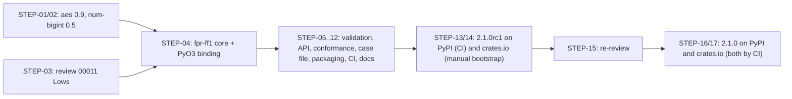

# Delivery Plan 00009: Crate And v2.1.0 Release

> [!abstract] Plan status: `approved`
> Publish the Rust core as the `fpr-ff1` crate on crates.io, in version lock-step with a `2.1.0` release on PyPI, after first taking the held `aes` and `num-bigint` upgrades as separately gated changes. Supersedes approved plan 00008 to correct its MSRV, keep third-party types out of the crate's public API, bootstrap the first crates.io publication correctly, and fix the three deferred findings from review 00011. No decision is open; approved by the user on 2026-09-26 and Builder-ready.

## 1. Objective and outcome

Plan 00008 (approved 2026-09-22, never started) set out to publish the Rust core as a crate. Before its start gate cleared, four problems surfaced that each change a frozen decision or requirement, so the contract requires a superseding plan rather than an edit:

| Problem | Source | Correction in this plan |
|---|---|---|
| Plan 00008 D8 declares MSRV 1.87, but the core calls `slice::as_chunks` (stable 1.88) at `rust/fpr-ff1-rust/src/lib.rs:112` | Review 00013 `REV-00013-MED-01`, re-confirmed by review 00014 | MSRV raised; see the next row for the final value |
| `aes` 0.9.3, which the held Dependabot PR #7 brings in, declares `rust-version = 1.89`; the reviews did not see this because the upgrade was not yet applied | crates.io metadata, verified 2026-09-25 (§19) | MSRV is **1.89**, the higher of the code's 1.88 and the dependency's 1.89 (D8) |
| The core's `num_radix`, `str_radix` and their reference variants are `pub` and take or return `num_bigint::BigUint`. Moved as-is into a published crate, every future `num-bigint` major becomes a breaking change for crate users | Repository: `rust/fpr-ff1-rust/src/lib.rs:182,197,326,361` | No third-party type in the public API; internals behind a hidden, non-default feature (D10) |
| crates.io Trusted Publishing cannot create a crate: the first publication of a new crate must use a maintainer-held API token. Plan 00008 REQ-09 assumed every publication could go through OIDC | crates.io documentation (§19) | The user's requested crate pre-release becomes the manual bootstrap publication; Trusted Publishing is configured afterwards and used for `2.1.0` (D11) |

Also folded in, because they belong in the same release: the held Dependabot PR #7 is taken as two separately gated upgrades before the crate's first publication (D12), and review 00011's three deferred Low findings are fixed (D13).

Outcome: `fpr-ff1` `2.1.0` on crates.io and PyPI, published from the same tagged commit on `main`, preceded by a soaked and re-reviewed `2.1.0rc1` on both registries. The Python package's accepted inputs and ciphertext are unchanged; the compiled wheels carry the upgraded `aes` and `num-bigint`, proven bit-exact.

## 2. Source traceability

| Requirement | Source | Source location | Interpretation |
|---|---|---|---|
| PLAN-00009-REQ-01 | Dependabot PR #7; user | PR #7 diff; user decision 2026-09-25 to hold it until after `v2.0.0` | Take `aes` 0.9 with `cipher` 0.5 and `crypto-common` 0.2 as its own gated change |
| PLAN-00009-REQ-02 | Dependabot PR #7; plan 00007 STEP-05 | PR #7 diff; `rust/fpr-ff1-rust/src/lib.rs` conversion | Take `num-bigint` 0.5 as its own gated change, with a benchmark under a park rule |
| PLAN-00009-REQ-03 | Review 00011 | `REV-00011-LOW-01`, `LOW-02`, `LOW-03` | Fix the three deferred Lows |
| PLAN-00009-REQ-04 | Plan 00008 REQ-01; repository | `rust/fpr-ff1-rust/Cargo.toml`; public items at `lib.rs:149-414` | Split into a publishable core and a PyO3 binding; no third-party type in the public API |
| PLAN-00009-REQ-05 | Plan 00008 REQ-02 | `src/fpr_ff1/_ff1.py` validation; `src/fpr_ff1/_exceptions.py` | Port every validation rule into the crate with typed errors |
| PLAN-00009-REQ-06 | Plan 00008 REQ-03 | `AGENTS.md` §Public API | A documented Rust API: construction, numeral primitive, string interface, length accessors |
| PLAN-00009-REQ-07 | Plan 00008 REQ-04 | `AGENTS.md` §Tests; `tests/vectors/*.json` | The crate's own conformance evidence from the shared vectors |
| PLAN-00009-REQ-08 | Plan 00008 REQ-05 | `AGENTS.md` "a change to one core is a change to both" | A shared case file proves the two validation layers agree |
| PLAN-00009-REQ-09 | Plan 00008 REQ-06; user D1 | `tests/test_contract.py` | Lock-step across `pyproject.toml` and both crate manifests |
| PLAN-00009-REQ-10 | Plan 00008 REQ-07; reviews 00013, 00014 | crates.io packaging rules; `REV-00013-MED-01` | Correct packaging, metadata and `rust-version = "1.89"` |
| PLAN-00009-REQ-11 | Plan 00008 REQ-08 | `.github/workflows/ci.yml` | Crate tests, lint, MSRV leg, docs, packaging and API-compatibility checks in the gate |
| PLAN-00009-REQ-12 | Plan 00008 REQ-09; crates.io documentation; user | §19; plan 00008 work log (pre-release instruction, 2026-09-22) | Bootstrap the crate manually with a scoped token at `2.1.0-rc1`, then publish `2.1.0` by Trusted Publishing |
| PLAN-00009-REQ-13 | Plan 00008 REQ-10 | `docs/AGENTS.md` | Every maintained document updated |
| PLAN-00009-REQ-14 | Plan 00008 REQ-11; plan 00007; user memory rule | `SECURITY.md`; `release-tags-on-main-via-pr` convention | Release `2.1.0rc1` then `2.1.0` through a PR merge commit on `main`, verified on both registries |

## 3. Repository baseline

| Field | Value |
|---|---|
| Repository | joelee/fpr-ff1 |
| Branch | chore/plan-00007-closeout |
| HEAD | e322cf5d2d77f7e10205bb8a5340333fc07b4186 |
| Working tree at publication | Clean (the strict gate returned only the empty file allocated for this plan) |
| Applicable instructions | `AGENTS.md`, `CLAUDE.md`, `docs/AGENTS.md`, `docs/plans/AGENTS.md`, `docs/reviews/AGENTS.md` |

`v2.0.0` is published on PyPI from tag `v2.0.0` at `0ac0877` on `main` (plan 00007, completed 2026-09-25). The baseline branch holds only plan 00007's closing work-log commits on top of `main`; its code is identical to `v2.0.0`. Open at baseline: Dependabot PRs #7 (`aes` and `num-bigint` majors, conflicting, checks from the pre-plan-00007 gate), #10 (actions) and #11 (Python dev tools), all held by user decision until after `v2.0.0`. `rust-toolchain.toml` pins the `stable` channel; CI builds with rustc 1.98.1.

## 4. Scope

### In scope

- `aes` 0.9 (with `cipher` 0.5, `crypto-common` 0.2) and `num-bigint` 0.5, each as a separate gated change; Dependabot PR #7 closed in their favour.
- The three Low findings from review 00011.
- Everything plan 00008 scoped: workspace split, validation port, public API, conformance suite, cross-language case file, lock-step, packaging, CI, documentation, publication and verification, with the corrections in §1.
- Release `2.1.0rc1` on PyPI and crates.io, owner soak, independent re-review, then `2.1.0` on both.

### Out of scope

- Any change to the Python package's accepted inputs, ciphertext, public API or default backend. The one exception-type change (REQ-03, a released `memoryview` now raising the documented `FF1Error` subclass instead of `ValueError`) narrows an already-rejected input to the documented contract.
- FF3/FF3-1, key management and every other permanent exclusion in `AGENTS.md`.
- `no_std`, key zeroization, constant-time claims and a `serde` feature (plan 00008 D5, D6 carried).
- Publishing the PyO3 binding crate.
- Widening the per-platform wheel test subset (plan 00007 deviation; not requested).
- Merging Dependabot PRs #10 and #11: owner housekeeping before this plan starts (§16).

## 5. Constraints and preserved decisions

- **The two cores stay in step**, proven by the dual-backend suite at every checkpoint; the validation layers are held in step by the case file (REQ-08).
- **Exact integer arithmetic only** in both cores; no float type or `libm` call in any FF1 path.
- **No shared mutable state, no `unsafe`**, in either crate.
- **Vectors are never regenerated**, and no self-generated output is committed as a vector.
- **Lock-step versions (plan 00008 D1):** `pyproject.toml`, the core crate and the binding crate carry the same version, Cargo semver spelling for pre-releases.
- **Claims parity:** no FIPS, constant-time or zeroization claim for either artifact.
- **Release convention:** each release reaches `main` through a PR merged with a merge commit, and the tag is placed on that merge commit (plan 00007; user memory rule).
- Only the user tags, pushes, merges and publishes; Builder takes no outward action without per-action authorization. No crates.io token is ever stored in the repository or in a CI secret.
- 100% line and branch coverage on `fpr_ff1`; `just quality` stays Rust-free.

## 6. Assumptions

None. Unresolved matters are recorded as decisions and block approval when material.

## 7. Decisions and blockers

| ID | Decision or blocker | Resolution | Owner | Status |
|---|---|---|---|---|
| D1 | Crate version scheme | Lock-step with the distribution (user decision 2026-09-22, plan 00008 D1), carried | User | Resolved |
| D2 | Crate name | `fpr-ff1`, directory `rust/fpr-ff1/`, library target `fpr_ff1` (user decision 2026-09-22, plan 00008 D2), carried | User | Resolved |
| D3 | Crate licence | `MIT OR Apache-2.0` for the crate; the PyPI distribution stays MIT (user decision 2026-09-22, plan 00008 D3), carried | User | Resolved |
| D4 | Where validation lives | Duplicated in the crate; Python unchanged; a shared case file proves agreement (plan 00008 D4), carried | Planner | Resolved |
| D5 | Key zeroization | Out of scope (plan 00008 D5), carried | Planner | Resolved |
| D6 | `no_std` | Out of scope (plan 00008 D6), carried | Planner | Resolved |
| D7 | Release version | **`2.1.0`**, preceded by `2.1.0rc1`. Lock-step means the crate cannot ship without a matching Python release; the Python package's behaviour is unchanged and the crate is a new artifact, so a minor version. Proposed by the planner on 2026-09-25 and accepted with the request to write this plan | User | Resolved |
| D8 | **MSRV** | **`rust-version = "1.89"`**, replacing plan 00008's 1.87. The code needs 1.88 (`slice::as_chunks`, `lib.rs:112`); `aes` 0.9.3 declares 1.89; every other dependency is lower (`cipher`, `crypto-common`, `hybrid-array`, `inout`, `cpufeatures` 1.85; `pyo3` 1.83; `num-bigint` 0.5.1 1.60). Rejected alternative: swapping `as_chunks` for `chunks_exact` to reach 1.88, which the `aes` floor makes pointless | Planner | Resolved |
| D9 | Numeral type in the public API | `u16` slices (plan 00008 D9), carried | Planner | Resolved |
| D10 | **What the public API exposes** | Only the crate's own types: the FF1 instance, its error enum and its alphabet type, over `u16`, `&[u8]` and `&str`. `num_radix`, `str_radix`, their reference variants, `prf`, `cipher_block`, `encode_len_u32` and the trace hook become crate-private; the PyO3 binding and the conformance tests reach them through a `#[doc(hidden)] pub mod __internal` compiled only with a non-default `internal` feature, documented as outside the semver contract. `cargo-semver-checks` runs without that feature | Planner | Resolved |
| D11 | **How the first crates.io publication happens** | Trusted Publishing cannot create a crate (§19). The owner publishes `2.1.0-rc1` manually, from the tagged commit, uploading a `.crate` whose SHA-256 matches the one CI built, with a crates.io token scoped to `publish-new` for `fpr-ff1` only and revoked immediately afterwards. The owner then configures the Trusted Publisher for this repository and `publish.yml`, and `2.1.0` is published by CI. This also fulfils the user's instruction of 2026-09-22 to publish a crate pre-release. Rejected alternative: a temporary token in a CI secret, which contradicts "no stored token" | Planner (owner performs) | Resolved |
| D12 | Dependabot PR #7 | Close it and take its two upgrades as STEP-01 (`aes`) and STEP-02 (`num-bigint`), each with its own gate, before the split. Rationale: the two are unrelated; #7's checks came from the pre-plan-00007 gate; and upgrading before the first publication means no crate user ever sees these majors | Planner | Resolved |
| D13 | Review 00011's three Lows | Fixed in this release (STEP-03). They were deferred past `2.0.0` by the user; `2.1.0` is the next release and each fix is small | Planner (user may drop at approval) | Resolved |
| D14 | Soak for `2.1.0rc1` | The owner states "soak until <date>" or "soak waived" in the work log after verifying the pre-release, as for `2.0.0rc2` | User (at STEP-14) | Resolved |
| D15 | Park rule for `num-bigint` 0.5 | After STEP-02, `just bench` must show `rust <= python` at n = 20,000 on radix 10 and 256, **and** the Rust time at n = 20,000 no more than 10% above the plan 00007 STEP-05 record (radix 10 9.9 ms, radix 256 4.1 ms) on the same machine class. Otherwise the Builder stops and escalates with numbers; keeping `num-bigint` 0.4.8, still maintained, is the fallback | Planner | Resolved |

## 8. Affected architecture and components

- `rust/Cargo.toml` — workspace members become `fpr-ff1` (published) and `fpr-ff1-rust` (PyO3 binding, unpublished).
- `rust/fpr-ff1/` (new) — `src/lib.rs`, `src/validate.rs`, `src/error.rs`, `src/alphabet.rs`, `src/internal.rs` (feature-gated), `tests/`, `README.md`, `LICENSE-MIT`, `LICENSE-APACHE`, `Cargo.toml` with `rust-version = "1.89"`.
- `rust/fpr-ff1-rust/` — PyO3 layer only; depends on `fpr-ff1` by path with `features = ["internal"]`.
- `rust/Cargo.lock` — `aes` 0.9.3, `cipher` 0.5.2, `crypto-common` 0.2.2, `num-bigint` 0.5.1 and their transitive changes.
- `src/fpr_ff1/_ff1.py` — `_require_bytes` normalises a released-buffer `ValueError` (REQ-03); no other change.
- `tests/test_properties.py`, `tests/test_thread_safety.py`, `tests/test_validation.py`, `tests/test_contract.py` — REQ-03, REQ-08, REQ-09.
- `tests/vectors/validation_cases.json` (new) — the shared case file.
- `.github/workflows/ci.yml`, `.github/workflows/publish.yml` — crate jobs, MSRV leg at 1.89, the Trusted Publishing job.
- `README.md`, `AGENTS.md`, `SECURITY.md`, `CHANGELOG.md`, `docs/architecture.md`, `docs/directory-structure.md`, `docs/developer-guide.md`, `docs/backlog.md`, `justfile`.

## 9. Requirement catalogue

### PLAN-00009-REQ-01 — Upgrade `aes` to 0.9 as its own gated change

- **Requirement:** Bump `aes` to 0.9 (resolving `cipher` 0.5.2, `crypto-common` 0.2.2, `hybrid-array`, `inout` 0.2, `cpufeatures` 0.3) and migrate the two AES seams: `BlockEncrypt` to `BlockCipherEncrypt`, `Block::clone_from_slice` to `Block::from`, as in PR #7. No other change in the commit. Close PR #7 with a comment pointing at this commit and STEP-02.
- **Rationale:** The AES implementation is the one component a second cryptographic implementation must never get wrong; the FIPS 197 known-answer vectors and PRF-equality tests exist to police exactly this swap.
- **Source:** Dependabot PR #7; user decision to hold it until after `v2.0.0`.
- **Acceptance evidence:** `tests/test_rust_aes_validation.py` (FIPS 197 KAT and PRF equality with the Python path) green; full dual-backend suite bit-exact including per-round intermediates; `cargo audit` clean; `Cargo.lock` diff limited to the AES stack.

### PLAN-00009-REQ-02 — Upgrade `num-bigint` to 0.5 under a park rule

- **Requirement:** Bump `num-bigint` to 0.5.1, adapting any changed API at its call sites (`BigUint::from`, `to_bytes_be`, `from_bytes_be`, `pow`, `div_rem`, `bits`, `iter_u32_digits`). Re-run the Rust conversion equivalence sweep across every supported radix, the full dual-backend suite, and `just bench`, then apply the park rule in D15.
- **Rationale:** `num-bigint` is the arithmetic engine of the divide-and-conquer conversion; its subquadratic division is why the Rust backend overtook the Python path. A major version needs a performance decision rule, not only a green suite.
- **Source:** Dependabot PR #7; plan 00007 STEP-05 benchmark record.
- **Acceptance evidence:** Equivalence sweep and full suite green and bit-exact; the benchmark recorded with machine, interpreter and toolchain; the park-rule verdict recorded; or an escalation entry and a reverted bump.

### PLAN-00009-REQ-03 — Fix review 00011's three deferred Low findings

- **Requirement:** (a) `_require_bytes` translates the `ValueError` raised by `bytes(memoryview)` on a released view into the caller-selected `FF1Error` subclass, with a message naming the argument but not its contents; no broader exception is caught. (b) `test_tweak_sensitivity` asserts: over the drawn cases, a collision is tolerated only on domains small enough for one to be plausible, and the test fails if every drawn pair collides. (c) Both concurrency tests in `tests/test_thread_safety.py` compare every iteration's result with the serial expectation, not only the last.
- **Rationale:** (a) keeps every rejection inside the documented hierarchy; (b) and (c) make two tests able to fail when their property breaks, in a project where a test that cannot fail is a defect.
- **Source:** Review 00011 `REV-00011-LOW-01`, `LOW-02`, `LOW-03`, re-confirmed still open by review 00013.
- **Acceptance evidence:** New rejection tests for a released view as key, default tweak and per-call tweak on both backends; (b) and (c) shown to fail against a deliberately broken implementation (tweak ignored; one wrong result injected mid-loop) and pass against the real one; coverage 100%.

### PLAN-00009-REQ-04 — Split the workspace and keep third-party types out of the public API

- **Requirement:** Create the `fpr-ff1` crate with the FF1 core, PRF, AES seams and conversion, no PyO3 dependency, `crate-type = ["rlib"]`. Reduce `fpr-ff1-rust` to the PyO3 layer, depending on `fpr-ff1` by path with the `internal` feature, keeping `cdylib`, `publish = false` and the `_fpr_ff1_rs` target. Per D10, the published API names no type from `num-bigint`, `aes`, `cipher` or `pyo3`; internal helpers live in the feature-gated `__internal` module.
- **Rationale:** Publication requires an `rlib` free of `extension-module`; and a third-party type in a published signature ties the crate's semver to that dependency's.
- **Source:** Plan 00008 REQ-01; `rust/fpr-ff1-rust/src/lib.rs:149-414`.
- **Acceptance evidence:** `cargo tree -p fpr-ff1` shows no `pyo3`; `cargo doc -p fpr-ff1` (without `internal`) lists no third-party type in any public signature; the wheel's file list and the extension's behaviour are unchanged; the full gate is green.

### PLAN-00009-REQ-05 — Port the validation layer with typed errors

- **Requirement:** As plan 00008 REQ-02: key length; radix `2 <= radix < 2**16`; minimum domain `radix**minlen >= 1_000_000` by integer arithmetic; length `min_length..=2**32 - 1`; numerals `< radix`; tweak length `<= 2**32 - 1`; tweak bounds including rejection above the ceiling and `min > max`; alphabet length and uniqueness; string characters from the alphabet. Errors are a non-exhaustive enum mirroring the Python hierarchy, implementing `core::error::Error`, with messages free of plaintext and key material.
- **Rationale:** The core validates nothing today; a published library must not fail open.
- **Source:** Plan 00008 REQ-02; `src/fpr_ff1/_ff1.py`; `src/fpr_ff1/_exceptions.py`.
- **Acceptance evidence:** A rejection test for every rule and boundary; no message contains a numeral value or key byte.

### PLAN-00009-REQ-06 — A documented Rust public API

- **Requirement:** As plan 00008 REQ-03: a constructor returning `Result`; `encrypt_numerals`/`decrypt_numerals` over `&[u16]`; `encrypt`/`decrypt` over `&str` with an alphabet; `min_length`/`max_length`. `Send + Sync`, no interior mutability. Every public item documented; crate-root documentation states the supported subset, the limits, no FF3, no FIPS, no constant-time, and that the Python package is the reference implementation; runnable doctests.
- **Rationale:** The API is the part fixed at publication.
- **Source:** Plan 00008 REQ-03; `AGENTS.md` §Public API.
- **Acceptance evidence:** `cargo test --doc` green; `cargo doc` with warnings denied; a compile-time `Send + Sync` assertion.

### PLAN-00009-REQ-07 — The crate's own conformance evidence

- **Requirement:** As plan 00008 REQ-04: the nine NIST samples both directions; per-round intermediates for every round of every sample; FIPS 197 AES vectors; frozen vectors including `d > 16`; exact-arithmetic boundary radices; property tests; exhaustive bijectivity for radix 2 length 20 and radix 10 length 6; a scan failing on any float type or `libm` call in the crate's FF1 path. All from the existing JSON files.
- **Rationale:** The crate must carry the evidence itself, not inherit it by association.
- **Source:** Plan 00008 REQ-04; `AGENTS.md` §Tests.
- **Acceptance evidence:** `cargo test` green; the float scan fails on a deliberate float; a deliberate S-expansion break fails the intermediates.

### PLAN-00009-REQ-08 — Prove the two validation layers agree

- **Requirement:** As plan 00008 REQ-05: `tests/vectors/validation_cases.json`, consumed by both suites, covering every Python exception type except `BackendError` and every Rust error variant; the released-`memoryview` case from REQ-03 is Python-only and marked so.
- **Rationale:** Two validation layers are two chances to diverge.
- **Source:** Plan 00008 REQ-05.
- **Acceptance evidence:** Both suites green; a deliberate divergence fails exactly one.

### PLAN-00009-REQ-09 — Lock-step across three manifests

- **Requirement:** As plan 00008 REQ-06: the contract test checks `pyproject.toml` and both crate manifests, and the `publish` flags (core publishable, binding not).
- **Rationale:** Plan 00008 D1.
- **Source:** Plan 00008 REQ-06; `tests/test_contract.py`.
- **Acceptance evidence:** Red on drift, green when aligned, without a Rust toolchain.

### PLAN-00009-REQ-10 — Packaging and metadata, with MSRV 1.89

- **Requirement:** As plan 00008 REQ-07, with `rust-version = "1.89"` (D8), `license = "MIT OR Apache-2.0"` and both licence files. The `.crate` contains the crate's sources, README, licences and any fixtures its packaged tests need, and nothing from the Python tree, no agent instructions, plans or reviews. docs.rs builds without the `internal` feature.
- **Rationale:** Publication is irreversible per version.
- **Source:** Plan 00008 REQ-07; review 00013 `REV-00013-MED-01`; D8.
- **Acceptance evidence:** `cargo package --locked` and `cargo publish --dry-run` green; a contents assertion passes and fails on a forbidden path; the crate builds and tests on Rust 1.89.

### PLAN-00009-REQ-11 — Gate the crate in CI

- **Requirement:** As plan 00008 REQ-08: workspace `cargo test` on three operating systems; `clippy -D warnings` and `fmt --check`; an MSRV leg pinned to **1.89**; `cargo doc` with warnings denied; `cargo package --locked` with the contents assertion; `cargo-semver-checks` against the last published version without the `internal` feature, skipped with a recorded reason before the first publication. All inside `ci.yml`, so `publish.yml` requires them.
- **Rationale:** The existing gate proves the extension, not the library crate.
- **Source:** Plan 00008 REQ-08.
- **Acceptance evidence:** All new jobs green; each fails when its subject is deliberately broken.

### PLAN-00009-REQ-12 — Bootstrap, then publish by Trusted Publishing

- **Requirement:** (a) `2.1.0-rc1` is published **manually by the owner** per D11: from the tagged commit, uploading the exact `.crate` CI built (SHA-256 compared), with a token scoped to `publish-new` for `fpr-ff1`, revoked immediately after. (b) The owner then configures the crates.io Trusted Publisher for `joelee/fpr-ff1`, workflow `publish.yml`. (c) `publish.yml` gains a `publish-crate` job using `rust-lang/crates-io-auth-action` (SHA-pinned) with `id-token: write`, running `cargo publish --locked -p fpr-ff1` only for non-prerelease versions, after the gate. No token is stored in the repository or a CI secret at any point.
- **Rationale:** crates.io cannot create a crate by OIDC (§19); the manual step must still publish exactly what CI verified.
- **Source:** Plan 00008 REQ-09; crates.io documentation; user instruction of 2026-09-22 (crate pre-release).
- **Acceptance evidence:** The published `2.1.0-rc1` `.crate` digest equals CI's; the token's revocation recorded by the owner; `2.1.0` published by the CI job.

### PLAN-00009-REQ-13 — Update the maintained documents

- **Requirement:** As plan 00008 REQ-10: `AGENTS.md` (the crate as a third artifact, validation duplicated, the case file, lock-step, no floats, the crate is not the reference, the `internal` feature is not public API); `docs/architecture.md`; `docs/directory-structure.md`; `docs/developer-guide.md` (recipes, CI jobs, MSRV, the bootstrap-then-OIDC publishing sequence); `README.md` (a Rust section); `SECURITY.md` (the crate named, same claims and channel); `docs/backlog.md`; `CHANGELOG.md`.
- **Rationale:** `docs/AGENTS.md`.
- **Source:** Plan 00008 REQ-10.
- **Acceptance evidence:** No document implies the crate is the reference or carries stronger claims.

### PLAN-00009-REQ-14 — Release `2.1.0rc1` and `2.1.0` on both registries

- **Requirement:** For each of `2.1.0rc1` and `2.1.0`: all three manifests at that version; a dated changelog section; the full gate and CI green at the release commit; the owner merges the release branch into `main` by PR **with a merge commit**, tags exactly `v2.1.0rc1` / `v2.1.0` on that merge commit, and publishes the GitHub release (pre-release, then final); `publish.yml` publishes to PyPI (and, for `2.1.0`, crates.io). Builder verifies both registries: files and digests against CI artifacts, PyPI attestations, docs.rs build, a scratch project outside the repository depending on the published crate reproducing a NIST vector and a `d > 16` case, and clean Python installs on both backends. An owner soak (D14) and an independent re-review with no Critical or Major finding separate the two.
- **Rationale:** Plan 00007's proven release discipline, including the merge-to-`main` step it initially missed.
- **Source:** Plan 00008 REQ-11; plan 00007 STEP-09 to STEP-14; user memory rule on tags.
- **Acceptance evidence:** Both versions live on both registries from tags on `main`; verification and handoff recorded.

## 10. Delivery strategy

1. **Dependencies first, while the code is still one crate** (STEP-01, STEP-02). Each upgrade is proven bit-exact on its own, so a later failure is never ambiguous between "the upgrade" and "the split".
2. **Small deferred fixes** (STEP-03), independent and quick.
3. **The split, with the API boundary drawn at the same time** (STEP-04). Deciding what is public while moving code avoids moving it twice.
4. **The crate's substance** (STEP-05 to STEP-08): validation, API, conformance, agreement.
5. **Packaging, CI and documentation** (STEP-09 to STEP-12).
6. **Candidate** (STEP-13, STEP-14): `2.1.0rc1` on PyPI by CI and on crates.io by the manual bootstrap, then Trusted Publisher configuration and soak.
7. **Promotion** (STEP-15 to STEP-17): re-review, final bump, both registries by CI.

Checkpoint after every code step: `just quality` (Rust-free), the full dual-backend gate with both `REQUIRE` flags, `cargo test` for the workspace, `just rust-lint`. From STEP-10 onward, also the MSRV build on 1.89 and `cargo package`.

## 11. Detailed implementation steps

### PLAN-00009-STEP-01 — Upgrade `aes` to 0.9

- **Status placeholder:** `not-started`
- **Objective:** The AES stack at 0.9, proven bit-exact.
- **Requirements:** `PLAN-00009-REQ-01`
- **Depends on:** None
- **Affected components:** `rust/fpr-ff1-rust/Cargo.toml`, `rust/Cargo.lock`, `rust/fpr-ff1-rust/src/lib.rs` (`prf`, `cipher_block` imports and block construction)
- **Preconditions:** Plan approved; clean worktree on a branch from `main` that includes plan 00007's closeout; Dependabot #10 and #11 merged or explicitly left open by the owner.
- **Test or evidence first:** Record the AES KAT, PRF-equality and full-suite results at the baseline.
- **Implementation tasks:**
  1. Set `aes = "0.9"`; `cargo update -p aes`; confirm the lock diff is the AES stack only.
  2. Apply the two API migrations from PR #7 and nothing else.
  3. Run the checkpoint; record `cargo audit`.
  4. Close PR #7 with a comment linking this commit and STEP-02 (owner-authorized outward action).
- **Documentation/configuration/operations:** None.
- **Verification:** `tests/test_rust_aes_validation.py`; full dual-backend gate including intermediates; `cargo test`; `just rust-lint`; `cargo audit`.
- **Completion criteria:** Bit-exact; one commit.
- **Rollback or recovery:** Revert the commit.
- **Builder stop conditions:** Any KAT, PRF-equality, ciphertext or intermediate difference; a lock change outside the AES stack.

### PLAN-00009-STEP-02 — Upgrade `num-bigint` to 0.5 under the park rule

- **Status placeholder:** `not-started`
- **Objective:** `num-bigint` 0.5.1 with no loss of correctness or of the long-input result.
- **Requirements:** `PLAN-00009-REQ-02`
- **Depends on:** STEP-01
- **Affected components:** `rust/fpr-ff1-rust/Cargo.toml`, `rust/Cargo.lock`, `rust/fpr-ff1-rust/src/lib.rs` conversion call sites
- **Preconditions:** STEP-01 committed.
- **Test or evidence first:** Record the equivalence sweep and a `just bench` run at `num-bigint` 0.4.8 on the machine that will measure 0.5.1.
- **Implementation tasks:**
  1. Set `num-bigint = "0.5"`; update the lock; adapt any changed API.
  2. Run the equivalence sweep and the checkpoint.
  3. Run `just bench` with the release-built extension; apply D15; record machine, interpreter, toolchain and every row.
- **Documentation/configuration/operations:** README performance figures only if the park rule passes and the numbers moved materially; otherwise unchanged.
- **Verification:** Equivalence sweep; full gate; benchmark recorded.
- **Completion criteria:** Park rule passed; one commit.
- **Rollback or recovery:** Revert to 0.4.8 (still maintained).
- **Builder stop conditions:** Park-rule failure (escalate with numbers); any divergence.

### PLAN-00009-STEP-03 — Fix review 00011's three Lows

- **Status placeholder:** `not-started`
- **Objective:** Every rejection typed; two tests able to fail.
- **Requirements:** `PLAN-00009-REQ-03`
- **Depends on:** None
- **Affected components:** `src/fpr_ff1/_ff1.py` (`_require_bytes`), `tests/test_validation.py`, `tests/test_properties.py`, `tests/test_thread_safety.py`, `CHANGELOG.md` (`[Unreleased]`)
- **Preconditions:** Clean worktree.
- **Test or evidence first:** Released-view tests first (they fail with `ValueError`); for (b) and (c), demonstrate each test failing against a deliberately broken implementation before relying on it, recorded in the work log and not committed.
- **Implementation tasks:**
  1. Narrow `ValueError` translation in `_require_bytes`, message without contents.
  2. Give `test_tweak_sensitivity` a failing assertion per REQ-03(b).
  3. Compare every iteration in both concurrency tests.
- **Documentation/configuration/operations:** Changelog entry for the exception-type change.
- **Verification:** Checkpoint; coverage 100%.
- **Completion criteria:** Three fixes, each with its red evidence; one commit.
- **Rollback or recovery:** Revert the commit.
- **Builder stop conditions:** Any change to accepted inputs or ciphertext; a catch broader than the released-buffer case.

### PLAN-00009-STEP-04 — Split the workspace and draw the API boundary

- **Status placeholder:** `not-started`
- **Objective:** A publishable `fpr-ff1` with no third-party type in its public API.
- **Requirements:** `PLAN-00009-REQ-04`
- **Depends on:** STEP-01, STEP-02, STEP-03
- **Affected components:** `rust/Cargo.toml`, `rust/fpr-ff1/` (new), `rust/fpr-ff1-rust/{Cargo.toml,src/lib.rs}`, `rust/Cargo.lock`, `justfile`
- **Preconditions:** STEP-01 to STEP-03 committed.
- **Test or evidence first:** Record the wheel's file list and `_rs.__version__`, and the gate result.
- **Implementation tasks:**
  1. Create `rust/fpr-ff1/` (package `fpr-ff1`, target `fpr_ff1`, `crate-type = ["rlib"]`); move the core, PRF, AES seams, conversion and trace types; remove PyO3.
  2. Make conversion, PRF, block-cipher, length-encoding and trace items crate-private; re-export what the binding and tests need from `#[doc(hidden)] pub mod __internal`, compiled only with feature `internal`.
  3. Reduce `fpr-ff1-rust` to the PyO3 layer, depending on `fpr-ff1` with `features = ["internal"]`.
  4. Re-run the gate; compare the wheel file list.
- **Documentation/configuration/operations:** None (STEP-12).
- **Verification:** `cargo tree -p fpr-ff1` without `pyo3`; `cargo doc -p fpr-ff1` public signatures free of third-party types; full gate; wheel file list unchanged.
- **Completion criteria:** Extension identical; boundary drawn; one commit.
- **Rollback or recovery:** Revert the commit.
- **Builder stop conditions:** Any behaviour or wheel-content change; a public signature that needs a third-party type.

### PLAN-00009-STEP-05 — Port validation and typed errors

- **Status placeholder:** `not-started`
- **Objective:** The crate rejects everything the Python package rejects.
- **Requirements:** `PLAN-00009-REQ-05`
- **Depends on:** STEP-04
- **Affected components:** `rust/fpr-ff1/src/{error.rs,validate.rs,lib.rs}`
- **Preconditions:** STEP-04 committed.
- **Test or evidence first:** Rejection tests for every rule and boundary, failing until implemented.
- **Implementation tasks:**
  1. The non-exhaustive error enum with `Display` and `core::error::Error`, redacted messages.
  2. `min_length` by integer arithmetic, matching `_min_length`.
  3. Validation wired into every entry point before computation.
- **Documentation/configuration/operations:** Doc comments naming the rule behind each check.
- **Verification:** `cargo test`; `just rust-lint`; no float in the crate.
- **Completion criteria:** Every rule enforced and tested; one commit.
- **Rollback or recovery:** Revert the commit.
- **Builder stop conditions:** A rule needing floats; a message that would echo data.

### PLAN-00009-STEP-06 — Public API and documentation

- **Status placeholder:** `not-started`
- **Objective:** The API Rust callers use, with runnable examples.
- **Requirements:** `PLAN-00009-REQ-06`
- **Depends on:** STEP-05
- **Affected components:** `rust/fpr-ff1/src/{lib.rs,alphabet.rs}`, `rust/fpr-ff1/README.md`
- **Preconditions:** STEP-05 committed.
- **Test or evidence first:** Doctests for construction, both interfaces and a rejection; a `Send + Sync` assertion.
- **Implementation tasks:**
  1. The constructor, four operations and accessors over `u16`.
  2. The alphabet type: length and uniqueness by code point.
  3. Crate-root documentation and README.
- **Documentation/configuration/operations:** This step is the crate's documentation.
- **Verification:** `cargo test --doc`; `cargo doc --no-deps` with warnings denied.
- **Completion criteria:** Every public item documented; examples run; one commit.
- **Rollback or recovery:** Revert the commit.
- **Builder stop conditions:** Any claim beyond the Python package's.

### PLAN-00009-STEP-07 — Conformance suite

- **Status placeholder:** `not-started`
- **Objective:** The crate's own evidence.
- **Requirements:** `PLAN-00009-REQ-07`
- **Depends on:** STEP-06
- **Affected components:** `rust/fpr-ff1/tests/`, dev-dependencies (a JSON parser, a property-test crate)
- **Preconditions:** STEP-06 committed.
- **Test or evidence first:** This step is the evidence.
- **Implementation tasks:**
  1. NIST samples both directions and per-round intermediates from the JSON files.
  2. AES KAT and frozen vectors including `d > 16`.
  3. Property tests and gated bijectivity sweeps (CI runs them in full).
  4. The float scan.
- **Documentation/configuration/operations:** None.
- **Verification:** `cargo test`; deliberate float and deliberate S-expansion break both fail.
- **Completion criteria:** REQ-07 covered; one commit.
- **Rollback or recovery:** Revert the commit.
- **Builder stop conditions:** A regenerated or hand-written expected value; any divergence from the Python core.

### PLAN-00009-STEP-08 — Cross-language validation agreement

- **Status placeholder:** `not-started`
- **Objective:** Both validation layers proven equivalent.
- **Requirements:** `PLAN-00009-REQ-08`
- **Depends on:** STEP-07
- **Affected components:** `tests/vectors/validation_cases.json`, a Python test module, `rust/fpr-ff1/tests/`
- **Preconditions:** STEP-07 committed.
- **Test or evidence first:** The case file written from the Python rules; the Python side passes before the Rust side exists.
- **Implementation tasks:**
  1. Case schema and cases covering every error kind.
  2. Consume from both suites.
  3. Record a deliberate divergence failing exactly one side.
- **Documentation/configuration/operations:** `AGENTS.md` at STEP-12.
- **Verification:** Both suites green; the probe recorded.
- **Completion criteria:** Agreement proven; one commit.
- **Rollback or recovery:** Revert the commit.
- **Builder stop conditions:** A case one language cannot express; any weakened assertion.

### PLAN-00009-STEP-09 — Lock-step for three manifests

- **Status placeholder:** `not-started`
- **Objective:** No manifest can drift.
- **Requirements:** `PLAN-00009-REQ-09`
- **Depends on:** STEP-04
- **Affected components:** `tests/test_contract.py`, both crate manifests
- **Preconditions:** STEP-04 committed.
- **Test or evidence first:** Drift one manifest; record red; restore; record green.
- **Implementation tasks:**
  1. Extend the contract test to both manifests and the `publish` flags.
- **Documentation/configuration/operations:** `AGENTS.md` at STEP-12.
- **Verification:** `uv run pytest tests/test_contract.py`, without a Rust toolchain.
- **Completion criteria:** Red-then-green recorded; one commit.
- **Rollback or recovery:** Revert the commit.
- **Builder stop conditions:** None.

### PLAN-00009-STEP-10 — Packaging, metadata and MSRV 1.89

- **Status placeholder:** `not-started`
- **Objective:** A correct `.crate` that builds on its declared minimum Rust.
- **Requirements:** `PLAN-00009-REQ-10`
- **Depends on:** STEP-07, STEP-09
- **Affected components:** `rust/fpr-ff1/{Cargo.toml,README.md,LICENSE-MIT,LICENSE-APACHE}`
- **Preconditions:** STEP-07 and STEP-09 committed.
- **Test or evidence first:** `cargo package --list` recorded; a build on Rust 1.88 recorded failing (proving 1.89 is the true floor, not a guess).
- **Implementation tasks:**
  1. Metadata: description, repository, documentation, homepage, keywords, categories, `rust-version = "1.89"`, `license = "MIT OR Apache-2.0"`, docs.rs configuration without `internal`.
  2. Licence files; fixtures included or packaged tests gated.
  3. The contents assertion; `cargo package --locked`; `cargo publish --dry-run`.
  4. Build and test on 1.89 with the locked dependencies.
- **Documentation/configuration/operations:** Crate README final.
- **Verification:** All green on 1.89; contents assertion passes and fails on a forbidden path.
- **Completion criteria:** The package is correct and reproducible; one commit.
- **Rollback or recovery:** Revert the commit.
- **Builder stop conditions:** A forbidden file in the package; the crate needing more than 1.89 (escalate: D8 would be wrong again).

### PLAN-00009-STEP-11 — CI jobs for the crate

- **Status placeholder:** `not-started`
- **Objective:** Every claim about the crate gated.
- **Requirements:** `PLAN-00009-REQ-11`, `PLAN-00009-REQ-12` (the `publish-crate` job)
- **Depends on:** STEP-10
- **Affected components:** `.github/workflows/ci.yml`, `.github/workflows/publish.yml`, `justfile`
- **Preconditions:** STEP-10 committed; push authorization.
- **Test or evidence first:** actionlint; each command run locally first.
- **Implementation tasks:**
  1. Workspace tests on three operating systems; the 1.89 MSRV leg; `cargo doc`; `cargo package` with the assertion; `cargo-semver-checks` with its recorded first-publication skip.
  2. The `publish-crate` job in `publish.yml`: SHA-pinned `rust-lang/crates-io-auth-action`, `id-token: write`, non-prerelease only, after the gate.
  3. Matching `just` recipes.
  4. Push (authorized) and iterate to green.
- **Documentation/configuration/operations:** Developer guide at STEP-12.
- **Verification:** All new jobs green; each fails on a deliberate break; the publish job skipped for a pre-release version in a dry run.
- **Completion criteria:** Gate as strong as the wheels'; one commit plus recorded fix-ups.
- **Rollback or recovery:** Revert the workflow commit.
- **Builder stop conditions:** A job that cannot be made green on a supported runner.

### PLAN-00009-STEP-12 — Documentation

- **Status placeholder:** `not-started`
- **Objective:** Every maintained document describes both artifacts truthfully.
- **Requirements:** `PLAN-00009-REQ-13`
- **Depends on:** STEP-11
- **Affected components:** `AGENTS.md`, `README.md`, `SECURITY.md`, `docs/architecture.md`, `docs/directory-structure.md`, `docs/developer-guide.md`, `docs/backlog.md`
- **Preconditions:** STEP-11 committed.
- **Test or evidence first:** Not applicable.
- **Implementation tasks:**
  1. The documents listed in REQ-13, including the bootstrap-then-OIDC publishing sequence and the `internal` feature's status.
- **Documentation/configuration/operations:** This step is the documentation.
- **Verification:** Ruff checks; a read-through against REQ-13.
- **Completion criteria:** No document implies the crate is the reference or has stronger claims; one commit.
- **Rollback or recovery:** Revert the commit.
- **Builder stop conditions:** A statement not sourced from the shipped artifacts.

### PLAN-00009-STEP-13 — Cut and gate `2.1.0rc1`

- **Status placeholder:** `not-started`
- **Objective:** A gated candidate commit at `2.1.0rc1` / `2.1.0-rc1`.
- **Requirements:** `PLAN-00009-REQ-14`, `PLAN-00009-REQ-09`
- **Depends on:** STEP-12
- **Affected components:** `pyproject.toml`, both crate manifests, `uv.lock`, `rust/Cargo.lock`, `CHANGELOG.md`
- **Preconditions:** STEP-12 committed.
- **Test or evidence first:** Contract test red-then-green across the bump.
- **Implementation tasks:**
  1. Bump all three manifests and both locks; a dated `[2.1.0rc1]` section.
  2. Full local gate; `cargo package --locked`, recording the `.crate` SHA-256; CI green at the candidate commit (push authorized).
  3. Hand off: frozen commit, `.crate` digest, CI run.
- **Documentation/configuration/operations:** Changelog.
- **Verification:** `uv lock --check`; `cargo build --locked`; contract test; full gate; CI green.
- **Completion criteria:** Candidate gated; `.crate` digest recorded.
- **Rollback or recovery:** Revert the commit.
- **Builder stop conditions:** Lock drift beyond version lines.

### PLAN-00009-STEP-14 — Owner publishes `2.1.0rc1` on both registries; soak

- **Status placeholder:** `not-started`
- **Objective:** The candidate public on PyPI and crates.io, Trusted Publisher configured.
- **Requirements:** `PLAN-00009-REQ-12`, `PLAN-00009-REQ-14`
- **Depends on:** STEP-13
- **Affected components:** None (owner actions; Builder verification)
- **Preconditions:** STEP-13 complete.
- **Test or evidence first:** This step is the evidence.
- **Implementation tasks:**
  1. **Owner:** PR the release branch into `main`, merge with a merge commit, tag `v2.1.0rc1` on it, publish a GitHub **pre-release**; `publish.yml` publishes to PyPI (its crate job skips the pre-release).
  2. **Owner:** download the `.crate` from the release's CI run, confirm its SHA-256 equals STEP-13's, and `cargo publish` it with a token scoped to `publish-new` for `fpr-ff1`; then revoke the token and record that it is revoked.
  3. **Owner:** configure the Trusted Publisher on crates.io for `joelee/fpr-ff1`, `publish.yml`.
  4. **Builder:** verify PyPI (files, digests, attestations, installs on both backends) and crates.io (version, licence, metadata, `.crate` digest, docs.rs build, a scratch project reproducing a NIST vector and a `d > 16` case).
  5. **Owner:** the D14 soak statement.
- **Documentation/configuration/operations:** Work log.
- **Verification:** Both registries verified; token revocation and Trusted Publisher configuration recorded.
- **Completion criteria:** `2.1.0rc1` public on both registries, verified, soak stated.
- **Rollback or recovery:** A defective candidate is left in place (yank if harmful) and fixed in `2.1.0rc2`; never overwritten.
- **Builder stop conditions:** A digest mismatch; any behavioural difference from the gated candidate.

### PLAN-00009-STEP-15 — Independent re-review

- **Status placeholder:** `not-started`
- **Objective:** Independent verification before promotion.
- **Requirements:** `PLAN-00009-REQ-14`
- **Depends on:** STEP-14 and the soak
- **Affected components:** `docs/reviews/` (the reviewer's report)
- **Preconditions:** Soak elapsed or waived.
- **Test or evidence first:** The review is the evidence.
- **Implementation tasks:**
  1. Builder prepares an evidence bundle for `v2.0.0..v2.1.0rc1`.
  2. **Owner** commissions the review.
  3. Owner dispositions any remaining finding in the work log.
- **Documentation/configuration/operations:** None by Builder.
- **Verification:** No Critical or Major finding; every finding dispositioned.
- **Completion criteria:** A clean review recorded.
- **Rollback or recovery:** A Critical or Major finding sends the work to `2.1.0rc2`.
- **Builder stop conditions:** Any Critical or Major finding.

### PLAN-00009-STEP-16 — Bump to `2.1.0`

- **Status placeholder:** `not-started`
- **Objective:** The final release commit.
- **Requirements:** `PLAN-00009-REQ-14`, `PLAN-00009-REQ-09`
- **Depends on:** STEP-15
- **Affected components:** `pyproject.toml`, both crate manifests, both locks, `CHANGELOG.md`, `README.md`, `docs/backlog.md`
- **Preconditions:** STEP-15 clean.
- **Test or evidence first:** Contract test red-then-green.
- **Implementation tasks:**
  1. Bump all three manifests and both locks; a dated `[2.1.0]` section; `[Unreleased]` at `v2.1.0...HEAD`.
  2. Full gate; `cargo package --locked`; CI green at the commit.
- **Documentation/configuration/operations:** Changelog, README, backlog.
- **Verification:** As STEP-13.
- **Completion criteria:** Gated final commit; one commit.
- **Rollback or recovery:** Revert the commit.
- **Builder stop conditions:** Lock drift; a red gate.

### PLAN-00009-STEP-17 — Owner publishes `2.1.0`; verify; handoff

- **Status placeholder:** `not-started`
- **Objective:** `2.1.0` on both registries by CI, verified.
- **Requirements:** `PLAN-00009-REQ-12`, `PLAN-00009-REQ-14`
- **Depends on:** STEP-16
- **Affected components:** `docs/backlog.md` (completion record)
- **Preconditions:** STEP-16 committed; Trusted Publisher configured (STEP-14).
- **Test or evidence first:** This step is the evidence.
- **Implementation tasks:**
  1. **Owner:** PR into `main` with a merge commit, tag `v2.1.0` on it, publish a non-prerelease GitHub release; `publish.yml` publishes PyPI and crates.io.
  2. **Builder:** verify both registries as in STEP-14; confirm the crate was published by the CI job (Trusted Publishing), not by hand.
  3. **Builder:** handoff record (commits, tags, runs, digests, toolchain, support policy) and the recovery procedure (yank-and-patch on either registry; never overwrite; never move a tag).
- **Documentation/configuration/operations:** Handoff; backlog.
- **Verification:** Both registries show `2.1.0` from `v2.1.0` on `main`.
- **Completion criteria:** Released, verified, handed off.
- **Rollback or recovery:** Yank and publish `2.1.1`.
- **Builder stop conditions:** Any gate failure; a crate published by anything other than the CI job.

## 12. Cross-cutting concerns

| Area | Applicability | Planned action or reason not applicable | Step or requirement |
|---|---|---|---|
| Compatibility and APIs | Applicable | Python API unchanged apart from one exception-type narrowing; the crate's API fixed at publication with no third-party types, then checked by `cargo-semver-checks` | REQ-03, REQ-04, REQ-11 |
| Data and migration | Not applicable | Ciphertext unchanged | — |
| Security and privacy | Applicable | AES upgrade proven by KAT and PRF equality; validation fail-closed with redacted messages; scoped, revoked bootstrap token; no stored token | REQ-01, REQ-05, REQ-12 |
| Performance and scale | Applicable | `num-bigint` 0.5 under a park rule with a fallback | REQ-02 |
| Reliability and failure handling | Applicable | Typed errors; case file prevents divergent acceptance | REQ-05, REQ-08 |
| Observability and operations | Not applicable | Library | — |
| Dependencies and supply chain | Applicable | Two majors taken separately; `--locked`; `cargo audit`; SHA-pinned actions; digests compared across CI and registries | REQ-01, REQ-02, REQ-12 |
| Accessibility and UX | Not applicable | No UI | — |
| Documentation and release | Applicable | Every maintained document; two changelog sections | REQ-13, REQ-14 |
| Deployment and rollback | Applicable | Immutable versions on both registries; yank-and-patch recorded; tags on `main` merge commits | REQ-14 |

## 13. Verification strategy

| Level | Evidence or command | When | Required result |
|---|---|---|---|
| AES correctness | `tests/test_rust_aes_validation.py` | STEP-01 onward | FIPS 197 KAT and PRF equality green |
| Conversion equivalence | Rust sweep over every supported radix | STEP-02 onward | Equal to the reference |
| Performance | `just bench`, D15 | STEP-02 | Park rule passed or escalated |
| Python suite | Full dual-backend gate; `just quality` Rust-free | Every code step | 100% coverage; bit-exact |
| Rust unit and integration | `cargo test`; `just rust-lint` | Every code step | Green |
| API boundary | `cargo doc -p fpr-ff1` without `internal` | STEP-04 onward | No third-party type in a public signature |
| Docs and doctests | `cargo test --doc`; `cargo doc` warnings denied | STEP-06 onward | Green |
| Cross-language agreement | Shared case file in both suites | STEP-08 onward | Both green; probe fails one |
| Lock-step | Contract test | STEP-09, STEP-13, STEP-16 | Red on drift |
| MSRV | Build and test on 1.89; 1.88 shown failing | STEP-10 onward | 1.89 green |
| Packaging | `cargo package --locked`; dry run; contents assertion | STEP-10 onward | Green; nothing forbidden |
| CI | New jobs in `ci.yml` | STEP-11 onward | Green and required by `publish.yml` |
| Registries | PyPI digests and attestations; crates.io digest, docs.rs, scratch project | STEP-14, STEP-17 | Match the gated candidate |
| Re-review | Independent review of `v2.0.0..v2.1.0rc1` | STEP-15 | No Critical or Major |

## 14. Acceptance criteria

- [ ] `PLAN-00009-AC-01` `aes` is 0.9 with the lock diff limited to the AES stack, and the FIPS 197 KAT, PRF equality and full dual-backend suite are bit-exact; PR #7 is closed with a link to STEP-01 and STEP-02.
- [ ] `PLAN-00009-AC-02` `num-bigint` is 0.5.1, the equivalence sweep and full suite are green, and the recorded benchmark passes D15, or an escalation is recorded and 0.4.8 retained.
- [ ] `PLAN-00009-AC-03` A released `memoryview` as key, default tweak or per-call tweak raises the matching `FF1Error` subclass on both backends; `test_tweak_sensitivity` and both concurrency tests are shown to fail against deliberately broken implementations.
- [ ] `PLAN-00009-AC-04` `fpr-ff1` has no `pyo3` in `cargo tree`, no third-party type in any public signature documented without `internal`, and the wheel's file list is unchanged.
- [ ] `PLAN-00009-AC-05` Every validation rule is enforced in the crate and covered by a rejection test, with redacted messages.
- [ ] `PLAN-00009-AC-06` The public API is documented, doctests pass, `cargo doc` has no warnings, and the type is `Send + Sync`.
- [ ] `PLAN-00009-AC-07` The crate's tests reproduce the NIST samples, intermediates, AES vectors, frozen vectors, property and bijectivity suites from the existing JSON files, and the float scan fails on a deliberate float.
- [ ] `PLAN-00009-AC-08` The shared case file is consumed by both suites, covers every error kind, and a deliberate divergence fails exactly one suite.
- [ ] `PLAN-00009-AC-09` The contract test checks all three manifests and their `publish` flags and fails on drift.
- [ ] `PLAN-00009-AC-10` The package declares `rust-version = "1.89"` and `MIT OR Apache-2.0` with both licence files; it builds and tests on 1.89 and is shown to fail on 1.88; `cargo package --locked` and the dry run are green; the contents assertion passes and fails on a forbidden path.
- [ ] `PLAN-00009-AC-11` The crate's CI jobs, including the 1.89 MSRV leg, are green and required by `publish.yml`, and the `publish-crate` job is skipped for a pre-release.
- [ ] `PLAN-00009-AC-12` The maintained documents describe both artifacts, the `internal` feature's status and the publishing sequence, with no stronger claims for the crate.
- [ ] `PLAN-00009-AC-13` `2.1.0rc1` is on PyPI from a tag on a `main` merge commit, with digests and attestations verified.
- [ ] `PLAN-00009-AC-14` `fpr-ff1` `2.1.0-rc1` is on crates.io, its `.crate` digest equals CI's, docs.rs built it, a scratch project reproduces a NIST vector and a `d > 16` case, the bootstrap token is recorded as revoked, and the Trusted Publisher is configured.
- [ ] `PLAN-00009-AC-15` An independent re-review of `v2.0.0..v2.1.0rc1` exists with no Critical or Major finding, and every finding is dispositioned.
- [ ] `PLAN-00009-AC-16` `2.1.0` is on PyPI and crates.io from `v2.1.0` on a `main` merge commit, the crate published by the CI job through Trusted Publishing.
- [ ] `PLAN-00009-AC-17` The handoff record and recovery procedure for both registries are in the work log, and `docs/backlog.md` records plan 00009 as completed.

## 15. Risks and mitigations

| Risk | Likelihood | Impact | Mitigation or test | Owner/step |
|---|---|---|---|---|
| The AES upgrade changes output | Low | High | FIPS 197 KAT, PRF equality, per-round intermediates before anything else changes | Builder/STEP-01 |
| `num-bigint` 0.5 is slower or behaves differently | Medium | Medium | Equivalence sweep; park rule; 0.4.8 fallback | Builder/STEP-02 |
| A third-party type leaks into the public API | Medium | High | Boundary drawn in the split; checked with `cargo doc` without `internal`; `cargo-semver-checks` afterwards | Builder/STEP-04, STEP-11 |
| The `internal` feature is mistaken for public API | Medium | Low | `#[doc(hidden)]`, non-default, documented as outside semver in `AGENTS.md` and the crate README | Builder/STEP-04, STEP-12 |
| The manual bootstrap publishes something CI did not build | Low | High | Upload the CI-built `.crate` after comparing SHA-256; verify on crates.io afterwards | Owner/STEP-14 |
| The bootstrap token outlives its use | Low | High | Scoped to `publish-new` for one crate; revoked immediately; revocation recorded | Owner/STEP-14 |
| MSRV is still wrong | Low | Medium | 1.89 derived from the code and every dependency; build on 1.89 and a failing 1.88 build recorded | Builder/STEP-10 |
| A crate-only fix later forces a Python release | Medium | Medium | Accepted consequence of lock-step (D1) | User/D1 |
| Two validation layers drift | Medium | High | The case file is the gate | Builder/STEP-08 |
| Registry versions are immutable | Certain | Medium | Dry runs, digest checks and a pre-release before the stable version | Builder/STEP-10 to STEP-14 |

## 16. Builder hand-off

- **Start condition:** User approval; plan 00007's closeout merged into `main` by PR; Dependabot #10 and #11 merged or explicitly left open by the owner; a clean worktree on a branch from `main`.
- **First step:** PLAN-00009-STEP-01.
- **Required sequence:** STEP-01 → STEP-02 → STEP-03 → STEP-04 → STEP-05 → STEP-06 → STEP-07 → STEP-08 → STEP-09 → STEP-10 → STEP-11 → STEP-12 → STEP-13 → STEP-14 → STEP-15 → STEP-16 → STEP-17. STEP-03 is independent of STEP-01/02; STEP-09 depends only on STEP-04.
- **Parallel-safe work:** STEP-03 alongside STEP-01/02.
- **Do not change:** accepted inputs, ciphertext, the Python public API or default backend; plan 00003 D3 and D4; the coverage floor; the Rust-free `just quality`. No FF3/FF3-1, key management, new Python runtime dependency, `unsafe`, shared state or float in an FF1 path. Do not publish the binding crate. Do not store a crates.io token anywhere. No tag, push, merge, PR closure or publication without per-action authorization.
- **Escalate when:** an AES or conversion divergence; a park-rule failure; a third-party type that cannot be kept out of a public signature; the crate needing more than Rust 1.89; a validation rule inexpressible without floats or in one language; a digest mismatch between CI and a registry; a Critical or Major review finding.
- **Completion hand-off:** `2.1.0` on PyPI and crates.io from `v2.1.0` on `main`, the crate published by CI, both verified, handoff and recovery recorded.

<!-- BUILDER_WORK_LOG_START -->
## 17. Builder Work Log

> [!warning] Builder-maintained section
> Delivery Planner creates this section. After approval, Builder may update only
> this delimited section and the Builder-maintained front-matter fields. Builder
> must preserve prior entries and use UTC timestamps.

### Step status

| Step | Status | Started (UTC) | Completed (UTC) | Evidence | Builder notes |
|---|---|---|---|---|---|
| PLAN-00009-STEP-01 | completed | 2026-09-26T16:46:28Z | 2026-09-26T16:46:28Z | Commit (this one); checkpoint-163734; cargo audit clean | Closing PR #7 deferred to after STEP-02 (authorization pending) |
| PLAN-00009-STEP-02 | not-started | — | — | — | — |
| PLAN-00009-STEP-03 | not-started | — | — | — | — |
| PLAN-00009-STEP-04 | not-started | — | — | — | — |
| PLAN-00009-STEP-05 | not-started | — | — | — | — |
| PLAN-00009-STEP-06 | not-started | — | — | — | — |
| PLAN-00009-STEP-07 | not-started | — | — | — | — |
| PLAN-00009-STEP-08 | not-started | — | — | — | — |
| PLAN-00009-STEP-09 | not-started | — | — | — | — |
| PLAN-00009-STEP-10 | not-started | — | — | — | — |
| PLAN-00009-STEP-11 | not-started | — | — | — | — |
| PLAN-00009-STEP-12 | not-started | — | — | — | — |
| PLAN-00009-STEP-13 | not-started | — | — | — | — |
| PLAN-00009-STEP-14 | not-started | — | — | — | — |
| PLAN-00009-STEP-15 | not-started | — | — | — | — |
| PLAN-00009-STEP-16 | not-started | — | — | — | — |
| PLAN-00009-STEP-17 | not-started | — | — | — | — |

Allowed status values: `not-started`, `in-progress`, `blocked`, `completed`,
`skipped`. A skipped step requires explicit user approval recorded in Evidence.

### Execution log

| Timestamp (UTC) | Step | Event | Evidence or reference | Next action |
|---|---|---|---|---|
| 2026-09-26T16:28:46Z | — | Builder started on approved plan 00009 (approval commit ab95fd6) on release/v2.1, branched from main 62c6115 | git status clean; plan 00007 closeout (PR #13) and Dependabot #10, #11 merged into main | Baseline, then STEP-01 |
| 2026-09-26T16:46:28Z | PLAN-00009-STEP-01 | Evidence first at baseline: tests/test_rust_aes_validation.py (FIPS 197 KAT + PRF equality) 19 passed with aes 0.8.4 | Baseline checkpoint-162846 green | Upgrade |
| 2026-09-26T16:46:28Z | PLAN-00009-STEP-01 | aes 0.8 -> 0.9 in rust/fpr-ff1-rust/Cargo.toml; cargo update -p aes; applied PR #7's two API migrations only: BlockEncrypt -> BlockCipherEncrypt, Block::clone_from_slice -> Block::from (in prf and cipher_block) | Lock diff limited to the AES stack: aes 0.8.4->0.9.3, cipher 0.4.4->0.5.2, crypto-common 0.1.7->0.2.2, inout 0.1.4->0.2.2, cpufeatures 0.2.17->0.3.1; added cpubits 0.1.1, hybrid-array 0.4.15; removed generic-array 0.14.7, cfg-if 1.0.4, version_check 0.9.5 (build dependency of generic-array). Build: no warnings | Checkpoint |

### Deviations and blockers

| Timestamp (UTC) | Step | Deviation or blocker | Impact | Decision required from |
|---|---|---|---|---|
| 2026-09-26T16:46:28Z | PLAN-00009-STEP-01 | Task 4 (close Dependabot PR #7 with a comment) is an outward action; no per-action authorization recorded yet. Deferred until STEP-02 lands so the closing comment can link both commits | None on the code; #7 stays open meanwhile | User: authorize closing PR #7 after STEP-02 |

### Verification results

| Timestamp (UTC) | Step | Command or check | Result | Evidence |
|---|---|---|---|---|
| 2026-09-26T16:37:02Z | Baseline | Checkpoint at 88bd449+work log: static; just backend-dev; just rust-test; just rust-lint; full dual-backend gate; just quality Rust-free | Pass | pyright 1.1.414 (Dependabot #11) 0 errors; 1688 passed in 259.28s, 100%, -k rust 576/1688; Rust-free 872 passed, 245 skipped, 100%; rustc 1.98.1; logs checkpoint-162846 |
| 2026-09-26T16:46:28Z | PLAN-00009-STEP-01 | Full checkpoint with aes 0.9.3; then tests/test_rust_aes_validation.py, test_intermediates.py, test_nist_vectors.py, test_frozen_kat.py, test_backend_agreement.py with FPR_FF1_REQUIRE_RUST_BACKEND=1 | Pass (bit-exact) | 1688 passed in 266.27s, 100%, -k rust 576; Rust-free 872 passed, 100%; cargo test and clippy -D warnings green; AES/conformance modules 336 passed (FIPS 197 KAT, PRF equality with the Python path, per-round intermediates, NIST, frozen KAT incl. d > 16, backend agreement); logs checkpoint-163734 |
| 2026-09-26T16:46:28Z | PLAN-00009-STEP-01 | cargo-audit 0.22.2 (CI pin) on rust/Cargo.lock | Pass | exit 0, 27 crate dependencies, no advisories |

### Completion summary

- **Implementation status:** `not-started`
- **Completed requirements:** None
- **Incomplete requirements:** All
- **Outstanding blockers:** None
- **Review request:** Not ready
<!-- BUILDER_WORK_LOG_END -->

## 18. Planning change log

| Timestamp (UTC) | Plan status | Change | Reason | Requested/approved by |
|---|---|---|---|---|
| 2026-09-26T16:25:46Z | approved | Plan approved: `plan_status: approved`, `build_ready: true`, `approved_at` set. Planning content frozen; only the Builder-maintained front matter and §17 may change from here. Start conditions in §16 are met: plan 00007's closeout (PR #13) and Dependabot #10 and #11 are merged into `main`, and `release/v2.1` branches from `main` at `62c6115`. | Explicit user approval ("plan 00009 commited and approved") after the draft was committed in 88bd449 | User |
| 2026-09-25T19:14:08Z | draft | Initial draft written at `docs/plans/00009-Crate_And_v2.1.0_Release.md`, superseding approved plan 00008 (never started). Changes from 00008: MSRV 1.87 → 1.89 (code needs 1.88 for `as_chunks`, review 00013 MED-01; `aes` 0.9.3 declares 1.89); no third-party type in the crate's public API, internals behind a hidden `internal` feature; first crates.io publication bootstrapped manually with a scoped, revoked token because Trusted Publishing cannot create a crate, then `2.1.0` by CI; Dependabot #7 taken as two gated upgrades before the split, with a park rule for `num-bigint`; review 00011's three Lows fixed; release version `2.1.0` preceded by `2.1.0rc1` on both registries, each through a `main` merge commit. Plan 00008's decisions D1 to D6 and D9 and its requirements carried forward. | User request on 2026-09-25 ("the word") to write the superseding plan proposed after `v2.0.0` shipped | User |

## 19. External references

1. **crates.io Trusted Publishing**, crates.io documentation; accessed 2026-09-25. Establishes that Trusted Publishing works from GitHub Actions through `rust-lang/crates-io-auth-action` with `id-token: write`, and that a crate must already exist: the first publication of a new crate requires an API token, after which the Trusted Publisher can be configured. <https://crates.io/docs/trusted-publishing>
2. **RFC 3691: Trusted Publishing for crates.io**, The Rust RFC Book; accessed 2026-09-25. Design background for the OIDC flow. <https://rust-lang.github.io/rfcs/3691-trusted-publishing-cratesio.html>
3. **Publishing on crates.io**, The Cargo Book; accessed 2026-09-25. Token scopes and `cargo publish` behaviour. <https://doc.crates.io/crates-io.html>
4. **crates.io crate metadata** for `aes` 0.9.3 (`rust-version` 1.89), `cipher` 0.5.2, `crypto-common` 0.2.2, `hybrid-array` 0.4.15, `inout` 0.2.2, `cpufeatures` 0.3.1 (each 1.85), `pyo3` 0.29.2 (1.83), `num-bigint` 0.5.1 and 0.4.8 (1.60), `num-traits` 0.2.19 (1.60), `num-integer` 0.1.47 (1.31); accessed 2026-09-25 through the crates.io API. <https://crates.io>
5. **`slice::as_chunks`**, Rust standard library documentation; stable since 1.88.0, as cited by reviews 00013 and 00014 and not re-fetched for this plan. <https://doc.rust-lang.org/std/primitive.slice.html#method.as_chunks>

## 20. Confidence

**Medium.** The repository evidence is direct and the corrections are each grounded in a verified fact: the call site at `lib.rs:112`, the public signatures, the dependency floors from crates.io, and the Trusted Publishing constraint from its documentation. The uncertainty is the same as plan 00008's, in the new surface: a validation layer and a public API with no Python counterpart to compare line by line, fixed at publication. Two new external dependencies add some: whether `num-bigint` 0.5 keeps the performance the Rust backend now advertises, which D15 turns into a rule rather than a hope, and the owner-performed bootstrap publication, which is the one step in the release that CI cannot perform.
