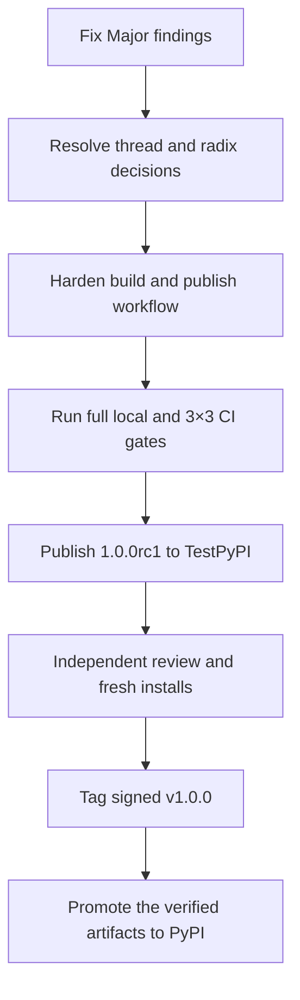

# `fpr-ff1` v1.0.0 Release Readiness Review

> [!summary] TL;DR
> `fpr-ff1` has an unusually strong conformance suite, a small API, clean packaging metadata, and a clear scope. The FF1 round implementation agrees with the NIST algorithm and all current tests pass. I do **not** recommend releasing `v1.0.0` yet. Three major findings should be fixed first: a real minimum-domain validation bypass, a dependency floor that permits vulnerable `cryptography` versions, and exception messages that disclose rejected plaintext symbols contrary to the security policy.

> [!danger] Release decision
> **NO-GO for an immediate `v1.0.0`.** Fix all Major findings and resolve the Medium thread-safety and radix-boundary decisions before freezing the API. Publish `1.0.0rc1`, run the full matrix from the built artifacts, then promote the exact verified artifacts to `1.0.0`.

## Context and assumptions

- Review target: [`main` at `31419828e6d00141b59d22387de665a3bc48a9ff`](https://github.com/joelee/fpr-ff1/tree/31419828e6d00141b59d22387de665a3bc48a9ff), tagged `v0.1.1`.
- Current PyPI releases confirmed on 2026-09-04: `0.1.0` and `0.1.1`; latest is `0.1.1`.
- Intended scope is FF1 only, with the 2016 NIST algorithm and the tighter limits from the February 2025 SP 800-38G Rev. 1 second public draft.
- This is a source, API, documentation, packaging, dependency, CI/CD, and release-readiness review. It is **not** a formal cryptographic proof, CAVP/CMVP validation, penetration test, or independent professional cryptographic audit.
- Classic GitHub branch protection and PyPI account/environment settings could not be read through the available repository integration. GitHub repository rulesets were readable and returned an empty list.

## Overall assessment

| Area | Assessment | Release impact |
|---|---|---|
| FF1 algorithm structure | Strong | Core steps match NIST; vectors and intermediate values pass. |
| Test design | Excellent | 709 tests, independent-oracle comparisons, exhaustive bijectivity cases, 100% line and branch coverage. |
| Input validation | Needs correction | A malformed but valid `Sequence` can bypass the minimum-domain check. |
| Public API | Small and understandable | Freeze only after the thread-safety and radix decisions. |
| Security posture | Good intent, material gaps | Dependency floor and error-message disclosure must be fixed. |
| Packaging | Clean wheel and valid metadata | Add an explicit source-distribution policy and test the wheel in CI. |
| CI/CD | Broad matrix and green | The artifact that is published is rebuilt after the verified artifact, weakening provenance. |
| Documentation | Thorough but overconfident | Add operational security warnings and replace “proven” with evidence-calibrated language. |
| `v1.0.0` readiness | **Not ready** | Three Major findings plus pre-freeze design decisions remain. |

## Verification performed

### Local results

| Check | Result |
|---|---|
| Python | CPython 3.12.13 |
| Ruff formatting | Pass: 16 files formatted |
| Ruff lint | Pass |
| Pyright strict mode | Pass: 0 errors, 0 warnings |
| Pytest | Pass: 709 tests |
| Coverage | Pass: 100% line and branch coverage; 204 statements and 62 branches |
| Full test duration | 323.20 seconds |
| Build | Pass: wheel and source distribution built |
| `twine check` | Pass on wheel and source distribution |
| `check-wheel-contents` | Pass |
| Isolated wheel install and encrypt/decrypt smoke test | Pass |
| Current locked environment dependency audit | Pass: no known vulnerabilities found |
| Declared minimum `cryptography==44.0.0` audit | Fail: eight advisory records reported; see MAJ-02 |
| Bandit | One expected B305 warning for ECB; not a defect because FF1 step 6.iii requires individual AES forward-cipher operations |
| Wheel reproducibility | Pass: two builds produced byte-identical wheels |
| Source-distribution reproducibility | Conditional: a custom build-output directory was included; see LOW-02 |

### GitHub results

- The latest normal [CI run on `v0.1.1`](https://github.com/joelee/fpr-ff1/actions/runs/33765426497) passed on Linux, macOS, and Windows for Python 3.12, 3.13, and 3.14, plus distribution build, metadata validation, and gitleaks.
- The [`v0.1.1` publish run](https://github.com/joelee/fpr-ff1/actions/runs/33766726779) also passed the full reusable matrix and published successfully.
- No open issues or pull requests were present at review time.
- Repository rulesets returned `[]`; classic branch protection could not be verified with the available permissions.

## Findings summary

| ID | Severity | Finding | Release blocker |
|---|---|---|---|
| MAJ-01 | Major | Declared sequence length is trusted, allowing the minimum domain to be bypassed | Yes |
| MAJ-02 | Major | Runtime dependency floor permits versions with known 2026 vulnerabilities | Yes |
| MAJ-03 | Major | Exceptions disclose rejected plaintext symbols despite the security policy | Yes |
| MED-01 | Medium | Shared mutable AES context makes instances unsafe across threads | Decision required |
| MED-02 | Medium | Publish workflow rebuilds rather than promoting the verified artifacts | Yes for supply-chain-quality GA |
| MED-03 | Medium | Mutable action tags and unverified repository/environment protections | Yes for supply-chain-quality GA |
| MED-04 | Medium | Operational security guidance is incomplete and the quick start uses a zero key | Yes, documentation fix |
| MED-05 | Medium | Radix boundary differs from NIST and the documentation says it does not | Decision required |
| MED-06 | Medium | README claims “proof” beyond what the evidence establishes | Yes, documentation fix |
| LOW-01 | Low | CI dependency sync is not explicitly locked and does not audit dependencies | No |
| LOW-02 | Low | Source-distribution contents are broader and less deterministic than necessary | No |
| LOW-03 | Low | The built wheel is not installed and tested by CI | No, strongly recommended |
| LOW-04 | Low | Stable-release metadata and project governance files need completion | No |
| LOW-05 | Low | Release signing and maintainer privacy hygiene should be improved | No |

---

## Detailed findings

### MAJ-01: Minimum-domain validation can be bypassed

**Evidence:** [`_prepare()` checks `len(x)` before materialising `x`, but never verifies the resulting list has the same length](https://github.com/joelee/fpr-ff1/blob/31419828e6d00141b59d22387de665a3bc48a9ff/src/fpr_ff1/_ff1.py#L270-L289). It also tests only for `__len__`, so mappings and sets are accepted even though the documented input is an ordered `Sequence`.

A concrete `collections.abc.Sequence` can report length six while yielding zero to five values. The pre-check accepts the declared length, and the FF1 core recalculates `n` from the shorter materialised list. I reproduced these outputs:

```text
reported length: 6; yielded values: 0 -> ciphertext length: 0; ciphertext: []
reported length: 6; yielded values: 1 -> ciphertext length: 1; ciphertext: [4]
reported length: 6; yielded values: 5 -> ciphertext length: 5; ciphertext: [3, 4, 6, 6, 8]
```

I also confirmed that `dict` and `set` inputs of length six are accepted. A set is unordered, so its encryption semantics are not stable enough for a format-preserving primitive.

**Impact:** The package can produce ciphertext for a domain smaller than the enforced `1,000,000` minimum. This is a validation fail-open and falls directly within the package’s own security-policy scope. It can also produce ciphertext that a normal call to `decrypt_numerals()` subsequently refuses because the ciphertext is below `min_length`.

**Required fix:**

1. Require `isinstance(x, collections.abc.Sequence)` before reading its length.
2. Capture and validate the declared length before copying, preserving the existing early-rejection protection for huge inputs.
3. Materialise and validate numerals.
4. Verify `len(numerals) == declared_length`; raise a typed structural or length exception when it changed.
5. Re-run `_validate_length(len(numerals), inout)` defensively before calling the core.
6. Add regression cases for an inconsistent `Sequence`, `dict`, `set`, both encrypt and decrypt, zero yielded values, and values below `min_length`.

### MAJ-02: The dependency floor permits known-vulnerable `cryptography` releases

**Evidence:** [`pyproject.toml` declares `cryptography>=44.0.0`](https://github.com/joelee/fpr-ff1/blob/31419828e6d00141b59d22387de665a3bc48a9ff/pyproject.toml#L35-L37). A `pip-audit` resolution at that exact minimum reported eight advisory records, including `PYSEC-2026-3552`, fixed in `50.0.0`. The locked development environment resolves `cryptography==50.0.0` and audited cleanly.

The most prominent advisory concerns PKCS#7 EnvelopedData decryption rather than the AES APIs used by this package, so I did **not** find a direct exploit path through `fpr-ff1`. The problem is still material: the published requirement explicitly permits affected releases, downstream security scanners will flag valid installations, and a shared application environment may use other affected `cryptography` APIs.

**Required fix:**

- Raise the runtime floor to at least `cryptography>=50.0.0`; preferably refresh the lock to the latest clean 50.x patch available at release time.
- Run `pip-audit` or OSV Scanner in CI against both the lock and the declared minimum supported dependency set.
- Enable Dependabot or Renovate for Python and GitHub Actions updates.
- Record the dependency-floor change in the `1.0.0` changelog.

### MAJ-03: Validation exceptions echo plaintext data

**Evidence:**

- [`_coerce_numerals()` includes the rejected numeral value in the exception](https://github.com/joelee/fpr-ff1/blob/31419828e6d00141b59d22387de665a3bc48a9ff/src/fpr_ff1/_ff1.py#L254-L268).
- [`_decode_str()` includes the rejected character in the exception](https://github.com/joelee/fpr-ff1/blob/31419828e6d00141b59d22387de665a3bc48a9ff/src/fpr_ff1/_ff1.py#L300-L310).
- [`SECURITY.md` says plaintext or key material appearing in an exception is in scope](https://github.com/joelee/fpr-ff1/blob/31419828e6d00141b59d22387de665a3bc48a9ff/SECURITY.md#L28-L36).
- A test explicitly requires the rejected character to appear in the message, institutionalising the contradiction.

**Impact:** Applications commonly log validation exceptions. A malformed sensitive value can therefore disclose the rejected symbol and its position. The exposure is partial, but it breaks an explicit security promise.

**Required fix:** Retain the input side and index, but redact the value. For example: `plaintext[5] is outside the configured radix` and `input character at index 5 is not in the configured alphabet`. Add tests asserting sensitive values are **absent** from exception text.

### MED-01: Shared mutable AES context creates a silent concurrency hazard

**Evidence:** Each `FF1` instance caches one live ECB encryptor and reuses it in the S-expansion path. The README correctly documents the instance as not thread-safe and warns that misuse can silently produce wrong ciphertext.

**Critique:** Documentation reduces surprise but does not remove the operational risk. An `FF1` object looks like immutable configuration and is likely to be registered as a singleton in a web service or dependency-injection container. Silent cryptographic corruption is a harsh failure mode. The optimisation only matters when `d > 16`; common short identifiers never enter the expansion loop.

**Recommended fix before API freeze:** Keep only immutable AES configuration on the instance. Create one local ECB encryptor per `_ff1()` invocation when `d > 16`, reuse it within that call, and finalise/discard it before returning. This makes separate calls safe to run concurrently without changing ciphertext. Benchmark the change. A per-instance lock is an alternative, but it serialises callers and makes async integration awkward.

### MED-02: The publish job does not publish the artifact that was built and checked

**Evidence:** The reusable quality workflow builds and uploads distributions, but the `publish` job performs a fresh checkout and a second `uv build` before publishing. The successful GitHub job list confirms both builds occurred. The workflow also permits `workflow_dispatch` without a tag/version guard.

**Impact:** The artifact tested and metadata-checked in the quality job is not byte-for-byte the artifact sent to PyPI. A manual dispatch can attempt to publish from an arbitrary selected ref, and no check enforces `GITHUB_REF_NAME == v<project.version>`.

**Required fix:** Build once, upload once, download the same immutable artifact into an artifact-validation job and the publish job, and publish only that artifact. Remove manual dispatch or require an explicit ref/version and validate it. Verify the GitHub tag, project metadata, wheel metadata, and changelog version agree.

### MED-03: Release workflow dependencies use mutable tags

**Evidence:** Workflows use `actions/checkout@v4`, `astral-sh/setup-uv@v5`, `actions/upload-artifact@v4`, and `pypa/gh-action-pypi-publish@release/v1`. The final action receives OIDC authority to publish the project.

GitHub’s secure-use guidance states that a full-length commit SHA is the only immutable way to pin an action. This matters most for the publish action because compromise can obtain a short-lived PyPI publishing token.

**Required fix:** Pin every third-party action to a reviewed full commit SHA, retain the readable version in a comment, and automate SHA updates. Add a repository ruleset or verify classic protection for `main` and `v*` tags, require CI before merge, prevent force pushes/deletion, and require manual approval on the `pypi` environment. These UI settings require manual verification.

### MED-04: Operational security guidance is incomplete

**Evidence:** The quick start uses `b"\x00" * 16`, an empty tweak, and no adjacent warning. The documentation covers timing and key zeroisation well, but does not prominently state that:

- FF1 is deterministic for a fixed key and tweak, so equal plaintexts produce equal ciphertexts.
- NIST recommends varying tweaks with each encryption instance when feasible.
- FF1 provides confidentiality, not integrity or authentication; modified ciphertext decrypts to another plausible in-domain value.
- A wrong key or tweak normally returns plausible plaintext rather than an error.
- The one-million-value domain is a standards floor, not a blanket guarantee against enumeration or guessing.

**Required fix:** Put a security warning immediately after the quick start and expand `SECURITY.md`. Label the zero key as test-only or show loading a key from an external KMS/secret source without adding key-management code to the package. Show a meaningful non-secret tweak derived from stable record context. Explain that applications needing tamper detection must authenticate ciphertext and context separately where their format allows it.

### MED-05: The radix boundary differs from NIST and the docs say it is the same

**Evidence:** The code accepts `2 <= radix < 2**16` and rejects `65536`. Both the 2016 publication and the 2025 Rev. 1 second public draft specify `radix` in the inclusive range `[2..2**16]`. NIST permits an implementation to support a subset of radices, so the package can remain conforming if this is an intentional implementation limit. The README comparison table is nevertheless incorrect when it says the NIST range is “same.”

**Why decide now:** The project’s release policy says any change to accepted inputs requires a major version. If `65536` is added after `1.0.0`, that policy would force `2.0.0` for an otherwise backward-compatible feature.

**Recommended resolution:** Support radix `65536` before `1.0.0`, add boundary and differential/conformance evidence, and change the guard to an inclusive maximum. If the oracle cannot cover the boundary, use a second independently implemented reference. Alternatively, explicitly document `2..65535` as a deliberate supported subset and correct every NIST comparison. Also revise the version policy: expanding the accepted domain without changing existing behaviour is a SemVer minor change; newly rejecting inputs or changing ciphertext is major.

### MED-06: “Proven” overstates the assurance level

**Evidence:** README headings say conformance and radices are “proven,” and describe two exhaustive domains as the strongest correctness statement available. The suite is excellent evidence, but finite vectors, one legacy oracle, properties, and two exhaustive domains do not prove the general implementation correct. The oracle also shares the same underlying `cryptography` AES implementation through the M2Crypto shim, though its FF1 control logic is independent.

**Required fix:** Use “strong conformance evidence,” “verified against,” and “tested exhaustively for these two domains.” State that the implementation has not received an independent cryptographic audit or NIST validation. Keep the existing FIPS disclaimer.

### LOW-01: Lock and vulnerability checks should be explicit in CI

CI runs `uv sync --all-extras --dev` while the developer guide recommends `uv sync --locked`. Add `--locked` or `--frozen` so lock drift fails. Add a dependency-vulnerability job and an automated dependency update policy. The current locked environment is clean as of 2026-09-04.

### LOW-02: Define the source-distribution contents explicitly

The wheel contains only the package, `py.typed`, metadata, and licence, which is excellent. The source distribution also contains agent instructions, workflows, review plans, tests, vectors, `.codegraph`, and the lock. A repeat build into a nonstandard output directory caused that directory’s generated `.gitignore` to enter the source distribution, making the archive differ.

Use Hatch’s explicit `sdist` include/exclude configuration. Keep licence, README, changelog, security policy, source, and preferably tests/vectors; exclude editor/agent state, local build directories, and internal review plans. Add a contents assertion.

### LOW-03: Test the installed wheel in CI

The matrix tests the source/editable environment. Add a clean-environment smoke test that installs the built wheel, imports every public symbol, encrypts/decrypts a NIST vector, checks `py.typed`, and confirms the reported distribution version. This catches packaging defects that source-tree tests cannot.

### LOW-04: Complete stable-release metadata and governance

Before GA:

- Set `version = "1.0.0"` and add a dated `1.0.0` changelog section.
- Change `Development Status :: 4 - Beta` to `5 - Production/Stable` only when the release is genuinely declared stable.
- Update `SECURITY.md` from `0.1.x` to the intended `1.x` support policy.
- Add author/maintainer metadata and a `Documentation` project URL.
- Add a concise `CONTRIBUTING.md` describing vector provenance, the full quality gate, security reporting, and ciphertext-compatibility rules.
- Consider issue and pull-request templates appropriate to a correctness-sensitive cryptographic library.

### LOW-05: Improve signing and maintainer privacy hygiene

The reviewed commit is unsigned; `v0.1.0` is a lightweight tag and the annotated `v0.1.1` tag is unsigned. Use a signed annotated `v1.0.0` tag and verify it in the release process. The public commit metadata also exposes a CGI corporate email address; switch future commits to a verified GitHub `noreply` address unless that employer association is intentional. Rewriting published history is not necessary for the package release and has its own costs.

---

## Positive findings

- The core is compact and readable, with spec-step comments at the right locations.
- Exact integer arithmetic correctly replaces floating-point logarithms.
- `b` is correctly derived from `v`; S expansion, truncation, encrypt/decrypt order, parity, and Feistel assignments match the NIST algorithms.
- All three AES key lengths are covered.
- The NIST vector files identify their primary source rather than regenerating expected outputs.
- Per-round intermediate-value assertions materially improve confidence over output-only vectors.
- Differential tests validate the oracle against NIST before using it for other radices.
- Exhaustive bijectivity checks for radix-2 length-20 and radix-10 length-6 are valuable.
- The malformed-input sweep and 100% branch gate are unusually disciplined.
- The public API and exception hierarchy are small and easy to understand.
- Key zeroisation, timing limitations, non-FIPS status, Unicode normalisation, and thread safety are documented honestly.
- Only one runtime dependency is used.
- The wheel is pure Python, typed, cleanly structured, metadata-valid, and installable.
- The CI matrix covers three operating systems and all declared Python versions.
- PyPI Trusted Publishing and attestations are already in use; no publishing token is stored in the repository.
- Gitleaks scans full history in CI and the latest run passed.

## Required fix list

### P0: complete before `1.0.0rc1`

- [ ] **MAJ-01:** Enforce `Sequence`, reject mapping/set inputs, and revalidate the materialised length.
- [ ] **MAJ-02:** Raise `cryptography` to `>=50.0.0` or a newer audited floor and refresh the lock.
- [ ] **MAJ-03:** Remove input values and characters from exceptions; invert tests to assert redaction.
- [ ] **MED-01:** Replace the instance-shared ECB context with a call-local context, or formally accept the concurrency risk after benchmarking.
- [ ] **MED-02:** Build once and publish the same checked artifacts; add tag/version/changelog guards.
- [ ] **MED-03:** Pin actions by full SHA and verify `pypi` environment approval plus branch/tag protection.
- [ ] **MED-04:** Add integrity, determinism, tweak, small-domain, wrong-key, and production-key guidance.
- [ ] **MED-05:** Support radix `65536` or explicitly document the narrower supported subset; correct the comparison table.
- [ ] **MED-06:** Replace proof language with calibrated evidence language.
- [ ] Run the full local gate and the complete 3×3 GitHub matrix after the fixes.

### P1: complete before final `1.0.0`

- [ ] Add locked sync, dependency audit, action/dependency update automation, and built-wheel smoke testing.
- [ ] Constrain and test source-distribution contents.
- [ ] Complete `1.0.0` version, changelog, classifier, support-policy, maintainer, and documentation metadata.
- [ ] Publish `1.0.0rc1` to TestPyPI and exercise installation in fresh Linux, macOS, and Windows environments.
- [ ] Ask at least one independent reviewer with cryptographic implementation experience to review `_ff1.py`, vector provenance, and the validation changes.
- [ ] Sign the annotated GA tag and retain PyPI attestations.

### P2: post-1.0 hardening

- [ ] Add mutation testing for the core and validation guards.
- [ ] Add a reproducible benchmark harness for performance and timing claims.
- [ ] Consider a second independent FF1 oracle if the legacy Ubiq package becomes unmaintainable or cannot cover radix `65536`.
- [ ] Keep monitoring the finalisation of NIST SP 800-38G Rev. 1.

## Alternatives and trade-offs

| Decision | Preferred option | Alternative | Trade-off |
|---|---|---|---|
| Thread safety | Call-local ECB context | Instance lock | Local context avoids silent races and global serialisation; lock may preserve more benchmark performance. |
| Radix `65536` | Support before v1 | Document `2..65535` as a subset | Support avoids a future version-policy problem; subset is conforming but surprising and less interoperable. |
| Release workflow | Build once, promote exact artifact | Rebuild reproducibly | Promotion gives direct evidence identity; rebuild requires stronger reproducibility controls and still complicates provenance. |
| Release cadence | `1.0.0rc1` then GA | Immediate `1.0.0` after fixes | RC provides installation and API feedback; immediate GA is faster but freezes decisions with almost no public burn-in. |
| Dependency policy | Safe minimum plus automated updates | Broad old-version compatibility | A higher floor reduces compatible environments but avoids known-vulnerable valid resolutions. |

## Recommended release sequence



My preferred version path is `0.1.1` → fixes on `main` → `1.0.0rc1` → `1.0.0`. If the fixes reveal wider API changes, publish `0.2.0` first and defer the release candidate.

## References

1. [NIST SP 800-38G Rev. 1, Second Public Draft](https://csrc.nist.gov/pubs/sp/800/38/g/r1/2pd), published 2025-02-03; accessed 2026-09-04.
2. [NIST SP 800-38G Rev. 1 2PD PDF](https://nvlpubs.nist.gov/nistpubs/SpecialPublications/NIST.SP.800-38Gr1.2pd.pdf), February 2025; accessed 2026-09-04. See specification pp. 11–15 and security/tweak guidance pp. 17–21.
3. [NIST SP 800-38G](https://nvlpubs.nist.gov/nistpubs/SpecialPublications/NIST.SP.800-38G.pdf), March 2016, updated 2016-08-04; accessed 2026-09-04.
4. [NIST FF1 sample values](https://csrc.nist.gov/CSRC/media/Projects/Cryptographic-Standards-and-Guidelines/documents/examples/FF1samples.pdf), accessed 2026-09-04.
5. [PyCA `cryptography` advisory GHSA-g6cj-pr64-35w5](https://github.com/pyca/cryptography/security/advisories/GHSA-g6cj-pr64-35w5), published 2026-07-31; affected `44.0.0` through `49.0.0`, fixed `50.0.0`.
6. [OSV PYSEC-2026-3552](https://osv.dev/vulnerability/PYSEC-2026-3552), published 2026-08-04; accessed 2026-09-04.
7. [PyCA `cryptography` security policy](https://cryptography.io/en/latest/security/), accessed 2026-09-04.
8. [PyCA symmetric encryption documentation](https://cryptography.io/en/latest/hazmat/primitives/symmetric-encryption/), accessed 2026-09-04.
9. [PyPA: Publishing package distributions with GitHub Actions](https://packaging.python.org/en/latest/guides/publishing-package-distribution-releases-using-github-actions-ci-cd-workflows/), updated 2026-09-01; accessed 2026-09-04.
10. [GitHub Actions secure-use reference](https://docs.github.com/actions/reference/security/secure-use), accessed 2026-09-04.
11. [`fpr-ff1` v0.1.1 release](https://github.com/joelee/fpr-ff1/releases/tag/v0.1.1), published 2026-09-03.
12. [`fpr-ff1` on PyPI](https://pypi.org/project/fpr-ff1/), accessed through package-index metadata on 2026-09-04.

## Confidence

**High** for the release recommendation and the three Major findings: each is supported by source inspection, an executable reproduction or dependency audit, and an explicit project or upstream security contract. **Medium-high** for the complete cryptographic assessment: the source was compared with the normative algorithm and passed excellent tests, but no finite review can replace formal proof, independent specialist audit, or NIST validation.

## Suggested next step

Implement MAJ-01 through MAJ-03 first, then benchmark the call-local ECB context change. Those changes remove the clearest security and correctness blockers without changing ciphertext for any currently valid ordinary input.
